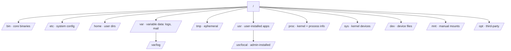

# 📁 01 — Linux Filesystem

> The filesystem is the API of Linux. Every device, process, and config is a file. Master the layout once and you'll never `cd ~` lost again.

## Why this matters

Knowing where logs, configs, and binaries live is the difference between a 30-second fix and a 30-minute hunt. The Filesystem Hierarchy Standard (FHS) is the contract.

## 🗺️ FHS at a glance

<!-- mermaid:rendered -->
<p align="center"></p>

<details><summary>Mermaid source</summary>

<!-- mermaid:rendered -->
<p align="center"></p>

<details><summary>Mermaid source</summary>

<!-- mermaid:rendered -->
<p align="center"></p>

<details><summary>Mermaid source</summary>



</details>

</details>

</details>

## Concepts

- **Everything is a file** — devices (`/dev/sda`), processes (`/proc/1234`), sockets, pipes.
- **Inode** — a fixed-size record holding metadata + block pointers. Filename lives in the directory entry, not the inode.
- **Hard link** — extra directory entry for the same inode. Cannot cross filesystems.
- **Symbolic link** — a file containing a path string. Can cross filesystems and break.
- **Mount point** — a directory where another filesystem is grafted in.
- **Path** — absolute (`/etc/hosts`) vs relative (`./hosts`, `../etc/hosts`).

## Commands

```bash
pwd                       # → print working directory (absolute path)
ls -lah /etc              # -l long, -a all (incl. dotfiles), -h human sizes
cd -                      # jump to previous directory
tree -L 2 /var            # show 2 levels deep (apt install tree)
stat /etc/hosts           # → inode, perms, atime/mtime/ctime, blocks
file /bin/ls              # → ELF 64-bit LSB pie executable…
df -hT                    # disk free, -T shows fs type
du -sh /var/log/*         # summarize size per entry, human readable
findmnt                   # tree of mounted filesystems
mount | column -t         # all mounts, aligned
ln    /etc/hosts hardlink # hard link (same inode)
ln -s /etc/hosts symlink  # symbolic link (path-based)
readlink -f symlink       # resolve symlink to absolute target
realpath ./foo/../bar     # canonicalize path
```

### Inspecting `/proc` and `/sys`

```bash
cat /proc/cpuinfo | head  # CPU details exposed by kernel
cat /proc/meminfo         # memory totals + slab info
cat /proc/$$/status       # status of current shell process ($$ = PID)
ls /proc/1/                # PID 1 (init/systemd) virtual files
cat /sys/class/net/eth0/address  # MAC address of eth0
```

## 🧪 Lab — Navigate and inspect a real Linux tree

```bash
docker run -it --rm ubuntu:22.04 bash
apt-get update && apt-get install -y tree file >/dev/null
```

**Step 1.** Map the top level.

```bash
ls -la /
# → drwxr-xr-x   1 root root  ... bin -> usr/bin
# → drwxr-xr-x   1 root root  ... etc
# → ...
```

**Step 2.** Find every config file under `/etc` modified in the last day.

```bash
find /etc -type f -mtime -1 2>/dev/null
# → /etc/hostname
# → /etc/hosts
# → /etc/resolv.conf
```

**Step 3.** Inspect an inode and create both link types.

```bash
cd /tmp && echo hello > original.txt
stat original.txt | grep -E 'Inode|Links'
# → Inode: 12345  Links: 1
ln    original.txt hard.txt
ln -s original.txt soft.txt
stat hard.txt | grep Inode    # same inode as original
stat soft.txt | grep Inode    # different inode (the symlink itself)
ls -li *.txt
# → 12345 -rw-r--r-- 2 root root … original.txt
# → 12345 -rw-r--r-- 2 root root … hard.txt
# → 67890 lrwxrwxrwx 1 root root … soft.txt -> original.txt
```

**Step 4.** Delete the original and watch what survives.

```bash
rm original.txt
cat hard.txt   # → hello   (inode still has refcount 1)
cat soft.txt   # → cat: soft.txt: No such file or directory  (broken)
```

**Step 5.** Explore `/proc` for the running shell.

```bash
echo $$                          # → 27   (your shell PID)
ls -l /proc/$$/exe               # → /proc/27/exe -> /usr/bin/bash
cat /proc/$$/cmdline | tr '\0' ' '; echo
ls /proc/$$/fd                   # → 0  1  2  255   (open file descriptors)
```

**Step 6.** Confirm a tmpfs mount.

```bash
findmnt /dev/shm
# → TARGET   SOURCE FSTYPE OPTIONS
# → /dev/shm tmpfs  tmpfs  rw,nosuid,nodev,noexec
```

## ⚠️ Gotchas

> ⚠️ `/tmp` and `/var/tmp` differ: `/tmp` is wiped on reboot; `/var/tmp` survives.
>
> ⚠️ `rm` removes the **directory entry**, not the data. If a process holds the file open, disk space is freed only when the FD closes. Use `lsof | grep deleted` to find leaks.
>
> ⚠️ Symlinks can create loops. `find` will detect them; `cp -r` without `-L` won't follow them.
>
> ⚠️ Hard links cannot span filesystems. `ln /home/x /mnt/y` fails with `Invalid cross-device link`.
>
> ⚠️ `/bin`, `/sbin`, `/lib` are symlinks to `/usr/bin` etc. on modern distros (UsrMerge). Don't rely on the split.

## 📖 Further reading

- `man 7 hier` — filesystem hierarchy from the man-pages project
- `man 7 inode` — inode structure
- [FHS 3.0 spec](https://refspecs.linuxfoundation.org/FHS_3.0/fhs/index.html)
- [`/proc` filesystem docs](https://www.kernel.org/doc/html/latest/filesystems/proc.html)
- [ArchWiki — File systems](https://wiki.archlinux.org/title/File_systems)
