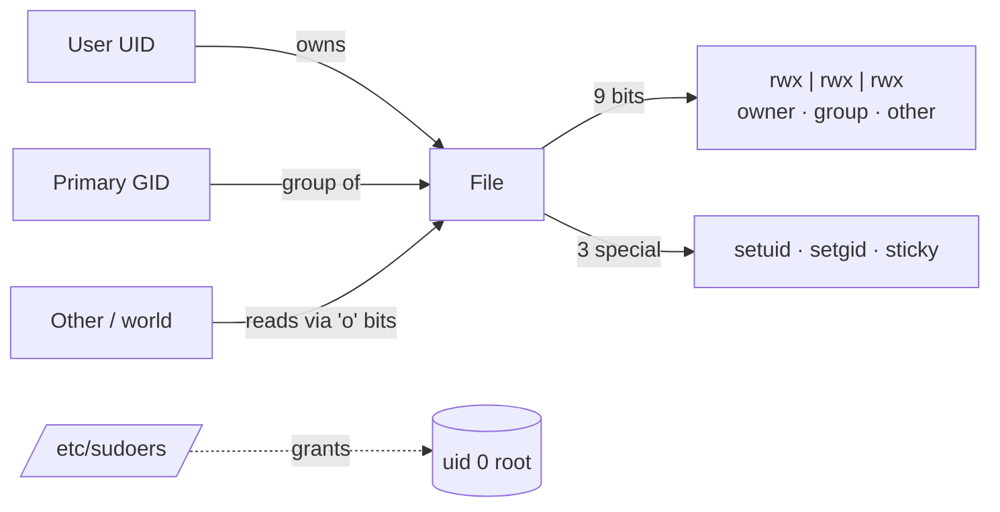

# 👥 02 — Users & Permissions

> Multi-user is Linux's superpower and footgun. One bad `chmod 777` can give the world your shell.

## Why this matters

Every file, process, socket, and namespace is owned. Auth bugs, data leaks, and privilege escalations all start with a misconfigured uid, group, or sudoers entry.

## 🔐 The permission model



## Concepts

- **uid/gid** — numeric. `uid 0` = root. Service users typically `100-999`. Humans `1000+`.
- **`/etc/passwd`** — `name:x:uid:gid:gecos:home:shell` (world-readable).
- **`/etc/shadow`** — hashed passwords (`$6$` = SHA-512). Root only.
- **`/etc/group`** — `name:x:gid:members`.
- **Permission triplet** — read(4) write(2) execute(1) for owner/group/other.
- **Special bits** — setuid (4000), setgid (2000), sticky (1000).
- **`sudo`** — runs commands as another user (default root). Configured via `/etc/sudoers` and `/etc/sudoers.d/*`.
- **umask** — bits *removed* from default perms (default 0022 → new files 644, dirs 755).

## Commands

```bash
id                          # → uid=0(root) gid=0(root) groups=0(root)
whoami                      # → root
who                         # → who is logged in
last -n 5                   # → last 5 logins (from /var/log/wtmp)

# User management
useradd -m -s /bin/bash alice          # -m create home, -s set shell
passwd alice                            # set / change password
usermod -aG sudo alice                  # -a append, -G supplementary group
userdel -r alice                        # -r also remove home + mail spool
groupadd developers
gpasswd -a alice developers             # add alice to developers

# Permissions
chmod 750 script.sh                     # rwx r-x ---
chmod u+x,g-w,o= file                   # symbolic syntax
chmod -R g+rX dir                       # capital X = exec only on dirs/already-exec
chown alice:developers report.txt       # owner:group
chgrp developers report.txt
umask                                   # → 0022
umask 0077                              # restrictive: only owner can read new files

# Special bits
chmod u+s /usr/bin/passwd               # setuid (run as file owner)
chmod g+s shared_dir                    # setgid (new files inherit group)
chmod +t /tmp                           # sticky (only owner can delete own files)

# sudo
sudo -l                                 # list what current user can sudo
sudo -u postgres psql                   # run psql as user postgres
visudo -f /etc/sudoers.d/alice          # safely edit (syntax-checks on save)
```

### Reading `ls -l`

```
-rwxr-x---  1 alice developers 4096 Apr 26 10:00 script.sh
│└┬┘└┬┘└┬┘  │ └─┬─┘ └────┬───┘
│ │  │  │   │   │        └─ group
│ │  │  │   │   └─ owner
│ │  │  │   └─ hard link count
│ │  │  └─ other:   ---  (none)
│ │  └─ group:    r-x  (read+exec)
│ └─ owner:    rwx  (read+write+exec)
└─ type: -=file  d=dir  l=link  c=char  b=block  s=socket  p=pipe
```

## 🧪 Lab — Create a user, restrict access, grant sudo

```bash
docker run -it --rm ubuntu:22.04 bash
apt-get update && apt-get install -y sudo vim >/dev/null
```

**Step 1.** Create user `alice` with a home and bash shell.

```bash
useradd -m -s /bin/bash alice
echo 'alice:Welcome1!' | chpasswd
id alice
# → uid=1000(alice) gid=1000(alice) groups=1000(alice)
```

**Step 2.** Create a shared project directory with setgid.

```bash
groupadd developers
usermod -aG developers alice
mkdir /srv/project
chown root:developers /srv/project
chmod 2770 /srv/project          # 2 = setgid, 770 = rwx rwx ---
ls -ld /srv/project
# → drwxrws--- 2 root developers 4096 Apr 26 10:00 /srv/project
```

**Step 3.** Verify alice can write, others cannot.

```bash
su - alice -c 'touch /srv/project/notes.md && ls -l /srv/project'
# → -rw-r--r-- 1 alice developers 0 Apr 26 10:00 notes.md   # group inherited!
useradd -m bob
su - bob -c 'touch /srv/project/oops.md'
# → touch: cannot touch '/srv/project/oops.md': Permission denied
```

**Step 4.** Grant alice limited sudo (only `systemctl restart nginx`).

```bash
cat > /etc/sudoers.d/alice <<'EOF'
alice ALL=(root) NOPASSWD: /usr/bin/systemctl restart nginx
EOF
chmod 440 /etc/sudoers.d/alice
su - alice -c 'sudo -l'
# → User alice may run: (root) NOPASSWD: /usr/bin/systemctl restart nginx
```

**Step 5.** Inspect `/etc/passwd` and `/etc/shadow`.

```bash
grep alice /etc/passwd
# → alice:x:1000:1000::/home/alice:/bin/bash
grep alice /etc/shadow
# → alice:$6$...hash...:19834:0:99999:7:::
```

**Step 6.** Demonstrate the sticky bit on `/tmp`.

```bash
ls -ld /tmp           # → drwxrwxrwt   ← the trailing 't' is the sticky bit
su - alice -c 'touch /tmp/alice.txt'
su - bob   -c 'rm /tmp/alice.txt'
# → rm: cannot remove '/tmp/alice.txt': Operation not permitted
```

## ⚠️ Gotchas

> ⚠️ Never `chmod 777` "to fix it." It almost never fixes anything and silently turns files into world-writable backdoors.
>
> ⚠️ Always edit sudoers with `visudo` (or place fragments in `/etc/sudoers.d/`). A syntax error locks everyone out of root.
>
> ⚠️ `su -` (with the dash) runs a login shell with target user's env. Plain `su user` keeps the current env — confusing PATH bugs follow.
>
> ⚠️ `useradd` (low-level) ≠ `adduser` (Debian wrapper). Behaviors differ; prefer `useradd` in scripts for portability.
>
> ⚠️ Removing a user with files still owned by their uid leaves orphans. Use `find / -uid 1000 2>/dev/null` to audit.
>
> ⚠️ Permissions on a symlink are ignored — the target's permissions apply. `chmod` on a symlink follows it by default.

## 📖 Further reading

- `man 5 passwd` · `man 5 shadow` · `man 5 sudoers`
- `man 1 chmod` · `man 1 chown` · `man 2 umask`
- [ArchWiki — Users and groups](https://wiki.archlinux.org/title/Users_and_groups)
- [ArchWiki — sudo](https://wiki.archlinux.org/title/Sudo)
- [Linux capabilities (man 7 capabilities)](https://man7.org/linux/man-pages/man7/capabilities.7.html) — fine-grained alternative to setuid
