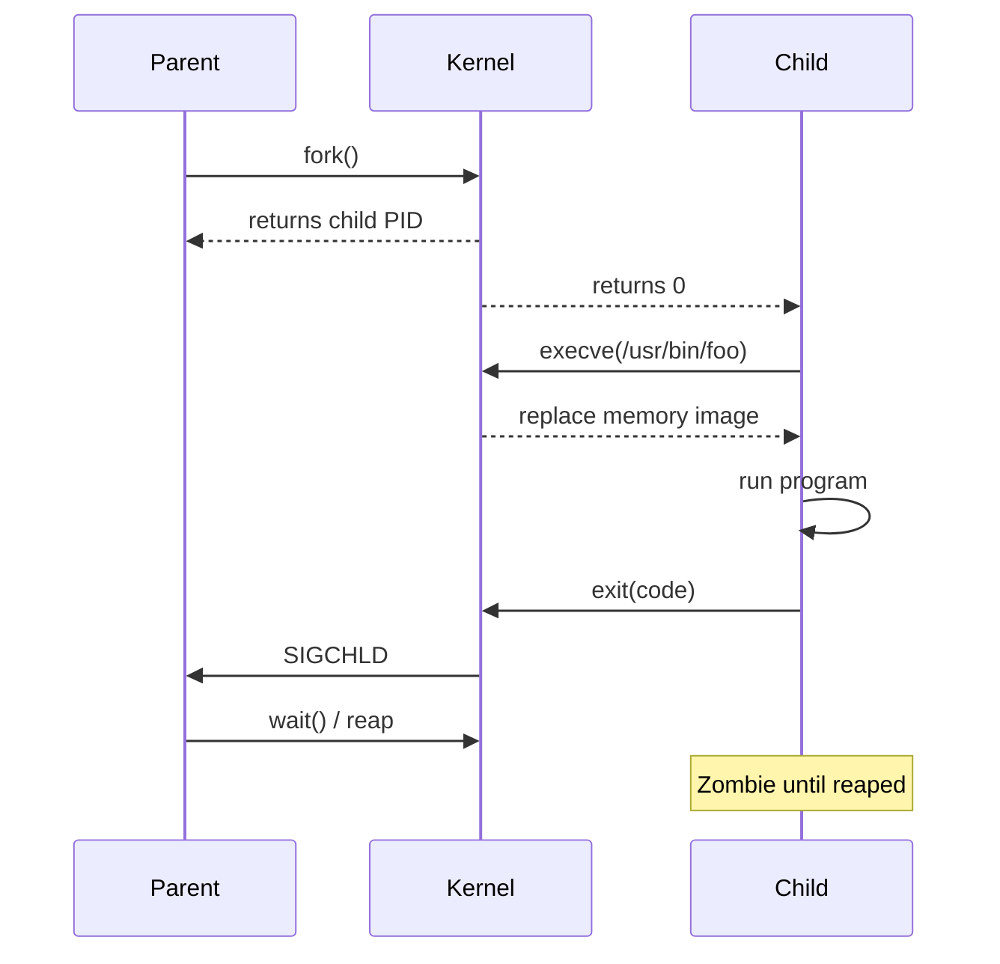

# ⚙️ 03 — Processes & Signals

> A Linux box is just a tree of processes rooted at PID 1. Knowing how to inspect, signal, and prioritize them is core SRE muscle.

## Why this matters

When something is "slow" or "stuck," 90% of the answer lives in `ps`, `top`, or `/proc`. Signals are the universal IPC for asking a process to stop, reload, or dump.

## 🌳 Process lifecycle



## Concepts

- **PID / PPID** — every process has a parent. PID 1 (init/systemd) is special — it reaps orphans.
- **States** — `R` running, `S` interruptible sleep, `D` uninterruptible (often I/O), `Z` zombie, `T` stopped.
- **Foreground / background** — `&` runs in background; `Ctrl-Z` stops; `bg`/`fg`/`jobs` manage them.
- **Signal** — async notification (`SIGTERM`=15 polite, `SIGKILL`=9 forceful, `SIGHUP`=1 reload, `SIGINT`=2 Ctrl-C).
- **Niceness** — scheduler hint, `-20` (highest) to `+19` (lowest). Only root can lower niceness.
- **File descriptors** — every process has 0=stdin, 1=stdout, 2=stderr.

## Commands

```bash
ps aux                            # BSD style: every process, with user + cmd
ps -ef                            # SysV style: same, different columns
ps -eo pid,ppid,user,stat,pcpu,pmem,cmd --sort=-pcpu | head
pstree -p                         # tree with PIDs
top                               # live view (q to quit, P sort by CPU, M by MEM)
htop                              # nicer; arrow keys, F9 to kill

# Signals
kill 1234                         # default SIGTERM (15)
kill -9 1234                      # SIGKILL — cannot be caught
kill -HUP 1234                    # SIGHUP — typical "reload config"
kill -l                           # list all signal names
killall nginx                     # by name
pkill -f 'python myapp.py'        # match full command line

# Priority
nice -n 10 ./batch.sh             # start with nice=10 (lower priority)
renice -n 5 -p 1234               # change running process

# Background / jobs
long_running &                    # background, returns shell prompt
jobs                              # → [1]+  Running   long_running &
fg %1                             # bring job 1 to foreground
bg %1                             # resume in background
disown %1                         # detach from shell (won't get SIGHUP on logout)
nohup ./script.sh >out.log 2>&1 & # immune to hangups, output redirected

# Inspection
cat /proc/1234/status             # detailed state, threads, capabilities
ls /proc/1234/fd                  # open file descriptors
cat /proc/1234/cmdline | tr '\0' ' '
ls -l /proc/1234/cwd              # current working dir of pid
ls -l /proc/1234/exe              # executable path
```

## 🧪 Lab — Spawn, signal, and reap processes

```bash
docker run -it --rm ubuntu:22.04 bash
apt-get update && apt-get install -y procps psmisc htop >/dev/null
```

**Step 1.** Spawn a sleeper in the background and inspect.

```bash
sleep 600 &
# → [1] 42
jobs
# → [1]+  Running   sleep 600 &
ps -o pid,ppid,stat,cmd $!
# → PID  PPID STAT CMD
# →  42    1  S    sleep 600
```

**Step 2.** Send a polite TERM, then a forceful KILL.

```bash
sleep 600 & PID=$!
kill $PID            # SIGTERM
sleep 1; ps -p $PID  # → no output ⇒ process gone

sleep 600 & PID=$!
kill -KILL $PID      # SIGKILL — uncatchable
wait $PID 2>/dev/null
echo "exit: $?"      # → exit: 137  (128 + signal 9)
```

**Step 3.** Demonstrate Ctrl-Z, `bg`, `fg`.

```bash
sleep 300            # press Ctrl-Z
# → [1]+  Stopped   sleep 300
bg                   # resume in background
jobs
# → [1]+  Running   sleep 300 &
fg                   # back to foreground; Ctrl-C to kill
```

**Step 4.** Make a process survive your shell exit with `nohup`.

```bash
nohup sleep 1000 >/tmp/sleep.log 2>&1 &
disown
ps -ef | grep sleep
# → root  100    1  0 …  sleep 1000     ← reparented to PID 1
```

**Step 5.** Create and reap a zombie.

```bash
# Parent that never wait()s — zombies will appear briefly
( sleep 5 & exec sleep 30 ) &
# In another shell, observe:
ps -eo pid,ppid,stat,cmd | awk '$3 ~ /Z/'
```

**Step 6.** Adjust priority.

```bash
nice -n 19 yes >/dev/null &        # lowest priority CPU hog
top -b -n 1 -p $! | tail -3
renice -n 0 -p $!                  # bump back to normal (root only for negative)
kill $!
```

**Step 7.** Inspect open FDs of the running shell.

```bash
ls -l /proc/$$/fd
# → lrwx------ 1 root root 64 Apr 26 … 0 -> /dev/pts/0
# → lrwx------ 1 root root 64 Apr 26 … 1 -> /dev/pts/0
# → lrwx------ 1 root root 64 Apr 26 … 2 -> /dev/pts/0
# → lrwx------ 1 root root 64 Apr 26 … 255 -> /dev/pts/0
```

## ⚠️ Gotchas

> ⚠️ `kill -9` is the **last resort**. It bypasses cleanup handlers — temp files, locks, child processes leak. Try TERM, then INT, then HUP, then KILL.
>
> ⚠️ `D` state (uninterruptible sleep) usually means waiting on I/O. You **cannot** kill it; fix the underlying device/NFS.
>
> ⚠️ Zombies (`Z`) consume only a PID slot. They appear when parents fail to `wait()`. Killing the **parent** lets init reap them.
>
> ⚠️ `nohup` does NOT detach from the shell's process group on its own. Pair with `&` and `disown`, or use `setsid` / `systemd-run --user --scope`.
>
> ⚠️ `top` shows %CPU per core (can exceed 100%). `top -H` shows threads.
>
> ⚠️ `ps aux` and `ps -ef` look similar but differ in columns and sort order. Pick one and stick with it.

## 📖 Further reading

- `man 1 ps` · `man 1 top` · `man 1 kill` · `man 7 signal`
- `man 2 fork` · `man 2 execve` · `man 2 wait`
- [`/proc/[pid]` reference](https://man7.org/linux/man-pages/man5/proc.5.html)
- [ArchWiki — Process management](https://wiki.archlinux.org/title/Process_management)
