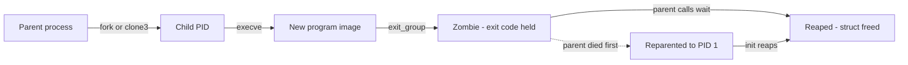
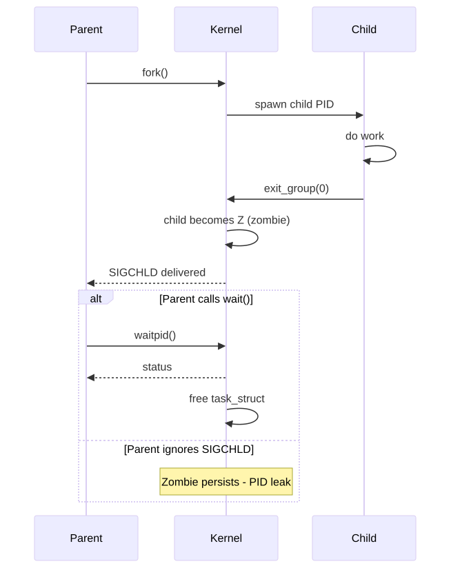
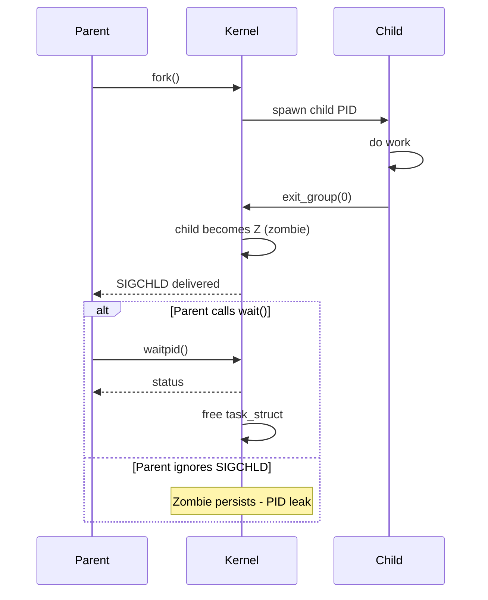
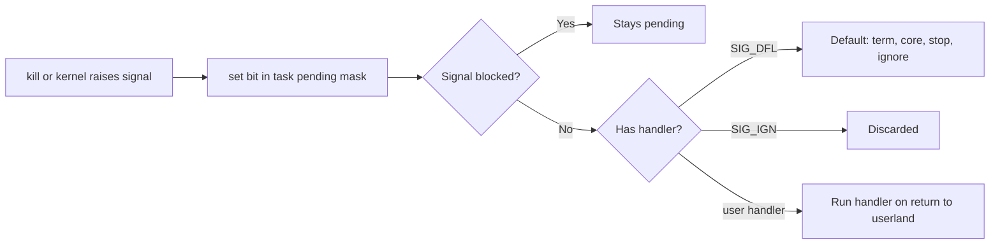

# Deep Dive: Process Lifecycle on Linux

## Why this matters

Every container, every systemd unit, every shell pipeline ultimately maps to the same kernel primitives: `fork`, `exec`, `wait`, signals, and `/proc`. When a Docker container "exits 137" or your CI job leaves zombies behind, you are debugging exactly these mechanisms. Understanding the lifecycle removes the magic from PID 1 behavior, init systems, supervisor design, and graceful shutdown.

---

## Mental model

A Linux process is a `task_struct` in the kernel with a PID, a parent (`ppid`), open file descriptors, a memory map, credentials, and a state. It does not start "from scratch" — it is always **cloned** from a parent and then **overlaid** with a new program image.

```
parent process
    |
    | fork()  -->  child gets a copy of address space (COW)
    |
    +--- child process (same code, different PID)
              |
              | exec("/bin/ls")  -->  replace memory image
              |                       PID stays the same
              v
         ls runs ... exits with status code
              |
              | becomes a "zombie" until parent calls wait()
              v
         reaped --> task_struct freed
```

Three states matter most in practice:
- **R** running / runnable
- **S** interruptible sleep (waiting for I/O, signal can wake it)
- **D** uninterruptible sleep (waiting on disk, cannot be killed)
- **Z** zombie (exited, waiting to be reaped)
- **T** stopped (SIGSTOP / ptrace)

---

## Architecture

<!-- mermaid:rendered -->
<p align="center"></p>

<details><summary>Mermaid source</summary>



</details>
### fork vs clone vs vfork

| Syscall | Use case | Address space |
|---------|----------|---------------|
| `fork()` | classic process creation | full COW copy |
| `vfork()` | legacy, parent blocked until exec | shared until exec |
| `clone()` / `clone3()` | threads, namespaces, containers | flags pick what is shared |

Containers are just `clone3` with `CLONE_NEWPID | CLONE_NEWNET | CLONE_NEWNS | ...`. No magic.

---

## Walkthrough: fork + exec + wait

```c
#include <sys/wait.h>
#include <unistd.h>
#include <stdio.h>

int main(void) {
    pid_t pid = fork();          // (1) kernel duplicates task_struct
    if (pid == 0) {
        // CHILD branch
        char *argv[] = { "/bin/echo", "hello", NULL };
        execve(argv[0], argv, NULL);   // (2) replace image; never returns on success
        _exit(127);                    // exec failed
    }
    // PARENT branch
    int status;
    waitpid(pid, &status, 0);    // (3) blocks until child exits, reaps zombie
    if (WIFEXITED(status))
        printf("child exit code = %d\n", WEXITSTATUS(status));
    return 0;
}
```

Key points:
1. After `fork`, both processes return — child gets `0`, parent gets the child PID.
2. `execve` keeps the same PID and PPID; only the memory image, registers, and most file descriptors (unless `O_CLOEXEC`) change.
3. `waitpid` is the ONLY way to reclaim a zombie. The exit code lives inside the kernel until reaped.

---

## Zombies and orphans

<!-- mermaid:rendered -->
<p align="center"></p>

<details><summary>Mermaid source</summary>



</details>
- **Zombie (Z):** child exited, parent has not called `wait`. The PID and exit status are pinned. Cannot be killed (`kill -9` does nothing — it is already dead). Fix the **parent**.
- **Orphan:** parent died before child. Kernel reparents child to the **subreaper** (PID 1 in most cases, or the nearest ancestor marked with `prctl(PR_SET_CHILD_SUBREAPER)`).
- **Container PID 1 trap:** if your container's PID 1 is your application and it does not reap children, every `exec` inside the container leaks zombies. Use `tini`, `dumb-init`, or `--init` for `docker run`.

---

## /proc/&lt;pid&gt;/ — the kernel as a filesystem

Every running process exposes its state under `/proc/<pid>/`. This is how `ps`, `top`, `htop`, and most observability tools work.

| Path | What you get |
|------|--------------|
| `/proc/<pid>/status` | human-readable: state, UID, threads, memory |
| `/proc/<pid>/stat` | space-separated raw fields (used by ps) |
| `/proc/<pid>/cmdline` | argv joined by NUL bytes |
| `/proc/<pid>/environ` | initial environment (NUL separated) |
| `/proc/<pid>/cwd` | symlink to current working directory |
| `/proc/<pid>/exe` | symlink to executable on disk |
| `/proc/<pid>/fd/` | open file descriptors as symlinks |
| `/proc/<pid>/maps` | memory regions, mmaped files, libraries |
| `/proc/<pid>/limits` | rlimits (nofile, nproc, stack ...) |
| `/proc/<pid>/ns/` | namespace handles (pid, net, mnt ...) |
| `/proc/<pid>/cgroup` | cgroup membership |
| `/proc/<pid>/oom_score` | how attractive this PID is to the OOM killer |

Useful one-liners:

```bash
# What binary is this PID running?
readlink /proc/$PID/exe

# What is it reading from / writing to?
ls -l /proc/$PID/fd/

# Which container (cgroup v2)?
cat /proc/$PID/cgroup

# Memory map of a leaking process
cat /proc/$PID/smaps_rollup
```

---

## Signal delivery semantics

Signals are an asynchronous IPC mechanism. The kernel sets a bit in the target's pending mask; the signal is delivered the next time the process returns to user mode.

<!-- mermaid:rendered -->
<p align="center"></p>

<details><summary>Mermaid source</summary>



</details>
Critical rules:
- **SIGKILL (9)** and **SIGSTOP (19)** cannot be caught, blocked, or ignored.
- A process in **D state** (uninterruptible) will not respond to any signal until the kernel wakes it from the I/O wait.
- **Signals do not queue** for standard signals — if 100 SIGCHLD arrive while one is pending, the handler runs once. Use `sigaction` with `SA_SIGINFO` plus realtime signals (`SIGRTMIN..SIGRTMAX`) if you need queuing.
- **PID 1 is special.** The kernel does NOT deliver default-action signals to PID 1 unless it explicitly installs a handler. That is why a naive `CMD ["python", "app.py"]` ignores `docker stop` (SIGTERM) and you wait 10 seconds for SIGKILL.

Reference handler:

```c
#include <signal.h>
volatile sig_atomic_t shutdown = 0;

void on_term(int sig) { shutdown = 1; }

int main(void) {
    struct sigaction sa = { .sa_handler = on_term, .sa_flags = SA_RESTART };
    sigemptyset(&sa.sa_mask);
    sigaction(SIGTERM, &sa, NULL);
    sigaction(SIGINT,  &sa, NULL);

    while (!shutdown) { /* event loop */ }
    /* graceful cleanup */
    return 0;
}
```

---

## Parent reaping and subreapers

A "subreaper" is a process that adopts orphaned descendants instead of letting them go to PID 1. systemd user services and container runtimes use this to keep accounting local.

```bash
# Mark current process as a subreaper for its descendants
prctl(PR_SET_CHILD_SUBREAPER, 1, 0, 0, 0);
```

In a container:
- If you run `docker run --init`, Docker injects `tini` as PID 1. `tini` forks your real command, becomes a subreaper, and reaps all orphans.
- Without `--init`, your app must either reap itself (loop on `waitpid(-1, &s, WNOHANG)` from a SIGCHLD handler) or accept the leak.

---

## Common interview questions

> The questions below are the ones that come up repeatedly in SRE / platform / kernel-adjacent interviews. Be ready to whiteboard the syscalls.

**Q1. What is the difference between a zombie and an orphan? How do you "kill" a zombie?**
A zombie is a dead child waiting for its parent to call `wait`. An orphan is a live child whose parent died — it gets reparented to PID 1 (or the nearest subreaper). You cannot kill a zombie; you must make the parent reap it (send SIGCHLD, fix the code, or kill the parent so init reaps the child).

**Q2. What exactly happens between `fork()` and `execve()`?**
`fork` clones the entire `task_struct` with copy-on-write pages. The child returns 0, the parent returns the child PID. Between fork and exec, file descriptors, signal handlers, and mappings are inherited. `execve` replaces the memory image and resets signal handlers (handlers set to default unless ignored), but PID, PPID, open FDs without `O_CLOEXEC`, and credentials persist.

**Q3. Why does my container ignore `docker stop`?**
Because PID 1 in Linux does not get default signal handling. If your app is PID 1 and never calls `sigaction(SIGTERM, ...)`, SIGTERM is dropped and Docker waits the grace period (default 10s) before sending SIGKILL. Fix: install handlers, run with `--init`, or use `tini`/`dumb-init`.

**Q4. A process is stuck in `D` state. What does that mean and what can you do?**
Uninterruptible sleep, almost always waiting on an I/O syscall (NFS, broken disk, hung block device). It cannot receive signals — even SIGKILL is queued until the kernel returns from the I/O. You either fix the underlying I/O (recover NFS, kick the device) or reboot. `cat /proc/<pid>/stack` shows the kernel call chain.

**Q5. How does `ps` work? Where does it get its data?**
It reads `/proc/<pid>/stat`, `status`, and `cmdline` for every PID directory under `/proc`. There is no syscall — `/proc` is a kernel-backed filesystem.

**Q6. What is OOM killer scoring based on?**
`/proc/<pid>/oom_score` is computed primarily from RSS as a fraction of available memory, biased by `oom_score_adj` (-1000 to +1000). Set `oom_score_adj = -1000` to make a PID immune. systemd uses this for critical services.

**Q7. What does `wait4` return when called with `WNOHANG` and there are no exited children?**
Returns 0 immediately (does not block). Returns -1 with `errno = ECHILD` if there are no children at all. This is the basis for non-blocking reapers.

**Q8. How do containers achieve PID isolation?**
`clone3` (or `unshare`) with `CLONE_NEWPID` creates a new PID namespace. The first process in that namespace becomes PID 1 *inside* the namespace, while still having a real "host" PID visible from the parent namespace. `/proc/<pid>/status` field `NSpid` shows both.

---

## Sources

- Kernel docs — Process management: https://www.kernel.org/doc/html/latest/process/index.html
- `man 2 fork`, `man 2 execve`, `man 2 waitpid`, `man 2 clone`
- proc filesystem: https://www.kernel.org/doc/html/latest/filesystems/proc.html
- Signal reference: https://man7.org/linux/man-pages/man7/signal.7.html
- PID 1 problem (tini): https://github.com/krallin/tini
- LWN — child subreapers: https://lwn.net/Articles/474787/
- Linux Programming Interface (Kerrisk), chapters 24-29
