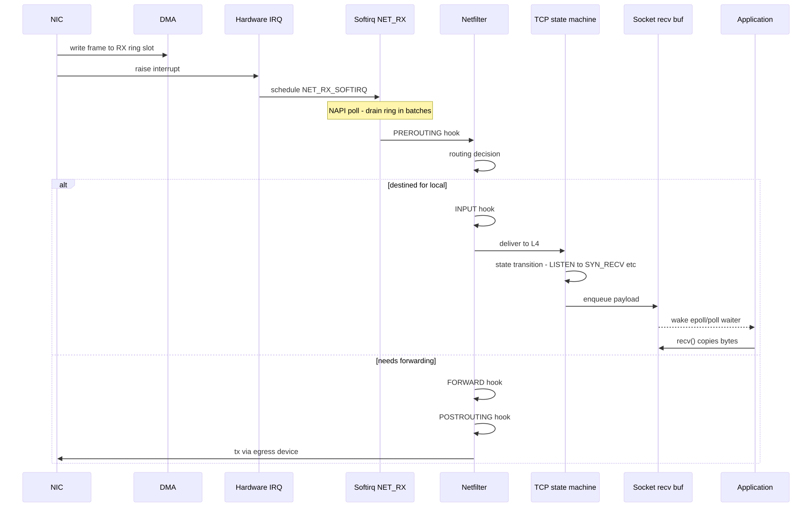
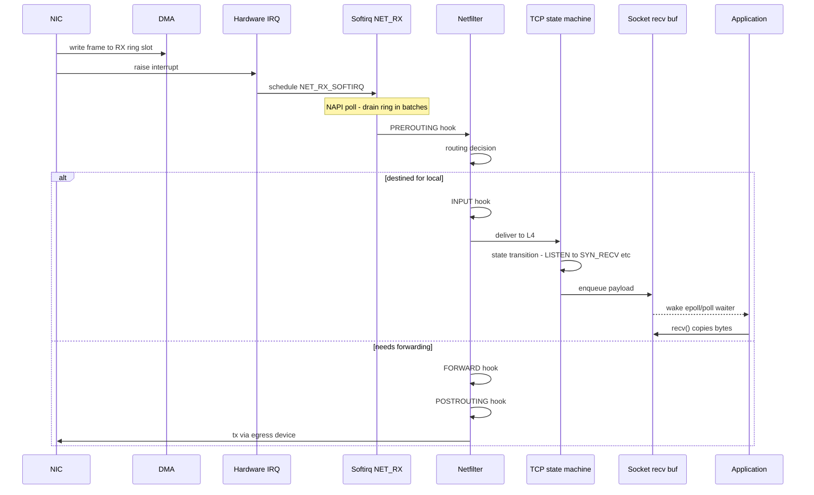
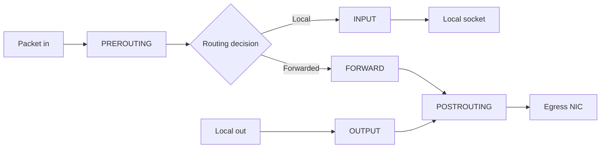
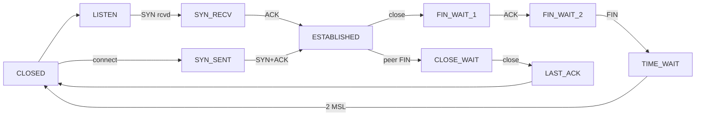

# Deep Dive: The Walk of a Packet — NIC to Socket

## Why this matters

Every networking bug — dropped packets, mysterious latency, iptables rules that "should" work but don't, conntrack table full, slow connection establishment — lives somewhere on the path from the NIC's receive ring to your application's `recv()` call. If you can name every stage on that path, you can pinpoint where the loss happens with `ethtool`, `nstat`, `ss`, `conntrack`, and `iptables -L -v`.

---

## Mental model

A received packet traverses three worlds:

```
+----------------+   +----------------+   +----------------+
|   Hardware     |   |    Kernel      |   |   Userspace    |
|  NIC + DMA     |-->|  IRQ + softirq |-->|  socket recv   |
|  ring buffer   |   |  netfilter     |   |  buffer        |
+----------------+   |  TCP/IP stack  |   +----------------+
                     +----------------+
```

The kernel does NOT process packets in the hardware interrupt — it only ACKs the IRQ and schedules a **softirq** (`NET_RX_SOFTIRQ`) which runs the actual stack work outside the IRQ context. This is why `top`'s `si` column matters under load.

---

## Sequence: receive path

<!-- mermaid:rendered -->
<p align="center"></p>

<details><summary>Mermaid source</summary>



</details>
---

## Stage 1 — NIC ring buffer

The NIC has fixed-size **RX rings** (descriptors pointing to DMA buffers). The driver pre-allocates `skb` slots; the NIC DMAs frames into them. Ring full = drop counted in `ethtool -S`.

```bash
# Inspect ring sizes
ethtool -g eth0

# Per-queue drops, errors
ethtool -S eth0 | grep -E 'drop|miss|error'

# Increase RX ring (only if drops are increasing)
ethtool -G eth0 rx 4096
```

If `rx_dropped` or `rx_no_buffer_count` climbs, the kernel cannot drain the ring fast enough — the bottleneck is downstream (softirq CPU saturation).

---

## Stage 2 — IRQ to softirq (NAPI)

Modern drivers use **NAPI**: the hardware IRQ fires once, the driver schedules `NET_RX_SOFTIRQ`, then **polls** the ring in batches (up to `netdev_budget` packets) before re-enabling the IRQ. This amortizes interrupt cost.

```bash
# Per-CPU softirq stats (column NET_RX matters)
cat /proc/softirqs | grep -E 'CPU|NET_RX'

# Tuning knobs
sysctl net.core.netdev_budget          # packets per NAPI poll, default 300
sysctl net.core.netdev_max_backlog     # per-CPU queue when RPS spreads work

# Spread RX across CPUs (RSS uses NIC hashing, RPS is software fallback)
ethtool -L eth0 combined 8
```

If one CPU is pinned at 100% in `si` and others are idle, you have a single RX queue — enable RSS or RPS.

---

## Stage 3 — Netfilter hooks

Netfilter (the engine behind `iptables` / `nftables`) exposes five hooks. **Order matters** — this is the canonical packet path through them:

<!-- mermaid:rendered -->
<p align="center"></p>

<details><summary>Mermaid source</summary>



</details>
| Hook | When | Common use |
|------|------|------------|
| PREROUTING | before routing | DNAT, mark, conntrack lookup |
| INPUT | destined for local | host firewall (filter table) |
| FORWARD | passing through | Docker, K8s, routers (filter) |
| OUTPUT | locally generated | egress firewall |
| POSTROUTING | just before TX | SNAT / MASQUERADE |

Every connection (after the first packet) is tracked in **conntrack** — a hash table keyed by 5-tuple. Look here when NAT misbehaves:

```bash
sysctl net.netfilter.nf_conntrack_max          # capacity
cat /proc/sys/net/netfilter/nf_conntrack_count # current
conntrack -L | head
dmesg | grep -i 'nf_conntrack: table full'
```

A "table full" log = silent drops. Raise the max or shorten timeouts.

---

## Stage 4 — TCP state machine

Once the packet reaches L4 and matches a socket, TCP runs its state machine.

<!-- mermaid:rendered -->
<p align="center"></p>

<details><summary>Mermaid source</summary>



</details>
Practical implications:
- **SYN_RECV pile-up** = SYN flood or backlog too small. `sysctl net.core.somaxconn`, `net.ipv4.tcp_max_syn_backlog`.
- **CLOSE_WAIT pile-up** = your app is not calling `close()` after the peer FIN. Application bug, not kernel.
- **TIME_WAIT pile-up** on the *initiator* (typically a load balancer or busy client). Use `SO_REUSEADDR`, ephemeral port range tuning, or persistent connections.

```bash
# Snapshot socket states
ss -tan state established | wc -l
ss -tan state time-wait   | wc -l
ss -lnt                          # listen sockets with backlog and accept queue

# Listen overflow / drop counters
nstat -az | grep -E 'ListenOverflow|ListenDrops|TCPSynRetrans'
```

---

## Stage 5 — Socket receive buffer

The TCP stack enqueues payload into the socket's receive buffer. The application drains it via `recv()` / `read()` / `recvmsg()`.

```bash
# Defaults and limits (min default max)
sysctl net.ipv4.tcp_rmem
sysctl net.ipv4.tcp_wmem
sysctl net.core.rmem_max
sysctl net.core.wmem_max
```

The advertised TCP **receive window** is bounded by the buffer. If the app does not drain fast enough, the window shrinks, the sender slows down (or stalls). Symptom: high `Recv-Q` in `ss -tan`.

Per-socket inspection:

```bash
ss -tan -i -m
#         |    |
#         |    +-- memory: r(rmem_alloc) tb(snd_buf) etc
#         +-- TCP info: rtt, cwnd, retrans
```

---

## End-to-end: where to look when "the network is slow"

| Symptom | Layer | Tool |
|---------|-------|------|
| `rx_dropped` increasing | NIC ring | `ethtool -S` |
| One CPU at 100% si | softirq | `mpstat -P ALL`, `/proc/softirqs` |
| `nf_conntrack: table full` | netfilter | `conntrack`, sysctl |
| `ListenOverflow` | TCP accept queue | `nstat`, raise `somaxconn` |
| Many `TIME_WAIT` | TCP teardown | `ss -tan state time-wait` |
| High `Recv-Q` | app not reading | `ss -tan`, app profiling |
| Retransmits | wire / congestion | `nstat TcpExtTCPSynRetrans`, `ss -i` |

---

## Common interview questions

> Memorize the path. The interviewer is looking for "PREROUTING then routing then INPUT" and "softirq, not IRQ".

**Q1. Walk a packet from wire to application.**
NIC DMAs into RX ring, raises IRQ, kernel schedules `NET_RX_SOFTIRQ`, NAPI polls the ring in batches, builds `skb`, runs PREROUTING + conntrack, routing decision, INPUT hook, L4 demux to socket, payload into recv buffer, app wakes from epoll and calls `recv`.

**Q2. Difference between PREROUTING and INPUT?**
PREROUTING runs before the routing decision — used for DNAT and rewriting destinations. INPUT runs after routing has decided the packet is for the local host — used for host firewall rules.

**Q3. Where does Docker insert iptables rules and why?**
Docker adds a `DOCKER` chain hooked from `FORWARD` (for container-to-container) and from `PREROUTING` / `OUTPUT` in the `nat` table for port publishing (DNAT). The MASQUERADE rule sits in `POSTROUTING` so containers can reach the outside world via the host IP.

**Q4. What is conntrack and why does it matter for K8s?**
Connection tracking remembers each flow's 5-tuple so reply packets can be SNAT'd/DNAT'd consistently. Kubernetes `Service` ClusterIP is implemented via DNAT + conntrack (kube-proxy iptables mode). Conntrack table exhaustion = pod-to-service traffic silently drops.

**Q5. CLOSE_WAIT vs TIME_WAIT — which one is your bug?**
CLOSE_WAIT is on the side that received a FIN but has not closed its socket — almost always an application bug (forgot to `close`). TIME_WAIT is on the side that initiated `close` — protocol-mandated 2*MSL wait, normal but can pile up under high churn.

**Q6. What does NAPI solve?**
Interrupt storms. Without NAPI, every packet would fire a hardware IRQ. NAPI fires one IRQ, then polls the ring in softirq context until empty (or budget exhausted), then re-enables the IRQ. Throughput up, IRQ overhead down.

**Q7. How would you debug a "kernel: nf_conntrack: table full, dropping packet" error?**
Check `/proc/sys/net/netfilter/nf_conntrack_count` vs `nf_conntrack_max`. Raise the max (memory permitting), shorten `nf_conntrack_tcp_timeout_established` (default 5 days!), or remove unnecessary NAT (e.g., switch kube-proxy to IPVS, or use eBPF / Cilium).

**Q8. Why might my server show `ListenOverflows`?**
The accept queue (length = `min(somaxconn, listen-backlog-arg)`) is full because the application is not calling `accept()` fast enough. Either increase `somaxconn` and the listen backlog, or fix the app to accept in a tight loop and hand off to workers.

---

## Sources

- Kernel networking: https://www.kernel.org/doc/html/latest/networking/index.html
- Netfilter packet flow diagram: https://en.wikipedia.org/wiki/Netfilter#/media/File:Netfilter-packet-flow.svg
- NAPI: https://wiki.linuxfoundation.org/networking/napi
- TCP tuning guide (Cloudflare): https://blog.cloudflare.com/the-story-of-one-latency-spike/
- conntrack-tools: https://conntrack-tools.netfilter.org/
- `man 7 tcp`, `man 7 socket`, `man 8 ss`, `man 8 ethtool`
- "Monitoring and Tuning the Linux Networking Stack" — Joe Damato (packagecloud blog)
