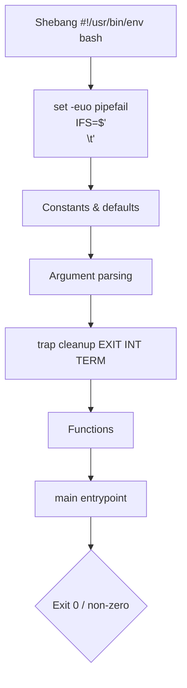

# 🐚 05 — Shell Scripting (Bash)

> Bash is glue. The difference between a fragile glob of commands and a reliable script is `set -euo pipefail` plus a `trap`.

## Why this matters

Cron jobs, CI pipelines, init scripts, container entrypoints — they're all bash. A bash script that silently swallows errors will haunt you at 3 AM.

## 🔁 Anatomy of a robust script



## Concepts

- **Shebang** — first line `#!/usr/bin/env bash` for portability.
- **Strict mode** — `set -e` exit on error, `set -u` undefined var = error, `set -o pipefail` pipe fails if any stage fails, `IFS=$'\n\t'` safer word splitting.
- **Variables** — `name=value` (no spaces around `=`); reference with `"$name"`.
- **Quoting** — `"double"` expands; `'single'` literal; `$(cmd)` command substitution.
- **Conditionals** — `[[ ... ]]` (preferred bash) vs `[ ... ]` (POSIX).
- **Loops** — `for`, `while`, `until`.
- **Functions** — `name() { ...; }` — return code only; capture stdout via `$(name)`.
- **Trap** — run cleanup on signals or `EXIT`.

## Commands & syntax

```bash
#!/usr/bin/env bash
set -euo pipefail
IFS=$'\n\t'

# Variables
NAME="alice"
COUNT=5
readonly NAME                      # immutable

# Arithmetic
i=$(( COUNT + 1 ))                 # 6
(( i > 3 )) && echo "big"

# String ops
echo "${NAME^^}"                   # ALICE  (uppercase)
echo "${NAME:0:2}"                 # al     (substring)
echo "${NAME/a/A}"                 # Alice  (replace first)
echo "${VAR:-default}"             # 'default' if VAR unset
echo "${VAR:?must be set}"         # error if unset

# Arrays
fruits=(apple banana cherry)
echo "${fruits[1]}"                # banana
echo "${#fruits[@]}"               # 3
for f in "${fruits[@]}"; do echo "$f"; done

# Conditionals
if [[ -f /etc/hosts ]]; then echo "exists"; fi
[[ "$NAME" == a* ]] && echo "starts with a"
case "$1" in
  start) echo "starting" ;;
  stop)  echo "stopping" ;;
  *)     echo "usage: $0 {start|stop}"; exit 1 ;;
esac

# Loops
for i in {1..5}; do echo "$i"; done
for f in /etc/*.conf; do echo "$f"; done
while read -r line; do echo "L: $line"; done < /etc/hosts

# Functions
greet() {
  local who="${1:?who?}"
  echo "hello, $who"
  return 0
}
out=$(greet world)

# Traps
cleanup() { rm -f /tmp/work.$$; }
trap cleanup EXIT INT TERM

# Useful test flags
# -e exists  -f regular file  -d directory  -L symlink  -r readable
# -s non-empty file  -x executable  -z empty string  -n non-empty string
```

## 🧪 Lab — Write a robust backup script

```bash
docker run -it --rm ubuntu:22.04 bash
apt-get update && apt-get install -y vim tar gzip shellcheck >/dev/null
mkdir -p /data && echo "data" > /data/file.txt
```

**Step 1.** Create `/usr/local/bin/backup.sh`.

```bash
cat > /usr/local/bin/backup.sh <<'EOF'
#!/usr/bin/env bash
#
# backup.sh — tar+gzip a source dir into a timestamped archive.
# Usage: backup.sh <src> <dest_dir>
set -euo pipefail
IFS=$'\n\t'

SRC="${1:?usage: $0 <src> <dest_dir>}"
DEST="${2:?usage: $0 <src> <dest_dir>}"
TS="$(date +%Y%m%d-%H%M%S)"
NAME="$(basename "$SRC")"
ARCHIVE="${DEST}/${NAME}-${TS}.tar.gz"
TMP="$(mktemp -d)"

log()  { printf '[%s] %s\n' "$(date +%T)" "$*" >&2; }
fail() { log "ERROR: $*"; exit 1; }
cleanup() { rm -rf "$TMP"; }
trap cleanup EXIT

[[ -d "$SRC"  ]] || fail "source not a directory: $SRC"
[[ -d "$DEST" ]] || mkdir -p "$DEST"

log "archiving $SRC -> $ARCHIVE"
tar -czf "$TMP/out.tgz" -C "$(dirname "$SRC")" "$NAME"
mv "$TMP/out.tgz" "$ARCHIVE"

SIZE="$(du -h "$ARCHIVE" | cut -f1)"
log "done: $ARCHIVE ($SIZE)"
EOF
chmod +x /usr/local/bin/backup.sh
```

**Step 2.** Lint it.

```bash
shellcheck /usr/local/bin/backup.sh
# → (no output ⇒ clean)
```

**Step 3.** Run it.

```bash
backup.sh /data /backups
# → [10:00:01] archiving /data -> /backups/data-20260426-100001.tar.gz
# → [10:00:01] done: /backups/data-20260426-100001.tar.gz (4.0K)
ls /backups
# → data-20260426-100001.tar.gz
```

**Step 4.** Trigger the error path.

```bash
backup.sh /nope /backups
# → [10:00:05] ERROR: source not a directory: /nope
echo $?     # → 1
```

**Step 5.** Verify the trap fires (no leftover tmp).

```bash
ls /tmp | grep -E '^tmp\.' || echo "clean"
# → clean
```

**Step 6.** Bonus — loop over multiple sources.

```bash
for d in /etc /data; do backup.sh "$d" /backups; done
ls /backups
# → data-20260426-100001.tar.gz  etc-20260426-100010.tar.gz  data-20260426-100012.tar.gz
```

## ⚠️ Gotchas

> ⚠️ Always quote variables: `"$var"`. Unquoted values undergo word splitting and globbing — the #1 source of bash bugs.
>
> ⚠️ `set -e` does **not** trigger inside `&&`/`||` chains, function bodies tested with `if`, or commands in pipelines (without `pipefail`). Read `man bash` "ERR" carefully.
>
> ⚠️ `[ ... ]` is a command (`/usr/bin/[`). `[[ ... ]]` is a bash keyword with safer parsing. Prefer `[[ ]]` in bash scripts.
>
> ⚠️ `cd` failures in scripts are catastrophic if you `rm -rf "$dir/*"` next. Always `cd "$dir" || exit 1`.
>
> ⚠️ Use `mktemp` — never `/tmp/myfile.$$`. Predictable names enable symlink attacks.
>
> ⚠️ `read` without `-r` mangles backslashes. Always `while read -r line; do …`.
>
> ⚠️ `bash` ≠ `sh`. `#!/bin/sh` on Debian = dash, missing `[[`, arrays, etc. Pick one and shebang it.
>
> ⚠️ Run `shellcheck` on every script. It catches the bugs you would learn the hard way.

## 📖 Further reading

- `man bash` (yes, all of it eventually)
- [GNU Bash manual](https://www.gnu.org/software/bash/manual/)
- [Bash strict mode by Aaron Maxwell](http://redsymbol.net/articles/unofficial-bash-strict-mode/)
- [Bash pitfalls — wiki.bash-hackers](https://mywiki.wooledge.org/BashPitfalls)
- [shellcheck.net](https://www.shellcheck.net/)
- [Google Shell Style Guide](https://google.github.io/styleguide/shellguide.html)
