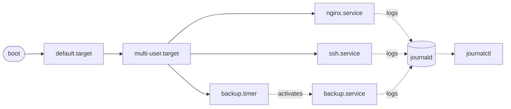

# 🛠️ 06 — systemd

> systemd is PID 1 on every modern Linux distro. It boots the system, supervises services, schedules timers, and centralizes logs. Love it or fight it — you must read it.

## Why this matters

In production every long-running process is a systemd unit. Knowing how to write a unit file and read `journalctl` is the day-1 skill of any DevOps role.

## 🧩 Unit relationships

<!-- mermaid:rendered -->
<p align="center"></p>

<details><summary>Mermaid source</summary>



</details>
## Quick reference

=== ":material-lightbulb-outline: Concept"
    systemd is PID 1: it boots the host, supervises long-running services as `.service` units, schedules work via `.timer` units, and centralizes logs through journald. A unit file plus `systemctl` is how you put any binary into production on a modern Linux host.

=== ":material-file-code-outline: Snippet"
    ```bash
    # /etc/systemd/system/heartbeat.service
    [Unit]
    Description=Heartbeat demo service
    After=network.target

    [Service]
    Type=simple
    ExecStart=/usr/local/bin/heartbeat.sh
    Restart=on-failure

    [Install]
    WantedBy=multi-user.target
    ```

=== ":material-console: Command"
    ```bash
    systemctl daemon-reload
    systemctl enable --now heartbeat.service
    systemctl status heartbeat --no-pager
    journalctl -u heartbeat -f
    ```

=== ":material-text-box-outline: Expected output"
    ```text
    ● heartbeat.service - Heartbeat demo service
       Loaded: loaded (/etc/systemd/system/heartbeat.service; enabled)
       Active: active (running) since Sun 2026-04-26 10:00:00 UTC
    Apr 26 10:00:01 host heartbeat.sh[42]: heartbeat at 2026-04-26T10:00:01+00:00
    ```

## Concepts

- **Unit** — config object: `.service`, `.timer`, `.socket`, `.mount`, `.target`, `.path`, `.slice`.
- **Target** — grouping (boot stage), e.g. `multi-user.target` (text-mode multi-user).
- **Service types** — `simple` (default, foreground), `forking` (daemonizes), `oneshot` (runs and exits), `notify` (signals readiness).
- **Drop-ins** — `/etc/systemd/system/foo.service.d/override.conf` overlays without editing the original.
- **journald** — binary structured log store at `/var/log/journal/`.
- **Restart policies** — `no`, `on-failure`, `always`, `on-abnormal`.

## Commands

```bash
# Inspect
systemctl status nginx
systemctl is-active nginx           # → active
systemctl is-enabled nginx          # → enabled
systemctl list-units --type=service --state=running
systemctl list-unit-files --state=enabled
systemctl cat nginx.service         # show effective unit + drop-ins
systemctl show nginx -p MainPID,ExecStart,Restart

# Lifecycle
systemctl start   nginx
systemctl stop    nginx
systemctl restart nginx
systemctl reload  nginx             # SIGHUP equivalent
systemctl enable  nginx             # start at boot
systemctl disable nginx
systemctl enable --now nginx        # enable + start in one
systemctl daemon-reload             # re-read unit files after edit

# Drop-ins / overrides
systemctl edit nginx                # creates /etc/systemd/system/nginx.service.d/override.conf

# Targets
systemctl get-default               # → multi-user.target
systemctl isolate rescue.target     # switch runlevel

# Timers (cron replacement)
systemctl list-timers --all
systemd-analyze calendar 'Mon *-*-* 03:00:00'

# Logs
journalctl -u nginx                          # all logs for nginx
journalctl -u nginx -f                       # follow (like tail -f)
journalctl -u nginx --since '1 hour ago'
journalctl -u nginx -p err..alert            # priority range (emerg..debug)
journalctl -b                                # this boot only
journalctl -b -1                             # previous boot
journalctl --disk-usage
journalctl --vacuum-time=7d                  # prune older than 7d

# Boot analysis
systemd-analyze
systemd-analyze blame                        # slowest services
systemd-analyze critical-chain
```

## 📜 Service unit anatomy

```ini
[Unit]
Description=My App
Documentation=https://example.com/docs
After=network-online.target
Wants=network-online.target

[Service]
Type=simple
User=myapp
Group=myapp
WorkingDirectory=/opt/myapp
Environment="LOG_LEVEL=info"
EnvironmentFile=-/etc/myapp/env       # leading - = ignore if missing
ExecStart=/opt/myapp/bin/server
ExecReload=/bin/kill -HUP $MAINPID
Restart=on-failure
RestartSec=5s
# Hardening
NoNewPrivileges=true
ProtectSystem=strict
ProtectHome=true
PrivateTmp=true
ReadWritePaths=/var/lib/myapp

[Install]
WantedBy=multi-user.target
```

## 🧪 Lab — Write a systemd service + timer

> 💡 Use the systemd-enabled image: `docker run -it --rm --privileged --tmpfs /tmp --tmpfs /run --tmpfs /run/lock -v /sys/fs/cgroup:/sys/fs/cgroup:rw jrei/systemd-ubuntu:22.04`. Inside it, `systemctl` works.

**Step 1.** Create a tiny script the service will run.

```bash
cat > /usr/local/bin/heartbeat.sh <<'EOF'
#!/usr/bin/env bash
set -euo pipefail
while true; do
  echo "heartbeat at $(date -Is)"
  sleep 5
done
EOF
chmod +x /usr/local/bin/heartbeat.sh
```

**Step 2.** Create the service unit.

```bash
cat > /etc/systemd/system/heartbeat.service <<'EOF'
[Unit]
Description=Heartbeat demo service
After=network.target

[Service]
Type=simple
ExecStart=/usr/local/bin/heartbeat.sh
Restart=on-failure
RestartSec=2s
StandardOutput=journal
StandardError=journal

[Install]
WantedBy=multi-user.target
EOF
```

**Step 3.** Load, enable, and start.

```bash
systemctl daemon-reload
systemctl enable --now heartbeat.service
systemctl status heartbeat --no-pager
# → ● heartbeat.service - Heartbeat demo service
# →    Loaded: loaded (/etc/systemd/system/heartbeat.service; enabled; …)
# →    Active: active (running) since …
```

**Step 4.** Tail the logs.

```bash
journalctl -u heartbeat -f --no-pager
# → Apr 26 10:00:01 host heartbeat.sh[42]: heartbeat at 2026-04-26T10:00:01+00:00
# → Apr 26 10:00:06 host heartbeat.sh[42]: heartbeat at 2026-04-26T10:00:06+00:00
# (Ctrl-C to stop following)
```

**Step 5.** Test the restart policy.

```bash
PID=$(systemctl show -p MainPID --value heartbeat)
kill -KILL $PID
sleep 3
systemctl status heartbeat --no-pager | grep -E 'Active|Main PID'
# → Active: active (running) since …  (1s ago)
# → Main PID: 99 (heartbeat.sh)        ← new PID
```

**Step 6.** Add a timer that pings every minute.

```bash
cat > /etc/systemd/system/ping.service <<'EOF'
[Unit]
Description=Single ping
[Service]
Type=oneshot
ExecStart=/usr/bin/echo "tick at $(date -Is)"
EOF

cat > /etc/systemd/system/ping.timer <<'EOF'
[Unit]
Description=Run ping every minute
[Timer]
OnBootSec=30s
OnUnitActiveSec=1min
Unit=ping.service
[Install]
WantedBy=timers.target
EOF

systemctl daemon-reload
systemctl enable --now ping.timer
systemctl list-timers ping.timer
# → NEXT                          LEFT  …  UNIT          ACTIVATES
# → Sun 2026-04-26 10:01:30 UTC   45s   …  ping.timer    ping.service
```

**Step 7.** Use a drop-in to change an option without editing the unit.

```bash
systemctl edit heartbeat.service
# Editor opens — paste:
# [Service]
# Environment="GREETING=hello"
# Save and exit.
systemctl restart heartbeat
systemctl show heartbeat -p Environment
# → Environment=GREETING=hello
```

## ⚠️ Gotchas

> ⚠️ Always `systemctl daemon-reload` after editing a unit file, or systemd uses the cached version.
>
> ⚠️ `Type=simple` services must NOT fork. If they do, systemd thinks they exited and restarts forever. Use `Type=forking` with `PIDFile=`.
>
> ⚠️ `Restart=always` on a misconfigured service = log flood. Set `StartLimitBurst=` + `StartLimitIntervalSec=` to brake.
>
> ⚠️ `journalctl` with no filters is slow. Always pin with `-u`, `--since`, or `-b`.
>
> ⚠️ Logs are per-boot by default unless `/var/log/journal/` exists. `mkdir /var/log/journal && systemctl restart systemd-journald` for persistence.
>
> ⚠️ Inside vanilla Docker, `systemctl` doesn't work — there's no PID 1 systemd. Use a systemd-enabled image or `docker exec`.
>
> ⚠️ Timers replace cron with logging, dependencies, and resource control. Prefer them on systemd hosts.

## 📖 Further reading

- `man 1 systemctl` · `man 1 journalctl` · `man 5 systemd.service` · `man 5 systemd.timer` · `man 5 systemd.unit`
- [systemd.io](https://systemd.io/)
- [systemd man pages index](https://www.freedesktop.org/software/systemd/man/)
- [ArchWiki — systemd](https://wiki.archlinux.org/title/Systemd)
- [systemd by example (interactive)](https://systemd-by-example.com/)
