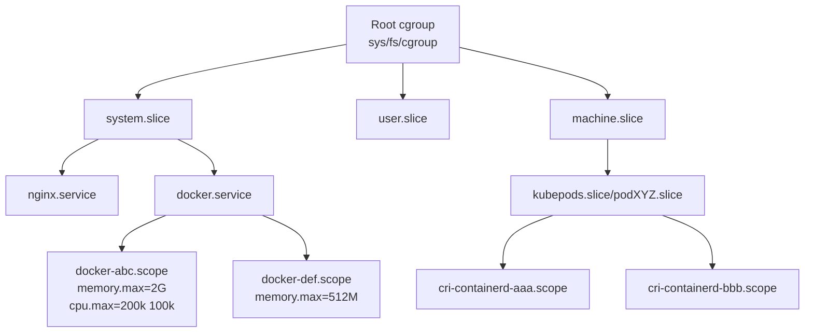
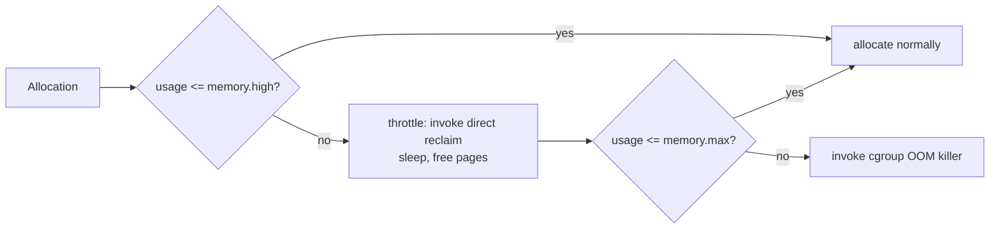

# Deep Dive: cgroups v2 — Unified Hierarchy and Controllers

## Why this matters

cgroups v2 is the foundation of every modern container runtime, every systemd resource limit, and every Kubernetes Pod QoS class. When you write `MemoryMax=2G` in a unit file, set `--memory=2g` on Docker, or define `resources.limits.memory: 2Gi` in a Pod spec — you are programming the v2 controller hierarchy. Knowing the difference between `MemoryHigh` and `MemoryMax` is the difference between an OOM-killed pod at 3 a.m. and a pod that gracefully throttles.

---

## Mental model — unified hierarchy

In cgroups **v1**, each controller (cpu, memory, blkio, pids, ...) had its **own** hierarchy. A process could be in different cgroups in different controllers. This was confusing and made delegation hard.

In cgroups **v2**, there is **one** tree. A process belongs to exactly one cgroup, and that cgroup enables a subset of controllers via `cgroup.subtree_control`.

```bash
/sys/fs/cgroup/                             <-- root cgroup (v2 mount)
├── cgroup.controllers                      <-- controllers available
├── cgroup.subtree_control                  <-- controllers enabled for children
├── system.slice/
│   ├── cgroup.procs
│   ├── memory.max
│   ├── cpu.max
│   └── docker-<id>.scope/
│       ├── cgroup.procs                    <-- container PIDs
│       ├── memory.max = 2147483648
│       ├── memory.high = 1879048192
│       ├── cpu.max = "200000 100000"       <-- 2 CPUs
│       └── io.max = "8:0 rbps=10485760"
└── user.slice/
    └── user-1000.slice/...
```

Identify a process's cgroup:

```bash
cat /proc/$$/cgroup
# 0::/user.slice/user-1000.slice/session-3.scope
```

The leading `0::` means cgroup v2 unified hierarchy.

---

## Architecture

<!-- mermaid:rendered -->
<p align="center"></p>

<details><summary>Mermaid source</summary>



</details>
systemd creates the slice/scope/service tree automatically and exposes resource directives that are translated into v2 files.

---

## The four core controllers

### cpu

Files: `cpu.max`, `cpu.weight`, `cpu.stat`, `cpu.pressure`

```bash
# Hard cap: 2 cores worth of time per period
echo "200000 100000" > cpu.max     # quota period (microseconds)

# Soft share (1..10000, default 100)
echo 200 > cpu.weight              # 2x weight vs siblings

# Read consumed time and throttling
cat cpu.stat
# usage_usec 12345678
# user_usec  10000000
# system_usec 2345678
# nr_periods 1234
# nr_throttled 56          <-- non-zero = you hit the quota
# throttled_usec 789000
```

**Throttling** is the silent killer of latency. A pod that "looks fine" on CPU usage but has rising `nr_throttled` is being paused at every period boundary.

### memory

Files: `memory.max`, `memory.high`, `memory.low`, `memory.min`, `memory.swap.max`, `memory.current`, `memory.stat`, `memory.events`, `memory.pressure`

| File | Behavior |
|------|----------|
| `memory.min` | hard guarantee — never reclaimed below this |
| `memory.low` | best-effort guarantee — reclaimed only if no alternative |
| `memory.high` | **throttle threshold** — allocations slowed via reclaim, NO kill |
| `memory.max` | **hard limit** — exceed it and the cgroup OOM killer fires |
| `memory.swap.max` | per-cgroup swap cap |

```bash
# Container with soft throttle at 1.75G, kill at 2G
echo $((2 * 1024 * 1024 * 1024))    > memory.max
echo $((7 * 256 * 1024 * 1024))     > memory.high

# What killed me?
cat memory.events
# low 0
# high 14         <-- was throttled 14 times
# max 0
# oom 0
# oom_kill 0
```

#### MemoryHigh vs MemoryMax — the critical distinction

<!-- mermaid:rendered -->
<p align="center"></p>

<details><summary>Mermaid source</summary>



</details>
- `MemoryHigh` = "please slow down" — graceful, app stays alive but gets slower.
- `MemoryMax` = "die now" — abrupt SIGKILL of the most expensive task.

Best practice in production: set `MemoryHigh` slightly below `MemoryMax` so you get warning signs (rising `memory.events.high` counter) before an OOM.

### io

Files: `io.max`, `io.weight`, `io.stat`, `io.pressure`

```bash
# Cap a cgroup to 10 MB/s read on device 8:0
echo "8:0 rbps=10485760 wbps=20971520" > io.max

# Proportional weight (1..10000, default 100)
echo 500 > io.weight

cat io.stat
# 8:0 rbytes=12345 wbytes=67890 rios=10 wios=20
```

`io.weight` only works under contention and only with the BFQ or `iocost` scheduler — it does nothing on `none`/`mq-deadline` without `iocost` cost model configured.

### pids

Files: `pids.max`, `pids.current`, `pids.events`

```bash
echo 256 > pids.max
cat pids.current
# 42
```

A fork bomb in a container with `pids.max=256` is contained within the container.

---

## PSI — Pressure Stall Information

Each controller exposes a `*.pressure` file that quantifies time the cgroup spent **stalled** waiting for that resource. This is the modern way to detect saturation, not utilization.

```bash
cat memory.pressure
# some avg10=12.34 avg60=3.45 avg300=0.12 total=123456789
# full avg10=4.56  avg60=1.23 avg300=0.04 total=45678901
```

- `some` = at least one task stalled
- `full` = every task in the cgroup stalled (truly saturated)
- avg10/60/300 = percentage of time in last 10s / 60s / 300s

PSI is what you alert on in modern SRE setups: `memory.pressure full avg10 > 10` is far more meaningful than `memory.current / memory.max > 0.9`.

---

## systemd integration

systemd is the userspace owner of the cgroup tree on every modern distro. It maps unit directives to v2 files:

| systemd directive | cgroup v2 file |
|-------------------|----------------|
| `CPUQuota=200%`   | `cpu.max = 200000 100000` |
| `CPUWeight=200`   | `cpu.weight = 200` |
| `MemoryHigh=1750M`| `memory.high` |
| `MemoryMax=2G`    | `memory.max` |
| `MemorySwapMax=0` | `memory.swap.max = 0` |
| `IOWeight=500`    | `io.weight` |
| `IOReadBandwidthMax=/dev/sda 10M` | `io.max rbps=...` |
| `TasksMax=256`    | `pids.max` |

```ini
# /etc/systemd/system/myapp.service
[Service]
ExecStart=/usr/bin/myapp
CPUQuota=200%
MemoryHigh=1750M
MemoryMax=2G
TasksMax=256
IOWeight=200
```

```bash
systemctl daemon-reload
systemctl restart myapp
systemd-cgls                          # tree view
systemd-cgtop                         # top-like view of cgroup usage
systemctl status myapp --no-pager     # shows cgroup path
```

---

## Walkthrough — create a cgroup by hand

```bash
# 1. Verify v2 is the unified mount (modern distros default to this)
mount | grep cgroup2
# cgroup2 on /sys/fs/cgroup type cgroup2 (rw,nosuid,nodev,noexec,relatime,nsdelegate)

# 2. Create a child cgroup
mkdir /sys/fs/cgroup/sandbox

# 3. Enable controllers in the parent's subtree_control FIRST
echo "+cpu +memory +io +pids" > /sys/fs/cgroup/cgroup.subtree_control

# 4. Set limits in the new cgroup
echo "100000 100000" > /sys/fs/cgroup/sandbox/cpu.max
echo $((512*1024*1024)) > /sys/fs/cgroup/sandbox/memory.max

# 5. Move a process into it
echo $$ > /sys/fs/cgroup/sandbox/cgroup.procs

# 6. Run anything; it inherits limits
stress-ng --vm 2 --vm-bytes 1G       # will be OOM-killed by cgroup
```

The "no internal processes" rule: a v2 cgroup with controllers enabled in `subtree_control` cannot have processes directly. Processes live only in **leaf** cgroups.

---

## Common interview questions

> Expect questions on the difference vs v1, the High/Max distinction, and how kubelet uses this.

**Q1. What is the single biggest difference between cgroups v1 and v2?**
v1 had per-controller hierarchies (a process could be in different cgroups for cpu vs memory). v2 has a single unified hierarchy — one cgroup membership per process — with controllers enabled per-subtree via `cgroup.subtree_control`.

**Q2. Difference between `MemoryHigh` and `MemoryMax`?**
`MemoryHigh` is a soft throttle: the kernel forces direct reclaim and sleeps allocators when usage exceeds it; nothing is killed. `MemoryMax` is a hard limit: exceeding it triggers the cgroup-scoped OOM killer immediately.

**Q3. How does Kubernetes map Pod resources to cgroup files?**
`requests.cpu` -> `cpu.weight` (proportional share). `limits.cpu` -> `cpu.max` (quota/period). `requests.memory` -> `memory.min` / `memory.low` depending on QoS. `limits.memory` -> `memory.max`. Burstable pods skip `memory.high`; Guaranteed pods get `requests == limits`.

**Q4. What is PSI and why is it better than utilization metrics?**
Pressure Stall Information measures time tasks were *stalled waiting* for CPU/memory/IO. Utilization can be 100% with no pressure (work is flowing); pressure is non-zero only when work is *blocked*. This eliminates false positives from healthy busy systems.

**Q5. Can a process see what cgroup it is in?**
Yes — read `/proc/self/cgroup`. v2 always shows `0::/path`. The controllers it sees depend on the cgroup namespace and the mount.

**Q6. Why does `cpu.weight` not cap CPU usage?**
Weight is a proportional share that only matters under contention. With idle siblings, a cgroup with weight 100 can use the entire CPU. To cap, use `cpu.max`.

**Q7. What is the "no internal processes" rule?**
In v2, any cgroup that has controllers enabled in its `subtree_control` cannot directly contain processes — processes must live in leaf cgroups. This makes resource accounting unambiguous.

**Q8. How does Docker pick between v1 and v2?**
At dockerd startup it inspects `/sys/fs/cgroup` mount type. With `cgroup2` it uses the unified driver; with the legacy mounts it uses v1. The `--cgroupfs` vs `--systemd` cgroup driver flag controls *who writes* the files; `--systemd` is required when running under systemd to avoid two writers fighting.

---

## Sources

- Kernel cgroup v2 docs: https://www.kernel.org/doc/html/latest/admin-guide/cgroup-v2.html
- systemd resource control: https://www.freedesktop.org/software/systemd/man/systemd.resource-control.html
- PSI: https://www.kernel.org/doc/html/latest/accounting/psi.html
- Chris Down — "Cgroup v2 in production": https://chrisdown.name/talks/
- Kubernetes resource management: https://kubernetes.io/docs/concepts/configuration/manage-resources-containers/
- runc cgroup driver: https://github.com/opencontainers/runc/blob/main/docs/cgroup-v2.md
