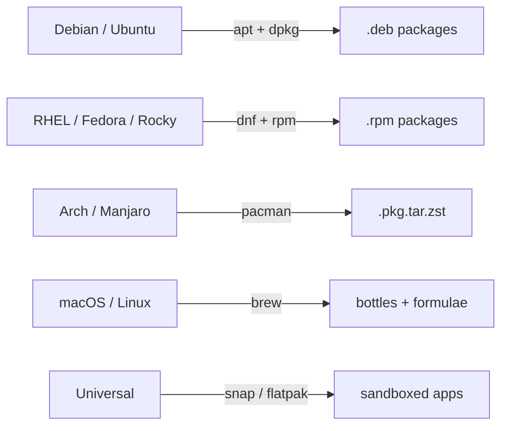

# 📦 07 — Package Management

> Distros disagree about everything except wanting their own package manager. Learn the three families and you cover 95% of Linux + macOS dev hosts.

## Why this matters

Installs, upgrades, dependency hell, and supply-chain provenance all flow through the package manager. Wrong repo or wrong version bricks production.

## 🌐 The big three (plus brew)

<!-- mermaid:rendered -->
<p align="center"></p>

<details><summary>Mermaid source</summary>



</details>
## Concepts

- **Repository** — server hosting packages + metadata, signed by GPG.
- **Package** — archive of files + metadata + maintainer scripts (pre/post install).
- **Dependency resolution** — manager pulls in transitive deps automatically.
- **Lock / hold** — pin a package to a version.
- **Source list** — which repos this host trusts (`/etc/apt/sources.list*`, `/etc/yum.repos.d/*`).

## Commands by family

### Debian / Ubuntu — `apt` + `dpkg`

```bash
apt update                            # refresh metadata
apt upgrade -y                        # upgrade installed packages
apt full-upgrade -y                   # may add/remove deps
apt install -y nginx jq               # install
apt remove -y nginx                   # remove (keep config)
apt purge  -y nginx                   # remove + config
apt autoremove -y                     # drop orphan deps
apt search nginx                      # find packages
apt show nginx                        # detailed info
apt list --installed | grep nginx
apt-mark hold nginx                   # pin
apt-mark unhold nginx

dpkg -l | grep nginx                  # list installed
dpkg -L nginx                         # files installed by package
dpkg -S /etc/nginx/nginx.conf         # which package owns this file
dpkg -i pkg.deb                       # install local .deb
```

### RHEL / Fedora / Rocky — `dnf` (or `yum`)

```bash
dnf check-update
dnf upgrade -y
dnf install -y nginx jq
dnf remove  -y nginx
dnf search nginx
dnf info nginx
dnf list installed
dnf history                           # transactions, rollback-friendly
dnf history undo <id>                 # rollback
dnf provides /usr/sbin/nginx          # which package provides this file
dnf module list nginx                 # AppStream module streams (RHEL 8+)

rpm -qa | grep nginx
rpm -ql nginx                         # files in installed package
rpm -qf /usr/sbin/nginx               # which package owns
rpm -ivh pkg.rpm
```

### Arch — `pacman`

```bash
pacman -Syu                           # sync + upgrade
pacman -S nginx                       # install
pacman -R nginx                       # remove
pacman -Rns nginx                     # remove + unused deps + configs
pacman -Ss nginx                      # search
pacman -Si nginx                      # info
pacman -Q                             # list installed
pacman -Qo /usr/bin/nginx             # owner
```

### macOS / Linux — `brew`

```bash
brew update
brew upgrade
brew install jq
brew uninstall jq
brew search jq
brew info jq
brew list
brew services start postgresql        # macOS service mgmt
brew cleanup                          # purge old versions
```

### Universal — `snap` / `flatpak`

```bash
snap install hello
snap list
snap refresh
snap remove hello

flatpak install flathub org.gimp.GIMP
flatpak run org.gimp.GIMP
flatpak list
```

## 🧪 Lab — Install, inspect, remove

```bash
docker run -it --rm ubuntu:22.04 bash
```

**Step 1.** Refresh metadata and install `jq` + `tree`.

```bash
apt update -qq
apt install -y jq tree
# → Setting up jq (1.6-2.1ubuntu3) ...
# → Setting up tree (2.0.2-1) ...
jq --version
# → jq-1.6
```

**Step 2.** Find which package owns a file.

```bash
dpkg -S /usr/bin/jq
# → jq: /usr/bin/jq

dpkg -L jq | head
# → /.
# → /usr
# → /usr/bin
# → /usr/bin/jq
# → /usr/share
# → ...
```

**Step 3.** Search for available packages.

```bash
apt search '^htop$' 2>/dev/null
# → htop/jammy 3.0.5-7build2 amd64
# →   interactive processes viewer
```

**Step 4.** Hold a package version.

```bash
apt-mark hold jq
apt-mark showhold
# → jq
apt-mark unhold jq
```

**Step 5.** Inspect the source list.

```bash
ls /etc/apt/sources.list.d/
cat /etc/apt/sources.list | head -5
# → deb http://archive.ubuntu.com/ubuntu jammy main restricted
# → deb http://archive.ubuntu.com/ubuntu jammy-updates main restricted
```

**Step 6.** Remove cleanly.

```bash
apt purge -y jq tree
apt autoremove -y
which jq && echo present || echo gone
# → gone
```

## ⚠️ Gotchas

> ⚠️ Always `apt update` before `apt install` on a fresh container/VM, or you'll get 404s on rotated metadata.
>
> ⚠️ `apt remove` keeps config files. `apt purge` removes them. Different consequences when reinstalling.
>
> ⚠️ Mixing `apt` with `pip install --system` or `npm i -g` outside `/usr/local` collides with the package manager. Use venvs / nvm / pipx.
>
> ⚠️ `add-apt-repository` and third-party repos can downgrade trust. Always check the GPG key fingerprint before trusting.
>
> ⚠️ `snap` auto-updates on a schedule by design — surprising in air-gapped environments.
>
> ⚠️ `brew` on macOS installs to `/opt/homebrew` (Apple Silicon) or `/usr/local` (Intel). Hard-coded paths in scripts break on the other arch.
>
> ⚠️ In Dockerfiles, `apt-get` (not `apt`) is the supported scripting frontend, plus `-y` and `--no-install-recommends`. Always `rm -rf /var/lib/apt/lists/*` after to slim the image.

## 📖 Further reading

- `man 8 apt` · `man 1 dpkg` · `man 8 dnf` · `man 8 pacman`
- [Debian apt user's manual](https://www.debian.org/doc/manuals/apt-guide/)
- [DNF docs](https://dnf.readthedocs.io/)
- [Arch pacman wiki](https://wiki.archlinux.org/title/Pacman)
- [Homebrew docs](https://docs.brew.sh/)
