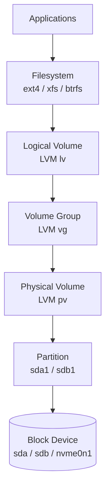

# 💾 09 — Storage & Disks

> Disks fail, fill up, or get mounted somewhere weird. Knowing partitions, filesystems, mounts, and LVM is non-negotiable for SREs.

## Why this matters

A full disk takes everything down — databases, logs, even SSH login. LVM lets you grow volumes online; fstab decides what comes back after reboot.

## 🧱 Storage stack



## Concepts

- **Block device** — disk or virtual disk: `/dev/sda`, `/dev/nvme0n1`, `/dev/vda`.
- **Partition** — slice of a disk: `/dev/sda1`. Tables: MBR (legacy) or GPT (modern).
- **Filesystem** — `ext4` (default Debian/Ubuntu), `xfs` (RHEL default), `btrfs`, `zfs`.
- **Mount** — attach a filesystem at a directory; see in `findmnt`.
- **`/etc/fstab`** — declarative mount config applied at boot.
- **Swap** — disk-backed virtual memory (`swapon -s` to inspect).
- **LVM** — physical volumes (PV) → volume groups (VG) → logical volumes (LV). Resize online.
- **inode exhaustion** — a filesystem can be "full" of files even with free bytes.

## Commands

```bash
# Inspect block devices
lsblk -f                          # tree + filesystems + UUIDs
lsblk -o NAME,SIZE,TYPE,MOUNTPOINT,FSTYPE
blkid                             # UUIDs + types of all block devices
fdisk -l                          # partition tables (root)
parted -l

# Free space
df -hT                            # filesystem usage, human + type
df -i                             # inode usage
du -sh /var/log                   # total of a dir
du -h --max-depth=1 / 2>/dev/null | sort -rh | head
ncdu /                            # interactive (apt install ncdu)

# Mount / unmount
mount                             # all mounts
mount /dev/sdb1 /mnt/data         # ad-hoc
mount -o remount,ro /             # remount root read-only
umount /mnt/data
findmnt /home

# fstab — persistent mounts
cat /etc/fstab
# UUID=xxxx-xxxx  /  ext4  defaults  0  1
# Test before reboot:
mount -a                          # mount everything in fstab not yet mounted

# Create filesystems
mkfs.ext4 /dev/sdb1
mkfs.xfs  /dev/sdb1
mkswap    /dev/sdb2 && swapon /dev/sdb2

# Grow filesystems online
resize2fs /dev/mapper/vg-lv       # ext4
xfs_growfs /mnt/data              # xfs (mounted path)

# Partition tools
fdisk /dev/sdb                    # interactive (MBR friendly)
parted /dev/sdb mklabel gpt
parted /dev/sdb mkpart primary ext4 0% 100%

# LVM — physical → group → logical
pvcreate /dev/sdb1
vgcreate vg_data /dev/sdb1
lvcreate -L 10G -n lv_app vg_data
mkfs.ext4 /dev/vg_data/lv_app
mount /dev/vg_data/lv_app /mnt/app
# Inspect
pvs ; vgs ; lvs
pvdisplay ; vgdisplay ; lvdisplay
# Grow
lvextend -L +5G /dev/vg_data/lv_app
resize2fs /dev/vg_data/lv_app

# Loopback (for labs without real spare disks)
dd if=/dev/zero of=/tmp/disk.img bs=1M count=200
losetup -fP /tmp/disk.img         # auto-find /dev/loopN, partition-aware
losetup -a                        # list loops
losetup -d /dev/loop0             # detach
```

## 🧪 Lab — Loopback disk → ext4 → mount → fstab

> 💡 Run `docker run -it --rm --privileged ubuntu:22.04 bash` so loop devices and `mount` work.

```bash
apt-get update && apt-get install -y util-linux e2fsprogs >/dev/null
```

**Step 1.** Create a 100 MB virtual disk.

```bash
dd if=/dev/zero of=/tmp/disk.img bs=1M count=100 status=progress
# → 104857600 bytes (105 MB) copied
```

**Step 2.** Attach as a loop device.

```bash
LOOP=$(losetup -f --show /tmp/disk.img)
echo "$LOOP"
# → /dev/loop0
lsblk "$LOOP"
# → NAME    MAJ:MIN RM  SIZE RO TYPE MOUNTPOINT
# → loop0     7:0    0  100M  0 loop
```

**Step 3.** Make an ext4 filesystem and mount it.

```bash
mkfs.ext4 -L mydata "$LOOP"
mkdir -p /mnt/mydata
mount "$LOOP" /mnt/mydata
findmnt /mnt/mydata
# → TARGET      SOURCE     FSTYPE OPTIONS
# → /mnt/mydata /dev/loop0 ext4   rw,relatime
```

**Step 4.** Write data and inspect usage.

```bash
echo "hello disk" > /mnt/mydata/note.txt
df -hT /mnt/mydata
# → Filesystem     Type  Size  Used Avail Use% Mounted on
# → /dev/loop0     ext4   93M   24K   86M   1% /mnt/mydata
df -i /mnt/mydata
# → Filesystem      Inodes IUsed IFree IUse% Mounted on
# → /dev/loop0       25688    12 25676    1% /mnt/mydata
```

**Step 5.** Add to `/etc/fstab` (UUID-based — survives device renumbering).

```bash
UUID=$(blkid -s UUID -o value "$LOOP")
echo "UUID=$UUID  /mnt/mydata  ext4  defaults,nofail  0  2" >> /etc/fstab
umount /mnt/mydata
mount -a            # remounts everything in fstab
findmnt /mnt/mydata # confirm it came back
```

**Step 6.** Find what's eating disk in a directory.

```bash
mkdir -p /tmp/junk && head -c 50M </dev/urandom > /tmp/junk/big.bin
du -h --max-depth=1 /tmp 2>/dev/null | sort -rh | head
# → 50M    /tmp/junk
# → 50M    /tmp
```

**Step 7.** Demonstrate inode exhaustion (small fs, many files).

```bash
cd /mnt/mydata
for i in $(seq 1 25000); do : > "f$i"; done 2>&1 | tail -3
df -i .
# → IUse% close to 100% — disk has bytes but no inodes left
rm -f f*
```

**Step 8.** Cleanup.

```bash
umount /mnt/mydata
losetup -d "$LOOP"
sed -i "\|UUID=$UUID|d" /etc/fstab
```

## ⚠️ Gotchas

> ⚠️ Always reference disks in `/etc/fstab` by UUID or LABEL, never `/dev/sdX`. Device order is not stable across reboots.
>
> ⚠️ A fstab typo can prevent boot. Use `nofail` on optional mounts and **always** `mount -a` to test before rebooting.
>
> ⚠️ `df` reports the **filesystem's** view; deleted files held open by a process still consume bytes. Use `lsof | grep deleted` to find culprits.
>
> ⚠️ `du` and `df` can disagree by GBs because of sparse files, deleted-but-open files, or different counting (apparent vs allocated).
>
> ⚠️ Resizing: shrink ext4 **offline only**; grow online OK. xfs cannot shrink at all.
>
> ⚠️ `mkfs.*` is destructive and asks no questions. Triple-check the device path. `lsblk` first, `mkfs` second.
>
> ⚠️ LVM snapshots are copy-on-write — they fill up if writes exceed snapshot size. Monitor with `lvs`.
>
> ⚠️ Inside Docker without `--privileged`, `losetup` and `mount` will fail with `permission denied`.

## 📖 Further reading

- `man 8 lsblk` · `man 8 mount` · `man 5 fstab` · `man 8 mkfs.ext4` · `man 8 lvm`
- [util-linux project](https://www.kernel.org/pub/linux/utils/util-linux/)
- [ArchWiki — File systems](https://wiki.archlinux.org/title/File_systems)
- [ArchWiki — LVM](https://wiki.archlinux.org/title/LVM)
- [Ext4 wiki](https://ext4.wiki.kernel.org/)
- [XFS docs](https://xfs.wiki.kernel.org/)
