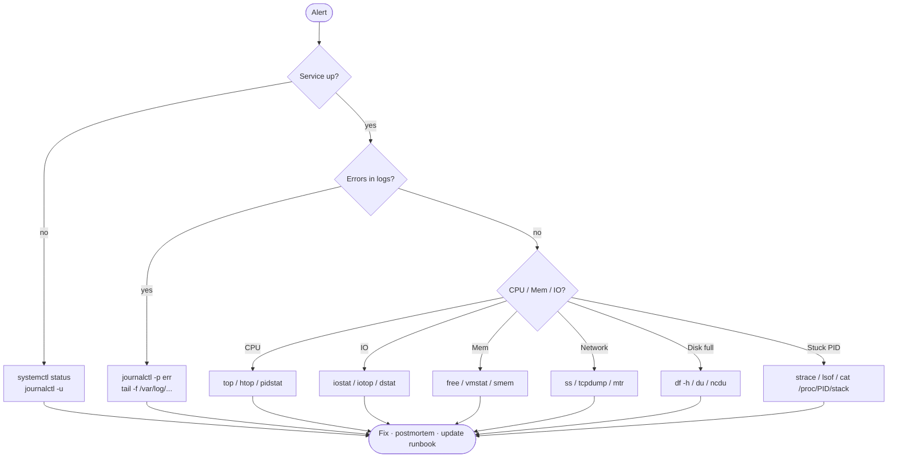

# 🔍 10 — Troubleshooting

> When the page fires at 3 AM, you have minutes to triage. This is the toolkit: logs, syscalls, open files, packet captures.

## Why this matters

The previous nine topics taught you the system. This one teaches you how to interrogate it when it lies. `strace`, `lsof`, and `tcpdump` are the deep-dive trio.

## 🩺 Triage flow



## Concepts

- **Always start with the recent change** — deploys, configs, package upgrades.
- **Read logs first**, instrument second. Most outages are visible.
- **Resource saturation** — CPU, memory, disk, IO, network, fds. The "USE" method.
- **Syscall view** — `strace` shows what a process is asking the kernel to do.
- **File descriptor view** — `lsof` shows everything a process has open (files, sockets, pipes).
- **Kernel ring buffer** — `dmesg`. OOM kills, hardware errors, driver messages.

## Commands

```bash
# === Logs ===
journalctl -p err -b                     # this boot, errors+
journalctl -u nginx --since '15 min ago'
tail -f /var/log/syslog                  # legacy log file
dmesg -T --level=err,warn | tail         # human timestamps + filter
dmesg -w                                 # follow new kernel msgs

# === System health ===
uptime                                   # → 10:00:00 up 3 days, load avg: 0.5 0.3 0.2
free -h                                  # memory + swap
vmstat 1 5                               # 5 samples, 1s apart (CPU, mem, IO, swap)
mpstat -P ALL 1                          # per-CPU usage (sysstat)
iostat -xz 1                             # per-device IO (sysstat)
pidstat 1                                # per-process CPU/IO
sar -u 1 5                               # historical (if sysstat enabled)

# === Process inspection ===
top                                      # interactive
htop                                     # nicer
ps auxf                                  # tree
pstree -p
cat /proc/<pid>/status                   # state, threads, capabilities
cat /proc/<pid>/stack                    # kernel stack (where it's stuck)

# === Open files & sockets ===
lsof -p <pid>                            # all FDs of a pid
lsof -i :80                              # who's on port 80
lsof -i TCP:443
lsof /var/log/syslog                     # who has this file open
lsof | grep deleted                      # leaked deleted files (disk eaten)
lsof -nP +D /var/lib/mysql               # files under a dir

# === Syscall tracing ===
strace -p <pid>                          # attach to running pid
strace -f -e trace=openat,connect ./prog # follow forks, filter syscalls
strace -c ./prog                         # summary (count, time per syscall)
strace -e trace=network -f curl example.com

# === Network ===
ss -tulpn                                # listening sockets
ss -tan state established | wc -l        # established conn count
tcpdump -i any -nn 'port 443' -c 20      # 20 pkts on port 443
tcpdump -i eth0 -w /tmp/cap.pcap         # save (analyze in Wireshark)
mtr -n example.com                       # combined ping+trace
nc -zv host 443                          # is the port reachable?

# === Disk ===
df -h ; df -i
du -sh /var/log/*
ncdu /                                   # interactive disk usage

# === Find what's holding a file ===
fuser -v /var/log/syslog                 # who has it open
fuser -k 8080/tcp                        # kill anyone on port 8080 (careful!)
```

## 🧪 Lab — Diagnose a "hung" process

```bash
docker run -it --rm ubuntu:22.04 bash
apt-get update && apt-get install -y strace lsof procps psmisc curl tcpdump >/dev/null
```

**Step 1.** Start a process that's blocked on input (looks "hung").

```bash
# Reads from a fifo that nobody writes to → blocked forever
mkfifo /tmp/q
( cat /tmp/q > /dev/null ) &
PID=$!
ps -o pid,stat,wchan:25,cmd -p $PID
# → PID  STAT WCHAN                     CMD
# → 42   S    pipe_read                 cat /tmp/q
```

**Step 2.** Confirm it's not consuming CPU.

```bash
top -b -n 1 -p $PID | tail -3
# → %CPU = 0.0   %MEM ~ 0.0
```

**Step 3.** See where it's stuck in the kernel.

```bash
cat /proc/$PID/stack 2>/dev/null || echo "(needs CONFIG_STACKTRACE)"
cat /proc/$PID/wchan; echo
# → pipe_read
```

**Step 4.** Attach `strace` — see the blocking syscall.

```bash
timeout 2 strace -p $PID 2>&1 | head -5
# → strace: Process 42 attached
# → read(0,                                    ← blocked here
```

**Step 5.** Use `lsof` to see what FDs it has.

```bash
lsof -p $PID
# → COMMAND PID USER   FD  TYPE  …  NAME
# → cat     42  root  cwd  DIR   …  /
# → cat     42  root    0u FIFO  …  /tmp/q          ← reading this fifo
# → cat     42  root    1w CHR   …  /dev/null
```

**Step 6.** Unblock it.

```bash
echo "go" > /tmp/q     # write to the other end
wait $PID
echo "exited cleanly"
```

**Step 7.** Diagnose a "port already in use" scenario.

```bash
( python3 -m http.server 9000 >/dev/null 2>&1 & )
sleep 1
ss -tulpn 'sport = :9000'
# → tcp LISTEN 0 5  0.0.0.0:9000  *:*  users:(("python3",pid=99,fd=3))
fuser -v 9000/tcp
# →                      USER       PID  ACCESS COMMAND
# → 9000/tcp:            root        99   F.... python3
kill 99
```

**Step 8.** Trace what `curl` does at the syscall level.

```bash
strace -e trace=network,openat -f curl -s http://example.com -o /dev/null 2>&1 | grep -E 'connect|openat.*resolv' | head
# → openat(AT_FDCWD, "/etc/resolv.conf", O_RDONLY|O_CLOEXEC) = 5
# → connect(5, {sa_family=AF_INET, sin_port=htons(53), …}, 16) = 0
# → connect(7, {sa_family=AF_INET, sin_port=htons(80), …}, 16) = 0
```

**Step 9.** Capture HTTP traffic on the loopback.

```bash
( curl -s http://example.com >/dev/null & )
tcpdump -i any -nn -c 6 'port 80' 2>/dev/null
# → IP …. > 93.184.216.34.80: Flags [S]   ← SYN
# → IP 93.184.216.34.80 > …. : Flags [S.] ← SYN-ACK
# → IP …. > 93.184.216.34.80: Flags [.]   ← ACK
```

**Step 10.** Find disk hogs interactively.

```bash
apt-get install -y ncdu >/dev/null
ncdu /var       # arrow keys to navigate, q to quit
```

## 🧠 The classic 60-second triage

```bash
uptime                                   # load
dmesg -T | tail                          # kernel issues, OOM kills
vmstat 1 5                               # CPU/mem/IO snapshot
mpstat -P ALL 1 1                        # per-core CPU
pidstat 1 1                              # busiest processes
iostat -xz 1 1                           # IO saturation
free -m                                  # memory headroom
sar -n DEV 1 1                           # NIC throughput
sar -n TCP,ETCP 1 1                      # TCP errors / retransmits
top                                      # final visual confirm
```
(adapted from Brendan Gregg's "Linux Performance Analysis in 60 seconds")

## ⚠️ Gotchas

> ⚠️ `strace` slows the target process significantly. Don't attach to a hot production database without a maintenance window.
>
> ⚠️ Without `-f`, `strace` misses child processes. Most modern apps fork; use `-f`.
>
> ⚠️ `tcpdump` requires root or `CAP_NET_RAW`. Inside containers add `--cap-add=NET_RAW` or run privileged.
>
> ⚠️ `lsof` output for `deleted` files is the #1 hidden cause of "df says 90% but du says 30%".
>
> ⚠️ Load average ≠ CPU usage. Load includes processes in `D` (uninterruptible IO). High load + low CPU = IO bottleneck.
>
> ⚠️ OOM kills appear in `dmesg` and `journalctl -k`. Always check after a service mysteriously vanishes.
>
> ⚠️ When running `fuser -k`, you can SIGKILL processes you didn't intend to. Use `-i` for interactive.
>
> ⚠️ Don't `tail -f` a rotating log file across rotation — use `tail -F` (capital F) which reopens.

## 📖 Further reading

- `man 1 strace` · `man 8 lsof` · `man 8 tcpdump` · `man 1 dmesg` · `man 1 vmstat`
- [Brendan Gregg — Linux Performance](https://www.brendangregg.com/linuxperf.html)
- [Brendan Gregg — USE Method](https://www.brendangregg.com/usemethod.html)
- [strace project](https://strace.io/)
- [Wireshark docs](https://www.wireshark.org/docs/) — analyzing pcaps
- [SystemTap / bpftrace](https://github.com/iovisor/bpftrace) — modern eBPF tracing
