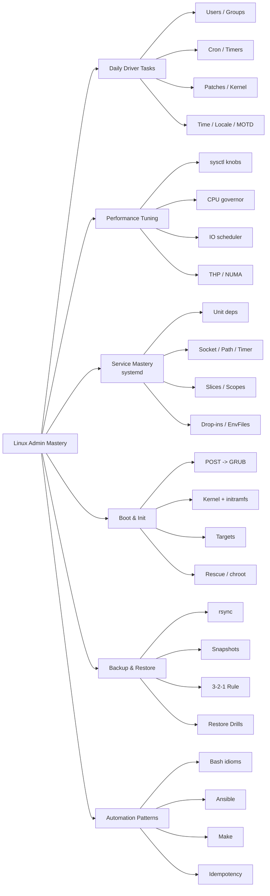
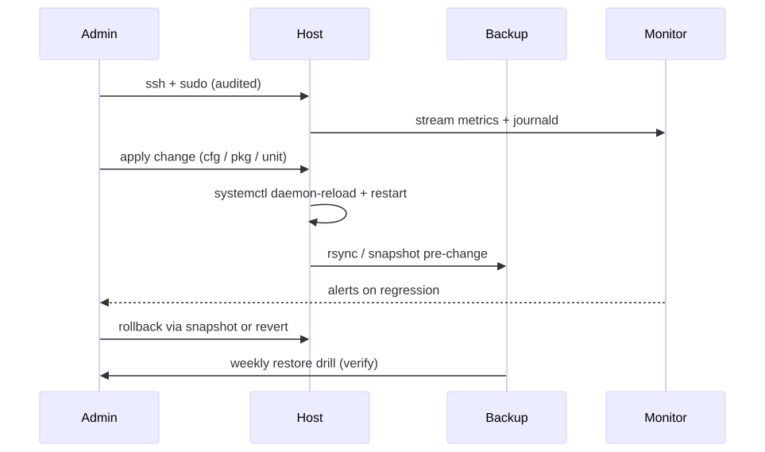
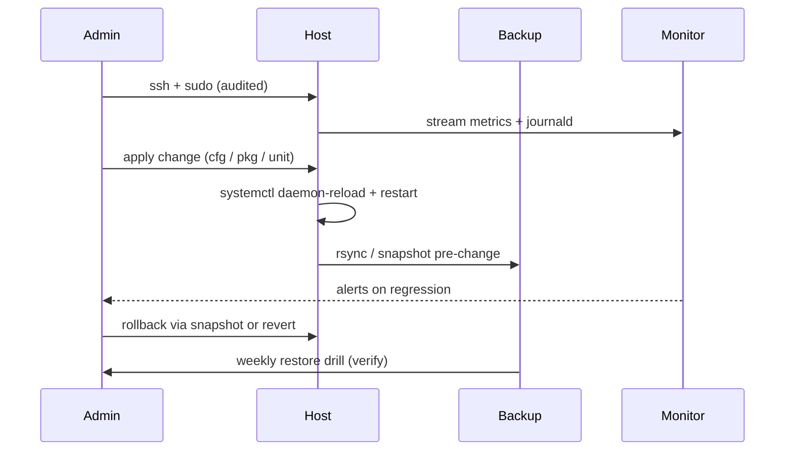

# Linux Admin Mastery

> A grizzled-veteran field guide to running Linux in production. No "hello world" — this is the playbook used at 3am when the pager goes off.

## Why this matters

Most Linux tutorials teach you commands. This module teaches you **judgement**: the muscle memory that separates a junior who runs `systemctl restart` and prays from a senior who reads the unit graph, checks the journal, and fixes the dependency. After 20 years, the commands are trivial — the *order* you run them in, and the *signals* you read between them, are everything.

Mastery is six things:
1. **Daily ops fluency** — user lifecycle, patches, time, locale — done in seconds, not minutes
2. **Performance instinct** — knowing which sysctl to twist before you reach for new hardware
3. **systemd literacy** — reading unit dependency graphs the way a DBA reads EXPLAIN plans
4. **Boot recovery** — turning an unbootable box into a bootable one with a USB stick
5. **Backup discipline** — 3-2-1, restore drills, snapshots that actually restore
6. **Automation reflexes** — every task done twice gets scripted; every script is idempotent

---

## Domain map

<!-- mermaid:rendered -->
<p align="center"></p>

<details><summary>Mermaid source</summary>



</details>
---

## Operational lifecycle

<!-- mermaid:rendered -->
<p align="center"></p>

<details><summary>Mermaid source</summary>



</details>
---

## Mental model

Treat the host as a **state machine** with three layers:

| Layer | Owns | Reset cost |
|-------|------|------------|
| Hardware / firmware | BIOS, NIC firmware, RAID controller | Reboot + risk |
| Kernel + initramfs | drivers, mounts, cgroups, namespaces | Reboot |
| Userspace (systemd + processes) | services, sockets, timers, logs | `systemctl` |

A senior admin always asks: **at which layer does the symptom live?** A failing TLS handshake is userspace. A wedged disk queue is kernel. A flapping link is firmware. Stop guessing — diagnose by layer.

---

## File index

| File | When to read |
|------|--------------|
| [daily-driver-tasks.md](daily-driver-tasks.md) | Weekly ops: users, cron, patches, time, locale, MOTD |
| [performance-tuning.md](performance-tuning.md) | Latency spikes, throughput ceilings, runaway memory |
| [service-mastery.md](service-mastery.md) | Anything systemd: units, deps, sockets, timers, journald |
| [boot-and-init.md](boot-and-init.md) | Box won't boot, kernel panic, GRUB recovery |
| [backup-and-restore.md](backup-and-restore.md) | DR planning, snapshot strategy, restore drills |
| [automation-patterns.md](automation-patterns.md) | Bash hygiene, Ansible quickies, Make-as-glue, idempotency |

---

## Quick reference card

```
# show me the truth about a host
hostnamectl                       # identity
timedatectl                       # time + sync state
localectl                         # locale + keymap
loginctl                          # active sessions
systemctl list-units --failed     # what's broken right now
journalctl -p err -b              # errors this boot
systemd-analyze blame             # slow boot offenders
systemd-analyze critical-chain    # boot dependency hot path
```

---

## 20-year-experience tips

> [!TIP]
> **The four laws of admin work**
> 1. **Read before you write.** `cat`/`journalctl`/`systemctl status` before any `restart`/`edit`/`rm`.
> 2. **Snapshot before you change.** LVM/btrfs/ZFS snapshot, or at minimum `cp -a /etc/foo /etc/foo.bak.$(date +%F)`.
> 3. **One change at a time.** If three things changed and one broke, you have a four-hour bisect ahead of you.
> 4. **The fix that requires a reboot is suspect.** A reboot masks state. Reboot only after you understand *why*.

> [!TIP]
> **Boring is a feature.** A senior admin's host looks like every other host: same paths, same units, same MOTD format. Originality is a smell — it means the next person can't help at 3am.

> [!TIP]
> **Trust the journal more than the docs.** Vendor docs lie. `journalctl -u <unit> -b` does not.

> [!TIP]
> **Every minute spent on `systemd-analyze` saves an hour of debugging.** Boot graphs reveal architectural mistakes that no log line will.

---

## Gotchas

> [!WARNING]
> - `systemctl edit` creates a drop-in; `systemctl edit --full` rewrites the unit. Mixing the two creates ghosts you'll chase for days.
> - `apt upgrade` is not `apt full-upgrade`. The first leaves held packages; the second can pull in surprises. Know which you mean.
> - `chronyd` and `systemd-timesyncd` will fight if both are enabled. Pick one.
> - `/etc/hosts` overrides DNS. Always. People forget this every single year.

---

## Sources

- `man 7 systemd.directives`
- `man 1 systemctl`, `man 1 journalctl`, `man 5 systemd.unit`
- `man 8 hostnamectl`, `man 8 timedatectl`, `man 8 localectl`
- freedesktop.org/wiki/Software/systemd/
- systemd.io (upstream design notes)
- kernel.org Documentation/admin-guide/
