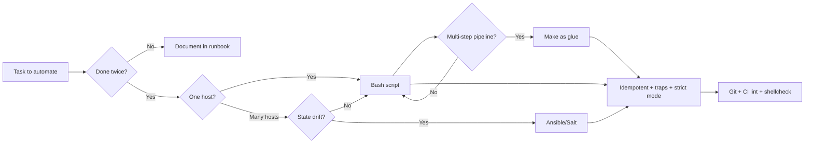
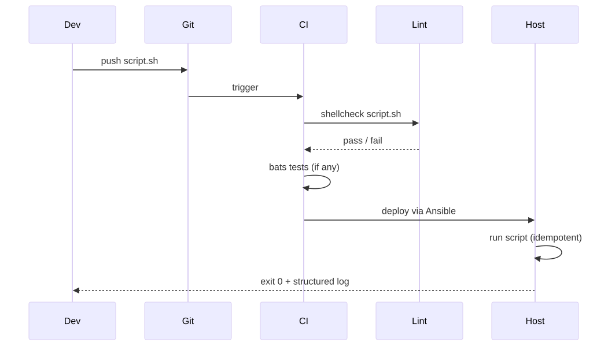
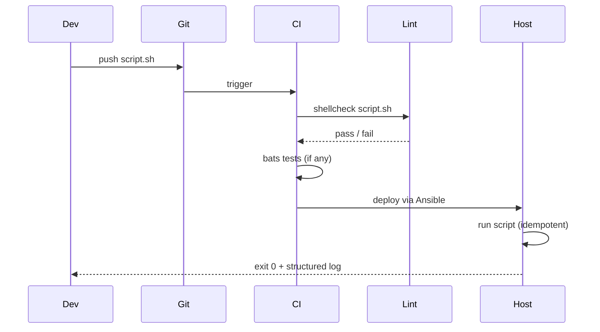
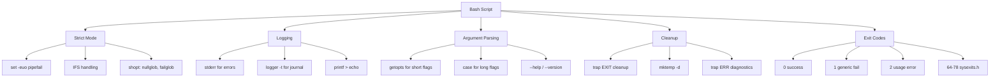

# Automation Patterns

> Anything done twice gets scripted. Anything scripted gets idempotent. Anything idempotent gets put in version control. That's the whole pyramid.

## Why this matters

The difference between an admin who "knows bash" and one who **writes production-grade automation** is not syntax — it is discipline around failure modes. A script without `set -euo pipefail` is a time bomb. An Ansible play without idempotency makes the second run dangerous. A Makefile without `.PHONY` confuses targets with files. The patterns in this file are the muscle memory that prevents 3am pages caused by your own scripts.

The four pillars:
1. **Bash hygiene** — strict mode, traps, mktemp, proper option parsing.
2. **Ansible quick patterns** — handlers, tags, `--check`, `--diff`.
3. **Make as glue** — `.PHONY`, `@echo`, dependency edges between targets.
4. **Idempotency rules** — same script, run 100 times, same end state.

---

## Mental model

<!-- mermaid:rendered -->
<p align="center"></p>

<details><summary>Mermaid source</summary>



</details>
<!-- mermaid:rendered -->
<p align="center"></p>

<details><summary>Mermaid source</summary>



</details>
<!-- mermaid:rendered -->
<p align="center"></p>

<details><summary>Mermaid source</summary>



</details>
---

## Bash idioms (the production starter)

### The strict-mode preamble

```bash
#!/usr/bin/env bash
# myscript.sh - one-line description of purpose
# Usage: myscript.sh [-v] [-d DIR] HOST
set -euo pipefail
IFS=$'\n\t'

# -e: exit on any error
# -u: error on undefined variable
# -o pipefail: pipe fails if any stage fails
# IFS: prevent word-splitting on spaces (only on \n and \t)

# Optional but useful:
shopt -s nullglob       # *.foo with no matches = empty array, not literal "*.foo"
shopt -s failglob       # OR: fail if no match (pick one)
```

> [!WARNING]
> `set -e` has surprising holes. It does NOT trigger inside `if`, `&&`, `||`, function chains, or command substitutions in older bash. Always pair with explicit error checking on critical operations.

### Traps for cleanup and diagnostics

```bash
TMPDIR=$(mktemp -d)
LOCKFILE=/var/run/myscript.lock

cleanup() {
  local rc=$?
  rm -rf "$TMPDIR"
  rm -f "$LOCKFILE"
  exit $rc
}
trap cleanup EXIT

# Bonus: diagnostic on error
trap 'echo "ERROR: line $LINENO: $BASH_COMMAND" >&2' ERR

# Bonus: handle Ctrl+C gracefully
trap 'echo "Interrupted"; exit 130' INT TERM
```

### Single-instance lock (prevent concurrent runs)

```bash
exec 9>/var/run/myscript.lock
flock -n 9 || { echo "Already running" >&2; exit 1; }
# FD 9 is held until script exits; lock auto-released
```

### mktemp (always)

```bash
TMPFILE=$(mktemp -t myscript.XXXXXX)
TMPDIR=$(mktemp -d -t myscript.XXXXXX)
# Never use /tmp/myscript.tmp — race condition + symlink attack
```

### Argument parsing with getopts

```bash
usage() {
  cat <<EOF
Usage: $(basename "$0") [-v] [-d DIR] [-n N] HOST

  -v        verbose
  -d DIR    output directory (default: /tmp)
  -n N      number of retries (default: 3)
  -h        show this help
EOF
  exit 2
}

VERBOSE=0
OUTDIR=/tmp
RETRIES=3

while getopts ":vd:n:h" opt; do
  case "$opt" in
    v) VERBOSE=1 ;;
    d) OUTDIR=$OPTARG ;;
    n) RETRIES=$OPTARG ;;
    h) usage ;;
    \?) echo "Unknown option: -$OPTARG" >&2; usage ;;
    :)  echo "Option -$OPTARG requires an argument" >&2; usage ;;
  esac
done
shift $((OPTIND - 1))

[[ $# -ge 1 ]] || { echo "HOST argument required" >&2; usage; }
HOST=$1
```

For long options (`--verbose`), use `getopt` from util-linux (different tool):

```bash
ARGS=$(getopt -o vd:n:h --long verbose,dir:,retries:,help -n "$0" -- "$@") \
  || { usage; exit 2; }
eval set -- "$ARGS"
```

### Logging that goes somewhere useful

```bash
log() {
  local level=$1; shift
  printf '%s [%s] %s\n' "$(date '+%FT%T%z')" "$level" "$*" >&2
  logger -t "${0##*/}" -p "user.$level" -- "$*"
}

log info "Starting backup of $HOST"
log warning "Disk usage above 80%"
log err "Database connection failed"
```

### Retry with exponential backoff

```bash
retry() {
  local max=$1; shift
  local delay=1
  local n=0
  until "$@"; do
    n=$((n + 1))
    if [[ $n -ge $max ]]; then
      log err "Failed after $max attempts: $*"
      return 1
    fi
    log warning "Attempt $n failed; retrying in ${delay}s"
    sleep "$delay"
    delay=$((delay * 2))
  done
}

retry 5 curl -fsS https://api.example.com/health
```

### Safe arithmetic

```bash
# Don't: result=$((1/0))   <- script dies under set -e
# Do:
if (( denom != 0 )); then
  result=$(( numer / denom ))
else
  result=0
fi

# Comparing strings: use [[ ]] not [ ]
[[ "$foo" == "$bar" ]]
[[ "$foo" =~ ^[0-9]+$ ]]      # regex, only in [[ ]]
```

### Quoting (the most-broken thing in bash)

```bash
# WRONG: word-splits on spaces, glob-expands
rm $file

# RIGHT: literal
rm "$file"

# Arrays: always "${arr[@]}" not "${arr[*]}"
files=(one.txt "two with spaces.txt")
for f in "${files[@]}"; do printf '%s\n' "$f"; done
```

---

## Bash exit code conventions

`/usr/include/sysexits.h` defines well-known codes. Use them.

| Code | Meaning |
|------|---------|
| 0 | success |
| 1 | generic failure |
| 2 | usage / argument error |
| 64 | EX_USAGE — command line usage error |
| 65 | EX_DATAERR — bad input data |
| 66 | EX_NOINPUT — input file missing |
| 69 | EX_UNAVAILABLE — service unavailable |
| 73 | EX_CANTCREAT — output cannot be created |
| 74 | EX_IOERR — IO error |
| 77 | EX_NOPERM — permission denied |
| 126 | command found but not executable |
| 127 | command not found |
| 128+N | killed by signal N (e.g. 130 = SIGINT) |

```bash
# In your script:
[[ -r "$infile" ]] || { echo "Cannot read $infile" >&2; exit 66; }
```

---

## Ansible quick patterns

### Skeleton

```text
ansible.cfg
inventory/
  hosts.yml
playbooks/
  site.yml
  webserver.yml
roles/
  nginx/
    tasks/main.yml
    handlers/main.yml
    templates/nginx.conf.j2
    defaults/main.yml
group_vars/
  all.yml
host_vars/
  web-01.yml
```

### ansible.cfg essentials

```ini
[defaults]
inventory = inventory/hosts.yml
host_key_checking = False
forks = 20
stdout_callback = yaml
deprecation_warnings = False
retry_files_enabled = False
gathering = smart
fact_caching = jsonfile
fact_caching_connection = /tmp/ansible-facts
fact_caching_timeout = 7200

[ssh_connection]
pipelining = True
ssh_args = -o ControlMaster=auto -o ControlPersist=300s
```

### A real role (idempotent nginx setup)

```yaml
# roles/nginx/tasks/main.yml
- name: Install nginx
  ansible.builtin.package:
    name: nginx
    state: present

- name: Deploy main config
  ansible.builtin.template:
    src: nginx.conf.j2
    dest: /etc/nginx/nginx.conf
    owner: root
    group: root
    mode: '0644'
    validate: 'nginx -t -c %s'
  notify: reload nginx

- name: Deploy site configs
  ansible.builtin.template:
    src: "{{ item }}.j2"
    dest: "/etc/nginx/conf.d/{{ item }}"
    mode: '0644'
  loop: "{{ nginx_sites }}"
  notify: reload nginx

- name: Ensure nginx is enabled and running
  ansible.builtin.systemd:
    name: nginx
    enabled: true
    state: started
    daemon_reload: true
```

```yaml
# roles/nginx/handlers/main.yml
- name: reload nginx
  ansible.builtin.systemd:
    name: nginx
    state: reloaded
```

### Tags and check mode

```bash
# Dry run with diff (see what would change without changing it)
ansible-playbook site.yml --check --diff

# Run only the nginx role tasks
ansible-playbook site.yml --tags nginx

# Limit to one host
ansible-playbook site.yml --limit web-01

# Run a single task ad-hoc
ansible web-01 -m systemd -a "name=nginx state=reloaded" --become

# Gather facts only
ansible web-01 -m setup
```

### Common idempotent patterns

| Don't | Do |
|-------|-----|
| `command: useradd alice` | `user: name=alice state=present` |
| `command: yum install nginx` | `package: name=nginx state=present` |
| `shell: echo "foo" >> /etc/hosts` | `lineinfile: path=/etc/hosts line="foo"` |
| `command: mkdir /opt/app` | `file: path=/opt/app state=directory` |
| `command: systemctl restart nginx` | `systemd: name=nginx state=restarted` |

When you MUST use `command`/`shell`, gate it:

```yaml
- name: Run only if marker file is absent
  ansible.builtin.command: /opt/app/install.sh
  args:
    creates: /opt/app/.installed     # idempotency guard
```

---

## Make as glue

Make is excellent for **multi-step pipelines** where steps depend on each other and on file state. Treat it as a typed task runner with built-in caching.

```makefile
# Makefile
.DEFAULT_GOAL := help
.PHONY: help lint test build deploy clean

# Use bash, strict
SHELL := /bin/bash
.SHELLFLAGS := -eu -o pipefail -c

# Variables (lazy = recursive, := = immediate)
HOSTS  ?= web-01 web-02
TAG    := $(shell git rev-parse --short HEAD)
IMAGE  := registry.example.com/myapp:$(TAG)

help:  ## Show this help
	@awk 'BEGIN {FS = ":.*##"; printf "Usage:\n  make \033[36m<target>\033[0m\n\nTargets:\n"} \
	  /^[a-zA-Z_-]+:.*?##/ { printf "  \033[36m%-15s\033[0m %s\n", $$1, $$2 }' $(MAKEFILE_LIST)

lint:  ## Lint shell + ansible
	shellcheck scripts/*.sh
	ansible-lint playbooks/

test: lint  ## Run all tests (depends on lint)
	bats tests/

build: test  ## Build the docker image
	docker build -t $(IMAGE) .

deploy: build  ## Deploy via ansible to all hosts
	ansible-playbook playbooks/site.yml -e image=$(IMAGE)

deploy-one: build  ## Deploy to one host: make deploy-one HOST=web-01
	ansible-playbook playbooks/site.yml -e image=$(IMAGE) --limit $(HOST)

clean:  ## Remove build artifacts
	rm -rf build/ dist/ .pytest_cache/

# File-based target: only rebuild if source changed
build/output.tar.gz: src/*.go
	mkdir -p build
	go build -o build/myapp ./src/...
	tar -czf $@ -C build myapp
```

> [!TIP]
> The `## comment` after each target plus the awk one-liner gives you a self-documenting `make help`. Steal this pattern for every project.

### Make traps for admins

- Tabs, not spaces, for recipe indentation. Always.
- `.PHONY: target` for targets that don't produce a file, otherwise Make may skip them.
- `$$VAR` to use a shell variable (escapes the `$` from Make).
- Each recipe line runs in its own shell unless joined with `\`. Use `.ONESHELL:` to change that.

---

## Idempotency rules

A script is idempotent if **running it N times has the same effect as running it once**. The discipline:

1. **Check before you change.** `if ! grep -q "pattern" /etc/file; then add; fi`
2. **Use declarative tools when possible.** `useradd` errors on existing user; `id alice >/dev/null 2>&1 || useradd alice` doesn't.
3. **Marker files for one-shot operations.** `[[ -f /opt/.installed ]] || run-installer`
4. **State-checking commands first.** `systemctl is-enabled nginx >/dev/null 2>&1 || systemctl enable nginx`
5. **Atomic file writes.** Write to `file.tmp`, then `mv file.tmp file` — readers never see partial content.

```bash
# Pattern: ensure a line is in a file (idempotent)
ensure_line() {
  local line=$1 file=$2
  grep -qxF -- "$line" "$file" || echo "$line" >> "$file"
}
ensure_line "127.0.0.1 myhost" /etc/hosts

# Pattern: ensure a directory exists with mode/owner
install -d -m 0755 -o root -g root /opt/myapp

# Pattern: atomic config replace
tmp=$(mktemp /etc/nginx/nginx.conf.XXXXXX)
render_config > "$tmp"
nginx -t -c "$tmp"             # validate before activation
mv "$tmp" /etc/nginx/nginx.conf
systemctl reload nginx
```

---

## Walkthrough: a real automation script

```bash
#!/usr/bin/env bash
# rotate-logs.sh - rotate and ship logs from app servers
# Usage: rotate-logs.sh [-d DAYS] [-b BUCKET] HOST [HOST...]
set -euo pipefail
IFS=$'\n\t'

DAYS=14
BUCKET=s3://myorg-logs
SCRIPT=$(basename "$0")

usage() { sed -n 's/^# //p' "$0" | head -3; exit 2; }

log() { printf '%s [%s] %s\n' "$(date '+%FT%T%z')" "$1" "${*:2}" >&2; }

cleanup() {
  local rc=$?
  [[ -n "${TMPDIR:-}" ]] && rm -rf "$TMPDIR"
  exit $rc
}

while getopts ":d:b:h" opt; do
  case $opt in
    d) DAYS=$OPTARG ;;
    b) BUCKET=$OPTARG ;;
    h) usage ;;
    *) usage ;;
  esac
done
shift $((OPTIND - 1))

[[ $# -ge 1 ]] || usage

TMPDIR=$(mktemp -d -t "$SCRIPT.XXXXXX")
trap cleanup EXIT
trap 'log err "line $LINENO: $BASH_COMMAND"' ERR

for host in "$@"; do
  log info "Processing $host"

  # 1. Compress logs older than 1 day
  ssh "$host" "sudo find /var/log/myapp -name '*.log' -mtime +1 \
                 -exec gzip -9 {} \;"

  # 2. Pull compressed logs
  rsync -aHAX --remove-source-files \
    "$host:/var/log/myapp/*.log.gz" "$TMPDIR/$host/" \
    || { log err "rsync failed for $host"; continue; }

  # 3. Ship to S3 with date prefix
  aws s3 sync "$TMPDIR/$host/" \
    "$BUCKET/$(date +%Y/%m/%d)/$host/" --quiet

  # 4. Delete logs older than retention on remote
  ssh "$host" "sudo find /var/log/myapp -name '*.log.gz' -mtime +$DAYS -delete"

  log info "Done $host"
done

log info "All hosts complete"
```

Realistic invocation + output:

```bash
$ ./rotate-logs.sh -d 30 -b s3://prod-logs web-01 web-02
2026-04-26T03:00:01+0530 [info] Processing web-01
2026-04-26T03:00:42+0530 [info] Done web-01
2026-04-26T03:00:42+0530 [info] Processing web-02
2026-04-26T03:01:18+0530 [info] Done web-02
2026-04-26T03:01:18+0530 [info] All hosts complete
$ echo $?
0
```

---

## 20-year-experience tips

> [!TIP]
> **`shellcheck` every script in CI.** It catches 90% of bash bugs before they ship — quoting issues, unused variables, deprecated syntax. Make it a required check.

> [!TIP]
> **Idempotency is a contract, not a feature.** If your script can't be re-run safely, the on-call person has to reason about state every time. Re-runnable scripts let humans trust the automation.

> [!TIP]
> **Prefer `set -euo pipefail` even if it complicates things.** Yes, you'll rewrite a few command chains. Yes, it's worth it the first time it catches a silent failure that would have wiped 200GB.

> [!TIP]
> **Use `--check --diff` on every Ansible run before applying.** It is the playbook equivalent of `git diff` before commit. Skipping it once is a story everyone has.

> [!TIP]
> **Make is fine for 50 lines of glue. Past that, switch to a real language.** Make's quoting and dependency tracking get baroque fast. Python invoke or Just are better for 500-line "scripts".

> [!TIP]
> **Always `set -x` temporarily for debugging — never leave it on.** A script with `set -x` in production floods journald and may leak secrets in logs.

---

## Gotchas

> [!WARNING]
> - `set -e` does NOT exit on failure inside `if`, `&&`, `||`, or piped command chains (without pipefail). It is not a panacea.
> - `bash script.sh` ignores the shebang and uses `/bin/bash`. `./script.sh` honors `#!/usr/bin/env bash`. They behave differently if the script uses bashisms unsupported by `/bin/sh`.
> - `cd` without checking exit status can put you in `$HOME` and execute commands there. Always `cd /target || exit 1`.
> - Glob in `for f in *.log; do` matches the literal `*.log` if no files exist (without `nullglob`). The loop runs once with `$f="*.log"`.
> - `getopts` (built-in) does NOT handle long options; `getopt` (util-linux) does. Don't confuse them.
> - Ansible `command:` is NOT idempotent; `shell:` even less so. Use modules or `creates:`/`removes:` guards.
> - `ansible_python_interpreter` defaults can be wrong on minimal hosts. Set explicitly in `group_vars/all.yml`.
> - Make swallows `cd` between recipe lines (each line is a separate shell). Use `cd dir && cmd` on a single line, or `.ONESHELL:`.
> - `make -j` parallelizes, but a target without proper deps will run before its prerequisites in parallel mode. Always declare prereqs.
> - `cron`/`systemd-timer` jobs run with stripped environment. Source `/etc/profile.d/*.sh` or set `PATH=` explicitly.

---

## Sources

- `man 1 bash` (long, but the parameter expansion section is gold)
- `man 1 set`, `man 1 trap`, `man 1 mktemp`, `man 1 getopts`
- `man 1 flock`
- `man 8 logger`, `man 5 syslog.conf`
- `man 1 shellcheck`
- `man 1 ansible-playbook`, `man 1 ansible`, `man 5 ansible.cfg`
- docs.ansible.com (especially "Best Practices")
- `man 1 make`, gnu.org/software/make/manual/
- mywiki.wooledge.org/BashFAQ (the authoritative bash FAQ)
- `man 3 sysexits` for canonical exit codes
- shellcheck.net (per-rule explanations)
