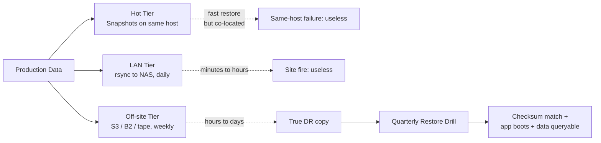
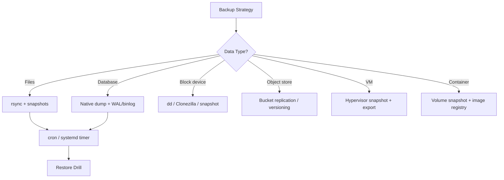

# Backup and Restore

> A backup that has never been restored is not a backup — it is a hopeful folder. The discipline that separates pros from amateurs is the **restore drill**, not the backup script.

## Why this matters

Every admin learns the hard way that backups fail silently. The tape drive that "ran every night for two years" turns out to have been writing to a full reel since month 3. The S3 lifecycle policy that "archived to Glacier" actually expired the data. The rsync that "backed up the database" copied an inconsistent file mid-write. Backup software has thousands of failure modes; restore drills find them before customers do.

The four discipline points:
1. **3-2-1 rule** — 3 copies, 2 media types, 1 off-site. Non-negotiable for production data.
2. **Restore drills** — quarterly minimum. If you have not restored, you do not have a backup.
3. **Application-consistent snapshots** — not just file-consistent. Quiesce the app or use its native dump.
4. **Immutability** — backups must survive ransomware. WORM, object-lock, or pull-based.

---

## Mental model

<!-- mermaid:rendered -->
<p align="center"></p>

<details><summary>Mermaid source</summary>



</details>
```mermaid
sequenceDiagram
    participant App
    participant FS as Filesystem
    participant Snap as Snapshot Layer
    participant Sync as rsync/restic
    participant Off as Off-site

    App->>App: FLUSH (pg_dump / mysqldump / fsfreeze)
    App->>FS: writes quiesced
    FS->>Snap: lvcreate -s / btrfs sub snap / zfs snap
    Snap-->>App: resume writes (sub-second)
    Sync->>Snap: read from frozen snapshot
    Sync->>Off: incremental upload (encrypted)
    Off-->>Sync: ack + retention policy
    Note over Sync,Off: Snapshot deleted after sync
```

<!-- mermaid:rendered -->
<p align="center"></p>

<details><summary>Mermaid source</summary>



</details>
---

## The 3-2-1 rule (and the 3-2-1-1-0 update)

Classic 3-2-1:
- **3** copies of data (production + 2 backups)
- **2** different media types (e.g. local disk + cloud object storage)
- **1** off-site

Modern (post-ransomware) 3-2-1-1-0:
- **3** copies
- **2** media types
- **1** off-site
- **1** offline/immutable copy (WORM, object lock, air-gapped tape)
- **0** errors verified by restore tests

If your "off-site" copy is on a continuously-mounted SMB share, ransomware encrypts it too. Object lock or pull-from-backup-server is the answer.

---

## rsync patterns

```bash
# Local-to-local mirror (preserve everything)
rsync -aHAX --delete /src/ /dst/
# -a: archive (rlptgoD)
# -H: hardlinks
# -A: ACLs
# -X: xattrs
# --delete: remove files at dst not in src

# Over SSH, with bandwidth limit and progress
rsync -aHAX --delete --bwlimit=20M --info=progress2 \
  /var/www/ backup@nas:/backups/web-01/var/www/

# Incremental snapshots with hardlinks (like Time Machine)
TODAY=$(date +%F)
YESTERDAY=$(date -d yesterday +%F)
rsync -aHAX --delete \
  --link-dest=/backups/web-01/$YESTERDAY \
  /var/www/ /backups/web-01/$TODAY/
# Files unchanged from yesterday are HARDLINKS — costs almost no extra disk

# Dry run (always do this first when --delete is involved)
rsync -aHAXn --delete --info=stats2 /src/ /dst/

# Pull model (backup server INITIATES, source can't push):
# better security posture — compromised source can't wipe backup server
ssh backup@nas \
  "rsync -aHAX --delete admin@web-01:/var/www/ /backups/web-01/"
```

> [!TIP]
> The trailing slash on the source matters: `/src/` copies the contents of src; `/src` copies src itself. Wrong slash = wrong layout.

### rsync exclusions

```bash
rsync -aHAX --delete \
  --exclude='*.tmp' \
  --exclude='.cache/' \
  --exclude-from=/etc/backup/excludes.txt \
  /home/ /backups/home/

# /etc/backup/excludes.txt
*.tmp
*.swp
node_modules/
.cache/
__pycache__/
```

---

## Snapshots: LVM, btrfs, ZFS

### LVM snapshots (any FS on top)

```bash
# Pre-requisite: VG must have free PEs for snapshot CoW space.
sudo vgs                                  # VFree column

# Create a 2G snapshot of vg0/data
sudo lvcreate -L 2G -s -n data_snap_$(date +%F) /dev/vg0/data

# Mount it read-only and back up from there (consistent point-in-time)
sudo mkdir -p /mnt/snap
sudo mount -o ro,nouuid /dev/vg0/data_snap_2026-04-26 /mnt/snap
sudo rsync -aHAX /mnt/snap/ /backups/data/
sudo umount /mnt/snap
sudo lvremove -y /dev/vg0/data_snap_2026-04-26
```

> [!WARNING]
> LVM snapshots auto-delete when full. Size them generously (10-20% of source for hour-long backups).

### btrfs snapshots

```bash
# Create read-only snapshot
sudo btrfs subvolume snapshot -r /data /data/.snapshots/2026-04-26

# Send incrementally to remote (efficient, only changed blocks)
sudo btrfs send -p /data/.snapshots/2026-04-25 /data/.snapshots/2026-04-26 \
  | ssh backup@nas "sudo btrfs receive /backups/data/"

# List snapshots
sudo btrfs subvolume list /data

# Delete
sudo btrfs subvolume delete /data/.snapshots/2026-04-25
```

### ZFS snapshots (the gold standard)

```bash
# Snapshot
sudo zfs snapshot tank/data@2026-04-26

# List
zfs list -t snapshot

# Send/receive (incremental, encrypted on the wire via SSH)
sudo zfs send -i tank/data@2026-04-25 tank/data@2026-04-26 \
  | ssh backup@nas "sudo zfs receive backup/data"

# Auto-snapshot policy via sanoid (or zfs-auto-snapshot)
# /etc/sanoid/sanoid.conf:
#   [tank/data]
#     use_template = production
#   [template_production]
#     hourly = 36
#     daily = 30
#     weekly = 8
#     monthly = 12
#     autosnap = yes
#     autoprune = yes

# Rollback (destroys everything since the snapshot)
sudo zfs rollback tank/data@2026-04-26

# Clone (writable copy, no space cost until divergence)
sudo zfs clone tank/data@2026-04-26 tank/data_test
```

---

## tar conventions

```bash
# Create compressed archive with permissions, ACLs, xattrs
sudo tar --acls --xattrs --selinux \
  -czf /backups/etc-$(date +%F).tar.gz /etc/

# Verify (does not extract; checks structure)
tar -tzf /backups/etc-2026-04-26.tar.gz > /dev/null && echo OK

# List contents
tar -tzf /backups/etc-2026-04-26.tar.gz | head

# Extract preserving everything to a target dir
sudo tar --acls --xattrs --selinux \
  -xzf /backups/etc-2026-04-26.tar.gz -C /tmp/restore/

# Extract a single file
tar -xzf /backups/etc-2026-04-26.tar.gz etc/passwd

# Compression choices (CPU vs size):
# .gz   = fast, decent
# .bz2  = slow, smaller
# .xz   = very slow, smallest
# .zst  = fast AND small (preferred on modern systems)
sudo tar --zstd -cf /backups/etc-$(date +%F).tar.zst /etc/
```

> [!TIP]
> **Always use `--acls --xattrs`.** A `tar` of `/etc/` without xattrs loses SELinux contexts and capabilities. The restore boots, but services fail mysteriously.

---

## Database backups (the only ones that matter at 3am)

```bash
# Postgres: logical dump (cross-version restorable)
pg_dump -Fc -d myapp -f /backups/myapp-$(date +%F).pgc
# -Fc = custom format (compressed, parallel restore via pg_restore -j)

# Postgres: physical (PITR)
# Configure WAL archiving in postgresql.conf:
#   archive_mode = on
#   archive_command = 'rsync -a %p backup@nas:/backups/wal/%f'
# Take base backup:
pg_basebackup -D /backups/pg-base-$(date +%F) -Ft -z -P

# MySQL/MariaDB: logical
mysqldump --single-transaction --routines --triggers --events \
  --all-databases | zstd > /backups/mysql-$(date +%F).sql.zst

# MySQL: physical, hot
xtrabackup --backup --target-dir=/backups/xtra-$(date +%F)

# Redis: trigger BGSAVE then copy dump.rdb
redis-cli BGSAVE
while [ "$(redis-cli LASTSAVE)" = "$LAST" ]; do sleep 1; done
cp /var/lib/redis/dump.rdb /backups/redis-$(date +%F).rdb

# MongoDB: mongodump
mongodump --archive=/backups/mongo-$(date +%F).archive --gzip
```

> [!WARNING]
> Never `cp` a database file from a running database. The file is being written to. Use the database's native dump or take a filesystem snapshot AFTER calling the database's freeze command (`SELECT pg_start_backup()` for pre-15 Postgres, `FLUSH TABLES WITH READ LOCK` for MySQL).

---

## Off-host backup with restic / borg

restic and borg are deduplicating, encrypted, incremental backup tools. Far better than raw rsync for off-site.

```bash
# Init a repo (one-time)
export RESTIC_REPOSITORY=s3:s3.amazonaws.com/my-backup-bucket
export RESTIC_PASSWORD_FILE=/etc/restic.pass
restic init

# Backup
restic backup /etc /home /var/lib/postgresql --tag nightly

# List snapshots
restic snapshots

# Browse a snapshot
restic mount /mnt/restic
ls /mnt/restic/snapshots/latest/etc/

# Restore
restic restore latest --target /tmp/restore --include /etc/nginx

# Prune (apply retention)
restic forget --keep-daily 7 --keep-weekly 4 --keep-monthly 12 --prune
```

borg syntax is similar; choose one and stick with it across the fleet.

---

## Scheduling: cron vs systemd timer

### cron

```cron
# /etc/cron.d/backup
SHELL=/bin/bash
PATH=/usr/local/bin:/usr/bin:/bin
MAILTO=admin@example.com

# Daily at 02:30
30 2 * * *  root  /usr/local/bin/backup.sh >> /var/log/backup.log 2>&1
```

### systemd timer (preferred)

```ini
# /etc/systemd/system/backup.service
[Unit]
Description=Nightly backup
Wants=network-online.target
After=network-online.target

[Service]
Type=oneshot
User=root
EnvironmentFile=/etc/backup/env
ExecStart=/usr/local/bin/backup.sh
StandardOutput=journal
StandardError=journal
TimeoutStartSec=4h

# Hardening
ProtectSystem=strict
ReadWritePaths=/backups /var/log
PrivateTmp=yes
```

```ini
# /etc/systemd/system/backup.timer
[Unit]
Description=Nightly backup timer

[Timer]
OnCalendar=*-*-* 02:30:00
RandomizedDelaySec=15min
Persistent=true

[Install]
WantedBy=timers.target
```

```bash
sudo systemctl enable --now backup.timer
systemctl list-timers backup.timer
journalctl -u backup.service --since today
```

Why timers > cron:
- Logs in the journal (not silently lost)
- `Persistent=true` catches missed runs
- `RandomizedDelaySec` spreads load across a fleet
- Inherits all systemd hardening directives

---

## Walkthrough: a realistic nightly backup script

```bash
#!/usr/bin/env bash
# /usr/local/bin/backup.sh
set -euo pipefail
trap 'echo "FAIL on line $LINENO" >&2' ERR

LOG_TAG=backup
HOST=$(hostname -s)
DATE=$(date +%F)
DEST=/backups/$HOST
RETAIN_DAYS=14

logger -t "$LOG_TAG" "START $DATE"

mkdir -p "$DEST/$DATE"

# 1. App-consistent: dump postgres
sudo -u postgres pg_dumpall | zstd > "$DEST/$DATE/pgdump.sql.zst"

# 2. Snapshot /var/lib/data (LVM)
SNAP=data_snap_$DATE
sudo lvcreate -L 5G -s -n "$SNAP" /dev/vg0/data
sudo mkdir -p /mnt/snap
sudo mount -o ro /dev/vg0/$SNAP /mnt/snap
sudo rsync -aHAX --delete /mnt/snap/ "$DEST/$DATE/data/"
sudo umount /mnt/snap
sudo lvremove -fy /dev/vg0/$SNAP

# 3. /etc as tar.zst
sudo tar --acls --xattrs --zstd -cf "$DEST/$DATE/etc.tar.zst" /etc

# 4. Off-site via restic
export RESTIC_PASSWORD_FILE=/etc/restic.pass
restic -r s3:s3.amazonaws.com/my-backup-bucket/$HOST \
  backup "$DEST/$DATE" --tag "$DATE"

# 5. Apply retention
find "$DEST" -mindepth 1 -maxdepth 1 -type d -mtime +$RETAIN_DAYS -exec rm -rf {} +
restic -r s3:s3.amazonaws.com/my-backup-bucket/$HOST \
  forget --keep-daily 7 --keep-weekly 4 --keep-monthly 6 --prune

logger -t "$LOG_TAG" "DONE $DATE bytes=$(du -sh "$DEST/$DATE" | cut -f1)"
```

Realistic output in journal:
```
$ journalctl -u backup.service --since today
Apr 26 02:30:01 web-01 systemd[1]: Starting Nightly backup...
Apr 26 02:30:01 web-01 logger[12001]: START 2026-04-26
Apr 26 02:31:43 web-01 backup.sh[12022]: pg_dump: dumped 18 databases
Apr 26 02:32:10 web-01 backup.sh[12030]: rsync: 1.2 GB transferred in 27s
Apr 26 02:35:55 web-01 backup.sh[12055]: restic: snapshot 8a3b4c saved
Apr 26 02:35:56 web-01 logger[12060]: DONE 2026-04-26 bytes=2.4G
Apr 26 02:35:56 web-01 systemd[1]: backup.service: Succeeded.
```

---

## The restore drill (quarterly minimum)

```bash
# Q1 drill: restore postgres to a scratch host
ssh scratch-01
sudo -u postgres pg_restore -d myapp_restored \
  /backups/web-01/2026-04-26/pgdump.sql.zst

# Verify
psql -d myapp_restored -c "SELECT count(*) FROM users;"
psql -d myapp_restored -c "SELECT max(created_at) FROM events;"

# Document in the runbook:
# - Time to restore: 14 minutes
# - Data loss window: <24 hours (last nightly)
# - Issues found: missing extension 'pg_trgm', added to backup script

# Q2 drill: bare metal restore from off-site
# Boot scratch hardware from live USB
# restic restore latest --target /mnt
# Reinstall GRUB, reboot
# Verify the box passes smoke tests
```

> [!TIP]
> Track every restore drill in a wiki page with: date, who, what restored, time-to-recover, issues found, fixes. After 2 years you have priceless data on your real RTO/RPO.

---

## 20-year-experience tips

> [!TIP]
> **Schrodinger's backup: the condition of any backup is unknown until you attempt to restore.** Restore drills are the only proof. Schedule them like you schedule patching.

> [!TIP]
> **Test the script on a freshly-installed box.** Your "always-runs" backup script is full of assumptions about what's installed. The day you restore to fresh hardware, half the assumptions break.

> [!TIP]
> **Encrypt at the source, not at the destination.** Cloud breaches happen. With restic/borg client-side encryption, even a leaked S3 bucket is useless without your passphrase.

> [!TIP]
> **Backup the `/etc` of every server, even cattle.** When you rebuild "the same" Ubuntu box from scratch, you'll discover dozens of small `/etc` tweaks nobody documented. `/etc` is your real configuration database.

> [!TIP]
> **The off-site copy must be PULL, not PUSH.** A compromised production host can wipe a push destination it has credentials to. The backup server should reach out and pull, with no creds stored on production.

---

## Gotchas

> [!WARNING]
> - `rsync --delete` will faithfully delete your live data if you swap source and destination. Always dry-run first; pin source/dest in script variables.
> - LVM snapshots fill up silently and become invalid. Monitor with `lvs` and alert when `Snap%` > 80.
> - `tar` without `--acls --xattrs` loses SELinux labels — restore "succeeds" but services fail with permission denied.
> - `pg_dump` of a single database does NOT include roles, tablespaces, or other databases. Use `pg_dumpall` for full DR.
> - `mysqldump` without `--single-transaction` locks all tables for the duration of the dump. On large DBs this is an outage.
> - `cp -a /var/lib/postgresql/data/` of a running cluster yields a corrupt copy. Use `pg_basebackup` or filesystem snapshot.
> - restic `forget --prune` rewrites the repo; do not run two prunes concurrently.
> - S3 lifecycle policies that move to Glacier/Deep Archive add hours/days to restore — confirm restore tier matches your RTO.
> - Backup credentials with `s3:DeleteObject` permission can wipe your backups. Use object lock or separate restore creds.
> - Hardlinked rsync trees (`--link-dest`) save space but a single `chmod -R` on a "hardlinked" file changes ALL historical copies.

---

## Sources

- `man 1 rsync`
- `man 8 lvcreate`, `man 8 lvremove`, `man 7 lvm`
- `man 8 btrfs-subvolume`, `man 8 btrfs-send`, `man 8 btrfs-receive`
- `man 8 zfs`, `man 8 zpool`
- `man 1 tar`
- `man 1 pg_dump`, `man 1 pg_basebackup`
- `man 1 mysqldump`
- restic.readthedocs.io
- borgbackup.readthedocs.io
- `man 5 systemd.timer`, `man 5 systemd.service`
- freedesktop.org/software/systemd/man/systemd.timer.html
