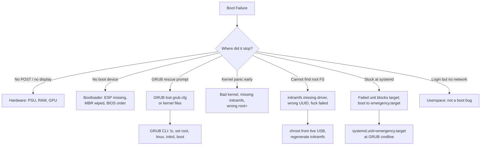

# Boot and Init

> The day you can fix an unbootable Linux box from a live USB at 2am is the day you stop being junior. This file is that day's playbook.

## Why this matters

Boot failures happen rarely — and always at the worst possible time. When they do, you cannot Google the screen in front of you because there is no shell to copy from. You need the **mental model** memorized cold: POST -> bootloader -> kernel -> initramfs -> init -> targets. Every failure mode lives at exactly one of those stages, and each stage has a recovery path.

Senior admins do not panic at a kernel panic. They read the panic message, identify the stage, and reach for the right tool: GRUB editor, kernel cmdline, initramfs shell, `systemd.unit=rescue.target`, or chroot from a live USB.

---

## Mental model: the boot pipeline

```mermaid
flowchart LR
    A[Power on] --> B[POST<br/>BIOS/UEFI firmware]
    B --> C{Boot mode?}
    C -->|BIOS| D[MBR / 1st stage GRUB]
    C -->|UEFI| E[ESP /EFI/.../grubx64.efi]
    D --> F[GRUB stage 2<br/>/boot/grub/grub.cfg]
    E --> F
    F --> G[kernel vmlinuz +<br/>initramfs initrd]
    G --> H[Kernel decompresses<br/>mounts initramfs as /]
    H --> I[initramfs scripts:<br/>load drivers, find root FS]
    I --> J[switch_root to real /]
    J --> K[/sbin/init = systemd PID 1]
    K --> L[default.target<br/>= multi-user.target]
    L --> M[Login prompt]
```

<!-- mermaid:rendered -->
<p align="center"></p>

<details><summary>Mermaid source</summary>



</details>
---

## Stage-by-stage breakdown

### 1. POST (Power-On Self-Test)

The firmware (BIOS or UEFI) initializes hardware and picks a boot device.

- **BIOS** reads the first 512 bytes (MBR) of the chosen disk -> jumps to bootloader stage 1.
- **UEFI** mounts the ESP (EFI System Partition, FAT32) and runs the `.efi` binary registered in NVRAM (`efibootmgr -v`).

Failure signs: no POST beep, no display, "No boot device". Not a Linux problem yet.

```bash
# UEFI: list and reorder boot entries
efibootmgr -v
efibootmgr -o 0001,0002,0000          # set boot order
efibootmgr -b 0003 -B                  # delete entry 0003
```

### 2. Bootloader (GRUB)

GRUB stages:
- **Stage 1** (in MBR or `BOOTX64.EFI`): tiny, knows how to load stage 2.
- **Stage 2** (`/boot/grub/i386-pc/core.img` or in ESP): reads `/boot/grub/grub.cfg`, presents the menu.

`grub.cfg` is **generated**, not edited. Source files:
- `/etc/default/grub` — top-level options (timeout, default, cmdline)
- `/etc/grub.d/*` — scripts that emit menu entries

Regenerate after editing:
```bash
sudo update-grub                              # Debian/Ubuntu
sudo grub2-mkconfig -o /boot/grub2/grub.cfg   # RHEL/Fedora (BIOS)
sudo grub2-mkconfig -o /boot/efi/EFI/<distro>/grub.cfg   # RHEL UEFI
```

### 3. Kernel + initramfs

GRUB hands two files to the CPU:
- `vmlinuz-<version>` — compressed kernel
- `initrd.img-<version>` (or `initramfs-<version>.img`) — cpio archive containing minimal userspace

The kernel decompresses itself, mounts the initramfs as `/`, and runs `/init` inside it. The initramfs job is to **find and mount the real root filesystem**, then `switch_root` to it.

Why initramfs exists: the real root may live on LVM, RAID, encrypted LUKS, NFS, or need a driver not built into the kernel. The initramfs ships those drivers + tools.

```bash
# Inspect contents of an initramfs (Debian)
lsinitramfs /boot/initrd.img-$(uname -r) | less

# RHEL
lsinitrd /boot/initramfs-$(uname -r).img | less

# Regenerate
sudo update-initramfs -u                  # Debian, current kernel
sudo update-initramfs -u -k all           # all kernels
sudo dracut --force /boot/initramfs-$(uname -r).img $(uname -r)   # RHEL
```

### 4. init = systemd PID 1

Once root is mounted, the kernel execs `/sbin/init` — on modern systems, a symlink to `/lib/systemd/systemd`. Override at the kernel cmdline with `init=/bin/bash` for emergency shell.

systemd reads `default.target` (a symlink in `/etc/systemd/system/`):

```bash
systemctl get-default              # multi-user.target
systemctl set-default graphical.target
```

### 5. Targets

Targets are systemd's grouping mechanism — analogous to SysV runlevels but a dependency graph, not a number.

| Target | Old runlevel | Use |
|--------|--------------|-----|
| `poweroff.target` | 0 | shutdown |
| `rescue.target` | 1 / S | single-user, root password required, basic system mounted |
| `multi-user.target` | 3 | full multi-user, no GUI |
| `graphical.target` | 5 | multi-user + display manager |
| `reboot.target` | 6 | reboot |
| `emergency.target` | — | minimal: only `/` mounted RO, root shell, no other services |

Switch live: `sudo systemctl isolate rescue.target`.

Boot to a target by adding to GRUB cmdline:
```
systemd.unit=emergency.target
systemd.unit=rescue.target
```

---

## GRUB editing at boot (the rescue interface)

When the GRUB menu appears, press `e` on the kernel entry to edit. You can:

- Remove `quiet splash` to see boot messages
- Add `single` (legacy) or `systemd.unit=rescue.target` for single-user
- Add `init=/bin/bash` for **emergency root shell with no init**, no services, no networking
- Add `rd.break` (RHEL/dracut) to drop into the initramfs shell
- Add `nomodeset` to disable KMS for video issues
- Change `root=UUID=...` if the wrong filesystem is being mounted

Press `Ctrl+X` or `F10` to boot the edited entry. Edits are temporary — they don't persist.

If GRUB drops to the rescue prompt (`grub rescue>`), it could not find or read `grub.cfg`:

```
grub rescue> ls
(hd0) (hd0,gpt1) (hd0,gpt2) (hd0,gpt3)
grub rescue> ls (hd0,gpt2)/
boot/ etc/ home/ ...
grub rescue> set root=(hd0,gpt2)
grub rescue> set prefix=(hd0,gpt2)/boot/grub
grub rescue> insmod normal
grub rescue> normal
# This restores the full GRUB menu; from there boot a kernel and reinstall GRUB.
```

---

## Manual boot from GRUB CLI

```
grub> ls (hd0,gpt2)/boot/
vmlinuz-5.15.0-92-generic   initrd.img-5.15.0-92-generic   ...
grub> set root=(hd0,gpt2)
grub> linux /boot/vmlinuz-5.15.0-92-generic root=UUID=abc-123 ro
grub> initrd /boot/initrd.img-5.15.0-92-generic
grub> boot
```

If that boots, your `grub.cfg` is broken; regenerate it after login.

---

## Recovery: chroot from a live USB

The universal "the box won't boot" recovery. Boot any modern Linux live USB (Ubuntu, Fedora, SystemRescue), open a terminal:

```bash
# 1. Identify partitions
lsblk -f
# nvme0n1
#  ├─nvme0n1p1  vfat        /boot/efi
#  ├─nvme0n1p2  ext4        /boot
#  └─nvme0n1p3  LVM2_member
#    └─vg0-root xfs         /

# 2. Mount real root
sudo mount /dev/mapper/vg0-root /mnt
sudo mount /dev/nvme0n1p2 /mnt/boot
sudo mount /dev/nvme0n1p1 /mnt/boot/efi    # if UEFI

# 3. Bind-mount kernel virtual filesystems (needed for chroot)
for d in dev proc sys run; do sudo mount --bind /$d /mnt/$d; done
# OR the modern systemd way:
sudo systemd-nspawn -D /mnt                 # spawns a clean chroot-like env

# 4. chroot in
sudo chroot /mnt /bin/bash

# Now you are "inside" the broken system as root.

# 5. Common fixes:
update-initramfs -u -k all                  # rebuild initramfs (Debian)
dracut --force                              # rebuild initramfs (RHEL)
update-grub                                 # rebuild grub.cfg (Debian)
grub-install /dev/nvme0n1                   # reinstall GRUB to MBR/ESP
passwd                                      # reset root password
vi /etc/fstab                               # fix bad mount that blocks boot

# 6. Exit cleanly
exit
sudo umount -R /mnt
sudo reboot
```

---

## emergency.target vs rescue.target

| | `rescue.target` | `emergency.target` |
|--|-----------------|-------------------|
| Local FS mounted | yes (all of `local-fs.target`) | only `/` and read-only |
| `sysinit.target` reached | yes (devices, swap, basic) | no |
| Networking | not started | not started |
| Root password | required | required |
| When to use | "I broke a service, let me fix it" | "even basic mounts fail" |

Recovery without root password: at GRUB, edit the kernel line to add `init=/bin/bash`. You bypass init entirely. Mount root RW (`mount -o remount,rw /`), `passwd`, then `exec /sbin/init`.

---

## Walkthrough: "kernel panic - not syncing - VFS unable to mount root fs"

```
[    1.234] Kernel panic - not syncing: VFS: Unable to mount root fs on unknown-block(0,0)

# Translation: kernel cannot find or mount the device named in root=

# Step 1: reboot, edit GRUB entry
# At GRUB menu, press 'e', find the linux line:
linux /boot/vmlinuz-... root=UUID=abc-123 ro quiet splash

# Remove "quiet splash" so you see what's happening.
# If UUID is wrong (post fstab edit), replace with /dev/sda3 or correct UUID.
# Boot.

# If still failing, the initramfs likely lacks the driver (e.g. nvme, dm-raid):
# Boot live USB, chroot in:
chroot /mnt /bin/bash
update-initramfs -u -k all
exit; umount -R /mnt; reboot

# If kernel itself is bad (post-upgrade):
# At GRUB, choose "Advanced" -> previous kernel -> boot.
# Then: apt-mark hold the broken kernel; remove or pin.
```

## Walkthrough: "you are in emergency mode"

```
You are in emergency mode. After logging in, type "journalctl -xb"
to view system logs, "systemctl reboot" to reboot, "systemctl
default" or "exit" to boot into default mode.

Give root password for maintenance:
(or press Control-D to continue):

# Step 1: log in.
# Step 2: find the failing unit
journalctl -xb -p err
systemctl --failed

# Common: a bad fstab entry.
mount -o remount,rw /
vi /etc/fstab                  # comment out the offending line
mount -a                       # test
systemctl daemon-reload
systemctl default              # try to reach multi-user.target
```

## Walkthrough: forgot root password

```
# At GRUB, press 'e' on the entry. Find:
linux /boot/vmlinuz-... root=UUID=... ro quiet splash

# Edit to:
linux /boot/vmlinuz-... root=UUID=... rw init=/bin/bash

# Ctrl+X to boot. You drop into a bash shell as root, no init running.

bash# mount -o remount,rw /
bash# passwd
New password: ********
Retype new password: ********
passwd: password updated successfully
bash# sync
bash# exec /sbin/init                      # hand off to systemd
# OR
bash# mount -o remount,ro /
bash# reboot -f
```

> [!WARNING]
> If `/etc/shadow` is on a separate FS or SELinux is enforcing, you may need additional steps. On RHEL with SELinux: after passwd, `touch /.autorelabel` then reboot, or `restorecon /etc/shadow` before reboot.

---

## 20-year-experience tips

> [!TIP]
> **Always keep a Linux live USB in your laptop bag.** SystemRescue (sysrescue.org) or a recent Ubuntu image. The day you need it, no download will be fast enough.

> [!TIP]
> **Never remove the previous kernel until the new one boots clean.** `apt autoremove` after a kernel upgrade is the #1 cause of unbootable boxes. Always reboot, log in, run `uptime`, *then* clean up.

> [!TIP]
> **`init=/bin/bash` is the universal panic button.** If everything is broken, this gives you a root shell. Memorize it. Drill it. Use it once and you'll never forget it.

> [!TIP]
> **Read GRUB error messages literally.** "file not found" means GRUB sees the disk but the path inside it is wrong. "no such device" means GRUB doesn't even see the partition. Different problems, different fixes.

> [!TIP]
> **Test boot recovery in a VM, not in production.** Spin up a VM, deliberately break GRUB, recover from a live USB. Do this once a year. The day you need it for real, the muscle memory is there.

---

## Gotchas

> [!WARNING]
> - On UEFI systems, `grub-install` requires the ESP to be mounted at `/boot/efi`. Forgetting this writes to the wrong place silently.
> - After kernel upgrades on encrypted LUKS systems, you MUST regenerate initramfs or you get prompted for the wrong key. `update-initramfs -u`.
> - `init=/bin/bash` gives you `/` mounted read-only. `mount -o remount,rw /` before any change.
> - `systemd-nspawn` is cleaner than `chroot + bind mounts` but requires the systemd-container package on the live USB.
> - SELinux relabelling: after editing files in chroot on a SELinux system, `touch /mnt/.autorelabel` to force a relabel on next boot, or you'll get strange permission denials.
> - `fsck` on the root filesystem from inside a running system is dangerous. Boot from live USB, unmount, then `fsck`.
> - `grub.cfg` regeneration (`update-grub`) reads kernels in `/boot/`. If `/boot` is a separate partition not mounted in chroot, you get an empty menu.
> - Some EFI firmware "forgets" boot entries on reset. `efibootmgr -c` re-creates them.
> - `nomodeset` is a video-only fix; do not leave it in production cmdline as it disables KMS performance features.

---

## Sources

- `man 8 grub-install`, `man 8 grub-mkconfig`, `man 5 grub`
- `man 8 update-initramfs`, `man 8 dracut`
- `man 8 efibootmgr`
- `man 7 systemd.special` (target reference)
- `man 8 systemd-nspawn`
- `man 7 bootup` (the canonical boot-flow document)
- freedesktop.org/software/systemd/man/bootup.html
- freedesktop.org/software/systemd/man/systemd.special.html
- kernel.org Documentation/admin-guide/initrd.rst
- kernel.org Documentation/admin-guide/kernel-parameters.txt
