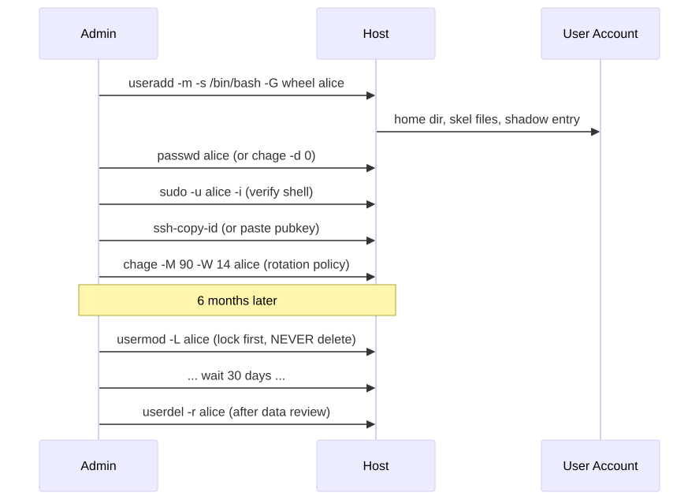
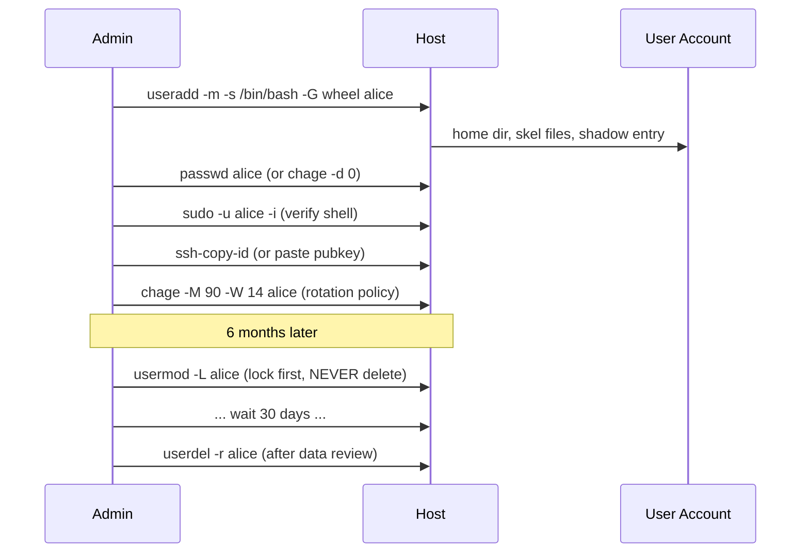

# Daily Driver Tasks

> The 50 things a Linux admin actually does every week. Memorize these and you save 30 minutes a day forever.

## Why this matters

Junior admins Google `useradd` syntax for ten years. Senior admins type it muscle-memory and use the saved time to think about the *system*. This file is the muscle-memory layer: user lifecycle, log rotation, scheduled jobs, patching, kernel updates, time, hostname, locale, MOTD. Every single one shows up in interviews and on Friday afternoons before long weekends.

The skill is not "knowing the command." The skill is **knowing the order, the verification step, and the rollback** for each operation.

---

## Mental model

```mermaid
flowchart TD
    A[Daily Ops] --> B[Identity]
    A --> C[Time]
    A --> D[Schedule]
    A --> E[Software]
    A --> F[Logs]
    A --> G[Presentation]

    B --> B1[useradd / usermod / userdel]
    B --> B2[groupadd / gpasswd]
    B --> B3[passwd policies]
    B --> B4[sudoers / wheel]

    C --> C1[timedatectl]
    C --> C2[chronyd / timesyncd]
    C --> C3[hwclock]

    D --> D1[crontab -e]
    D --> D2[systemd timers]
    D --> D3[at / batch]

    E --> E1[apt / dnf / zypper]
    E --> E2[unattended-upgrades]
    E --> E3[kernel pin]
    E --> E4[reboot needed]

    F --> F1[logrotate]
    F --> F2[journald rotation]
    F --> F3[auditd]

    G --> G1[hostname]
    G --> G2[locale / timezone]
    G --> G3[MOTD / issue]
```

<!-- mermaid:rendered -->
<p align="center"></p>

<details><summary>Mermaid source</summary>



</details>
<!-- mermaid:rendered -->
<p align="center"></p>

<details><summary>Mermaid source</summary>



</details>
---

## The 50 tasks

### Identity and access (1-12)

```bash
# 1. Create a real human user
useradd -m -s /bin/bash -c "Alice Lee" -G wheel,docker alice
# -m makes home, -s sets shell, -G adds supplementary groups

# 2. Force first-login password change
chage -d 0 alice

# 3. Set password policy (max 90d, warn 14d, min 1d, expire warn 7d)
chage -M 90 -W 14 -m 1 alice

# 4. Show current chage state
chage -l alice

# 5. Add user to a group without losing existing groups
usermod -aG docker alice          # -a is mandatory; without it you OVERWRITE

# 6. Lock an account (preserves data, blocks login)
usermod -L alice                  # adds ! to /etc/shadow password

# 7. Unlock
usermod -U alice

# 8. Expire account on a date (off-boarding)
chage -E 2026-12-31 alice

# 9. Delete user AND home (final off-boarding, after data review)
userdel -r alice

# 10. Create a service account (no shell, no home)
useradd -r -s /usr/sbin/nologin -d /nonexistent appsvc

# 11. Grant sudo via drop-in (NEVER edit /etc/sudoers directly)
echo "alice ALL=(ALL) NOPASSWD: /usr/bin/systemctl restart nginx" \
  | sudo tee /etc/sudoers.d/alice-nginx
sudo visudo -cf /etc/sudoers.d/alice-nginx   # syntax check

# 12. Audit who has sudo
getent group wheel sudo 2>/dev/null
sudo grep -RhE '^[^#]' /etc/sudoers /etc/sudoers.d/
```

### Time (13-18)

```bash
# 13. Show current time + sync state
timedatectl

# 14. Set timezone
timedatectl set-timezone Asia/Kolkata
ls /usr/share/zoneinfo            # list available

# 15. Enable NTP (uses chronyd or systemd-timesyncd, whichever is active)
timedatectl set-ntp true

# 16. Detailed chrony status
chronyc tracking                  # offset, stratum, root delay
chronyc sources -v                # peers + selection state

# 17. Force immediate resync
chronyc makestep                  # only if you know what you're doing

# 18. Sync hardware clock from system
hwclock --systohc                 # write RTC from system time
```

### Scheduled jobs (19-26)

```bash
# 19. Edit current user's crontab
crontab -e

# 20. List all user crontabs (root only)
for u in $(cut -f1 -d: /etc/passwd); do
  crontab -l -u "$u" 2>/dev/null | grep -v '^#' | grep . && echo "^^ $u"
done

# 21. System-wide cron locations
ls /etc/cron.{d,daily,hourly,weekly,monthly}
cat /etc/crontab

# 22. systemd timer (preferred over cron for new work)
systemctl list-timers --all
systemctl status backup.timer

# 23. Create a oneshot timer (see service-mastery.md for full unit)
systemctl edit --force --full backup.timer

# 24. One-off job in 30 minutes
echo '/usr/local/bin/cleanup.sh' | at now + 30 minutes
atq                               # list queued
atrm 3                            # remove job 3

# 25. Cron syntax reminder (m h dom mon dow)
# */15 * * * *   every 15 min
# 0 */4 * * *    every 4 hours on the hour
# 0 2 * * 0      Sundays at 02:00

# 26. Catch a missed cron run on next boot (cron can't; anacron / timer can)
# In a systemd timer: Persistent=true under [Timer]
```

### Patching and packages (27-34)

```bash
# 27. Refresh metadata (DO THIS FIRST)
apt update                        # Debian/Ubuntu
dnf check-update                  # RHEL/Fedora
zypper refresh                    # SUSE

# 28. Apply security-only updates
unattended-upgrade --dry-run -d   # Debian
dnf upgrade --security            # RHEL

# 29. Full upgrade
apt full-upgrade -y               # may add/remove packages
dnf upgrade -y

# 30. Hold a package at current version
apt-mark hold openssh-server
dnf versionlock add openssh-server   # needs python3-dnf-plugin-versionlock

# 31. Show what would be removed
apt autoremove --dry-run

# 32. Find which package owns a file
dpkg -S /usr/bin/sshd
rpm -qf /usr/bin/sshd

# 33. List installed kernels
dpkg -l 'linux-image-*' | grep ^ii
rpm -qa kernel

# 34. Check if reboot is needed
[ -f /var/run/reboot-required ] && cat /var/run/reboot-required.pkgs
needs-restarting -r               # RHEL: exits 1 if reboot required
```

### Kernel updates (35-40)

```bash
# 35. Show running kernel
uname -r

# 36. Show available kernels at boot
ls /boot/vmlinuz-*
grubby --info=ALL                 # RHEL

# 37. Set default kernel (RHEL)
grubby --set-default /boot/vmlinuz-5.14.0-362.el9.x86_64

# 38. Pin kernel package (Debian)
apt-mark hold linux-image-$(uname -r) linux-headers-$(uname -r)

# 39. Remove old kernels (KEEP at least 2 — the running one and one fallback)
apt autoremove --purge
dnf remove $(dnf repoquery --installonly --latest-limit=-2 -q)

# 40. Live-patch (kpatch / livepatch) status
kpatch list                       # RHEL
canonical-livepatch status        # Ubuntu
```

### Logs and rotation (41-45)

```bash
# 41. journald disk usage
journalctl --disk-usage

# 42. Vacuum journal to 500M
journalctl --vacuum-size=500M
journalctl --vacuum-time=14d

# 43. Test logrotate config
logrotate -d /etc/logrotate.d/nginx     # debug, no changes
logrotate -f /etc/logrotate.d/nginx     # force run

# 44. Tail multiple units live
journalctl -fu nginx -u php8.2-fpm

# 45. Errors since last boot
journalctl -p err -b
```

### Hostname / locale / MOTD (46-50)

```bash
# 46. Set FQDN
hostnamectl set-hostname web-01.prod.example.com
hostnamectl                       # verify static + transient + pretty

# 47. Generate and set locale
locale-gen en_US.UTF-8            # Debian
localectl set-locale LANG=en_US.UTF-8

# 48. Set keymap
localectl set-keymap us

# 49. Static MOTD (login banner)
cat > /etc/motd <<'EOF'
========================================================
  web-01.prod.example.com  |  managed by ansible
  Owner: platform@example.com
========================================================
EOF

# 50. Dynamic MOTD (Ubuntu uses /etc/update-motd.d/)
ls /etc/update-motd.d/
chmod -x /etc/update-motd.d/10-help-text   # disable a banner script
```

---

## Walkthrough: complete user onboarding (realistic)

```bash
$ sudo useradd -m -s /bin/bash -c "Bob Patel" -G wheel,docker bpatel
$ sudo chage -d 0 bpatel
$ sudo chage -M 90 -W 14 -m 1 bpatel
$ sudo chage -l bpatel
Last password change                                    : password must be changed
Password expires                                        : password must be changed
Password inactive                                       : password must be changed
Account expires                                         : never
Minimum number of days between password change          : 1
Maximum number of days between password change          : 90
Number of days of warning before password expires       : 14

$ sudo mkdir -p /home/bpatel/.ssh
$ sudo cp /tmp/bpatel.pub /home/bpatel/.ssh/authorized_keys
$ sudo chown -R bpatel:bpatel /home/bpatel/.ssh
$ sudo chmod 700 /home/bpatel/.ssh
$ sudo chmod 600 /home/bpatel/.ssh/authorized_keys

$ sudo -u bpatel -i
bpatel@web-01:~$ id
uid=1003(bpatel) gid=1003(bpatel) groups=1003(bpatel),10(wheel),998(docker)
bpatel@web-01:~$ exit

$ sudo tee /etc/sudoers.d/bpatel <<'EOF'
bpatel ALL=(ALL) ALL
EOF
$ sudo visudo -cf /etc/sudoers.d/bpatel
/etc/sudoers.d/bpatel: parsed OK
```

## Walkthrough: kernel update with verification

```bash
$ uname -r
5.15.0-89-generic

$ sudo apt update && sudo apt full-upgrade -y
... linux-image-5.15.0-92-generic installed ...

$ ls /boot/vmlinuz-*
/boot/vmlinuz-5.15.0-89-generic
/boot/vmlinuz-5.15.0-92-generic

$ [ -f /var/run/reboot-required ] && cat /var/run/reboot-required
*** System restart required ***

# Snapshot before reboot if you can (LVM/btrfs/ZFS)
$ sudo lvcreate -L 2G -s -n root_pre_kernel_92 /dev/vg0/root

$ sudo systemctl reboot

# After reboot
$ uname -r
5.15.0-92-generic
$ dmesg -T | grep -iE 'error|fail' | head
```

---

## 20-year-experience tips

> [!TIP]
> **Lock, don't delete.** Off-boarding is a process: `usermod -L`, leave for 30 days, audit owned files (`find / -uid <UID> 2>/dev/null`), then `userdel -r`. Deleting on day one orphans cron jobs, broken processes, and unreadable backups for years.

> [!TIP]
> **Never `crontab -r`.** It silently destroys the user's crontab with no confirmation and no backup. Always `crontab -l > /tmp/cron.bak.$USER` first. The `r` and `e` keys are next to each other on the keyboard. Ask any admin who has done this once — they only do it once.

> [!TIP]
> **Patch in waves: dev -> staging -> 10% prod -> rest.** Anyone who patches 100% of prod on a Friday once... only does it once.

> [!TIP]
> **Always `visudo -cf` after editing sudoers.** A broken sudoers file means *no one* can sudo, including you. The recovery is a reboot to single-user mode at best.

> [!TIP]
> **chage -d 0 is your friend.** Forces password change at first login. Without it, the temp password you emailed lives forever in someone's "Sent" folder.

---

## Gotchas

> [!WARNING]
> - `usermod -G` (without `-a`) **replaces** the user's group list. You will lock yourself out of `wheel`/`sudo`. Always `-aG`.
> - `cron` runs with a minimal `PATH` (`/usr/bin:/bin`). If your script calls `aws` or `kubectl`, set `PATH=` at the top of the crontab or use full paths.
> - `cron` does NOT inherit your shell environment. No `~/.bashrc`, no `nvm`, no `pyenv`. Source what you need.
> - `apt upgrade` will refuse to remove packages even if needed; `apt full-upgrade` (or `dist-upgrade`) will. Read the diff before saying yes.
> - `timedatectl set-ntp true` does nothing if neither chronyd nor timesyncd is installed. Check `systemctl status systemd-timesyncd chronyd`.
> - `/etc/motd` is static; on Ubuntu the dynamic banner from `/etc/update-motd.d/` runs on every login. Disabling MOTD requires both.
> - Kernel removal that wipes the running kernel will brick reboot. ALWAYS keep N and N-1.
> - Cron times are in the **system timezone**. Changing TZ silently shifts every job.

---

## Sources

- `man 8 useradd`, `man 8 usermod`, `man 8 userdel`, `man 1 chage`
- `man 5 sudoers`, `man 8 visudo`
- `man 1 timedatectl`, `man 1 hostnamectl`, `man 1 localectl`
- `man 5 crontab`, `man 1 crontab`, `man 8 cron`
- `man 8 logrotate`, `man 1 journalctl`
- `man 8 apt`, `man 8 dnf`, `man 8 zypper`
- freedesktop.org/wiki/Software/systemd/timedated/
- freedesktop.org/wiki/Software/systemd/hostnamed/
