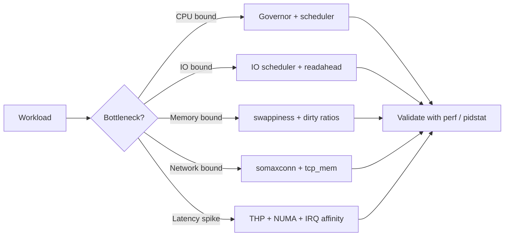
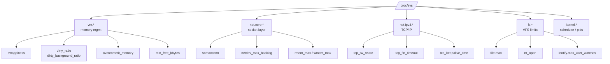

# Performance Tuning

> Most Linux performance problems are not "we need bigger hardware" — they are "the kernel defaults assume a 2008 desktop." Knowing five sysctls separates a senior from a junior.

## Why this matters

The Linux kernel ships with conservative defaults that work for everything from a Raspberry Pi to a 256-core NUMA box. Those defaults are wrong for your workload. A well-tuned `vm.swappiness` and `net.core.somaxconn` will outperform doubling RAM. Tuning is not magic — it is **measurement, hypothesis, knob, measurement**. Anyone twisting knobs without baselines is gambling.

The discipline is:
1. **Baseline first.** No baseline = no improvement claim.
2. **One knob at a time.** Mixing 6 changes hides which one helped.
3. **Persist the win.** A reboot that loses your tuning is a tuning that never happened.
4. **Document why.** "We set vm.dirty_ratio=10 because Postgres write bursts caused 4s stalls." Not "we set it because Stack Overflow said so."

---

## Mental model

<!-- mermaid:rendered -->
<p align="center"></p>

<details><summary>Mermaid source</summary>



</details>
<!-- mermaid:rendered -->
<p align="center"></p>

<details><summary>Mermaid source</summary>



</details>
---

## The sysctl knobs that matter

### Memory (`vm.*`)

| Knob | Default | Tune to | Why |
|------|---------|---------|-----|
| `vm.swappiness` | 60 | `10` (DBs), `1` (k8s nodes) | 60 means kernel happily swaps anonymous pages; for DB/cache workloads this is a latency disaster |
| `vm.dirty_ratio` | 20 | `10` for write-heavy | % of RAM that can be dirty before processes block on writeback |
| `vm.dirty_background_ratio` | 10 | `5` for write-heavy | When kernel starts background flush. Keep < dirty_ratio |
| `vm.dirty_expire_centisecs` | 3000 | `500` for low-latency | Max age (100ths of a sec) of dirty data before flush |
| `vm.overcommit_memory` | 0 | `2` for Redis, `1` for fork-heavy | 2 = strict accounting, no OOM lottery |
| `vm.min_free_kbytes` | auto | bump on big-RAM boxes | Reserve for atomic allocations; prevents fragmentation panics |
| `vm.zone_reclaim_mode` | 0 | keep `0` on NUMA | Avoid aggressive local-node reclaim that thrashes |

### Filesystem (`fs.*`)

| Knob | Default | Tune to | Why |
|------|---------|---------|-----|
| `fs.file-max` | ~9% RAM | `2097152` | System-wide FD ceiling; web/proxy boxes hit this |
| `fs.nr_open` | 1048576 | match per-process need | Per-process FD ceiling (with ulimit -n) |
| `fs.inotify.max_user_watches` | 8192 | `524288` | IDEs and watchers (vscode, webpack) eat these |

### Network core (`net.core.*`)

| Knob | Default | Tune to | Why |
|------|---------|---------|-----|
| `net.core.somaxconn` | 4096 (>=5.4) / 128 | `65535` | Listen-backlog ceiling. 128 is a 1990s default; nginx/haproxy eat it |
| `net.core.netdev_max_backlog` | 1000 | `30000` | Per-CPU packet queue when NIC > kernel can drain |
| `net.core.rmem_max` / `wmem_max` | 212992 | `16777216` | Max socket buffer; required for high-BDP links |

### TCP (`net.ipv4.*`)

| Knob | Default | Tune to | Why |
|------|---------|---------|-----|
| `net.ipv4.tcp_tw_reuse` | 2 (loopback) | `1` (cautious) | Lets new conns reuse TIME_WAIT sockets when safe; helps short-lived API clients |
| `net.ipv4.tcp_fin_timeout` | 60 | `30` | Time stuck in FIN-WAIT-2; lower clears zombies faster |
| `net.ipv4.tcp_keepalive_time` | 7200 | `300` | Detect dead peers in 5 min instead of 2 hours |
| `net.ipv4.ip_local_port_range` | 32768-60999 | `10240-65535` | Outbound ephemeral ports; raise on busy reverse proxies |
| `net.ipv4.tcp_max_syn_backlog` | 1024 | `8192` | SYN queue size before SYN cookies kick in |

> [!WARNING]
> Do NOT set `net.ipv4.tcp_tw_recycle` — it was removed in 4.12 because NAT broke. If you read a blog telling you to enable it, the blog is older than your career plan.

---

## Applying knobs (persistent)

```bash
# 1. Test live (NOT persistent)
sudo sysctl -w vm.swappiness=10
sudo sysctl -w net.core.somaxconn=65535

# 2. Persist via drop-in (NEVER edit /etc/sysctl.conf directly on modern systems)
sudo tee /etc/sysctl.d/99-tuning.conf <<'EOF'
# Memory
vm.swappiness = 10
vm.dirty_ratio = 10
vm.dirty_background_ratio = 5
vm.overcommit_memory = 1

# Filesystem
fs.file-max = 2097152
fs.inotify.max_user_watches = 524288

# Network core
net.core.somaxconn = 65535
net.core.netdev_max_backlog = 30000
net.core.rmem_max = 16777216
net.core.wmem_max = 16777216

# TCP
net.ipv4.tcp_tw_reuse = 1
net.ipv4.tcp_fin_timeout = 30
net.ipv4.tcp_keepalive_time = 300
net.ipv4.ip_local_port_range = 10240 65535
net.ipv4.tcp_max_syn_backlog = 8192
EOF

# 3. Apply
sudo sysctl --system          # reads ALL drop-ins in correct order
sysctl vm.swappiness          # verify

# 4. Per-process FD limits (ulimit) — sysctl alone is not enough
sudo tee /etc/security/limits.d/99-nofile.conf <<'EOF'
*  soft  nofile  65535
*  hard  nofile  1048576
EOF
# For systemd services, use LimitNOFILE= in the unit, NOT limits.conf
```

---

## CPU governor

```bash
# Inspect
cat /sys/devices/system/cpu/cpu0/cpufreq/scaling_governor
# typical values: performance, powersave, ondemand, schedutil

# Set 'performance' on all CPUs (kills idle frequency stepping; lowest latency)
for c in /sys/devices/system/cpu/cpu*/cpufreq/scaling_governor; do
  echo performance | sudo tee "$c"
done

# Persist via cpupower
sudo apt install linux-cpupower
sudo cpupower frequency-set -g performance

# Disable Intel turbo (deterministic latency for benchmarks)
echo 1 | sudo tee /sys/devices/system/cpu/intel_pstate/no_turbo
```

> [!TIP]
> On modern kernels (>=4.7) `schedutil` is the default and is usually as good as `performance` while saving power. Switch to `performance` only when you've measured a tail-latency problem and idle-to-active wakeup is the cause.

---

## IO scheduler

```bash
# See current scheduler for each block device
for d in /sys/block/sd*/queue/scheduler; do echo "$d -> $(cat $d)"; done
# [bfq] mq-deadline none kyber

# Choose:
#   none       -> NVMe, fastest, no-op (let device queue do the work)
#   mq-deadline -> SATA SSD, predictable latency
#   bfq        -> spinning rust + desktop interactivity
#   kyber      -> mixed read/write, low latency

# Set live
echo none | sudo tee /sys/block/nvme0n1/queue/scheduler

# Persist via udev
sudo tee /etc/udev/rules.d/60-ioscheduler.rules <<'EOF'
ACTION=="add|change", KERNEL=="nvme[0-9]*", ATTR{queue/scheduler}="none"
ACTION=="add|change", KERNEL=="sd[a-z]", ATTR{queue/rotational}=="0", ATTR{queue/scheduler}="mq-deadline"
ACTION=="add|change", KERNEL=="sd[a-z]", ATTR{queue/rotational}=="1", ATTR{queue/scheduler}="bfq"
EOF
sudo udevadm control --reload && sudo udevadm trigger
```

---

## Transparent Huge Pages (THP)

THP is a double-edged sword: great for HPC/scientific code that touches huge contiguous regions, terrible for databases that want predictable allocation.

```bash
# Inspect
cat /sys/kernel/mm/transparent_hugepage/enabled
# [always] madvise never        <- current is 'always'

cat /sys/kernel/mm/transparent_hugepage/defrag
# always defer defer+madvise [madvise] never

# Disable for DB hosts (Postgres, Redis, Mongo, Oracle all recommend this)
echo never | sudo tee /sys/kernel/mm/transparent_hugepage/enabled
echo never | sudo tee /sys/kernel/mm/transparent_hugepage/defrag

# Persist via kernel cmdline (GRUB)
# Add: transparent_hugepage=never  to GRUB_CMDLINE_LINUX
sudo vi /etc/default/grub
sudo update-grub                    # Debian
sudo grub2-mkconfig -o /boot/grub2/grub.cfg   # RHEL
```

> [!TIP]
> The smoking gun for THP-induced latency is `khugepaged` showing up at the top of `perf top` during latency spikes. If you see it, disable THP and re-baseline.

---

## NUMA basics

NUMA = Non-Uniform Memory Access. On multi-socket boxes, each CPU socket has "local" RAM (fast) and "remote" RAM (slow, ~50% slower). Pinning matters.

```bash
# 1. Topology
numactl --hardware
# available: 2 nodes (0-1)
# node 0 cpus: 0 1 2 3 ...
# node 0 size: 65536 MB
# node distances:
# node   0   1
#   0:  10  21
#   1:  21  10

# 2. Pin a process to node 0 (cpu + memory)
numactl --cpunodebind=0 --membind=0 ./my-database

# 3. Interleave memory across all nodes (good for sequential access)
numactl --interleave=all ./my-app

# 4. Show current NUMA stats per node
numastat -m

# 5. Per-process NUMA inspection
numastat -p $(pgrep -f my-app)

# Watch for high "numa_miss" or "numa_foreign" -> bad placement
```

> [!TIP]
> On a single-socket box NUMA is irrelevant — `numactl --hardware` will show 1 node. Don't tune it.

---

## Walkthrough: a real "the API is slow" investigation

```bash
$ uptime
 15:42:11 up 47 days,  3:21,  2 users,  load average: 8.42, 6.18, 4.05
# load > cores -> contention somewhere

$ vmstat 1 5
procs -----------memory---------- ---swap-- -----io---- -system-- ------cpu-----
 r  b   swpd   free   buff  cache   si   so    bi    bo   in   cs us sy id wa st
 9  2  18432  82340  12300 8400000   12   18   140   220 8000 12000 60 12 18 10  0
# r=9 (runnable > cores), wa=10 (IO wait), si/so non-zero (SWAPPING)

$ free -h
              total        used        free      shared  buff/cache   available
Mem:           15Gi        12Gi        80Mi       300Mi       2.5Gi       1.8Gi
Swap:         2.0Gi       1.5Gi       512Mi
# memory pressure -> swap usage growing

$ sysctl vm.swappiness
vm.swappiness = 60
# the smoking gun for a Redis box

# Action
$ sudo sysctl -w vm.swappiness=1
$ sudo swapoff -a && sudo swapon -a       # flush swap back to RAM (if you have headroom)

# Persist
$ echo 'vm.swappiness = 1' | sudo tee /etc/sysctl.d/99-redis.conf
$ sudo sysctl --system

# After 15 min:
$ vmstat 1 5
 r  b   swpd   free   buff  cache   si   so    bi    bo   in   cs us sy id wa st
 1  0      0 1200000  12300 12000000  0    0    20    40 4000  6000 30  6 62  2  0
# load down, swap zero, wa down
```

---

## Walkthrough: connection refused under load

```bash
# Symptom: nginx logs show "connection refused" under burst
$ ss -lnt | grep :443
LISTEN 511    4096        *:443        *:*
#       ^^^   ^^^^
#       |     `--- somaxconn ceiling
#       `--- current backlog (FULL!)

$ sysctl net.core.somaxconn
net.core.somaxconn = 4096

# Bump it
$ sudo sysctl -w net.core.somaxconn=65535
$ echo 'net.core.somaxconn = 65535' | sudo tee /etc/sysctl.d/99-nginx.conf

# nginx ALSO needs its own listen backlog raised:
# server { listen 443 backlog=65535 ssl; ... }
$ sudo nginx -t && sudo systemctl reload nginx

$ ss -lnt | grep :443
LISTEN 0      65535       *:443        *:*
```

---

## 20-year-experience tips

> [!TIP]
> **Tune in pairs.** `vm.dirty_ratio` and `vm.dirty_background_ratio` only make sense together. `net.core.somaxconn` and the application's listen backlog only make sense together. Always tune the pair, not the half.

> [!TIP]
> **Read the kernel docs, not Medium articles.** `Documentation/admin-guide/sysctl/` in the kernel tree is authoritative and current. Most blog posts are 2014-vintage and contain `tcp_tw_recycle=1` (which has been removed for years).

> [!TIP]
> **A production change without a rollback plan is a bet, not a change.** Before every sysctl tweak: capture current values to a file (`sysctl -a > /tmp/sysctl.before.$(date +%F)`), so a `sysctl -p /tmp/sysctl.before.*` will revert you.

> [!TIP]
> **Measure with `perf top -g` and `pidstat -d 1` before tuning.** Half the "tuning needed" tickets are actually a runaway process or a bad query. Don't tune around a bug.

> [!TIP]
> **Latency tail is the metric, not average.** A change that improves p50 but worsens p99 is a regression. Always look at p99 / p99.9.

---

## Gotchas

> [!WARNING]
> - `sysctl -p` only re-reads `/etc/sysctl.conf` by default. Use `sysctl --system` to read all drop-ins.
> - `ulimit -n` set in `/etc/security/limits.conf` does NOT apply to systemd services. Use `LimitNOFILE=` in the unit (or a drop-in).
> - `vm.overcommit_memory=2` will refuse `fork()` from large processes (forking copies the page table accounting). Test under load.
> - `tcp_tw_reuse=1` is safe for client-side connections (outbound). Setting it for purely server roles does nothing.
> - Disabling THP at runtime does not free already-allocated huge pages — daemons may need a restart.
> - `cpufreq` settings reset on reboot unless persisted via `cpupower.service` or kernel cmdline.
> - `numactl --interleave=all` defeats CPU cache locality. Use only when memory bandwidth, not latency, is the bottleneck.

---

## Sources

- `man 8 sysctl`, `man 5 sysctl.conf`, `man 5 sysctl.d`
- `man 8 tuned`, `man 5 tuned.conf` (RHEL bundles tuned profiles)
- `man 8 numactl`, `man 8 numastat`
- `man 8 cpupower`, `man 8 irqbalance`
- kernel.org: `Documentation/admin-guide/sysctl/vm.rst`
- kernel.org: `Documentation/admin-guide/sysctl/net.rst`
- kernel.org: `Documentation/admin-guide/mm/transhuge.rst`
- kernel.org: `Documentation/admin-guide/pm/cpufreq.rst`
- freedesktop.org/software/systemd/man/systemd.exec.html (LimitNOFILE etc.)
