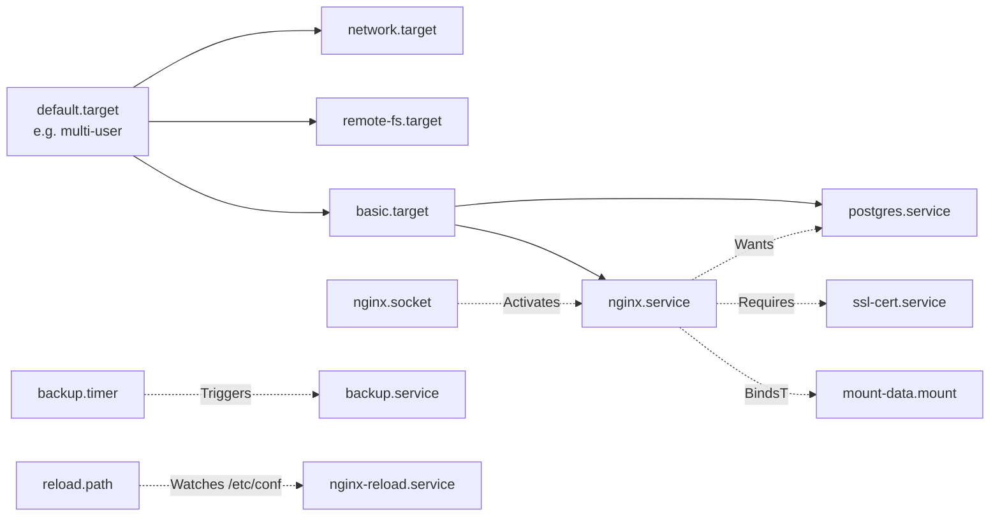
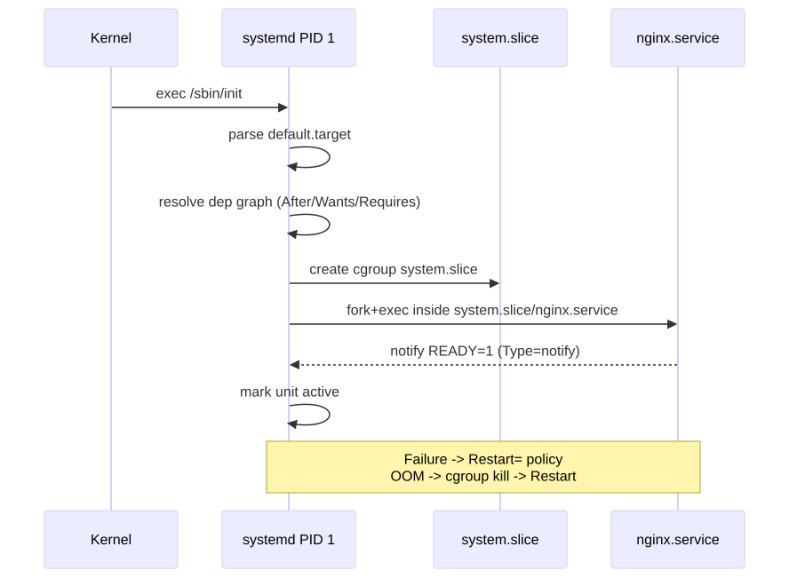
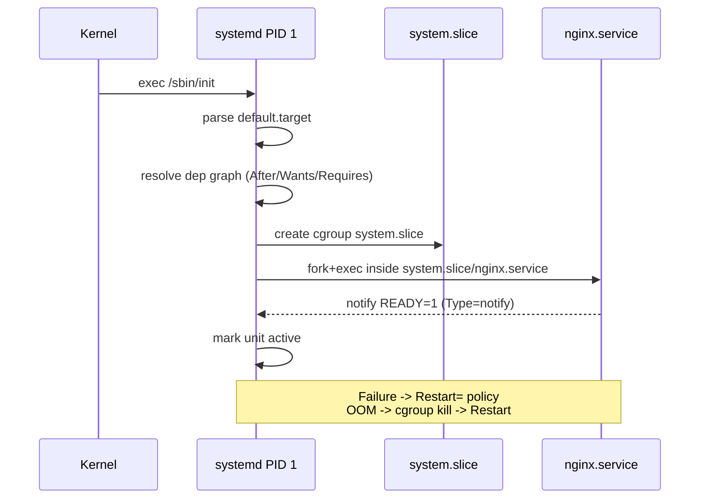
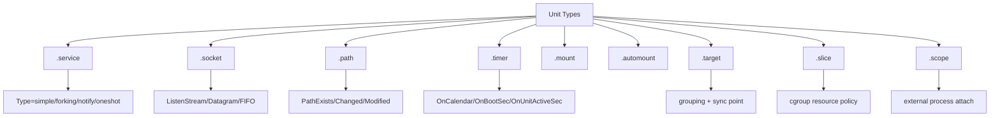

# Service Mastery (systemd deep dive)

> systemd is the most-cursed and most-essential subsystem on Linux. Read this once, read the man pages twice, and you will outclass 90% of admins.

## Why this matters

systemd is not just an init system — it is a **dependency-resolved process manager + socket activator + timer + cgroup controller + journal + DNS resolver + login manager**. Most production incidents trace to a misunderstood unit dependency or a stale drop-in. Mastery means reading a unit file the way a chess grandmaster reads a board: instantly seeing the threats two moves ahead.

The four pillars:
1. **Dependency vocabulary** — `After`, `Wants`, `Requires`, `BindsTo` mean specific things. Confusing them produces non-deterministic ordering.
2. **Activation models** — service, socket, path, timer, target. Each has a use case.
3. **Cgroup discipline** — slices and scopes shape resource policy.
4. **Override hygiene** — drop-ins are surgical; full edits are amputation.

---

## Mental model

<!-- mermaid:rendered -->
<p align="center"></p>

<details><summary>Mermaid source</summary>



</details>
<!-- mermaid:rendered -->
<p align="center"></p>

<details><summary>Mermaid source</summary>



</details>
<!-- mermaid:rendered -->
<p align="center"></p>

<details><summary>Mermaid source</summary>



</details>
---

## Dependency vocabulary (the most-misused words in Linux)

| Directive | Meaning | When to use |
|-----------|---------|-------------|
| `After=foo.service` | Order: start me AFTER foo. **No** requirement — foo can be absent. | Almost always pair with Wants/Requires |
| `Before=foo.service` | Order: start me BEFORE foo. | Rare; usually inverted to After= on the other unit |
| `Wants=foo.service` | Pull foo in. If foo fails, **I still start.** | Soft dependency — the 90% case |
| `Requires=foo.service` | Pull foo in. If foo fails to start, **I am not started.** Foo stopping later does NOT stop me. | Hard start dep, loose runtime |
| `Requisite=foo.service` | Foo must already be active when I activate. Does NOT start foo. | Niche; usually wrong |
| `BindsTo=foo.service` | Like Requires + if foo stops/fails LATER, **I am stopped too**. | Mounts, devices, anything where I cannot survive foo dying |
| `PartOf=foo.service` | If foo is restarted/stopped, I am too. **Asymmetric** — I can stop without affecting foo. | Worker units that follow a coordinator |
| `Conflicts=foo.service` | Activating me deactivates foo, and vice-versa. | Mutually exclusive units (e.g. `chronyd` vs `systemd-timesyncd`) |

> [!TIP]
> **The single most common bug:** writing `Requires=postgres.service` without `After=postgres.service`. Result: parallel start, your app crashes because postgres isn't listening yet. Always pair `After=` with the start dep.

---

## Anatomy of a service unit

```ini
# /etc/systemd/system/myapp.service
[Unit]
Description=My App
Documentation=https://internal.wiki/myapp
After=network-online.target postgres.service
Wants=network-online.target
Requires=postgres.service
StartLimitIntervalSec=60
StartLimitBurst=5

[Service]
Type=notify                                # simple|forking|notify|oneshot|dbus
User=myapp
Group=myapp
EnvironmentFile=-/etc/myapp/env            # leading - = optional
WorkingDirectory=/var/lib/myapp
ExecStartPre=/usr/bin/myapp migrate
ExecStart=/usr/bin/myapp serve
ExecReload=/bin/kill -HUP $MAINPID
Restart=on-failure                         # no|on-success|on-failure|always
RestartSec=5s
TimeoutStartSec=30s
TimeoutStopSec=20s

# Hardening
NoNewPrivileges=yes
ProtectSystem=strict
ProtectHome=yes
PrivateTmp=yes
PrivateDevices=yes
ReadWritePaths=/var/lib/myapp /var/log/myapp
CapabilityBoundingSet=
AmbientCapabilities=

# Resource limits
LimitNOFILE=65535
MemoryMax=2G
CPUQuota=200%                              # 2 full cores
TasksMax=4096
Slice=myapp.slice

[Install]
WantedBy=multi-user.target
```

### Type= matrix

| Type | When `Active` is set | Use case |
|------|----------------------|----------|
| `simple` | as soon as ExecStart forks | Default; fine for most foreground daemons |
| `forking` | when parent exits (after PIDFile is written) | Old daemons that double-fork |
| `notify` | when service sends `READY=1` via sd_notify | **Preferred** — accurate readiness |
| `oneshot` | when ExecStart exits | Scripts, migrations; pair with `RemainAfterExit=yes` |
| `dbus` | when service takes its bus name | dbus-activated services |
| `idle` | like simple but waits for active jobs to finish | Avoid; mostly cosmetic for boot |

---

## Socket activation

Socket activation lets systemd own the listening socket; the service starts on first connection. Win: zero downtime restarts (kernel buffers connections during restart) and lazy startup.

```ini
# /etc/systemd/system/myapp.socket
[Unit]
Description=My App socket

[Socket]
ListenStream=0.0.0.0:8080
Accept=no                                  # yes = inetd-style; no = service handles all conns
NoDelay=yes
ReusePort=yes

[Install]
WantedBy=sockets.target
```

```bash
sudo systemctl enable --now myapp.socket
# Note: do NOT enable myapp.service. The socket pulls it in.

# Inspect
ss -lnp | grep 8080
systemctl list-sockets
```

The service receives the FD via `LISTEN_FDS=1`, `LISTEN_PID=<pid>`. Apps must support `sd_listen_fds()` (libsystemd) — most don't. nginx does, sshd does, custom apps usually need a small change.

---

## Path activation

Trigger a service when a file changes. Use case: hot-reload nginx when `/etc/nginx/conf.d/` changes.

```ini
# /etc/systemd/system/nginx-reload.path
[Unit]
Description=Watch nginx config

[Path]
PathChanged=/etc/nginx/conf.d
PathChanged=/etc/nginx/nginx.conf
Unit=nginx-reload.service

[Install]
WantedBy=multi-user.target
```

```ini
# /etc/systemd/system/nginx-reload.service
[Unit]
Description=Reload nginx on config change

[Service]
Type=oneshot
ExecStartPre=/usr/sbin/nginx -t
ExecStart=/bin/systemctl reload nginx
```

---

## Timer units (cron replacement)

```ini
# /etc/systemd/system/backup.timer
[Unit]
Description=Nightly backup
Requires=backup.service

[Timer]
OnCalendar=*-*-* 02:30:00                  # daily at 02:30 local time
RandomizedDelaySec=10min                   # spread across fleet
Persistent=true                            # run on next boot if missed
AccuracySec=1min                           # default 1m, tighten if needed
Unit=backup.service

[Install]
WantedBy=timers.target
```

```bash
systemctl list-timers --all
systemctl status backup.timer
journalctl -u backup.service --since today
```

> [!TIP]
> Always pair a `.timer` with a `.service` of the same name. If they share names, `Unit=` is optional — systemd matches by stem.

### OnCalendar shortcuts

```
minutely        = *-*-* *:*:00
hourly          = *-*-* *:00:00
daily           = *-*-* 00:00:00
weekly          = Mon *-*-* 00:00:00
monthly         = *-*-01 00:00:00
*-*-* 03:00:00  = every day at 03:00
Mon *-*-* 09:00 = Mondays at 09:00
*-*-1..7 *:*:00 = first week of every month, every minute (don't do this)
```

Validate with: `systemd-analyze calendar 'Mon *-*-* 09:00:00'`.

---

## Slices and scopes (cgroups)

A **slice** is a cgroup that holds units; a **scope** is a cgroup created for processes started outside systemd (e.g. by login).

```
-.slice                       (root)
  ├─ system.slice             (system services)
  │   ├─ nginx.service
  │   └─ postgres.service
  ├─ user.slice               (login sessions)
  │   └─ user-1000.slice
  │       └─ session-3.scope
  └─ machine.slice            (containers/VMs via systemd-machined)
```

Apply policy at the slice level — affects every contained unit.

```ini
# /etc/systemd/system/myapp.slice
[Slice]
CPUQuota=400%                              # 4 cores total for myapp.* units
MemoryMax=8G
TasksMax=10000
IOWeight=200                               # default 100
```

Reference from a service:
```ini
[Service]
Slice=myapp.slice
```

Inspect:
```bash
systemd-cgtop                              # like top but per-cgroup
systemd-cgls                               # tree view
systemctl status myapp.slice
systemctl set-property myapp.service MemoryMax=2G --runtime  # live, --runtime=non-persistent
```

---

## Drop-ins (the right way to override)

> [!TIP]
> **Never edit vendor unit files in `/lib/systemd/system/` or `/usr/lib/systemd/system/`.** Package upgrades will overwrite your changes. Use drop-ins.

```bash
# Surgical override — adds/replaces a single directive
sudo systemctl edit nginx.service
# This opens an editor on /etc/systemd/system/nginx.service.d/override.conf
```

```ini
# /etc/systemd/system/nginx.service.d/override.conf
[Service]
LimitNOFILE=131072
Environment="WORKER_PROCESSES=auto"
```

```bash
# Full file override (rare; use only when you need to change ExecStart)
sudo systemctl edit --full nginx.service

# After ANY edit:
sudo systemctl daemon-reload
sudo systemctl restart nginx

# Inspect the merged result
systemctl cat nginx.service                # shows vendor + all drop-ins in load order
systemctl show nginx.service | less        # all resolved properties
```

### Drop-in load order

```
/etc/systemd/system/<unit>.d/*.conf      <- highest priority (admin)
/run/systemd/system/<unit>.d/*.conf      <- runtime (transient)
/usr/lib/systemd/system/<unit>.d/*.conf  <- vendor
```

Files within each dir are loaded **lexically**, so prefix with numbers: `10-limits.conf`, `20-env.conf`.

### Resetting a directive

A drop-in with an empty value clears a list-type directive:

```ini
[Service]
ExecStart=
ExecStart=/usr/bin/my-replacement
```

The first empty `ExecStart=` clears the inherited list, then the second sets the new one. **This is the only way to replace `ExecStart=` from a vendor unit.**

---

## Environment files

```bash
# /etc/myapp/env
DATABASE_URL=postgres://localhost/myapp
LOG_LEVEL=info
# Comments OK; NO bash expansion, NO export, NO multiline
```

```ini
[Service]
EnvironmentFile=-/etc/myapp/env            # - = silently OK if missing
EnvironmentFile=/etc/myapp/secrets.env     # no - = MUST exist
Environment="OVERRIDE=foo"                 # inline; later wins over file
```

Ordering: later directives win. Inline `Environment=` after `EnvironmentFile=` overrides file values.

---

## journald rotation

```bash
# Inspect
journalctl --disk-usage
ls -lh /var/log/journal/*/

# Persistent journal (NOT default on minimal Debian/RHEL!)
sudo mkdir -p /var/log/journal
sudo systemd-tmpfiles --create --prefix /var/log/journal
sudo systemctl restart systemd-journald
```

Configure in `/etc/systemd/journald.conf` (or drop-in `journald.conf.d/`):

```ini
[Journal]
Storage=persistent
SystemMaxUse=2G                            # cap total journal size
SystemKeepFree=500M                        # always leave this much free
SystemMaxFileSize=128M                     # rotate at this size
SystemMaxFiles=20                          # keep this many archive files
MaxRetentionSec=30day                      # discard older than 30d
ForwardToSyslog=no
RateLimitIntervalSec=30s
RateLimitBurst=10000                       # raise for chatty apps
```

```bash
sudo systemctl restart systemd-journald
journalctl --vacuum-size=500M              # immediate cleanup
journalctl --vacuum-time=14d
```

---

## Walkthrough: diagnose a flapping service

```
$ systemctl status myapp.service
● myapp.service - My App
     Loaded: loaded (/etc/systemd/system/myapp.service; enabled)
     Active: failed (Result: start-limit-hit) since Mon 2026-04-26 14:02:11 IST
   Main PID: 8421 (code=exited, status=1/FAILURE)

# "start-limit-hit" -> systemd gave up restarting

$ journalctl -u myapp.service -n 50 --no-pager
Apr 26 14:01:00 web-01 myapp[8401]: FATAL: cannot connect to postgres: timeout
Apr 26 14:01:05 web-01 systemd[1]: myapp.service: Main process exited, code=exited, status=1
Apr 26 14:01:05 web-01 systemd[1]: myapp.service: Failed with result 'exit-code'.
Apr 26 14:01:10 web-01 systemd[1]: myapp.service: Scheduled restart job, restart counter is at 5.
Apr 26 14:02:11 web-01 systemd[1]: myapp.service: Start request repeated too quickly.

$ systemctl status postgres.service
● postgres.service - PostgreSQL
     Active: active (running)
# Postgres is up, but myapp can't reach it. Maybe ordering bug.

$ systemctl cat myapp.service | grep -E 'After|Requires|Wants'
Requires=postgres.service
# Missing After=postgres.service. Even though Requires pulled it in,
# they started in PARALLEL, and myapp lost the race.

$ sudo systemctl edit myapp.service
[Unit]
After=postgres.service network-online.target

$ sudo systemctl daemon-reload
$ sudo systemctl reset-failed myapp.service
$ sudo systemctl start myapp.service
$ systemctl is-active myapp.service
active
```

---

## Walkthrough: socket activation for zero-downtime restart

```
$ cat /etc/systemd/system/myapi.socket
[Unit]
Description=myapi listening socket

[Socket]
ListenStream=0.0.0.0:9000
ReusePort=yes

[Install]
WantedBy=sockets.target

$ sudo systemctl enable --now myapi.socket
$ sudo systemctl start myapi.service       # connects to existing socket FD

# Now restart the service while curl-ing:
$ while true; do curl -s -o /dev/null -w "%{http_code}\n" http://localhost:9000/; done &
200
200
200
$ sudo systemctl restart myapi.service
200
200                                          # no 5xx, no connection refused
200
# kernel buffered the in-flight conns during the ~200ms restart
```

---

## 20-year-experience tips

> [!TIP]
> **Always run `daemon-reload` after editing units.** Forgetting this is the single most common "but I changed it!" bug. Make it a reflex: edit -> `daemon-reload` -> `restart`.

> [!TIP]
> **`systemctl cat` is your truth source.** It shows the merged unit (vendor + all drop-ins) in load order. When two admins disagree about what a unit does, run `systemctl cat`. End of debate.

> [!TIP]
> **`Type=notify` beats `Type=simple` every time you can use it.** systemd actually knows when the service is ready, so `After=` chains downstream work correctly. With `Type=simple`, "started" just means "forked" — useless for ordering.

> [!TIP]
> **Use `Restart=on-failure`, not `Restart=always`.** With `always`, a service that exits 0 (clean shutdown intended) gets restarted, defeating `systemctl stop`. Read the difference in `man systemd.service`.

> [!TIP]
> **Pair `StartLimitBurst` with `RestartSec`.** Default is 5 restarts in 10s — easy to hit during a config typo, then systemd refuses to retry until `systemctl reset-failed`. Junior admins blame systemd; seniors recognize the pattern.

---

## Gotchas

> [!WARNING]
> - `network.target` is reached when the network *configuration* is done, not when an interface is up. Use `network-online.target` (and `Wants=network-online.target`) if your service needs reachable network.
> - `Requires=` does NOT include order. Without `After=`, both units start in parallel. This is the #1 systemd bug.
> - `BindsTo=` cascades: stopping the dep stops you. Use carefully — easy to create chains that take down half the box.
> - `EnvironmentFile=` does NOT do shell expansion. `FOO=$BAR` literally sets FOO to the string `$BAR`.
> - `systemctl edit --full` is destructive: it copies the whole vendor unit to `/etc/`, freezing it. Future package updates won't touch it. Prefer plain `systemctl edit`.
> - Symlinks in `multi-user.target.wants/` from `enable` are NOT removed by `daemon-reload`. Use `systemctl disable` properly.
> - Journal namespace: `journalctl -u foo.service` only matches if the unit logged via systemd's stdout/stderr capture. Apps that write directly to `/var/log/foo.log` won't show.
> - `systemd-analyze verify <unit>` catches typos and broken refs offline. Use it in CI before deploying units.
> - Setting `User=foo` does NOT set `$HOME`, `$LOGNAME`, etc. by default. Add `WorkingDirectory=` and use `Environment=HOME=...` if needed.

---

## Sources

- `man 5 systemd.unit`, `man 5 systemd.service`, `man 5 systemd.socket`, `man 5 systemd.path`, `man 5 systemd.timer`
- `man 5 systemd.slice`, `man 5 systemd.scope`, `man 5 systemd.exec`, `man 5 systemd.resource-control`
- `man 1 systemctl`, `man 1 journalctl`, `man 1 systemd-analyze`
- `man 7 systemd.directives` (alphabetical reference)
- `man 5 journald.conf`
- freedesktop.org/software/systemd/man/systemd.unit.html
- freedesktop.org/software/systemd/man/systemd.exec.html
- freedesktop.org/wiki/Software/systemd/socket-activation/
- systemd.io/CONTROL_GROUP_INTERFACE/
