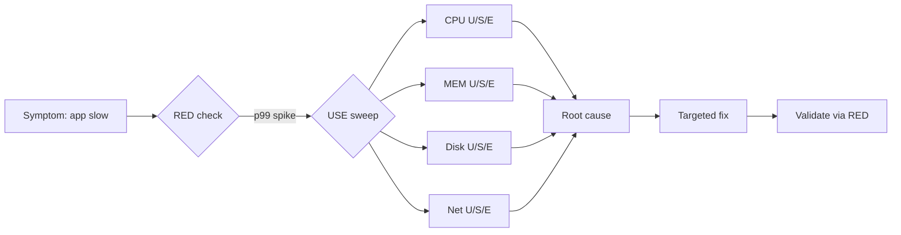
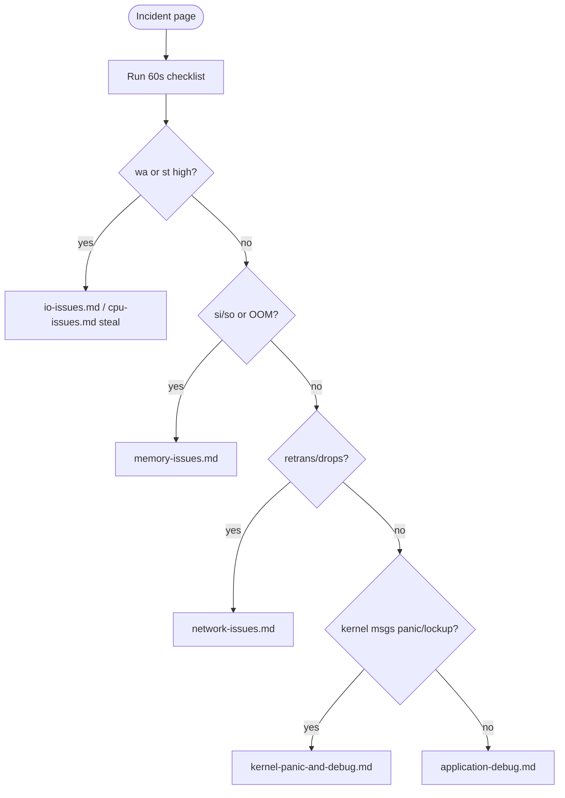

# Linux Deep Troubleshooting — Field Manual

> Symptom signature: A production Linux box is "slow", "stuck", "dropping requests", or "on fire". You need a repeatable, evidence-driven path from symptom to root cause in minutes — not hours. This module is the senior-engineer playbook for that.

This index ties together six topic runbooks plus the postmortem template. Each runbook follows the same skeleton: symptom -> diagnosis sequence -> 5-7 root causes -> fix -> prevent.

## Index

| File | When to open it |
|------|-----------------|
| [cpu-issues.md](cpu-issues.md) | Load avg climbing, CPU pegged, kernel time high, stolen ticks in VM |
| [memory-issues.md](memory-issues.md) | OOM-killer firing, swap thrashing, slab/cache bloat, THP stalls |
| [io-issues.md](io-issues.md) | `await` >50ms, queue depth saturated, fsync slow, fs corruption |
| [network-issues.md](network-issues.md) | Packet loss, retransmits, conntrack full, port exhaustion, MTU |
| [kernel-panic-and-debug.md](kernel-panic-and-debug.md) | Box rebooted, soft/hard lockups, hung tasks, kdump capture |
| [application-debug.md](application-debug.md) | App-level latency, syscall storms, leak hunts, eBPF tracing |
| [production-postmortem.md](production-postmortem.md) | After the fire — write the doc, ship the action items |

---

## The USE + RED Methodology

Two complementary lenses. Use **both** on every incident.

### USE (Brendan Gregg) — for resources
For every resource (CPU, memory, disk, network, interconnect), check three numbers:

| Letter | Meaning | Example signal |
|--------|---------|----------------|
| **U**tilization | % of time the resource was busy | CPU 100%, disk 95% |
| **S**aturation | Queued/waiting work it could not service yet | runqueue len 12, await 80ms |
| **E**rrors | Hard error counts | `ifconfig` RX-ERR, EDAC, SMART |

Saturation hurts before utilization does. A disk at 60% utilization with await=200ms is failing.

### RED (Tom Wilkie) — for services / requests
For every request-driven service:

| Letter | Meaning |
|--------|---------|
| **R**ate | requests/sec |
| **E**rrors | failed requests/sec |
| **D**uration | latency distribution (p50/p95/p99) |

**Rule:** USE explains *why* RED looks bad.

<!-- mermaid:rendered -->
<p align="center"></p>

<details><summary>Mermaid source</summary>



</details>
---

## The 60-Second Checklist

Brendan Gregg's classic. Run this **before** you touch anything else. You will solve 80% of incidents from this output alone.

```bash
uptime                        # load avg trend (1/5/15)
dmesg -T | tail -50           # recent kernel events (OOM, link flaps, EDAC)
vmstat -SM 1 5                # r/b queues, swap si/so, us/sy/wa/st
mpstat -P ALL 1 5             # per-CPU breakdown — find imbalance
pidstat 1 5                   # per-process CPU offenders
iostat -xz 1 5                # await, %util, svctm per device
free -m                       # MemAvailable, swap used
sar -n DEV 1 5                # NIC throughput + errors
sar -n TCP,ETCP 1 5           # active/passive opens, retransmits
top -b -n 1 | head -20        # top consumers snapshot
```

### What each line tells you

| Tool | Look for | Means |
|------|----------|-------|
| `uptime` | load > #CPUs and rising | Saturation building |
| `dmesg -T` | `Out of memory`, `blocked for 120s`, `Link is Down` | Hard event already happened |
| `vmstat` | `wa` high | I/O wait. `st` high = hypervisor steal |
| `vmstat` | `si/so` non-zero | Swapping — RAM is over |
| `mpstat` | one CPU 100%, others idle | Single-threaded bottleneck or IRQ pinned |
| `pidstat` | %CPU > 100 = multi-thread offender | Found the process |
| `iostat -xz` | `%util` 100, `await` >> `svctm` | Disk saturated, queue backed up |
| `free -m` | `available` < 10% of total | Cache pressure |
| `sar -n DEV` | rxerr/txerr/drop > 0 | NIC layer problem |
| `sar -n ETCP` | retrans/s rising | Network or peer overload |

<!-- mermaid:rendered -->
<p align="center"></p>

<details><summary>Mermaid source</summary>



</details>
---

## Tools required (install everywhere, day one)

```text
sysstat          # sar, iostat, mpstat, pidstat
procps           # vmstat, top, free, ps
util-linux       # dmesg, lsblk, lsipc
iproute2         # ss, ip, tc
nicstat          # NIC saturation
numactl          # NUMA layout
perf (linux-tools) # perf top, perf record
bpftrace / bcc   # eBPF one-liners
strace, ltrace   # syscall / library tracing
gdb              # process attach, core analysis
tcpdump, tshark  # wire-level
crash, kdump     # post-mortem kernel
fio, ioping      # storage benchmarks
stress-ng        # synthetic load
```

---

## Critical first-rule list (memorize)

1. **Capture before you cure.** `dmesg`, `ps auxf`, `ss -s`, `free`, `top -bn1` to a file in `/tmp` before any restart.
2. **Reproduce in a tight loop**, then attach tools — symptoms once-an-hour cannot be flame-graphed.
3. **One change at a time.** If you tune two sysctls and it gets better, you learned nothing.
4. **Saturation > utilization.** Queues kill latency long before CPUs hit 100%.
5. **Trust counters, distrust averages.** p99 lives where the mean cannot see.
6. **Always check the hypervisor layer in cloud** — `st%` in vmstat reveals noisy neighbours.
7. **`MemAvailable`, not `free`.** The latter has lied to ops engineers since 2014.
8. **`ss`, not `netstat`.** `ss -tan state established | wc -l` is faster and accurate.
9. **`journalctl --since "10 min ago" -p warning`** beats grepping logs.
10. **Write the incident timeline as it happens** — see [production-postmortem.md](production-postmortem.md).

---

## 20-Year Tips

> **Tip 1 — The 5-minute rule.** If you have not formed a hypothesis in 5 minutes, you are missing data. Stop typing, run the 60-second checklist again, and *read* it.
>
> **Tip 2 — Two terminals.** One pinned to `dmesg -wT` and `journalctl -f`, the other for investigation. Never close the first one during an incident.
>
> **Tip 3 — Latency != CPU.** Most "slow service" tickets are I/O or lock contention, not CPU. Always check `vmstat` `wa` and `b` columns first.
>
> **Tip 4 — `LANG=C` everywhere.** Locale parsing has bitten more shell pipelines than you would believe.
>
> **Tip 5 — Keep a `~/runbook/` of working one-liners.** Your future self at 3am will thank you.

## Common Interview Questions

> **Q1: Walk me through what you do in the first 60 seconds of a production Linux incident.**
> A: Run the USE checklist (`uptime`, `dmesg -T`, `vmstat`, `mpstat`, `pidstat`, `iostat -xz`, `free -m`, `sar -n DEV/TCP`, `top`). Read for the dominant signal — wa, st, si/so, retrans, OOM. Form a hypothesis, drill into the matching runbook.
>
> **Q2: Difference between USE and RED methodologies?**
> A: USE is resource-oriented (Utilization, Saturation, Errors per resource). RED is service-oriented (Rate, Errors, Duration per request). USE explains *why* RED looks bad.
>
> **Q3: Why prefer `MemAvailable` over `free`?**
> A: `free` does not account for reclaimable cache and slab. `MemAvailable` (added 2014, kernel 3.14) is the kernel's own estimate of what a new workload can allocate without swapping. It is the correct metric.
>
> **Q4: `vmstat` shows `st` = 30. What is happening?**
> A: 30% of CPU cycles were stolen by the hypervisor — your VM was descheduled while wanting CPU. Noisy neighbour or oversubscribed host. Move workload, complain to provider, or buy reserved/dedicated capacity.
>
> **Q5: Saturation vs utilization, with example.**
> A: Disk at 60% util with await 200ms is *saturated* — queue depth is high, requests wait. Disk at 100% util with await 2ms is just busy. Saturation kills latency; utilization is just an accounting number.
>
> **Q6: Why `ss` over `netstat`?**
> A: `ss` reads from netlink (`/proc/net/tcp_diag`), netstat parses `/proc/net/tcp`. On a box with 100k sockets `netstat` takes minutes; `ss` returns instantly.
>
> **Q7: You see load avg 50 on a 4-core box but CPUs are 20% idle. Explain.**
> A: Load average counts runnable + uninterruptible (D-state) tasks. High load with low CPU = many tasks blocked on I/O or locks. Check `ps -eo state,pid,cmd | awk '$1=="D"'`.
