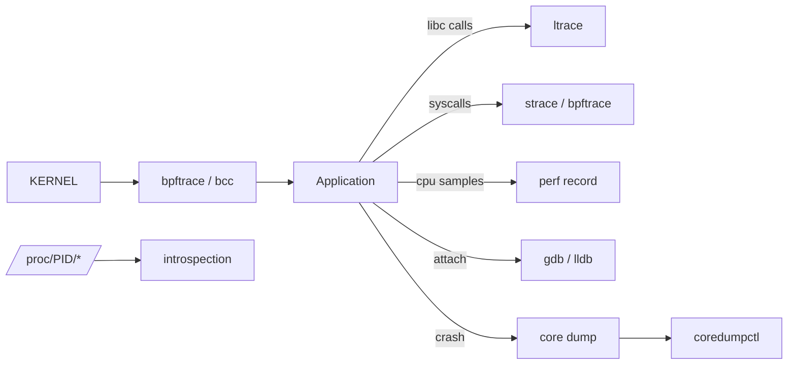

# Application Debug — strace, perf, gdb, eBPF

> **Symptom signature**: Service is "slow" but the host is healthy (CPU/IO/network normal); a process is stuck and not consuming CPU; intermittent 5-second pauses; segfault with no useful error; FD leak (`Too many open files`); unexplained syscall storm in `top`'s `%sy` column; need to trace one specific request through one specific PID without restarting it.

This is the level where you stop blaming infra and prove what the application actually does — at the syscall, library and instruction level — without changing the binary.

## Where each tool plugs in

<!-- mermaid:rendered -->
<p align="center"></p>

<details><summary>Mermaid source</summary>



</details>
## Decision tree

```mermaid
flowchart TD
  S[App misbehaving] --> Q1{using CPU?}
  Q1 -->|yes 100%| PERF2[perf top / flame graph]
  Q1 -->|no, but stuck| Q2{in D-state?}
  Q2 -->|yes| WCH[/proc/PID/wchan + stack]
  Q2 -->|no, S-state| Q3{which syscall?}
  Q3 --> STR[strace -p -f -tt]
  Q1 -->|crashed| Q4{core dump?}
  Q4 -->|yes| CD[coredumpctl + gdb]
  Q4 -->|no| EN[Enable cores: ulimit, sysctl]
  S --> Q5{leaking FDs?}
  Q5 -->|yes| FDS[/proc/PID/fd]
  S --> Q6{need prod-safe trace?}
  Q6 -->|yes| BPF[bpftrace / bcc]
```

## Tools required

```text
strace -fttT -p PID -e trace=...
ltrace -p PID
gdb -p PID                         # attach without restart
gcore PID                          # snapshot core without killing
coredumpctl list / info / debug
perf record -F 99 -p PID -g -- sleep 30
perf script | stackcollapse-perf.pl | flamegraph.pl
bpftrace -e '...'
bcc-tools: execsnoop opensnoop tcpconnect biolatency funccount
ls -l /proc/PID/{maps,status,fd,limits,wchan,stack,smaps_rollup}
lsof -p PID
pmap -X PID
pstack PID                         # quick user-stack
ss -tnp                            # PID-attributed sockets
```

## Diagnosis sequence

1. **/proc snapshot first — never starts with strace.**
   ```bash
   ls -l /proc/<PID>/exe                 # binary
   cat /proc/<PID>/status | head -20     # state, threads, RSS, ctx switches
   cat /proc/<PID>/limits                # FD limit, mem limit
   cat /proc/<PID>/wchan                 # if S/D state, kernel function it's waiting on
   cat /proc/<PID>/stack                 # kernel-side stack (root only)
   ls /proc/<PID>/fd | wc -l             # FD count
   cat /proc/<PID>/smaps_rollup          # RSS/PSS/Swap rollup
   ```

2. **Quick user-stack (no attach pause).**
   ```bash
   pstack <PID>                          # or: gdb -batch -ex 'thread apply all bt' -p <PID>
   ```

3. **strace — the right way (don't strace -e read,write a busy server).**
   ```bash
   strace -fttT -p <PID> -e trace=!futex,clock_gettime -o /tmp/s.log
   # → -f follow forks/threads; -tt timestamps; -T syscall duration
   # → exclude noisy syscalls; analyse with awk on the log
   awk -F'<' '{print $2}' /tmp/s.log | sort -n | tail
   ```
   **Warning**: strace doubles or triples syscall latency via PTRACE. Do not run on a tight prod loop without a maintenance window. Prefer bpftrace for prod.

4. **bpftrace one-liners — production-safe.**
   ```bash
   # Slow opens > 10ms
   bpftrace -e 'tracepoint:syscalls:sys_enter_openat /pid==PID/ { @s[tid]=nsecs; }
                tracepoint:syscalls:sys_exit_openat  /@s[tid]/ { $d=(nsecs-@s[tid])/1e6; if ($d>10){printf("%d ms\n",$d);} delete(@s[tid]); }'

   # Top syscalls per second
   bpftrace -e 'tracepoint:raw_syscalls:sys_enter /pid==PID/ { @[probe]=count(); } interval:s:1 { print(@); clear(@); }'

   # File-open snoop
   opensnoop-bpfcc -p PID

   # Latency histogram for a function
   funclatency-bpfcc -p PID 'libc:read'
   ```

5. **perf record + flame graph (CPU work).**
   ```bash
   perf record -F 99 -p <PID> -g --call-graph dwarf -- sleep 30
   perf script | stackcollapse-perf.pl | flamegraph.pl > /tmp/fg.svg
   # → for JIT (Java/Node): use perf-map-agent or --jit
   ```

6. **Attach gdb without killing the process.**
   ```bash
   gdb -p <PID>
   (gdb) thread apply all bt          # all threads
   (gdb) info threads
   (gdb) thread N
   (gdb) bt full
   (gdb) detach                        # release the process!
   ```

7. **Snapshot a core without ending the process.**
   ```bash
   gcore -o /tmp/snapshot <PID>
   gdb /path/to/binary /tmp/snapshot.<PID>
   ```

8. **Crashed? Capture the core.**
   ```bash
   # Enable cores once
   ulimit -c unlimited
   sysctl -w kernel.core_pattern='|/usr/lib/systemd/systemd-coredump %P %u %g %s %t %c %h'
   # Inspect via systemd-coredump
   coredumpctl list
   coredumpctl info <PID>
   coredumpctl debug <PID>            # opens gdb on the core
   ```

9. **FD leak hunt.**
   ```bash
   ls -l /proc/<PID>/fd | awk '{print $NF}' | sort | uniq -c | sort -nr | head
   # → spot 10000 sockets to one IP, or 5000 open files in /tmp
   ```

10. **Library calls (ltrace).**
    ```bash
    ltrace -p <PID> -e 'malloc+free+ssl_*' 2>&1 | head -200
    ```

## Reading `/proc/<PID>/` like a pro

| File | What it tells you |
|------|-------------------|
| `status` | State (R/S/D/Z/T), Threads, VmRSS, ctxt_switches |
| `wchan` | The kernel function the task is sleeping in (if not R) |
| `stack` | Kernel-side stack (CONFIG_STACKTRACE) — needs root |
| `fd/` | Every open FD, symlink to file/socket/pipe |
| `fdinfo/<n>` | Position, flags per FD; for epoll, the watched FDs |
| `maps` | Virtual memory map (libs, stack, heap) |
| `smaps_rollup` | One-shot RSS/PSS/Swap totals |
| `limits` | rlimits the process inherited |
| `cgroup` | Which cgroup it belongs to |
| `io` | bytes read/written, syscalls (since start) |
| `sched` | Scheduler stats: runtime, wait, slices |
| `net/` | Per-process /proc/net view (in netns) |

## Root causes

### 1. App stuck in a single syscall (D-state)
**Confirm**: `cat /proc/<PID>/wchan` returns e.g. `nfs_wait_on_request` or `io_schedule`. `pstack` shows the user call leading there.
**Fix**: Resolve the underlying I/O / NFS / lock. App-side, set timeouts on the offending operation.

### 2. Hot syscall loop
**Confirm**: `top` shows `%sy` high. `strace -c -p PID` (run for 10s, Ctrl-C) shows millions of `gettimeofday`/`epoll_wait` with timeout=0.
**Fix**: Patch app — busy-poll → blocking wait; use vDSO for time; longer epoll timeout.

### 3. FD leak / `Too many open files`
**Confirm**: `ls /proc/PID/fd | wc -l` rising; eventually `accept(): EMFILE` in app log.
**Fix**: Find leaker via FD type breakdown above. Patch close() in the right place. Until then, `prlimit --pid <PID> --nofile=65536:65536` to raise live limit.

### 4. Memory leak (slow heap growth)
**Confirm**: RSS grows linearly. `pmap -X PID` shows heap segment growing. Heap profiler (`pprof`, `valgrind --tool=massif`, `jemalloc MALLOC_CONF=prof:true`) confirms allocation site.
**Fix**: Patch leak. Workaround: periodic restart via systemd `MemoryHigh=`.

### 5. Lock contention (futex storm)
**Confirm**: `perf top` shows `__lll_lock_wait` or `pthread_mutex_lock` high. `strace -c` shows `futex` dominant, with high latency.
**Fix**: Profile contended lock; sharding/striping; switch to lock-free DS where possible.

### 6. Segfault with no symbols
**Confirm**: `coredumpctl info` shows `Signal: 11 (SEGV)` but `gdb` backtrace = `??`.
**Fix**: Install debug symbols (`debuginfo-install <pkg>` / `dnf debuginfo-install`); rebuild app with `-g`; for stripped vendor binaries, ask vendor for debuginfo package.

### 7. Library mismatch / LD_PRELOAD surprise
**Confirm**: `cat /proc/<PID>/maps | grep -v deleted | awk '{print $NF}' | sort -u` shows unexpected libs (e.g. an old `libssl.so.1.0.0` resolved instead of system one). `ldd /path/to/binary` differs from runtime maps.
**Fix**: Clean `LD_LIBRARY_PATH`, remove rogue `LD_PRELOAD`, rebuild with proper rpath, or containerize to freeze the lib graph.

## Production-safe trace cheatsheet (eBPF)

```bash
execsnoop-bpfcc        # every exec() — debug cron storms
opensnoop-bpfcc        # every open(), see config-file paths
tcpconnect-bpfcc       # every outbound TCP
tcpaccept-bpfcc        # every inbound TCP
biolatency-bpfcc       # disk latency histogram
runqlat-bpfcc          # scheduler latency
profile-bpfcc -F 99 -p PID 30   # flame graph data
funccount-bpfcc 'tcp_sendmsg'   # count function calls
argdist-bpfcc -C 'p::vfs_read():u32:$PID'   # per-PID vfs_read count
```

These have <1% overhead and are safe on production. strace is a debugger; bpftrace is an observer.

## Prevent

- Build apps with debug symbols stripped to a separate `*-debuginfo` package, not deleted.
- Default `LimitNOFILE=65536` in systemd units for any networked daemon.
- Configure systemd-coredump (RHEL 8+/Ubuntu 22+); cores land in `/var/lib/systemd/coredump/` with metadata.
- Ship `coredumpctl info` summaries to incident channel automatically.
- For latency-sensitive services, baseline syscall mix with `strace -c` in stage; alert if prod drifts.
- Use cgroup v2 `pids.max` to prevent runaway fork bombs.
- Add a `bpftrace` toolbox container or sidecar for k8s nodes — debugging-as-code.
- Ban `strace` on hot paths in production runbooks. Default to bpftrace.

> ### 20-Year Tips
> - **`/proc` first, tools second.** Half the answers are in `/proc/<PID>/{status,wchan,stack,limits,fd}` — and reading them takes zero CPU.
> - **`gcore` is criminally underused.** Snapshot a misbehaving prod process to a core file, restart, debug offline. The user never knew.
> - **strace doubles latency.** Doc this in your runbooks. People keep stracing the database and wondering why p99 went up.
> - **Always `detach` from gdb.** Forgetting `detach` leaves the process stopped. I once paged myself at 3am for a process I was debugging at 11pm.
> - **Symbols matter more than tools.** A flame graph of `[unknown]` boxes is useless. Spend the upfront cost on debuginfo.
> - **`coredumpctl debug` is the modern way** — handles decompression, sym lookup, and gdb invocation in one command.
> - **bpftrace one-liners > custom collectors.** A 30-character bpftrace replaces hours of dashboard work for one-off questions.
> - **`pidstat -w 1`** shows context-switch rate per process. A daemon doing 10k cs/sec is futex-thrashing — investigate before scaling.

> ### Common Interview Questions
> **Q1: Difference between strace and ltrace?**
> A: strace traces syscalls (kernel boundary). ltrace traces dynamic library calls (libc and friends). Both use PTRACE and add overhead.
>
> **Q2: Why prefer bpftrace over strace in production?**
> A: bpftrace runs in-kernel via eBPF, attaches to tracepoints/kprobes — sub-percent overhead. strace uses PTRACE which stops the process at every syscall, easily 2-5x latency.
>
> **Q3: How do you read `/proc/<PID>/wchan`?**
> A: It's the kernel function name the task is currently sleeping in. e.g. `futex_wait_queue_me` = blocked on futex; `nfs_wait_on_request` = NFS RPC pending; `io_schedule` = block I/O.
>
> **Q4: Process is stuck. Without restarting it, how do you find out why?**
> A: `cat /proc/PID/wchan` and `/proc/PID/stack` for kernel side. `pstack PID` or attach gdb for user side. `strace -p` if active syscalls. Detach from gdb when done.
>
> **Q5: How do you enable core dumps system-wide?**
> A: `ulimit -c unlimited`, `sysctl kernel.core_pattern`, ensure `/proc/sys/kernel/core_uses_pid=1` or use systemd-coredump pipe. For services in systemd: `LimitCORE=infinity`.
>
> **Q6: A Java process leaks FDs. How do you find which FDs?**
> A: `ls -l /proc/PID/fd` and group by symlink target — sockets, files, pipes. `lsof -p PID -nP` for nicer view. Then `jstack` or `jcmd PID Thread.print` to map open FDs to Java code paths.
>
> **Q7: Difference between `gcore` and `coredumpctl`?**
> A: `gcore` snapshots a live process into a core file without killing it. `coredumpctl` manages cores produced by crashes (systemd-coredump pipe).
>
> **Q8: How would you find which process is opening a specific file?**
> A: `bpftrace -e 'tracepoint:syscalls:sys_enter_openat /str(args->filename)=="/etc/hosts"/ { printf("%d %s\n", pid, comm); }'`. Or `opensnoop-bpfcc -n /etc/hosts`.
