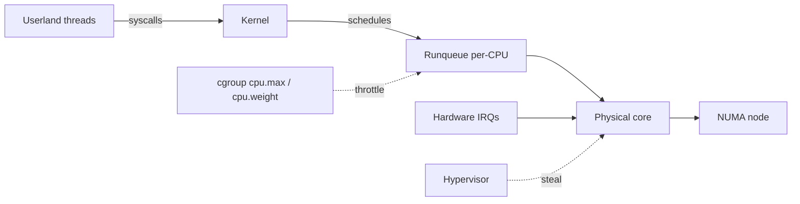
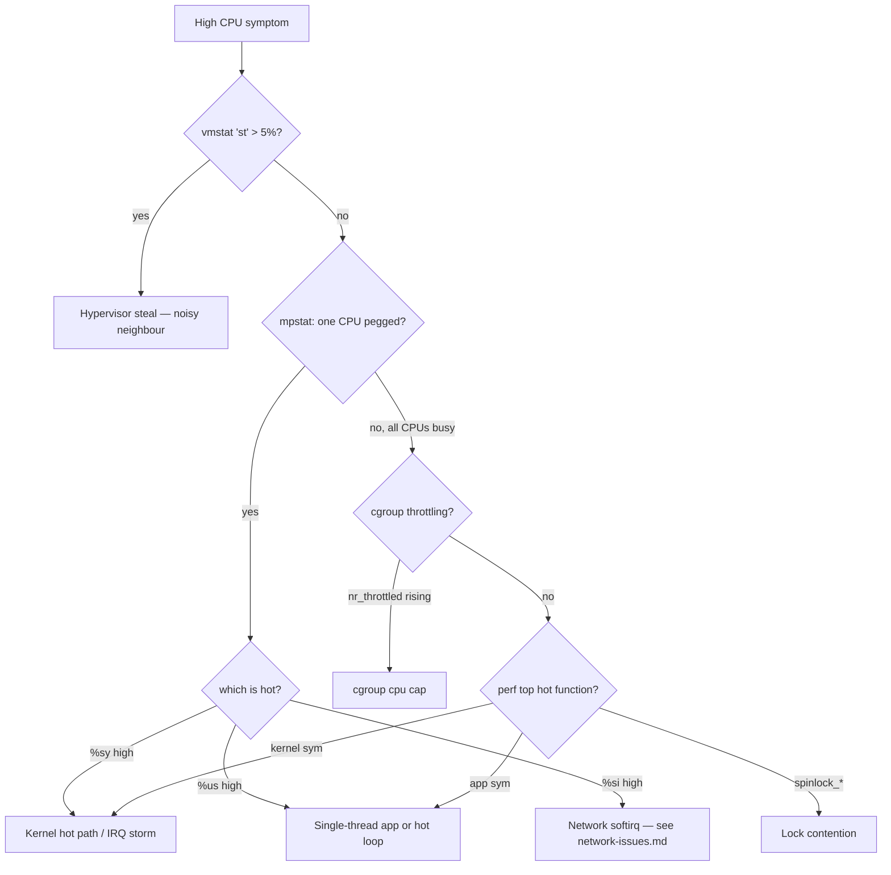

# CPU Issues — Deep Troubleshooting

> **Symptom signature**: Load average above #CPUs and rising; one or more cores pegged at 100%; `top` shows %sy or %si dominant; user-facing latency rises despite "no traffic increase"; in a VM, `vmstat` shows `st` > 5%; `perf top` shows a single function in the top 1%; an app that used to take 100ms now takes 2s with no code change.

If you see *high load average* but `top` shows the CPUs are mostly idle — you have an I/O or lock problem, not a CPU problem. Jump to [io-issues.md](io-issues.md). Load avg counts D-state tasks.

## CPU layer involved

<!-- mermaid:rendered -->
<p align="center"></p>

<details><summary>Mermaid source</summary>



</details>
## Diagnosis decision tree

<!-- mermaid:rendered -->
<p align="center"></p>

<details><summary>Mermaid source</summary>



</details>
## Tools required

```text
mpstat -P ALL 1            # per-CPU breakdown
pidstat -tu 1              # per-thread CPU
perf top -F 99             # 99Hz live profile
perf record -F 99 -ag -- sleep 30 && perf report
flamegraph.pl              # https://github.com/brendangregg/FlameGraph
turbostat                  # frequency, C-states, package power
numastat -p PID            # NUMA hits/misses
chrt, taskset              # priorities and affinity
systemd-cgtop              # cgroup CPU usage
cat /sys/fs/cgroup/<...>/cpu.stat   # nr_throttled, throttled_usec
```

## Diagnosis sequence

1. **Confirm it is CPU and not I/O.**
   ```bash
   vmstat -SM 1 5
   # → expect: r > #CPUs, b small, wa low, st small. If wa high → I/O.
   ```

2. **Identify CPU imbalance.**
   ```bash
   mpstat -P ALL 1 3
   # → if CPU0 = 100% and others idle → IRQ pinning or single thread on that core
   ```

3. **Find the offending PID and thread.**
   ```bash
   pidstat -tu 1 5 | sort -k8 -nr | head
   # → TID with > 90% is a hot thread; PID with > 100% spans many cores
   ```

4. **Live profile with perf.**
   ```bash
   perf top -F 99 -p <PID>
   # → top function = hot path. If [kernel.kallsyms] dominates → syscall storm
   ```

5. **Capture a flame graph (30s).**
   ```bash
   perf record -F 99 -p <PID> -g -- sleep 30
   perf script | stackcollapse-perf.pl | flamegraph.pl > /tmp/fg.svg
   # → open in browser, inverted icicles → wide bars are hot
   ```

6. **Check hypervisor steal (if VM).**
   ```bash
   vmstat 1 5 | awk 'NR>2 {print $16}'
   # → column 'st'. > 5% sustained = noisy neighbour
   ```

7. **Check cgroup throttling.**
   ```bash
   cat /sys/fs/cgroup/system.slice/<unit>/cpu.stat
   # → nr_throttled increasing = cgroup cap hit
   ```

8. **NUMA misses?**
   ```bash
   numastat -p <PID>
   # → other_node high = remote-memory accesses, ~3x slower
   ```

## Root causes

### 1. Single-threaded hot loop in app
**Confirm**: `pidstat -t` shows one TID at 99-100%, others idle. `perf top` shows a tight loop in app symbols.
**Fix**: Profile and parallelise; offload regex/JSON parsing; cache results; check for accidental N+1 in serialization.

### 2. Kernel softirq storm (NET_RX)
**Confirm**: `mpstat` shows %si > 30 on one CPU. `cat /proc/softirqs | grep NET_RX` shows runaway counter on one column.
**Fix**: Enable RPS/RSS to spread softirq across CPUs:
```bash
echo ffff > /sys/class/net/eth0/queues/rx-0/rps_cpus
ethtool -L eth0 combined 8
```
Move IRQ affinity off CPU0 (`/proc/irq/<N>/smp_affinity`).

### 3. Hypervisor CPU steal (VM noisy neighbour)
**Confirm**: `vmstat` `st` > 5% sustained; `mpstat` shows %steal on multiple cores.
**Fix**: Migrate VM to a different host, request dedicated tenancy, or move to compute-optimised instance class. There is no in-guest fix.

### 4. cgroup CPU throttling (k8s `cpu.limits`)
**Confirm**:
```bash
cat /sys/fs/cgroup/<pod>/cpu.stat | grep -E 'nr_throttled|throttled_usec'
```
Both rising. Pod sees latency spikes every ~100ms (CFS quota period).
**Fix**: Raise `cpu.limits` or remove the limit (keep `requests`); switch to `cpuManagerPolicy: static` for latency-sensitive pods; use cgroup v2 with `cpu.max burst` (5.14+).

### 5. CPU pinning gone wrong
**Confirm**: `taskset -cp <PID>` shows narrow mask; `mpstat` shows pinned core saturated while others idle. Often after `numactl --physcpubind` script.
**Fix**: Re-balance affinity; use `--cpunodebind` (NUMA node) instead of `--physcpubind` (specific CPUs) unless you really mean to pin.

### 6. Frequency scaling / C-state stuck low
**Confirm**: `turbostat --interval 1` shows Bzy_MHz << base clock under load; `cat /sys/devices/system/cpu/cpu0/cpufreq/scaling_governor` = `powersave`.
**Fix**:
```bash
cpupower frequency-set -g performance
# or per-core: echo performance > /sys/.../scaling_governor
```
For latency-critical workloads disable deep C-states: `intel_idle.max_cstate=1` on kernel cmdline.

### 7. Lock contention (spin/futex)
**Confirm**: `perf top` shows `osq_lock`, `__lll_lock_wait`, `futex_wait`, or `_raw_spin_lock` in top 5.
**Fix**: Reduce contention granularity (per-shard locks); check pgbouncer / connection-pool settings; for kernel locks, often a kernel upgrade fixes (e.g. inode_hash_lock improvements in 5.x).

## Fix patterns table

| Cause | Quick fix | Real fix |
|-------|-----------|----------|
| Hot loop | scale horizontally | profile + algorithm change |
| Softirq storm | RPS, IRQ affinity | NIC with multiqueue, XDP |
| Steal | restart on different host | dedicated/reserved capacity |
| cgroup throttle | raise limit | static CPU manager + correct sizing |
| Bad pinning | unset taskset | NUMA-aware scheduling |
| Powersave gov | `performance` governor | BIOS perf profile + tuned-adm |
| Lock contention | smaller batch sizes | sharding + lockless data structures |

## Prevent

- **Monitoring SLOs**: alert on `node_cpu_seconds_total{mode="steal"} > 5%`, `container_cpu_cfs_throttled_periods_total` ratio > 5%.
- **Always set `cpu.requests` in k8s**, but be very careful with `cpu.limits` for latency-sensitive workloads — many shops drop limits entirely on critical paths.
- Default to `cpufreq governor=performance` on bare metal DB hosts.
- Pin IRQs off CPU0 by default. Reserve CPU0 for OS housekeeping on busy NICs.
- Run `tuned-adm profile throughput-performance` (or `latency-performance`) per workload class.
- Keep kernel ≥ 5.10 for modern scheduler fixes (CFS bandwidth bug pre-5.4 caused phantom throttling).

> ### 20-Year Tips
> - **The CFS throttling trap**: pods with CPU limits and bursty traffic get throttled even at 30% average usage. The kernel pre-5.4 had a bug where unused quota was not preserved across periods. Either remove limits on latency-critical pods or use cgroup v2 with `cpu.max burst`.
> - **`%si` on one core only**: classic single-NIC-queue with IRQ pinned to CPU0. Enable RSS in NIC driver, then RPS in software, before buying bigger hardware.
> - **Don't trust `%us` for noisy neighbour**: in cloud VMs, `%us` looks normal while `%steal` quietly eats your latency budget. Monitor `st` always.
> - **Flame graph reads bottom-up**: bottom = on-CPU function, width = time spent. A flat-topped wide tower is your bottleneck — fix from the top.
> - **NUMA misses are silent**: a process that fits in one socket's RAM but is scheduled across both will run 2-3x slower. Use `numactl --cpunodebind=0 --membind=0` for DBs.

> ### Common Interview Questions
> **Q1: Difference between load average and CPU utilization.**
> A: Load avg = runnable + uninterruptible-sleep tasks averaged over 1/5/15 min. CPU util = % time CPU was non-idle. High load with low CPU util = tasks blocked on I/O or locks (D-state).
>
> **Q2: How do you find which thread inside a process is burning CPU?**
> A: `pidstat -t -p <PID> 1` or `top -H -p <PID>`. The TID column maps to `/proc/<PID>/task/<TID>/`. For Java, then map TID to Java thread via `jstack` and look for `nid=0x<hex of TID>`.
>
> **Q3: What is CPU steal and how do you mitigate it?**
> A: `st` in vmstat — % of cycles the hypervisor took away while the guest wanted CPU. No in-guest fix. Mitigations: move host, buy dedicated, smaller VM with full pinning.
>
> **Q4: A pod has `cpu.limits=2` and is being throttled at 1.2 cores average. Why?**
> A: CFS quota is allocated per 100ms period. A bursty workload that uses 2 cores for 60ms then idle gets throttled in that period despite low average. Fix: raise limit, remove limit, or use cpu burst (cgroup v2, kernel 5.14+).
>
> **Q5: How would you generate a flame graph?**
> A: `perf record -F 99 -g -p <PID> -- sleep 30 && perf script | stackcollapse-perf.pl | flamegraph.pl > out.svg`. Read width = time, bottom-up = call stack.
>
> **Q6: Your DB box has cpufreq governor `powersave`. Impact?**
> A: CPU stays at base clock or below; latency-critical syscalls take 2-3x longer to reach turbo. Switch to `performance` governor and disable deep C-states for sub-ms response.
>
> **Q7: How do RPS, RFS and RSS differ?**
> A: RSS = NIC hardware spreads RX queues across CPUs (best). RPS = software emulation when NIC has one queue. RFS = RPS but routes flows to the CPU running the consumer process (cache-friendly).
>
> **Q8: `perf top` shows `_raw_spin_lock` at 30%. Where do you go next?**
> A: That is kernel lock contention. `perf record -ag` then look at the parent functions of the spinlock to identify the subsystem (often inode_hash_lock, mm or networking). Often resolved by kernel upgrade or by reducing concurrency granularity (e.g. smaller batch sizes, more shards).
