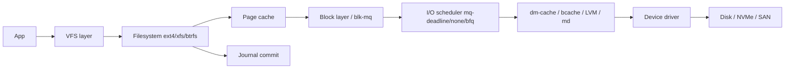
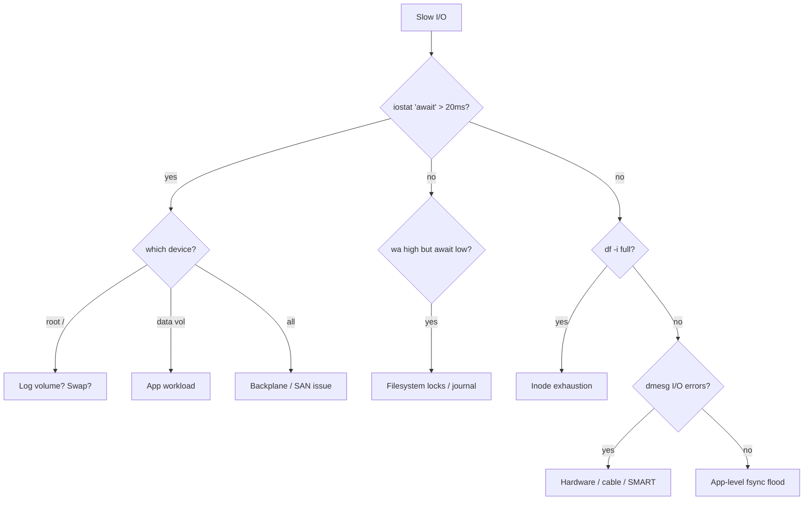

# I/O Issues — Deep Troubleshooting

> **Symptom signature**: `iostat -x` shows `await` > 50ms or `%util` pinned at 100%; `vmstat` `wa` > 30%; load avg high but CPUs 70% idle (D-state tasks); fsync taking seconds; database WAL writes stalling; `dmesg` shows `task X blocked for more than 120 seconds`; `df -i` shows inodes near 100%; mount returns `read-only filesystem` after a power event.

I/O is where averages mislead the most. A device at "60% util" with 200ms await is dying. Always look at await + queue depth, not %util alone.

## I/O stack involved

<!-- mermaid:rendered -->
<p align="center"></p>

<details><summary>Mermaid source</summary>



</details>
## Diagnosis decision tree

<!-- mermaid:rendered -->
<p align="center"></p>

<details><summary>Mermaid source</summary>



</details>
## Tools required

```text
iostat -xz 1               # extended per-device, skip idle
iotop -oP                  # per-process I/O (only active)
pidstat -d 1               # per-process kB_rd/wr
biolatency-bpfcc           # BPF: I/O latency histogram
biosnoop-bpfcc             # BPF: per-I/O trace
blktrace -d /dev/sda -o trace; blkparse trace.* 
fio --name=test --rw=randread --bs=4k --iodepth=32 --runtime=30
ioping -c 10 /var/lib/data # quick latency probe
lsblk -o NAME,ROTA,DISC-MAX,SCHED,SIZE
cat /sys/block/sda/queue/scheduler
cat /sys/block/sda/queue/nr_requests
smartctl -a /dev/sda       # device health
xfs_info / xfs_repair
fsck -y /dev/sdX           # ext family
```

## Diagnosis sequence

1. **Confirm I/O is the bottleneck.**
   ```bash
   vmstat -SM 1 5
   # → wa column dominant (>20%) AND b column non-zero = I/O wait
   ```

2. **Find the bad device.**
   ```bash
   iostat -xz 1 5
   # → expect: await ~ svctm; r_await + w_await reveal which direction
   # → bad: await > 50ms, %util 100%, aqu-sz growing
   ```

3. **Interpret iostat -x columns.**

   | Column | Healthy | Bad |
   |--------|---------|-----|
   | `r/s`, `w/s` | Workload-dependent | Sudden 10x jump |
   | `rkB/s`, `wkB/s` | Below disk's spec | Saturating bandwidth |
   | `aqu-sz` | < `nr_requests`/2 | Pinned at max |
   | `await` | < 20ms HDD, < 5ms SSD, < 1ms NVMe | > 50ms = saturated |
   | `r_await` vs `w_await` | Comparable | Asymmetric = read or write only saturated |
   | `%util` | < 70% | 100% sustained — saturated (ignore on multi-queue NVMe) |

   Note: `%util` is unreliable on multi-queue NVMe — a single queue at 100% can leave others idle. Trust `await` and `aqu-sz` instead.

4. **Identify the offending process.**
   ```bash
   iotop -oPa             # -o only-with-IO, -P process not thread, -a accumulated
   pidstat -d 1 5
   # → kB_wr/s columns reveal write-heavy processes
   ```

5. **BPF-level latency histogram (no overhead).**
   ```bash
   biolatency-bpfcc 5 1
   # → bimodal distribution = mix of cache hits and disk seeks
   ```

6. **Per-I/O trace (high overhead, short bursts).**
   ```bash
   biosnoop-bpfcc | head -50
   # → see exact PID/file/latency per I/O
   ```

7. **Filesystem-layer freezes.**
   ```bash
   dmesg -T | grep -E 'blocked for more than 120|hung_task'
   # → kernel hung-task detector. Often journal commit stuck.
   ```

8. **Inode and free space.**
   ```bash
   df -h && df -i
   # → 100% inodes is silent: no errors until you try to create a file
   ```

9. **Hardware health.**
   ```bash
   smartctl -H /dev/sda
   smartctl -a /dev/sda | grep -E 'Reallocated|Pending|Uncorrectable|Temperature'
   # → Reallocated_Sector_Ct rising = drive failing
   ```

## Root causes

### 1. Disk saturated by single workload (write storm)
**Confirm**: `iotop` shows one PID dominant; `iostat` `aqu-sz` pinned; `await` 100ms+.
**Fix**: Throttle the offender via cgroup v2 io.max:
```bash
echo "8:0 wbps=10485760" > /sys/fs/cgroup/<cg>/io.max  # 10 MB/s write cap
```
Or fix the app — buffered writes, batched flushes, lower checkpoint frequency in DB.

### 2. Wrong I/O scheduler
**Confirm**: `cat /sys/block/sdX/queue/scheduler` shows `[bfq]` on a fast NVMe — adds CPU + latency. Or `[mq-deadline]` on rotational with no fairness.
**Fix**:
```bash
echo none      > /sys/block/nvme0n1/queue/scheduler   # NVMe
echo mq-deadline > /sys/block/sda/queue/scheduler     # SATA SSD/HDD
```
Persist via udev rule.

### 3. nr_requests / queue depth too low
**Confirm**: `aqu-sz` exactly at `nr_requests`, throughput well below device max.
**Fix**:
```bash
echo 1024 > /sys/block/nvme0n1/queue/nr_requests
```
Test with fio. Don't set blindly above 2048.

### 4. Filesystem journal contention
**Confirm**: ext4: `jbd2/sdaX-8` process at top of `iotop`. fsync latency > 1s. `dmesg` hung tasks reference `jbd2_log_wait_commit`.
**Fix**: Mount `data=writeback,nobarrier` only with battery-backed cache; better: separate journal device:
```bash
mkfs.ext4 -O ^has_journal /dev/data        # external
tune2fs -O has_journal -J device=/dev/sdj1 /dev/data
```
For XFS, increase log size at mkfs (`-l size=512m`) and use `logbsize=256k` mount option.

### 5. bcache / dm-cache / LVM-cache backing-device starvation
**Confirm**: `bcache-status` shows `cache_hit_ratio` < 50%; backing HDD at 100% util while cache SSD idle.
**Fix**: Tune sequential cutoff (`echo 0 > /sys/block/bcache0/bcache/sequential_cutoff`); switch mode to `writeback`; or accept that working set exceeds cache and add SSD capacity.

### 6. ext4/xfs corruption
**Confirm**: `dmesg` shows `EXT4-fs error`, `XFS: Corruption detected`, mount remounted read-only. Read errors with no SMART issue point to FS, not disk.
**Fix (ext4)**:
```bash
umount /dev/sdX1
e2fsck -fy /dev/sdX1
# if super block bad: e2fsck -b 32768 /dev/sdX1
```
**Fix (xfs)**:
```bash
umount /dev/sdX1
xfs_repair /dev/sdX1
# if log corrupt: xfs_repair -L /dev/sdX1   # DESTRUCTIVE
```
**Always image first**: `dd if=/dev/sdX of=/backup/image.dd bs=4M conv=noerror,sync`.

### 7. Inode exhaustion
**Confirm**: `df -i` shows 100% on a partition. `touch /mnt/x` returns `No space left on device` despite `df -h` showing free space.
**Fix**: Find directory with most files:
```bash
sudo find /var -xdev -type d -printf '%p %k\n' | sort -k2 -n | tail
```
Delete or archive. For ext4, inode count is fixed at mkfs time — re-mkfs with `-N` for higher count, or switch to xfs (dynamic inodes).

## Prevent

- I/O scheduler udev rule per device class:
  ```
  ACTION=="add|change", KERNEL=="nvme*", ATTR{queue/scheduler}="none"
  ACTION=="add|change", KERNEL=="sd*",  ATTR{queue/rotational}=="0", ATTR{queue/scheduler}="mq-deadline"
  ```
- Set `nr_requests=1024` on NVMe via tuned profile.
- Mount options: `noatime,nodiratime` everywhere unless mail spool. Add `discard=async` (kernel ≥5.6) for SSDs or schedule weekly `fstrim -av`.
- Monitor: `node_disk_io_time_weighted_seconds_total` rate > 0.5 = saturation; SMART `reallocated_sector_count` > 0 = pre-failure alert.
- Run `fio` benchmark on every new host before production:
  ```bash
  fio --name=baseline --rw=randwrite --bs=4k --iodepth=32 --runtime=60 --filename=/data/test
  ```
  Save the JSON to compare degradation over time.
- Always-on `smartd`. Replace any SMART warning drive within a maintenance window.
- For DBs: separate WAL/journal volume from data volume.

> ### 20-Year Tips
> - **`%util` lies on NVMe.** Multi-queue devices report 100% if any queue is busy. Trust `await` and IOPS vs spec.
> - **fsync is the silent killer.** Most "DB slow" tickets are fsync latency. Test with `pg_test_fsync` (Postgres) or `mongoperf`.
> - **Always image before fsck.** A failed `xfs_repair -L` can lose terabytes. `dd | gzip > image.gz` or LVM snapshot first.
> - **Separate journal devices** for ext4/xfs on write-heavy workloads. The journal becomes the bottleneck before the data area does.
> - **`blktrace` is the truth.** When iostat lies and BPF is too high-level, blktrace shows you every single I/O with timestamps and queue position. Use sparingly — it's expensive.
> - **Trim or weep**: SSDs without weekly `fstrim` slow down by 30-50% over months. Enable `fstrim.timer` always.
> - **NUMA + I/O**: an NVMe on PCIe attached to socket 0 with workload pinned to socket 1 sees 2x latency. `lspci -vvv` shows NUMA node; pin workload accordingly.

> ### Common Interview Questions
> **Q1: How do you read `iostat -x`?**
> A: Focus on `await` (avg latency) vs `svctm`/IOPS spec. `aqu-sz` shows queue depth — pinned at `nr_requests` = saturated. `%util` is misleading on multi-queue NVMe.
>
> **Q2: A box has load avg 50 but CPUs 80% idle. What's wrong?**
> A: D-state (uninterruptible sleep) tasks count toward load. Likely I/O wait or NFS hang. Check `ps -eo state,pid,cmd | awk '$1=="D"'` and `vmstat` `b` column.
>
> **Q3: ext4 vs xfs trade-offs?**
> A: ext4 = mature, smaller filesystems, easier resize-shrink. xfs = better large file performance, dynamic inodes, no shrink, faster crash recovery on huge FS. Default to xfs for >2TB or DB workloads.
>
> **Q4: When would you use `data=writeback` mount option?**
> A: Only with battery/flash-backed write cache. It allows data writes to be reordered around journal commits — fast but risks corruption on crash.
>
> **Q5: How do you confirm a disk is dying without taking it offline?**
> A: `smartctl -a` for `Reallocated_Sector_Ct`, `Current_Pending_Sector`, `Offline_Uncorrectable` > 0. `dmesg` for "I/O error" or "medium error". `badblocks -nsv` for read-only scan (still risky).
>
> **Q6: cgroup I/O throttling — write a one-liner to limit a container to 10MB/s on /dev/sda.**
> A: `echo "8:0 wbps=10485760" > /sys/fs/cgroup/<cg>/io.max` (cgroup v2). For v1: `blkio.throttle.write_bps_device`.
>
> **Q7: `df -h` says 50% free but `touch` fails.**
> A: Inode exhaustion. `df -i`. Common cause: many tiny files (mail spool, session caches). Fix: clean directory or re-mkfs with `-N` (ext) / use xfs.
>
> **Q8: Difference between `fsck -y` and `xfs_repair -L`?**
> A: `fsck -y` answers yes to repair prompts on ext family. `xfs_repair -L` zeros the XFS log — destructive, only when the log itself is corrupt and you accept losing in-flight transactions. Always image first.
