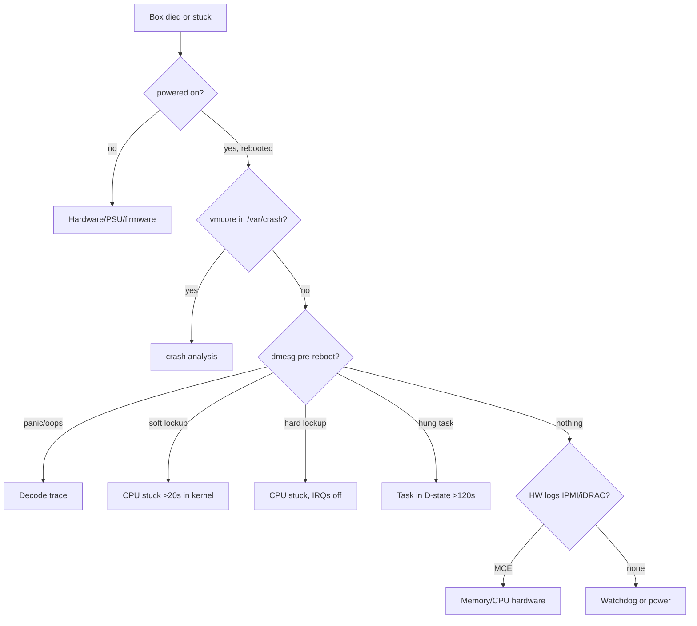

# Kernel Panics, Lockups & Crash Debug

> **Symptom signature**: Box rebooted unexpectedly; serial console shows `Kernel panic - not syncing`; `dmesg` after reboot reports `BUG: soft lockup - CPU#X stuck for 22s`; `hung_task: blocked for more than 120 seconds`; `Oops` with stack trace; system unresponsive on console but ping replies (or vice versa); `journalctl --list-boots` shows unexpected boot.

The job here is twofold: **capture the evidence** (kdump, serial logs, sysrq) and **classify the failure** (oops vs panic vs soft/hard lockup vs hung task — they look similar but mean different things).

## Kernel debug pipeline

```mermaid
flowchart LR
  EVT[Crash event] --> KMSG[printk ring]
  KMSG --> CONS[Serial / netconsole]
  EVT --> KDUMP[kdump via kexec]
  KDUMP --> VMC[/var/crash/vmcore]
  VMC --> CRASH[crash utility]
  CRASH --> RC[Root cause]
  EVT --> SYSRQ[sysrq trigger]
  SYSRQ --> KMSG
```

## Decision tree

<!-- mermaid:rendered -->
<p align="center"></p>

<details><summary>Mermaid source</summary>



</details>
## Tools required

```text
journalctl -k -b -1            # kernel log of previous boot
journalctl --list-boots
dmesg -T --level=err,crit,alert,emerg
kdumpctl status                # RHEL family
systemctl status kdump
crash /usr/lib/debug/.../vmlinux /var/crash/<ts>/vmcore
makedumpfile -d 31 -c vmcore vmcore.compressed
ipmitool sel list              # System Event Log (ECC, thermal)
mcelog --client                # Machine Check exceptions
edac-util -v                   # ECC events
echo c > /proc/sysrq-trigger   # force crash (test only!)
echo t > /proc/sysrq-trigger   # dump task state
echo w > /proc/sysrq-trigger   # blocked tasks only
echo l > /proc/sysrq-trigger   # backtrace all CPUs
netconsole module              # remote dmesg over UDP
addr2line -e vmlinux <addr>    # decode raw addresses
```

## Diagnosis sequence

1. **First, confirm it actually crashed (vs reboot vs network partition).**
   ```bash
   journalctl --list-boots
   last -x reboot shutdown | head
   # → unclean shutdown will not have a 'shutdown' record
   ```

2. **Read the previous boot's kernel log.**
   ```bash
   journalctl -k -b -1 | tail -200
   # → search for 'Oops', 'panic', 'BUG', 'hard LOCKUP', 'soft lockup', 'hung_task'
   ```

3. **Did kdump fire?**
   ```bash
   ls -lh /var/crash/*/vmcore* 2>/dev/null
   systemctl status kdump
   # → vmcore present = capture succeeded
   ```

4. **Open vmcore with crash.**
   ```bash
   crash /usr/lib/debug/lib/modules/$(uname -r)/vmlinux /var/crash/127.0.0.1-2026.../vmcore
   crash> sys           # summary
   crash> bt            # backtrace of crashing CPU
   crash> bt -a         # all CPUs
   crash> log           # full dmesg
   crash> ps            # process list
   crash> mod -s        # loaded modules
   crash> kmem -i       # memory state
   ```

5. **Hardware-event correlation.**
   ```bash
   ipmitool sel list | tail -50
   mcelog --client
   edac-util -v
   # → ECC corrected/uncorrected, thermal trips, voltage faults
   ```

6. **For unresponsive but alive boxes, use sysrq before pulling the plug.**
   ```bash
   echo 1 > /proc/sys/kernel/sysrq          # enable
   echo w > /proc/sysrq-trigger             # blocked tasks
   echo l > /proc/sysrq-trigger             # backtrace all CPUs
   echo m > /proc/sysrq-trigger             # memory info
   echo t > /proc/sysrq-trigger             # all task states
   # capture from serial console or netconsole
   echo c > /proc/sysrq-trigger             # force panic + kdump (last resort)
   ```

## Failure classes — how to tell them apart

| Class | dmesg keyword | What it means |
|-------|---------------|---------------|
| **Oops** | `Oops:`, `BUG:` | Kernel hit a bad pointer or assertion. Often recoverable; process killed. Preserves system. |
| **Panic** | `Kernel panic - not syncing` | Unrecoverable. Box stops or reboots based on `kernel.panic`. |
| **Soft lockup** | `BUG: soft lockup - CPU#X stuck for 22s!` | A CPU stayed in kernel mode without yielding for >20s. IRQs still on. Often a tight loop or huge lock wait. |
| **Hard lockup** | `NMI watchdog: BUG: Hard LOCKUP on CPU N` | A CPU stuck with IRQs disabled — only NMI can detect. Usually driver bug or spinlock deadlock. |
| **Hung task** | `INFO: task X:Y blocked for more than 120 seconds` | A task in D-state for `kernel.hung_task_timeout_secs`. NOT a crash; symptom of I/O or lock starvation. |
| **MCE** | `mce: [Hardware Error]:` | Hardware fault (CPU, memory, PCIe). Correlate with `mcelog`/IPMI SEL. |

## Root causes

### 1. NULL pointer dereference in driver
**Confirm**: `Oops` trace mentions a non-mainline module (often vendor net/storage). `crash> bt` shows the function in module symbol space.
**Fix**: Update driver/firmware. Disable feature offload that triggers the path (e.g. `ethtool -K eth0 tso off gso off`). Report bug with vmcore and reproduce steps.

### 2. Memory corruption (slab, use-after-free)
**Confirm**: Random Oops with different stacks; `BUG: KASAN:`/`BUG: kmalloc-free` if KASAN enabled. `dmesg` shows slab corruption messages.
**Fix**: Boot with `slub_debug=FZP` or KASAN kernel in staging to catch source. Often resolved by kernel update; sometimes a specific module (custom OOT driver).

### 3. Soft lockup from busy spinlock
**Confirm**: `BUG: soft lockup ... stuck for 22s`. Stack shows `_raw_spin_lock` or specific lock function. Same CPU appears repeatedly.
**Fix**: Identify the lock owner via stack analysis. Common culprits: `inode_hash_lock`, `mm_take_all_locks`. Kernel update usually fixes; reduce concurrency as workaround.

### 4. Hard lockup (NMI watchdog fires)
**Confirm**: `Hard LOCKUP on CPU N` with `nmi_backtrace`. IRQs disabled in stack. Often driver bug (igb, ixgbe historically) or BIOS SMI taking too long.
**Fix**: Update NIC firmware/driver; disable problematic offload; raise `kernel.watchdog_thresh` only as last resort. Disable BIOS SMI features (power capping, USB legacy emulation).

### 5. Hung task (D-state) from NFS/storage
**Confirm**: `hung_task: task X:Y blocked for more than 120 seconds`. Stack shows `nfs_wait_on_request`, `jbd2_log_wait_commit`, `io_schedule`.
**Fix**: NFS — server unreachable; check mount with `soft,intr,timeo=` options. Storage — see [io-issues.md](io-issues.md). Set `kernel.hung_task_panic=1` in HA-only environments to fail-fast.

### 6. OOM with `panic_on_oom=1`
**Confirm**: `Out of memory and no killable processes...` followed by panic. `kernel.panic_on_oom` set.
**Fix**: See [memory-issues.md](memory-issues.md). Default `panic_on_oom=0`; only set =1 in HA pairs where rebooting fast is better than degraded service.

### 7. Hardware MCE / bad DIMM
**Confirm**: `mce: Uncorrected error`. `edac-util` shows non-zero `CE`/`UE` counts on a memory channel. Repeated panics on same socket/DIMM.
**Fix**: Replace DIMM. Until then, offline channel via BIOS (`memmap=` kernel cmdline can blacklist memory regions). Check IPMI SEL for thermal/PSU issues simultaneously.

## Setting up kdump (mandatory for any prod host)

```bash
# RHEL/Rocky
yum install -y kexec-tools
grubby --update-kernel=ALL --args="crashkernel=512M-:256M"
systemctl enable --now kdump
kdumpctl status

# Test (CAREFUL — this crashes the box)
echo c > /proc/sysrq-trigger
# After reboot:
ls -lh /var/crash/
```

For containers/VMs, ensure crashkernel reservation accounts for total RAM (often 256-512M).

## Prevent

- **Always enable kdump.** No vmcore = no root cause = repeat outage.
- **Serial console + netconsole.** When kdump fails, console output is your only artifact.
- **Set sysctls deliberately:**
  ```ini
  kernel.panic = 10                  # reboot 10s after panic (if HA)
  kernel.panic_on_oops = 0           # don't panic on oops; capture and continue
  kernel.hung_task_timeout_secs = 120
  kernel.hung_task_panic = 0         # 1 only in HA pairs
  kernel.watchdog_thresh = 10        # NMI watchdog threshold
  vm.panic_on_oom = 0
  kernel.sysrq = 1                   # enable for ops; or 244 for restricted
  ```
- Subscribe to vendor kernel security/stability advisories. Run latest -stable not bleeding-edge.
- Schedule firmware/microcode updates (`microcode_ctl`, `intel-microcode`) every 6 months.
- For fleet, ship `dmesg` to central log + alert on `Oops|panic|lockup|MCE` keywords.
- Run `mcelog --daemon` and alert on uncorrected errors.

> ### 20-Year Tips
> - **No vmcore, no answer.** The most expensive lesson. Every prod host gets kdump configured before it serves traffic.
> - **Soft lockup ≠ panic.** It is a warning that one CPU is stuck. The box is often still serving on other CPUs. Capture sysrq-l immediately, then decide.
> - **Hung task is not a kernel bug.** 99% of the time, it is your storage/NFS/lock. Don't bother kernel maintainers until you've ruled out infrastructure.
> - **Repeated panics on the same DIMM = replace the DIMM.** Don't `memmap=` your way around it; you'll forget and confuse the next on-call.
> - **`crash> bt` is a 30-year-old utility and still the gold standard.** Learn it once, use forever. Combine with `bt -f -a` for full register state across all CPUs.
> - **`netconsole` for unkillable hangs**: kernel sends dmesg over UDP to a remote collector. Set up before you need it.
> - **Microcode updates fix more "kernel bugs" than people realise.** Always check `cat /proc/cpuinfo | grep microcode` and compare to vendor latest after a mystery panic.

> ### Common Interview Questions
> **Q1: Difference between Oops, Panic, soft lockup, hard lockup, hung task.**
> A: Oops = kernel bug, often recoverable. Panic = unrecoverable, system stops/reboots. Soft lockup = CPU stuck in kernel mode >20s, IRQs on. Hard lockup = stuck with IRQs off, only NMI watchdog detects. Hung task = task in D-state >120s, often I/O.
>
> **Q2: How do you set up kdump?**
> A: Reserve memory via kernel cmdline `crashkernel=512M-:256M`, install `kexec-tools`, enable `kdump.service`. Test with `echo c > /proc/sysrq-trigger`. vmcore lands in `/var/crash/`.
>
> **Q3: A box reboots without warning every few days. How do you investigate?**
> A: Check `journalctl --list-boots` and read `journalctl -k -b -1`. Look for panic/MCE before reboot. Check `ipmitool sel list`, `mcelog`, `edac-util`. Ensure kdump is configured. Pull system event log from BMC for hardware events.
>
> **Q4: What does `kernel.panic_on_oops=1` do, and when would you set it?**
> A: Convert any kernel oops into a full panic. Set in HA pairs where you prefer fast failover over a degraded host. Default 0 keeps the box alive for debugging.
>
> **Q5: SysRq triggers — name three useful ones.**
> A: `w` = blocked tasks, `l` = backtrace all CPUs, `t` = all task states, `m` = mem info, `c` = crash + kdump.
>
> **Q6: How to decode a kernel address from a stack trace?**
> A: `addr2line -e vmlinux <addr>` if vmlinux available, or `crash> sym <addr>`. Modern kernels include symbols in the trace; older ones need `System.map`.
>
> **Q7: NMI watchdog fires on CPU 4. What likely caused it and how do you proceed?**
> A: A CPU stuck with IRQs disabled — usually driver spinlock deadlock or BIOS SMI. Capture stacks (auto-printed). Check loaded modules; correlate with recent driver/firmware updates. Update or disable offload. If nothing software-side changed, suspect BIOS SMI (power capping, USB legacy).
>
> **Q8: Hung task fires on jbd2. What does it mean?**
> A: ext4 journal commit blocked >120s. Underlying block device unresponsive. Check `iostat`, dmesg for I/O errors, SMART, multipath status. The kernel is fine; storage is the problem.
