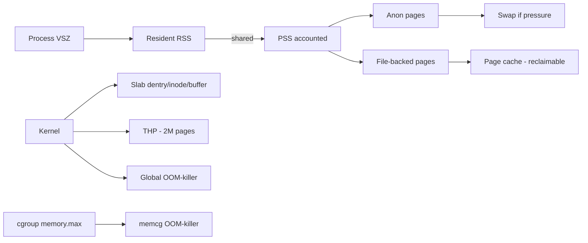
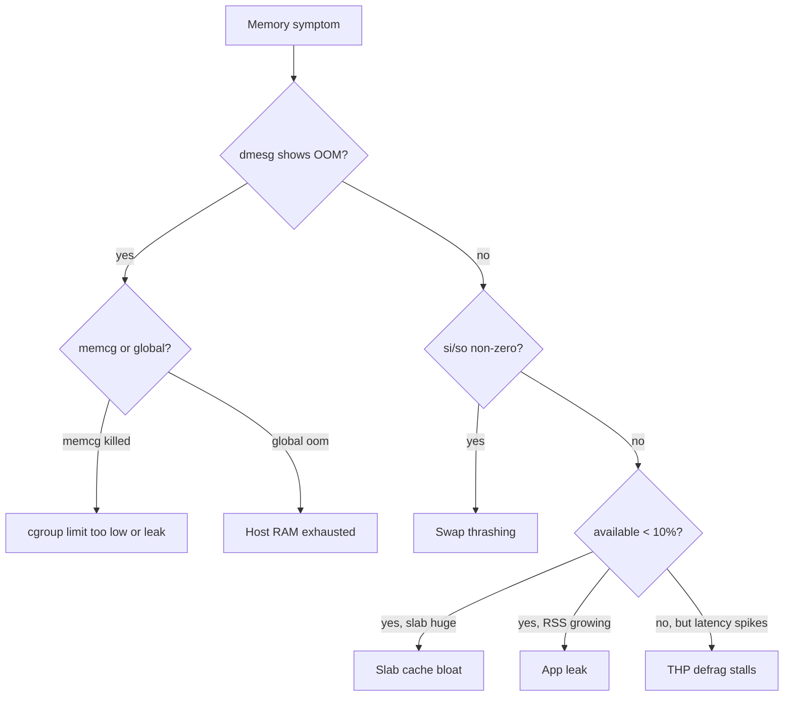

# Memory Issues — Deep Troubleshooting

> **Symptom signature**: `dmesg` shows `Out of memory: Killed process`; service restarts every few hours with `exit code 137` in k8s; `free -m` shows `available` < 5%; `vmstat` shows `si/so` non-zero; latency p99 is bimodal — most fast, occasional 5s spikes (THP defrag); `slabtop` shows `dentry` or `inode_cache` hundreds of MB; container memory grows linearly forever.

The hardest memory bugs are not OOM kills — they are **slow leaks** that look like normal growth, and **slab/THP** issues that look like CPU problems.

## Memory layer involved

<!-- mermaid:rendered -->
<p align="center"></p>

<details><summary>Mermaid source</summary>



</details>
## Diagnosis decision tree

<!-- mermaid:rendered -->
<p align="center"></p>

<details><summary>Mermaid source</summary>



</details>
## Tools required

```text
free -m -w                 # -w splits buffers/cache properly
cat /proc/meminfo          # source of truth
vmstat -SM 1               # si/so, swap activity
smem -tk -P <pat>          # PSS-aware per-process
ps -eo pid,rss,vsz,comm --sort=-rss | head
slabtop -o                 # slab cache top
cat /proc/slabinfo         # raw
cat /proc/<PID>/status     # VmRSS, VmSwap, RssAnon, RssFile
cat /proc/<PID>/smaps_rollup
cat /sys/fs/cgroup/<cg>/memory.current
cat /sys/fs/cgroup/<cg>/memory.events    # oom, oom_kill, max
cat /sys/fs/cgroup/<cg>/memory.pressure  # PSI - psi
cat /sys/kernel/mm/transparent_hugepage/enabled
numastat -m
```

## Diagnosis sequence

1. **The right "free" view.**
   ```bash
   free -mw
   # → use 'available', not 'free'. If available < 10% of total, you have pressure.
   ```

2. **Read `/proc/meminfo` correctly.**
   ```bash
   awk '/^(MemTotal|MemAvailable|Buffers|Cached|SReclaimable|Slab|AnonPages|Mapped|Shmem|SwapTotal|SwapFree|Committed_AS|PageTables)/' /proc/meminfo
   # → Anonymous = AnonPages, file-backed = Cached - Shmem
   # → Slab = SReclaimable + SUnreclaim. SUnreclaim huge = kernel leak.
   ```

3. **OOM forensics.**
   ```bash
   dmesg -T | grep -B2 -A20 'Out of memory'
   # → look for: 'Killed process X (name)', the rss column, and oom_score_adj
   journalctl -k --since "1 hour ago" | grep -i 'oom\|memcg'
   ```

4. **Per-process memory truth (PSS).**
   ```bash
   smem -tk | sort -k5 -h | tail
   # → PSS divides shared pages by sharers. RSS double-counts. Trust PSS.
   ```

5. **Slab cache investigation.**
   ```bash
   slabtop -o -s c | head -20
   # → top by cache size. dentry/inode_cache > 1GB = filesystem walker leak.
   ```

6. **Detect a slow leak (sample over time).**
   ```bash
   while true; do
     date +%s
     awk '/VmRSS|VmSwap/' /proc/<PID>/status
     sleep 60
   done | tee /tmp/leak.log
   # → linear growth = leak; sawtooth = GC; flat = no leak
   ```

7. **cgroup memory pressure (PSI).**
   ```bash
   cat /sys/fs/cgroup/<cg>/memory.pressure
   # → 'some avg10' > 10 = workload waiting on memory 10% of the time
   ```

8. **THP behaviour.**
   ```bash
   grep -E 'AnonHugePages|ShmemHugePages' /proc/meminfo
   cat /sys/kernel/mm/transparent_hugepage/enabled
   cat /sys/kernel/mm/transparent_hugepage/defrag
   # → 'always' + bursty allocs = stalls during khugepaged defrag
   ```

## RSS vs VSZ vs PSS — the cheat table

| Metric | What it counts | Use when |
|--------|---------------|----------|
| **VSZ** | Total virtual address space, including never-touched | Mostly useless. JVM with `-Xmx32g` shows VSZ=33g even if using 4g |
| **RSS** | Resident pages, double-counts shared (libs) | Quick per-process glance |
| **PSS** | Resident, shared pages divided by # sharers | True memory cost; sum of PSS = used RAM |
| **USS** | Pages unique to that process | What you'd reclaim if you killed it |

Always reach for **PSS** when summing across many processes (e.g. nginx workers).

## Root causes

### 1. Application memory leak (slow)
**Confirm**: RSS curve linear over hours; restart resets baseline. Heap profiler (`pprof`, `jmap`, `valgrind --leak-check=full`) confirms.
**Fix**: Patch the leak. Until then, set `MemoryHigh` (cgroup v2) for soft pressure restart-on-threshold via systemd `MemoryMax=` + `Restart=on-failure`.

### 2. Memory spike (legitimate burst)
**Confirm**: RSS jumps to peak then plateaus; happens during specific request (large upload, batch import).
**Fix**: Add streaming/chunked processing; raise limit if true working set; add request-size guards at LB.

### 3. cgroup memory limit too low (k8s 137 OOMs)
**Confirm**: `memory.events` shows `oom_kill > 0`; container peak RSS ≈ limit. `kubectl describe pod` shows `OOMKilled`.
**Fix**: Set `memory.limit = peak_RSS * 1.3`. Use VPA (Vertical Pod Autoscaler) in `Off` mode to recommend. Never set `requests=limits` for memory unless you understand QoS Guaranteed implications.

### 4. Slab cache bloat (dentry/inode)
**Confirm**: `slabtop` shows `dentry` or `inode_cache` > 5% RAM. Often after `find /` runs or backup tools.
**Fix**:
```bash
echo 2 > /proc/sys/vm/drop_caches      # drop slab (one-shot, observation only)
sysctl -w vm.vfs_cache_pressure=200    # reclaim more aggressively
```
Real fix: do not walk `/` from cron. Use targeted scans.

### 5. Transparent Huge Pages defrag thrash
**Confirm**: Latency p99 spikes coincide with `compact_stall` rising in `/proc/vmstat`. AnonHugePages is large and growing.
**Fix**: For DBs (Mongo, Postgres, Redis, ES — all recommend this):
```bash
echo madvise > /sys/kernel/mm/transparent_hugepage/enabled
echo defer+madvise > /sys/kernel/mm/transparent_hugepage/defrag
```
Make persistent in tuned profile or grub `transparent_hugepage=madvise`.

### 6. Swap thrashing
**Confirm**: `vmstat` `si/so` continuously > 100 pages/sec; `free` shows swap used + available low.
**Fix**: Identify the process via `smem -s swap`, kill or restart it. Lower `vm.swappiness=10` (default 60) for DB hosts. For k8s, swap is now allowed (1.28+) but most operators still disable.

### 7. Kernel memory leak (SUnreclaim growth)
**Confirm**: `cat /proc/meminfo` shows `SUnreclaim` growing forever; `slabtop` shows kernel cache (e.g. `kmalloc-1k`) huge with no obvious owner.
**Fix**: Reboot is the field fix. Real fix: enable `/sys/kernel/debug/kmemleak` (kernel built with CONFIG_DEBUG_KMEMLEAK), reproduce, capture. File bug with vendor and kernel version.

## Prevent

- Default sysctls for general-purpose servers:
  ```ini
  vm.swappiness = 10
  vm.vfs_cache_pressure = 50
  vm.overcommit_memory = 1   # only if you know what you're doing; 0 is the default
  vm.panic_on_oom = 0        # let the killer pick, don't reboot
  kernel.panic = 10          # if oops, reboot in 10s (only if you have HA)
  ```
- Always set `memory.limit` in containers, but set it to **peak * 1.3**, not request value.
- Monitor `node_memory_MemAvailable_bytes / node_memory_MemTotal_bytes < 0.10` (alert).
- Monitor `container_memory_working_set_bytes / container_spec_memory_limit_bytes > 0.85` (warn).
- Monitor `node_vmstat_pswpin / pswpout > 100/s` (alert).
- For latency-sensitive DBs: disable THP, set `vm.swappiness=1`, lock memory with `mlock` if possible.
- Use **Pressure Stall Information** (`/proc/pressure/memory`) — it predicts OOM minutes earlier than `available`.

> ### 20-Year Tips
> - **`free` lies, `MemAvailable` tells the truth.** A 64G box showing "free 200M" is fine if available is 30G.
> - **Always check OOM scores**: `cat /proc/<PID>/oom_score`. The kernel kills high-score victims. To protect a process: `echo -1000 > /proc/<PID>/oom_score_adj`.
> - **THP madvise, never always, on DB hosts.** A Postgres slowdown to 10% throughput at 3am once-a-week is khugepaged defragging. Ask me how I know.
> - **Slab leaks are real.** Some kernel versions leak `kmalloc-256` slowly under specific NFS workloads. Reboot, then upgrade.
> - **`smaps_rollup` (kernel 4.14+) is your friend** — gives RSS/PSS/Swap for the whole process in one read instead of summing thousands of mappings.
> - **In k8s, `kubectl top` lies about working set during eviction**. Always sanity-check with `cat /sys/fs/cgroup/.../memory.current` from the node.

> ### Common Interview Questions
> **Q1: Why is `MemAvailable` better than `MemFree`?**
> A: `MemFree` excludes reclaimable cache and slab. `MemAvailable` (kernel 3.14+) is the kernel's estimate of what could be allocated to a new workload before swapping. It includes reclaimable page cache and slab.
>
> **Q2: Difference between RSS, VSZ, PSS, USS?**
> A: VSZ = virtual size (incl. never-touched). RSS = resident pages but double-counts shared. PSS = resident with shared pages divided by sharer count (true memory cost). USS = pages unique to the process (what you'd free by killing it).
>
> **Q3: How does the OOM killer choose its victim?**
> A: Computes `oom_score` based on RSS + swap, biased by `oom_score_adj` (-1000 to 1000). Highest score dies. Modify with `echo -500 > /proc/<PID>/oom_score_adj` to protect critical processes.
>
> **Q4: Container is OOMKilled with code 137 but `kubectl top` showed 70% usage. Why?**
> A: `kubectl top` polls every ~15s; a burst between samples can hit `memory.limit`. memcg OOM is also evaluated against `memory.current`, which includes file cache pinned by the workload — `working_set` differs.
>
> **Q5: Why disable THP on database servers?**
> A: THP allocates 2MB pages and defragments under pressure (khugepaged). Bursty allocators (DB buffer pools) trigger expensive compaction stalls — multi-second p99 spikes. `madvise` lets only opted-in code use THP.
>
> **Q6: Slab cache is 8G of 16G RAM. What do you do?**
> A: `slabtop` to identify the cache. If `dentry`/`inode_cache`, look for processes walking the FS. `echo 2 > /proc/sys/vm/drop_caches` to test. Long-term: stop the walker or raise `vm.vfs_cache_pressure`.
>
> **Q7: Slow memory leak vs spike — how do you tell?**
> A: Sample RSS over time. Linear growth = leak. Step-up to plateau = legitimate working-set growth. Sawtooth = GC. Sudden jump then return = burst.
>
> **Q8: `vm.swappiness=60` vs `=10` — what changes?**
> A: Higher swappiness → kernel more willing to swap anonymous pages to free file cache. On DBs, you want low swappiness so hot pages stay in RAM; cache misses are cheaper than swap-in.
