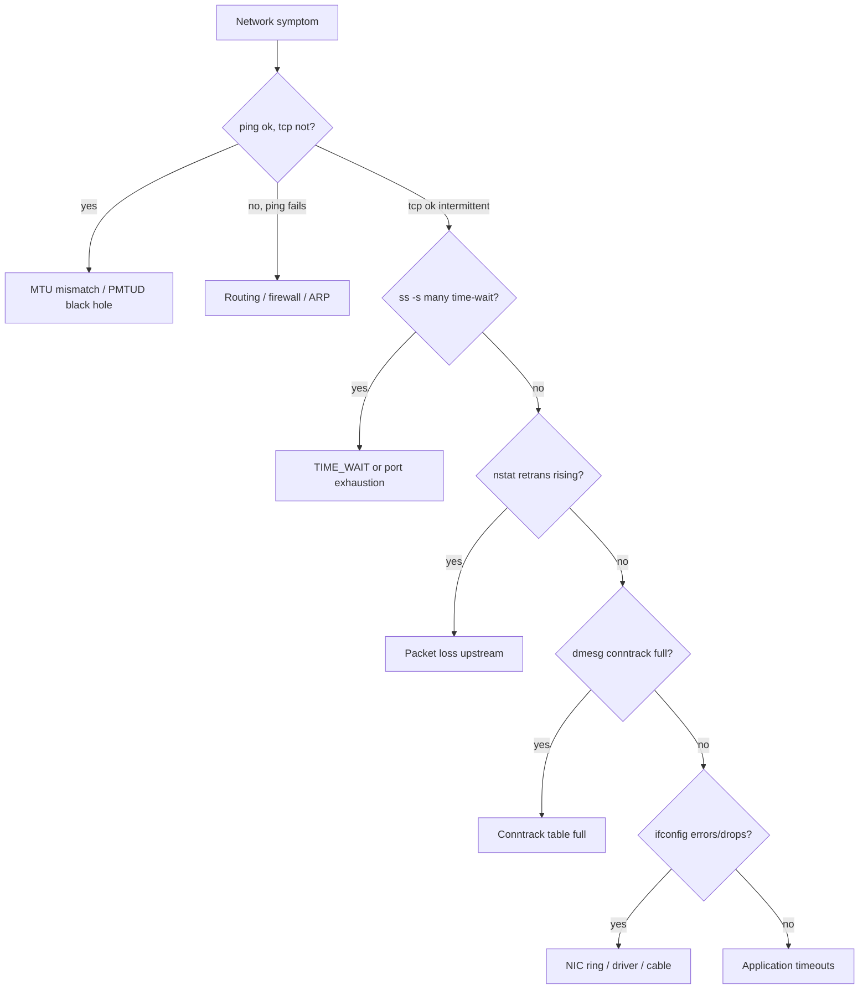

# Network Issues — Deep Troubleshooting

> **Symptom signature**: Intermittent connection refused or timeouts; `ss -s` shows tens of thousands of `time-wait`; `dmesg` says `nf_conntrack: table full, dropping packet`; ping works but TCP doesn't (MTU); curl hangs from one host but not another; retransmits climbing in `nstat`; `ifconfig` shows non-zero RX/TX errors or drops; ephemeral source ports exhausted (`bind: address already in use` for outbound).

Network problems split into three families: **packet drops** (NIC, ring, conntrack), **state-table exhaustion** (conntrack, sockets, TIME_WAIT), and **path/MTU**. Diagnose family first, drill second.

## Network stack involved

<!-- mermaid:rendered -->
<p align="center"></p>

<details><summary>Mermaid source</summary>


</details>
## Diagnosis decision tree

<!-- mermaid:rendered -->
<p align="center"></p>

<details><summary>Mermaid source</summary>



</details>
## Tools required

```text
ss -tan, ss -s, ss -tip   # socket diag (replaces netstat)
ip -s link, ip -s -s link # interface counters
ethtool -S eth0           # NIC driver counters
ethtool -g eth0           # ring buffer size
nstat -az                 # all kernel counters with delta
sar -n DEV,EDEV,TCP,ETCP 1
tcpdump -i any -nn -s0 -w /tmp/cap.pcap host X and port Y
tshark / wireshark
mtr -rwc 100 host         # path + loss per hop
dropwatch -l kas          # kernel-level drop locations
ss --tcp-info             # rtt, cwnd, lost
conntrack -L, conntrack -S
sysctl net.netfilter.nf_conntrack_count
ip neigh show             # ARP cache
ping -M do -s 1472 host   # MTU probe (1500 - 28)
tracepath / tracepath6
```

## Diagnosis sequence

1. **Identify the family.**
   ```bash
   ss -s
   # → tcp: estab=5000  closed=10  orphaned=0  timewait=80000  ports=0
   # → 80k time-wait or ports near limit = state-table problem
   ```

2. **Interface-level errors and drops.**
   ```bash
   ip -s -s link show eth0
   # → RX errors > 0 = layer-1 (cable/SFP/duplex)
   # → RX dropped > 0 = software ring full or no socket buffer
   ```
   ```bash
   ethtool -S eth0 | grep -iE 'drop|err|miss|fifo'
   # → rx_no_buffer / rx_missed_errors = ring too small or softirq slow
   ```

3. **Ring buffer sized appropriately.**
   ```bash
   ethtool -g eth0
   # → if Current = Pre-set Maximum, you're already maxed
   ethtool -G eth0 rx 4096 tx 4096       # bump (driver-dependent)
   ```

4. **TCP retransmits and timeouts.**
   ```bash
   nstat -z | grep -iE 'tcp.*(retrans|timeout|reset)'
   sar -n ETCP 1 5
   # → retrans/s > 1% of segs/s = real loss
   ```

5. **Per-connection inspection.**
   ```bash
   ss -tinp 'dport = :443' | head -20
   # → look for: rtt, cwnd, lost, retrans, unacked, rcv_space, send-q growing
   ```

6. **Where in the kernel are packets dropped?**
   ```bash
   dropwatch -l kas
   start
   # → shows function name where SKBs are freed (e.g. tcp_v4_rcv, nf_hook_slow)
   ```

7. **Conntrack table state.**
   ```bash
   sysctl net.netfilter.nf_conntrack_count net.netfilter.nf_conntrack_max
   conntrack -S            # per-CPU stats: insert_failed, drop, early_drop
   dmesg -T | grep conntrack
   ```

8. **MTU probe.**
   ```bash
   ping -M do -s 1472 server.example.com   # 1472+28 = 1500
   # → if fails at 1472 but works at 1400 → MTU somewhere is 1428
   tracepath server.example.com            # shows pmtu per hop
   ```

9. **ARP cache.**
   ```bash
   ip neigh show | wc -l
   # → near net.ipv4.neigh.default.gc_thresh3 (default 1024) → tune
   dmesg | grep 'neighbour table overflow'
   ```

10. **Ephemeral port exhaustion (outbound).**
    ```bash
    sysctl net.ipv4.ip_local_port_range
    ss -tan state time-wait | wc -l
    # → if time-wait > (port range size * 0.5) per dst → exhausting
    ```

## Root causes

### 1. NIC ring buffer overrun (`rx_no_buffer`)
**Confirm**: `ethtool -S eth0` shows non-zero `rx_no_buffer_count` or `rx_missed_errors` rising.
**Fix**:
```bash
ethtool -G eth0 rx 4096 tx 4096
# spread softirq: enable RPS, RSS (see cpu-issues.md cause #2)
```
Also tune `net.core.netdev_budget=600` and `netdev_max_backlog=10000`.

### 2. Conntrack table full
**Confirm**: `dmesg | grep 'nf_conntrack: table full'`. `conntrack -S` shows `insert_failed > 0`.
**Fix**:
```bash
sysctl -w net.netfilter.nf_conntrack_max=1048576
sysctl -w net.netfilter.nf_conntrack_buckets=262144   # max/4
# shorten timeouts for tcp time-wait
sysctl -w net.netfilter.nf_conntrack_tcp_timeout_time_wait=30
```
On firewalls/LBs handling > 100k flows, plan for millions. Or use `NOTRACK` for known stateless flows.

### 3. TCP retransmits from real loss
**Confirm**: `nstat` shows `TcpRetransSegs / TcpOutSegs > 0.01`. `mtr -rwc 200 host` shows loss at hop N.
**Fix**: Network team if loss is in path. In-host: enable BBR `sysctl -w net.ipv4.tcp_congestion_control=bbr` for better recovery; tune buffers `net.core.rmem_max=16777216`, `net.ipv4.tcp_rmem='4096 87380 16777216'`.

### 4. ARP cache overflow
**Confirm**: `dmesg | grep 'neighbour table overflow'`. Common on hosts with thousands of L2 neighbours (k8s nodes, VXLAN).
**Fix**:
```bash
sysctl -w net.ipv4.neigh.default.gc_thresh1=8192
sysctl -w net.ipv4.neigh.default.gc_thresh2=16384
sysctl -w net.ipv4.neigh.default.gc_thresh3=32768
```
Persist in `/etc/sysctl.d/`.

### 5. MTU mismatch / PMTUD black hole
**Confirm**: small payloads work, large payloads (file uploads, TLS handshake with big cert) hang. `ping -M do -s 1472` fails. Path traverses tunnel (VXLAN/IPSec/GRE).
**Fix**: Set MTU on interface to match path: `ip link set eth0 mtu 1450`. For TCP-only traffic without changing MTU: clamp MSS:
```bash
iptables -t mangle -A FORWARD -p tcp --tcp-flags SYN,RST SYN -j TCPMSS --clamp-mss-to-pmtu
```

### 6. Ephemeral port exhaustion
**Confirm**: outbound `connect()` returns `EADDRNOTAVAIL`; `ss -tan state time-wait | wc -l` near 28k+; mostly to a single dst:port.
**Fix**:
```bash
sysctl -w net.ipv4.ip_local_port_range="1024 65535"
sysctl -w net.ipv4.tcp_tw_reuse=1            # safe; reuses TW for new outbound
# DO NOT enable tcp_tw_recycle (removed in 4.12, broke NAT clients)
```
Real fix: connection pooling in app, or use SO_REUSEPORT with multiple source IPs.

### 7. TIME_WAIT explosion (server side)
**Confirm**: server shows hundreds of thousands of TIME_WAIT, mostly to client side. Inbound new connections refused.
**Fix**: TIME_WAIT is on the side that calls `close()` first. If server, change to keep-alive / HTTP/2; if you must, reduce `net.ipv4.tcp_fin_timeout=30`. Increase `net.core.somaxconn=4096` and listen backlog.

## iptables/nftables footgun
A long `iptables` chain (10k+ rules) adds CPU per packet. Confirm: `mpstat` shows %si high, `perf top` shows `nf_hook_slow`. Fix: use ipset, switch to nftables sets, or use eBPF/XDP filtering at NIC.

## Prevent

- Baseline sysctls for any production server:
  ```ini
  net.core.somaxconn = 4096
  net.core.netdev_max_backlog = 10000
  net.ipv4.tcp_max_syn_backlog = 4096
  net.ipv4.tcp_syncookies = 1
  net.ipv4.tcp_tw_reuse = 1
  net.ipv4.tcp_fin_timeout = 30
  net.ipv4.ip_local_port_range = 1024 65535
  net.ipv4.tcp_congestion_control = bbr
  net.netfilter.nf_conntrack_max = 1048576
  net.ipv4.neigh.default.gc_thresh3 = 32768
  ```
- Always increase NIC ring to max for high-PPS hosts.
- Enable RSS in NIC + RPS in software for single-queue NICs.
- Monitor: `node_netstat_TcpExt_TCPRetransFail`, `node_nf_conntrack_entries / max > 0.8`, `node_network_receive_drop_total` rate, NIC error rate.
- Lock MTU at provisioning and document tunnel overhead (VXLAN=50, IPsec ~74). Default to MTU 1450 in any overlay.
- For services on k8s, prefer `ipvs` over `iptables` proxy mode for >1000 services.
- Use `ss` everywhere; ban `netstat` from runbooks.

> ### 20-Year Tips
> - **`tcp_tw_recycle` killed more clusters than any sysctl in history.** Removed in kernel 4.12. If a blog post tells you to enable it, the post is older than your cluster. Use `tcp_tw_reuse` only.
> - **MTU bugs are diabolical.** Small handshakes succeed; first big packet hangs. ALWAYS test with `ping -M do -s 1472` when adding tunnels.
> - **Conntrack on a busy LB is non-negotiable.** Plan for 4-8M entries. Bucket count = max/4. Shorter timeouts for time-wait.
> - **`dropwatch` is an underused superpower.** It tells you which kernel function dropped the packet. Three minutes of `dropwatch` saves three hours of guessing.
> - **Always check both ends.** A retransmit on host A might be the symptom; the cause is host B's full accept queue. Run `ss -lntp` on the listener and check `Recv-Q` (drops on overflow when `tcp_abort_on_overflow=1`).
> - **BBR is usually a win** on long-haul or lossy links, not always on LAN. Test before rollout.
> - **Single-queue NIC + busy host = death.** `ethtool -l eth0` shows queues. If Combined=1, you cannot scale. Replace NIC or use RPS.

> ### Common Interview Questions
> **Q1: Difference between RX errors and RX dropped on `ip -s link`?**
> A: Errors = layer-1 (CRC, frame, FIFO, cable, duplex). Dropped = packet arrived ok but software dropped it (ring full, no socket buffer, conntrack reject).
>
> **Q2: How do you diagnose conntrack table full?**
> A: `dmesg` shows `nf_conntrack: table full, dropping packet`. `cat /proc/sys/net/netfilter/nf_conntrack_count` near `nf_conntrack_max`. Fix: raise max + buckets, shorten timeouts.
>
> **Q3: Why did `tcp_tw_recycle` get removed?**
> A: It assumed monotonic timestamps per remote IP. Behind NAT, multiple clients share one IP with non-monotonic clocks → spurious connection drops. Removed in 4.12.
>
> **Q4: Walk me through diagnosing TCP retransmits.**
> A: `nstat` for retrans/segs ratio. `ss --tcp-info` per connection for `lost`, `retrans`, `rtt`. `mtr` to find lossy hop. `tcpdump` to confirm dup ACKs and SACK blocks. Then network team or congestion-control change.
>
> **Q5: Symptoms of MTU mismatch.**
> A: TCP handshake completes (small SYN/ACK), data hangs after first 1500-byte packet. `ping` works small, fails with `-M do -s 1472`. Fix MTU on interface or TCPMSS clamp.
>
> **Q6: Ephemeral port exhaustion — how do you fix it short-term and long-term?**
> A: Short: widen `ip_local_port_range`, enable `tcp_tw_reuse`. Long: connection pooling in app, persistent connections, or scale out source IPs.
>
> **Q7: `ss` vs `netstat` — why prefer ss?**
> A: ss reads via netlink, netstat parses /proc. On boxes with 100k sockets, netstat is minutes-slow. ss is instant and more accurate (states, timers, RTT).
>
> **Q8: How to find out which kernel function is dropping packets?**
> A: `dropwatch -l kas`, then `start`. It hooks `kfree_skb` and shows the kernel function symbol where the SKB was freed. Alternative: bpftrace `kprobe:kfree_skb { @[kstack] = count(); }`.
