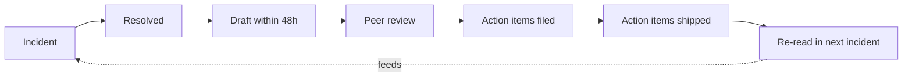
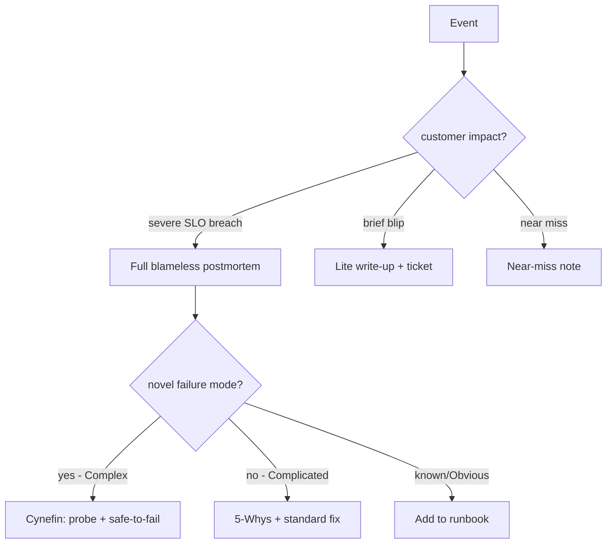
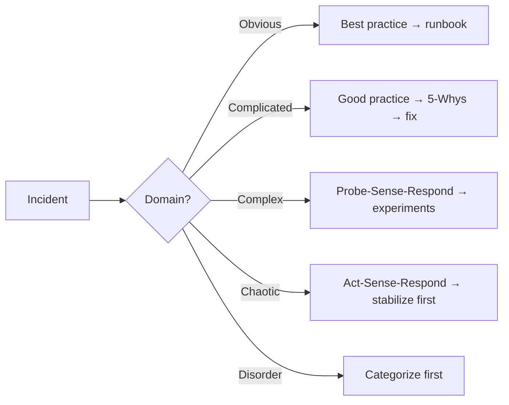

# Production Postmortems — The Real Doc

> **Symptom signature**: The fire is out. Customers are served. Now the hard part — write a doc that tells the truth, names no individuals, and produces action items that actually ship. Done badly, postmortems become theatre. Done well, they are the highest-leverage artifact your org produces.

This file gives you a template, two analytical frameworks (5-Whys + Cynefin), guidance on blameless culture, action-item categorization, and a worked example.

## Postmortem lifecycle

<!-- mermaid:rendered -->
<p align="center"></p>

<details><summary>Mermaid source</summary>



</details>
## Decision tree — what kind of postmortem do you need?

<!-- mermaid:rendered -->
<p align="center"></p>

<details><summary>Mermaid source</summary>



</details>
---

## The Template

Use this structure verbatim. Copy into wiki/Notion/Google Docs.

```markdown
# Postmortem: <One-line title — service + symptom + date>

**Status**: Draft / In Review / Final
**Owner**: <single person — coordinator, not blame>
**Severity**: SEV1 / SEV2 / SEV3
**Customer impact**: <quantified — N requests, X users, Y minutes>
**Detected by**: <alert name | customer report | manual>

---

## 1. Summary
3-5 sentences a VP can read. What broke, who was affected, how long, what fixed it.

## 2. Timeline (UTC)
| Time | Event | Source |
|------|-------|--------|
| 14:02 | Deploy of v2.4.1 to prod-eu1 completed | CI log |
| 14:07 | First 5xx spike, 0.3% error rate | Grafana |
| 14:09 | Pagerduty alert fired | PD |
| 14:11 | On-call ack, started investigation | PD |
| 14:18 | Identified bad config flag in v2.4.1 | Slack #incident |
| 14:24 | Rollback initiated | CI log |
| 14:31 | Error rate normal | Grafana |
| 14:45 | All-clear declared | Slack |

> Rule: timestamps from systems, not from memory. Pull from PagerDuty, Slack, deploy tool, dashboards.

## 3. Impact
- Duration: 24 minutes (14:07 - 14:31 UTC)
- Requests affected: ~84,000 (0.4% error rate during window)
- Users affected: ~6,200 unique (estimated from req counts)
- Revenue impact: $X estimated
- SLO budget burned: 1.4% of monthly budget

## 4. What happened (narrative)
2-3 paragraphs. Plain English. No jargon. Tell the story chronologically with hyperlinks to graphs and traces.

## 5. Root cause analysis
Use 5-Whys (see below). State the chain explicitly.

## 6. Contributing factors
Things that made it worse. Not THE cause, but helped:
- No canary stage between staging and full prod
- Alert latency: 4 minutes from impact to page
- Rollback took 7 minutes (target: 2)

## 7. What went well
- On-call ack < 2 minutes
- Rollback button worked first try
- Customer comms posted to status page within 8 minutes

## 8. What went poorly
- No automated config-flag validation in CI
- Two engineers spent 6 minutes on the wrong hypothesis (DB)
- Status-page template missing from runbook

## 9. Where we got lucky
- Outage was during low-traffic window. At peak it would be 10x worse.
- The bad flag did not corrupt persisted state — clean rollback was possible.

## 10. Action items
| ID | Action | Type | Owner | Due | Ticket |
|----|--------|------|-------|-----|--------|
| AI-1 | Add config-schema validation to CI | Prevent | @alice | 2 weeks | JIRA-123 |
| AI-2 | Implement canary stage at 5% traffic | Prevent | @bob | 4 weeks | JIRA-124 |
| AI-3 | Reduce alert latency: scrape interval 30s→10s | Mitigate | @carol | 1 week | JIRA-125 |
| AI-4 | Runbook: add status-page template | Process | @dave | 3 days | JIRA-126 |
| AI-5 | Document rollback SLO target in deploy tool | Process | @eve | 1 week | JIRA-127 |

## 11. Lessons learned
1-3 bullets, broad enough to apply beyond this incident.

## 12. Appendix
- Screenshots of dashboards (with annotations)
- Slack thread permalinks
- Deploy diff / commit hash
- Trace IDs / sample requests
```

---

## Analysis frameworks

### 5-Whys — for known failure classes
Iterate "why" 5 times. Stop when you hit a system / process cause, not a person.

> **Example:** Service returned 5xx.
> 1. Why? Bad config flag deployed.
> 2. Why? Flag not validated in CI.
> 3. Why? Validation step exists but skipped on hotfix branch.
> 4. Why? CI job conditional on branch name pattern.
> 5. Why? **Tribal knowledge — no policy document or test enforced the contract.**
> → Fix: enforce check on all branches; document policy.

**Anti-pattern**: stopping at "engineer made mistake". That is a person, not a system. Keep going.

### Cynefin — for novel/Complex failures
Dave Snowden's framework. 5-Whys assumes Complicated (cause-effect knowable). Some incidents are Complex (cause-effect only visible in hindsight) — for those, prefer probes and safe-to-fail experiments.

<!-- mermaid:rendered -->
<p align="center"></p>

<details><summary>Mermaid source</summary>



</details>
| Domain | Example | Postmortem style |
|--------|---------|------------------|
| Obvious | Disk full, certificate expired | Add monitoring + runbook entry, done |
| Complicated | Race condition revealed by traffic pattern | 5-Whys + targeted fix |
| Complex | Microservice cascade you can't reproduce | Multiple safe-to-fail experiments, observability investments |
| Chaotic | Active region-wide outage | Stabilize NOW, postmortem later |

---

## Blameless culture — practical rules

1. **No names in the doc body.** Use roles ("on-call", "deploying engineer"). Names go in the owners table only.
2. **"What was missing in the system that allowed a human to make this mistake?"** — Etsy's framing. Replace "X did Y wrong" with "the system permitted Y".
3. **Distinguish error from negligence.** Mistakes inside normal procedure are signals about the system. Skipping safety procedures is a separate HR conversation, not a postmortem.
4. **Write for the person who comes next.** A postmortem is read by future on-calls who never met you. Optimise for them.
5. **Read previous postmortems before writing yours.** Patterns repeat — say so.
6. **Review meeting includes the people involved.** Not as defendants, as experts. Their hands-on context is the most valuable input.
7. **Status of action items is reviewed monthly.** Unfinished AIs are the single biggest predictor of repeat incidents.

---

## Action item categorization

Every AI gets exactly one type. Mix the portfolio: too many "Prevent" with no "Detect" means you'll be late next time.

| Type | Definition | Example |
|------|-----------|---------|
| **Prevent** | Stop this class from recurring | Schema validation, type checks, integration tests |
| **Detect** | See it faster next time | New alert, lower scrape interval, log enrichment |
| **Mitigate** | Reduce blast radius when it does happen | Canary, circuit breaker, feature flag |
| **Respond** | Faster human response | Runbook, training, automation |
| **Process** | Org/policy change | Required reviews, deploy windows, escalation policy |

Healthy ratio in a quarter: ~30% Prevent, 25% Detect, 25% Mitigate, 10% Respond, 10% Process. Pure Prevent is brittle.

---

## SLO-based severity (suggested)

| Severity | Definition | Postmortem required? |
|----------|-----------|---------------------|
| SEV1 | >5% SLO budget burned in <1h | Yes, full, public |
| SEV2 | 1-5% SLO budget burned, customer-visible | Yes, full, internal |
| SEV3 | <1% budget, near-miss, internal | Lite write-up |
| SEV4 | No customer impact, observability win | Slack note + AI ticket |

---

## Worked example — "The Friday afternoon DB query"

> ### Incident: prod-orders DB latency spike, 2025-09-12 16:40-17:25 UTC
>
> **Summary**: A read-only analytics query joining `orders` and `events` (180-day window) was issued from a notebook against the primary DB at 16:40 UTC. The query plan flipped to nested-loop after a recent stats refresh. CPU on the DB host hit 100%, p99 of order-write API rose from 80ms to 6.4s. Mitigated by `pg_cancel_backend()` at 17:18 UTC. Full recovery by 17:25.
>
> **Impact**: 45 minutes elevated latency. ~8% checkout abandonment vs baseline. Estimated revenue loss: $42k.
>
> **Timeline**:
> - 16:40 — analyst ran ad-hoc query in Jupyter
> - 16:42 — first p99 anomaly in checkout
> - 16:48 — alert fired (8-min lag — too slow)
> - 16:51 — on-call ack
> - 17:02 — DB CPU pinned, hypothesis: bad query
> - 17:14 — `pg_stat_activity` revealed the offending query
> - 17:18 — query cancelled
> - 17:25 — p99 normal
>
> **5-Whys**:
> 1. Why latency spike? DB CPU at 100%.
> 2. Why? A 45-minute analytics query consumed all CPU.
> 3. Why allowed? No statement_timeout on the analytics user.
> 4. Why no replica for analytics? Cost-saving deferred from Q1 roadmap.
> 5. Why was deferring this risky? **No risk register tied roadmap items to incident probability.**
>
> **Action items**:
> | ID | Action | Type | Owner | Due |
> |----|--------|------|-------|-----|
> | AI-1 | Set `statement_timeout=30s` for analytics role | Prevent | DB team | 2 days |
> | AI-2 | Provision read replica for analytics | Mitigate | Infra | 6 weeks |
> | AI-3 | Alert on `pg_stat_activity` queries > 60s | Detect | Obs | 1 week |
> | AI-4 | Document risk for deferred reliability work | Process | Eng mgmt | 2 weeks |
> | AI-5 | Disable Jupyter direct-prod credentials | Prevent | Sec | 1 week |
>
> **Lesson**: Cost-saving decisions that defer reliability investments need the same risk register entry as any other technical-debt decision. "We'll do it next quarter" is a risk acceptance — log it as such.

---

## Templates and references

- **Google SRE postmortem template**: https://sre.google/sre-book/example-postmortem/
- **Etsy "Blameless PostMortems"** (Allspaw, 2012): foundational essay on blame-free culture.
- **Failure is not the opposite of success** (Etsy debriefing facilitator guide): how to run the meeting.
- **PagerDuty Incident Response docs**: https://response.pagerduty.com/
- **Cynefin primer** (Snowden, HBR 2007): "A Leader's Framework for Decision Making".

---

## Prevent (the meta-prevention)

- **Postmortem-of-postmortems** quarterly: are AIs shipping? are themes recurring? if yes, that's the next big project.
- Track AI completion rate as a team SLO. Aim > 80% within deadline.
- Publish postmortem index — searchable, tagged by service/cause-class. New on-calls read three before their first shift.
- Game-day exercises mine recent postmortems for failure modes to inject.
- Onboard every new engineer with "read these 5 postmortems" in the first week.

> ### 20-Year Tips
> - **Write the doc within 48 hours.** Memories degrade fast; the doc written next month is a fiction.
> - **The first draft is yours; the final draft belongs to the team.** Get it reviewed by people who weren't on the call.
> - **Action items without owners and dates do not exist.** Treat unowned AIs as documentation, not commitments.
> - **The postmortem culture predates the postmortem.** Teams that punish honest disclosure get false postmortems. Fix the culture first.
> - **Re-read postmortems before launching anything risky.** Pattern recognition is your edge.
> - **A postmortem is a love letter to your future on-call.** Treat it that way — they will read it at 3am and curse or thank you.
> - **Beware "human error" as root cause.** It is always a system that allowed the human to err. Always.

> ### Common Interview Questions
> **Q1: What makes a postmortem "blameless"?**
> A: Focus on systems, not individuals. Use roles (on-call) not names. Frame human mistakes as system gaps. Distinguish error from negligence. Goal is learning, not punishment.
>
> **Q2: When would you choose Cynefin over 5-Whys?**
> A: Use 5-Whys for Complicated incidents (cause-effect knowable in hindsight). Use Cynefin for Complex incidents (cause-effect only emerges through probes) — typical of microservice cascades you can't reproduce.
>
> **Q3: How do you categorize action items?**
> A: Prevent / Detect / Mitigate / Respond / Process. A healthy mix avoids over-investing in one axis. Pure Prevent is brittle; combine with Detect + Mitigate.
>
> **Q4: An AI from a postmortem 6 months ago is still open. What do you do?**
> A: Surface in the next incident review. If still not prioritised, escalate to leadership as accepted risk and document. Repeat-incident causes are usually unfinished AIs.
>
> **Q5: Customer asks for a postmortem within 24 hours of incident. Reasonable?**
> A: A short public summary in 24-48h is reasonable. A deep root-cause analysis usually takes 3-7 days (data collection, peer review). Communicate this expectation.
>
> **Q6: How do you measure if your postmortem process is healthy?**
> A: AI completion rate (>80%), time-to-first-draft (<48h), mean-time-between-similar-incidents (rising), proportion of repeat causes (falling), engineer participation breadth.
>
> **Q7: Senior engineer was on-call and made a mistake. How do you write that up?**
> A: Describe the action and the system context that made it possible. "On-call ran command X, which the runbook did not warn would also trigger Y." Owner of the AI to update the runbook is the team, not the engineer.
>
> **Q8: What is a "near-miss" postmortem and why bother?**
> A: An incident that almost caused customer impact but didn't (lucky timing, redundancy caught it). Documenting these surfaces latent risk before the next incident converts the near-miss into a hit. High ROI, low cost.
