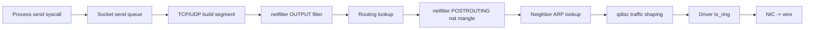
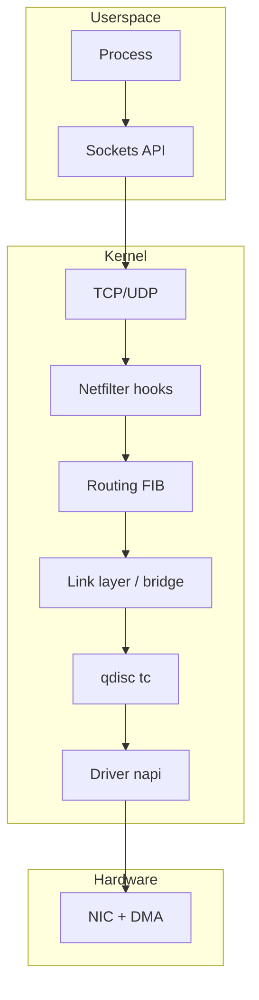

# Linux Networking Deep Dive

> Production-grade networking knowledge for senior SRE / DevOps / Platform engineers.
> Every command in this folder has been used to debug a real outage somewhere.

## Why this matters

Networking is the #1 cause of "it works on my machine" — and the #1 cause of 3 AM pages. Most engineers learn just enough to ship a service, but when latency spikes, packets drop, DNS lies, or conntrack fills up, the difference between a 5-minute fix and a 5-hour incident is whether you understand the **data path** end-to-end. This folder covers how a packet actually moves through a Linux box, from the wire to your process and back.

Containers, Kubernetes, service meshes, and overlays all sit on top of the same primitives covered here: namespaces, veth, bridges, iptables/nftables, conntrack, routing tables, and ARP. Master the primitives, and the abstractions become trivial.

---

## OSI vs TCP/IP — mapped to Linux primitives

| OSI Layer | TCP/IP Layer | Linux Primitive | Tools |
|-----------|--------------|-----------------|-------|
| 7 Application | Application | sockets, libc, openssl | curl, dig, ssh, nc |
| 6 Presentation | Application | TLS, gzip in user space | openssl s_client |
| 5 Session | Application | SO_REUSEPORT, keepalive | ss -ti |
| 4 Transport | Transport | TCP/UDP stack, sysctl net.ipv4.tcp_* | ss, tcpdump |
| 3 Network | Internet | netfilter, routing table, ARP, ICMP | ip route, ip neigh, iptables |
| 2 Data Link | Link | NIC driver, bridge, VLAN, MAC | ip link, bridge, ethtool |
| 1 Physical | Link | NIC hardware, cables, SFP | ethtool, mii-tool |

---

## Full data path — receive side

```mermaid
flowchart LR
  A[Wire/SFP] --> B[NIC PHY]
  B --> C[NIC ring buffer / DMA]
  C --> D[IRQ -> softirq NET_RX]
  D --> E[napi_poll driver]
  E --> F[GRO aggregate]
  F --> G[netfilter PREROUTING raw mangle nat]
  G --> H[Routing decision]
  H --> I[netfilter INPUT filter]
  I --> J[TCP/UDP stack]
  J --> K[Socket receive queue]
  K --> L[Process recv syscall]
```

<!-- mermaid:rendered -->
<p align="center"></p>

<details><summary>Mermaid source</summary>



</details>
## Full data path — transmit side

<!-- mermaid:rendered -->
<p align="center"></p>

<details><summary>Mermaid source</summary>



</details>
## Layer-to-layer container view

<!-- mermaid:rendered -->
<p align="center"></p>

<details><summary>Mermaid source</summary>



</details>
---

## Concepts

- **Three planes:** data plane (packets), control plane (routes/ARP), management plane (config/SSH).
- **Netfilter hooks (5):** PREROUTING, INPUT, FORWARD, OUTPUT, POSTROUTING — every packet hits these in order.
- **Conntrack:** stateful flow table (`/proc/net/nf_conntrack`); essential for NAT, firewalls, and load balancers.
- **Routing decision happens TWICE** for forwarded packets: once after PREROUTING, once after OUTPUT for locally generated.
- **NIC offloads:** GRO/GSO/TSO/LRO/checksumming — hide real packet sizes from tcpdump.
- **MTU & path MTU:** 1500 default Ethernet; PMTUD relies on ICMP "Frag Needed" — broken if firewalls eat ICMP.
- **Sockets:** AF_INET (IPv4), AF_INET6, AF_UNIX (IPC), AF_PACKET (raw), AF_NETLINK (kernel control).

---

## 30+ networking commands cheat-table

| Command | Purpose |
|---------|---------|
| `ip addr show` | List interfaces + IP addresses |
| `ip -br addr` | Brief one-line-per-interface view |
| `ip link show` | Layer-2 link state, MAC, MTU |
| `ip link set eth0 up` | Bring interface up |
| `ip route show` | Main routing table |
| `ip route get 8.8.8.8` | Which route a packet WILL take |
| `ip rule show` | Policy routing rules (RPDB) |
| `ip neigh show` | ARP / neighbor cache |
| `ip -s link show eth0` | Per-NIC stats (rx/tx errors, drops) |
| `ip netns list` | Network namespaces |
| `bridge fdb show` | Bridge MAC forwarding table |
| `bridge vlan show` | Per-port VLAN config |
| `ss -tunlp` | Sockets: TCP UDP listen, numeric, PID |
| `ss -ti` | TCP info: cwnd, rtt, retrans |
| `ss -s` | Socket summary counts |
| `netstat -rn` | Legacy routing table |
| `tcpdump -i eth0 -nn 'port 443'` | Capture HTTPS |
| `tcpdump -i any -w cap.pcap` | Save to file |
| `tshark -i eth0 -Y http` | Wireshark CLI with display filter |
| `dig +short example.com` | DNS A record |
| `dig +trace example.com` | Walk DNS from root |
| `nslookup example.com 8.8.8.8` | Query specific server |
| `host -t MX example.com` | Mail records |
| `getent hosts example.com` | NSS lookup (resolv.conf + hosts + ...) |
| `curl -v --resolve host:443:1.2.3.4 https://host/` | Bypass DNS for testing |
| `nc -lvnp 8080` | Listen for TCP |
| `nc -u -lvnp 5300` | Listen UDP |
| `nmap -sT -p 1-1000 host` | TCP connect scan |
| `mtr -rwbzc 100 8.8.8.8` | Continuous traceroute + loss |
| `traceroute -n -T -p 443 host` | TCP traceroute through firewalls |
| `ping -M do -s 1472 host` | PMTU discovery probe |
| `iptables -t nat -L -n -v` | NAT table with counters |
| `nft list ruleset` | Full nftables ruleset |
| `conntrack -L` | List active flows |
| `conntrack -S` | Conntrack stats |
| `ethtool eth0` | Speed/duplex/link |
| `ethtool -S eth0` | Driver-level stats |
| `ethtool -k eth0` | Offload features |
| `ethtool -g eth0` | Ring buffer sizes |
| `tc qdisc show` | Traffic control queues |
| `tc -s qdisc show dev eth0` | qdisc stats (drops, backlog) |
| `nload eth0` / `iftop -i eth0` / `bmon` | Live bandwidth |
| `arp -an` | Legacy ARP table |
| `sysctl net.ipv4.ip_forward` | Routing enabled? |
| `cat /proc/net/dev` | Per-interface counters |
| `cat /proc/net/sockstat` | Socket usage summary |

---

## Lab — boot a netshoot container with full host access

```bash
# Most loaded networking troubleshooting toolbox available
docker run -it --rm --privileged --net=host --pid=host nicolaka/netshoot

# Inside: try every tool from the table above against the host stack
ip -br addr
ss -tunlp
tcpdump -i any -nn -c 20 'tcp[tcpflags] & (tcp-syn) != 0'
```

> **Gotcha:** `--net=host` means you see the HOST namespace, not a container's.
> Use `nsenter -t <PID> -n ip addr` to inspect another container's namespace.

---

## How to navigate this folder

| File | When to read |
|------|--------------|
| [interfaces-and-bonds.md](interfaces-and-bonds.md) | Setting up NICs, bonding, VLANs, virtual interfaces |
| [routing-and-arp.md](routing-and-arp.md) | "Why isn't this packet leaving?", policy routing, ECMP |
| [iptables-vs-nftables.md](iptables-vs-nftables.md) | Firewall rules, NAT, conntrack debugging |
| [dns-resolution.md](dns-resolution.md) | DNS failures, slow lookups, search-domain weirdness |
| [tcp-internals.md](tcp-internals.md) | TIME_WAIT floods, slow connections, congestion tuning |
| [network-namespaces.md](network-namespaces.md) | Container networking, building your own veth lab |
| [tools-mastery.md](tools-mastery.md) | Become fluent with tcpdump, ss, mtr, ethtool |

---

## 20-year tips

> 1. **The first question in any network incident is "what changed?"** — not "what's broken?". 90% of issues correlate with a deploy, a route change, or a firewall update in the last hour.
> 2. **Trust counters, not theories.** `ip -s link`, `ethtool -S`, `nstat -az`, `ss -s` will tell you what really happened.
> 3. **Capture before you debug.** `tcpdump -i any -w /tmp/$(date +%s).pcap` running in a tmux pane has saved more outages than any dashboard.
> 4. **Conntrack is the silent killer.** When `nf_conntrack: table full, dropping packet` appears in dmesg, you have minutes before total failure.
> 5. **MTU bugs hide as "slow connections."** Small packets work, large ones hang. Always test with `ping -M do -s 1472`.

---

## Common interview questions

> - Walk a packet through the kernel from NIC to userspace process. Where can it be dropped?
> - Difference between TIME_WAIT and CLOSE_WAIT — which side has each, and why?
> - How does a Linux bridge differ from an L3 switch?
> - What's the difference between SNAT, DNAT, and MASQUERADE?
> - Explain conntrack and one way it can break a service.
> - You see 100% packet loss to one IP only. Walk me through the diagnosis.
> - What does `ip route get` actually do?
> - Why is `tcp_tw_recycle` removed from the kernel?

---

## Sources

- `man 7 netdevice`, `man 8 ip`, `man 8 ss`, `man 8 tcpdump`, `man 7 socket`
- Linux kernel docs: `Documentation/networking/`
- RFC 791 (IP), RFC 793 (TCP), RFC 1122 (Host requirements), RFC 5681 (TCP congestion)
- "Linux Observability with BPF" — Calavera & Fontana
- "TCP/IP Illustrated, Volume 1" — W. Richard Stevens
- https://www.kernel.org/doc/html/latest/networking/
