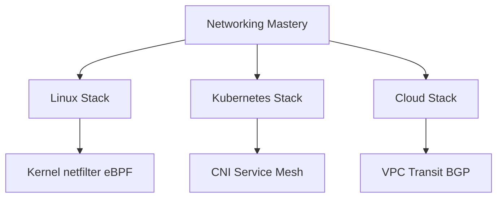
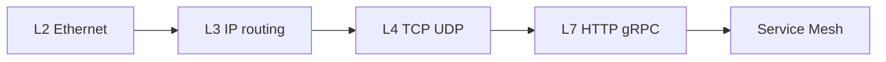
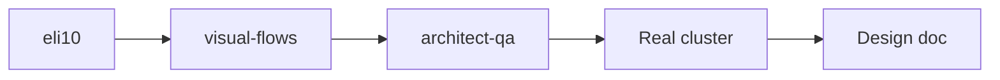
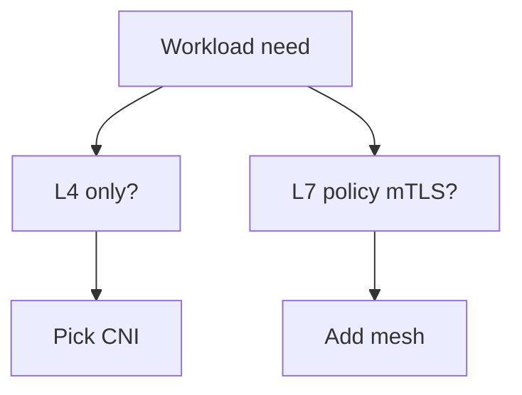

# Networking Mastery — Cross-Stack

Deep mastery folder spanning Linux networking, Kubernetes networking, and
cloud/hybrid connectivity. Built for staff/principal engineers and architects
who need to reason from packet to platform.

## Scope

This mastery folder is intentionally cross-stack. Networking is the one
discipline where Linux kernel knobs, container runtime choices, K8s primitives,
CNI plugin internals, cloud VPC constructs, and on-prem BGP fabrics all collide
in a single packet path. You cannot reason about pod latency without
understanding conntrack. You cannot pick a CNI without understanding eBPF
tradeoffs. You cannot scale DNS without understanding NodeLocal caches.

## Files

| File | Purpose | Audience |
|------|---------|----------|
| README.md | Index + org chart | Everyone |
| architect-qa.md | 50+ architect-level Q&A | Staff / Principal / Architect |
| eli10.md | Plain-English analogies | Anyone, especially newcomers |
| visual-flows.md | 12 mermaid packet-path diagrams | Visual learners, reviewers |

## Org Chart

<!-- mermaid:rendered -->

Mermaid source

## How To Use

- New to networking? Start with `eli10.md`. Read every analogy, then run the
  tcpdump/dig/curl commands at the end of each section on a real cluster.
- Preparing for an architecture interview or design review? Read
  `architect-qa.md` end to end. Each Q is a real production scenario.
- Reviewing a design doc or whiteboarding? Pull a diagram from
  `visual-flows.md` and trace the packet with the team.

## Layers Covered

<!-- mermaid:rendered -->

Mermaid source

## Linux Primitives

- veth pairs, bridges, network namespaces
- iptables, nftables, conntrack
- IPVS, eBPF/XDP
- routing tables, policy routing, fwmark
- tc, qdisc, netem
- socket options, TCP tuning (BBR, rmem/wmem)

## Kubernetes Primitives

- Pod network, ClusterIP, NodePort, LoadBalancer, ExternalName
- Headless services, EndpointSlices
- NetworkPolicy (L3/L4), AdminNetworkPolicy
- Ingress, Gateway API
- CoreDNS, NodeLocal DNSCache
- CNI: Calico, Cilium, Flannel, AWS VPC CNI, Azure CNI

## Cloud / Hybrid

- VPC, subnets, route tables, NAT gateways
- Transit Gateway, Cloud Router, vWAN
- Direct Connect / ExpressRoute / Interconnect
- Private Service Connect, PrivateLink
- Multi-cluster service mesh (Istio multi-primary, Cilium ClusterMesh)
- Global load balancing, Anycast, GeoDNS

## Reading Order For An Architect

<!-- mermaid:rendered -->

Mermaid source

1. Skim `eli10.md` for vocabulary and analogies.
2. Internalize packet paths from `visual-flows.md`.
3. Drill `architect-qa.md` to build judgment for tradeoffs.
4. Validate on a real cluster with tcpdump, ss, conntrack, cilium monitor.
5. Write or review the design doc.

## Critical Tools To Master

| Tool | Layer | Use |
|------|-------|-----|
| tcpdump | L2-L7 | Capture packets on any interface |
| ss | L4 | Socket state, listen queues |
| conntrack | L4 | NAT and connection tracking |
| ip | L2-L3 | Addresses, routes, namespaces, links |
| nft | L3-L4 | Modern packet filter |
| dig | L7 DNS | Resolution debugging |
| curl --resolve | L7 | Bypass DNS for cert and routing tests |
| cilium monitor | L3-L7 | eBPF dataplane visibility |
| istioctl proxy-config | L7 | Envoy state in mesh |
| mtr | L3 | Path latency and loss |

## Mental Models

- The packet always wins. If your mental model disagrees with tcpdump,
  the model is wrong.
- Conntrack is the silent killer at scale. Watch table size, watch eviction.
- DNS is the most common outage cause in K8s. Cache locally.
- MTU mismatches cause silent throughput collapse. Fragment-aware paths only.
- Every overlay costs CPU and obscures debugging. Justify every tunnel.

## Anti-Patterns To Reject

- One giant flat L2 across an entire datacenter
- ClusterIP exposed externally via NodePort with no rate limiting
- iptables with 50k+ rules on every node (use IPVS or eBPF)
- DNS TTL of 5s on a service called millions of times per minute
- Picking a service mesh because it is trendy, not because L7 policy is needed
- Cross-AZ chatty microservices with no topology-aware routing

## Cross-Stack Decision Framework

<!-- mermaid:rendered -->

Mermaid source

When designing, always answer in this order:
1. What latency budget do I have?
2. What is the blast radius of one node failure?
3. What is the failure mode of the control plane (CNI controller, mesh CP)?
4. How do I observe a packet at every hop?
5. How do I roll this back without downtime?

## Production War Stories Embedded

The Q&A file embeds real failures: NodeLocal DNSCache rollout that broke
search domains, Cilium kube-proxy replacement and conntrack table overflow,
AWS VPC CNI pod-density limits, Istio sidecar injection breaking initContainers
that need network, BGP session flaps from TOR maintenance, MTU 9001 vs
1500 path with VXLAN encapsulation overhead.

## Companion Folders

This mastery folder pairs with the broader `13-networking-deep/` lessons that
another agent maintains. Use those for hands-on labs; use this folder for
architectural judgment.

## Maintenance

- Add new Q&A whenever a real outage teaches a new tradeoff.
- Add a new diagram whenever a packet path is non-obvious.
- Never remove an analogy from `eli10.md`; only add.
- Keep mermaid diagrams under 6 nodes for whiteboard portability.
