# Networking ELI10 — Explain It Like I'm Ten

Networking is just kids passing notes in a giant school. Once you accept
that, every fancy word collapses into something obvious.

Each section: an analogy, the real thing, a simple diagram, and commands
you can run on a real cluster to see it happen.

---

## 1. IP Address — The House Number

### Analogy
Every house on the street has a number. You write the number on the
envelope. The postman knows how to find it. If two houses had the same
number, the postman would lose his mind. That's why your computer
freaks out when two devices have the same IP.

### Real
An IP address is a 32-bit number (IPv4) like `10.0.0.5` or a 128-bit
number (IPv6) like `2001:db8::1`. It identifies one network interface
at one moment in time. It can change (DHCP) or be fixed (static).

### Diagram
<!-- mermaid:rendered -->

Mermaid source

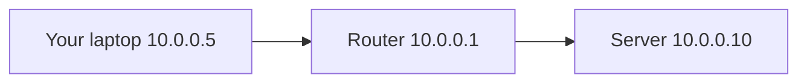

### Try it
- `ip addr show` — see your house numbers
- `ip route` — see which road leads where
- `ping 10.0.0.10` — knock on a neighbor's door

---

## 2. Port — The Room Number

### Analogy
Your house has many rooms. The kitchen is room 80, the bedroom is room
22, the office is room 443. The postman delivers to the house, but
inside the house, the right person picks it up based on the room number.

### Real
A port is a 16-bit number (0-65535) that tells the operating system
which program should receive the data. Web servers listen on 80 (HTTP)
or 443 (HTTPS). SSH on 22. DNS on 53. Your browser uses a random
ephemeral port (e.g., 51234) when it talks out.

### Diagram
<!-- mermaid:rendered -->

Mermaid source

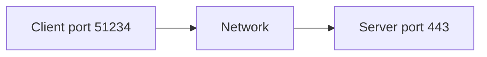

### Try it
- `ss -tlnp` — see which programs are waiting at which rooms
- `nc -zv example.com 443` — knock on room 443
- `lsof -iTCP -sTCP:LISTEN` — list every door that's open

---

## 3. DNS — The Phone Book

### Analogy
You don't memorize your friends' phone numbers anymore. You type
"Mom" and the phone looks it up. DNS does that for the internet.
You type `google.com`, and DNS tells your computer it lives at
`142.250.190.78`.

### Real
DNS (Domain Name System) is a global, hierarchical, distributed key-value
store. Your computer asks a resolver, which asks root servers, then TLD
servers, then authoritative servers, and the answer comes back. Results
are cached based on TTL.

### Diagram
<!-- mermaid:rendered -->

Mermaid source

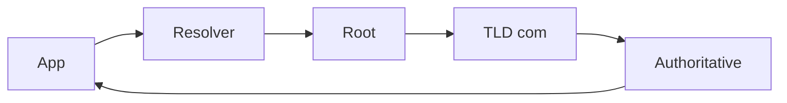

### Try it
- `dig google.com` — full lookup with timing
- `dig +trace google.com` — watch the chain happen
- `dig @8.8.8.8 google.com` — ask a specific resolver

---

## 4. NAT — The Secretary at the Door

### Analogy
Imagine all the kids in a classroom want to call their parents from one
phone in the hallway. The secretary picks up, dials, and notes who is
waiting on which line. When the parent calls back, she knows which kid
to hand the phone to. Outside the office, all calls look like they come
from the secretary's number — your real number is hidden.

### Real
NAT (Network Address Translation) lets many private IPs share one public
IP. A NAT box rewrites source IP/port on the way out and reverses it on
the way back, using a translation table. This is why your home router
gives every device a `192.168.x.x` but the internet sees only your
public IP.

### Diagram
<!-- mermaid:rendered -->

Mermaid source

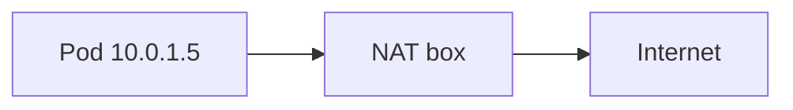

### Try it
- `curl ifconfig.me` — see your public face
- `conntrack -L` (Linux) — peek at the secretary's notebook
- `iptables -t nat -L -n -v` — see the rewrite rules

---

## 5. CNI — The Wires Inside the Lego City

### Analogy
You build a city out of Lego bricks. Each Lego house (a pod) needs a
wire to talk to others. Someone has to plan: which wire goes where, who
gets which house number, who handles the toll booths. That planner is
the CNI.

### Real
CNI (Container Network Interface) is the Kubernetes plug-in that gives
every pod an IP, sets up the veth pair to the node, programs the routes,
applies network policy, and (sometimes) handles overlay encapsulation.
Examples: Calico, Cilium, Flannel, AWS VPC CNI.

### Diagram
<!-- mermaid:rendered -->

Mermaid source

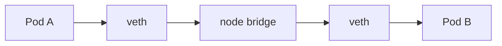

### Try it
- `kubectl get pods -n kube-system | grep -i cni` — find your CNI
- `ip netns list` — pod network namespaces (on the node)
- `cilium status` (if Cilium) — full dataplane state

---

## 6. Service Mesh — Magic Walkie-Talkie Between Every Kid

### Analogy
Every kid in school carries a magic walkie-talkie. It encrypts their
voice, records who said what, retries when the signal is weak, and
refuses to connect if the principal said no. The kids never write any
of that logic themselves — the walkie-talkie does it.

### Real
A service mesh injects a sidecar proxy (Envoy) next to every pod. The
proxy handles mTLS, retries, traffic shifting, observability, and
authorization without app code. Examples: Istio, Linkerd, Cilium
Service Mesh, Consul Connect.

### Diagram
<!-- mermaid:rendered -->

Mermaid source

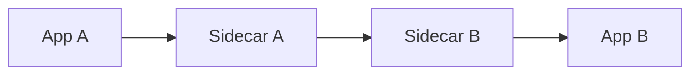

### Try it
- `istioctl proxy-status` — every sidecar's view of the world
- `kubectl logs <pod> -c istio-proxy` — sidecar logs
- `istioctl proxy-config cluster <pod>` — what upstreams it knows

---

## 7. Ingress — The Front Gate of the Park

### Analogy
A theme park has many rides inside. But you don't enter through each
ride; you enter through the front gate. The gate checks your ticket and
points you to the right ride. Ingress is the front gate of your cluster.

### Real
Ingress / Gateway routes external HTTP(S) traffic into the cluster based
on hostname and path. One LoadBalancer fronts an Ingress controller
(nginx, Traefik, Envoy Gateway), which forwards to many Services.

### Diagram
<!-- mermaid:rendered -->


Mermaid source

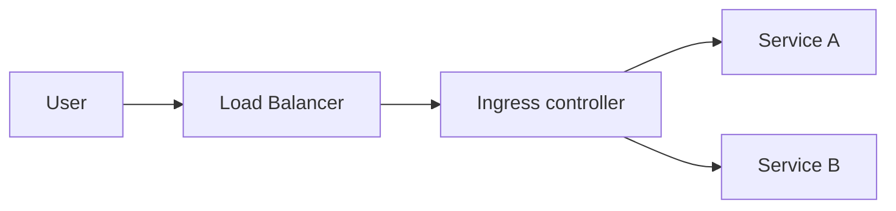

### Try it
- `kubectl get ingress -A` — list every front gate
- `curl -H "Host: foo.example" http://LB-IP/` — test routing
- `kubectl logs -n ingress-nginx deploy/ingress-nginx-controller`

---

## 8. Service (ClusterIP) — The Class Representative

### Analogy
Instead of every kid memorizing every other kid's seat, each class has
a representative. You hand your note to the rep, the rep finds the kid.
If a kid is absent, the rep skips them. Pods come and go; the Service
stays.

### Real
A ClusterIP Service has a stable virtual IP and DNS name. Behind it is
a list of pod IPs (EndpointSlices). kube-proxy or eBPF programs the
node to load-balance traffic to pods. When a pod dies, the endpoint is
removed.

### Diagram
<!-- mermaid:rendered -->


Mermaid source

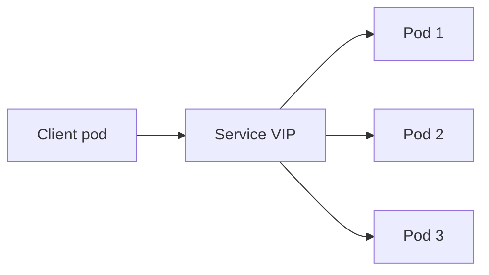

### Try it
- `kubectl get svc` — list class reps
- `kubectl get endpointslices` — who is currently in class
- `kubectl run -it --rm test --image=busybox -- wget -O- svc-name`

---

## 9. NodePort — The Window Slot in the Wall

### Analogy
Pretend the school is locked. There's a slot at every classroom window
labeled the same number, like 30080. You shove a note through any
window and it ends up in the right class. Convenient, but a bit ugly.

### Real
NodePort opens the same port (30000-32767 by default) on every node.
Traffic to `<any-node-ip>:30080` is forwarded to the Service. Useful
when there is no cloud LB, or as the target of an external LB.

### Diagram
<!-- mermaid:rendered -->


Mermaid source

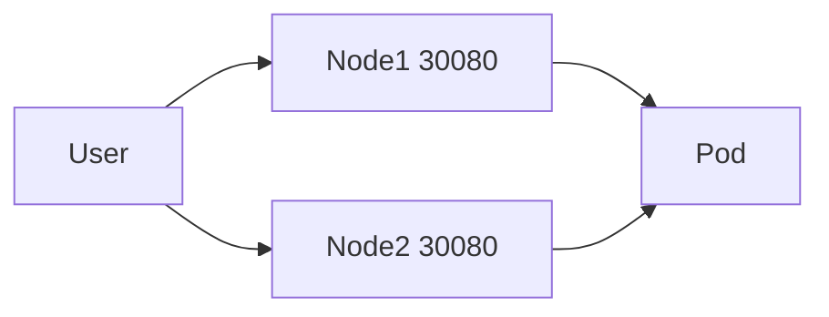

### Try it
- `kubectl get svc -o wide` — find NodePort entries
- `curl http://<node-ip>:30080`
- `iptables -t nat -L KUBE-NODEPORTS -n` — see the rules

---

## 10. LoadBalancer — The Big Sign Outside

### Analogy
The school puts a giant sign outside with a phone number. Anyone can
call it. The sign forwards calls into the school's switchboard. The
sign is paid for and looks fancy.

### Real
A LoadBalancer Service asks the cloud for an external load balancer
(AWS ELB, GCP forwarding rule, Azure LB). The LB forwards to NodePort
or directly to pods (with right CNI). Costs money. Use one per app or
share via Ingress.

### Diagram
<!-- mermaid:rendered -->


Mermaid source

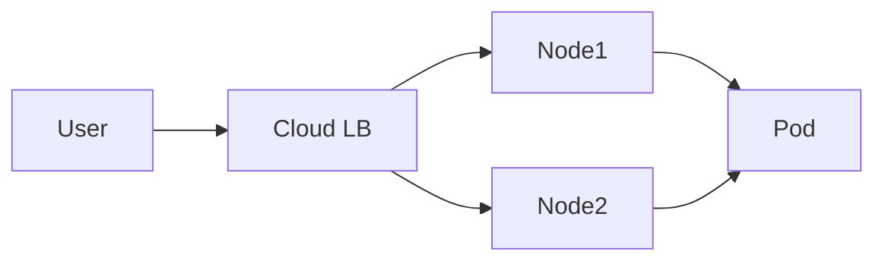

### Try it
- `kubectl get svc -w` — watch the EXTERNAL-IP appear
- `dig <lb-hostname>` — resolve the cloud-assigned name
- AWS: `aws elbv2 describe-load-balancers` — find it on the cloud side

---

## 11. NetworkPolicy — The Hall Monitor

### Analogy
The hall monitor stands in the corridor with a clipboard. She knows
which kids are allowed to visit which classrooms. If a kid not on the
list shows up, she stops them.

### Real
NetworkPolicy is a Kubernetes object that allows or denies pod-to-pod
traffic based on labels, namespaces, and ports. It needs a CNI that
implements it (Calico, Cilium, not basic Flannel). Default is allow-all
unless a policy applies.

### Diagram
<!-- mermaid:rendered -->


Mermaid source

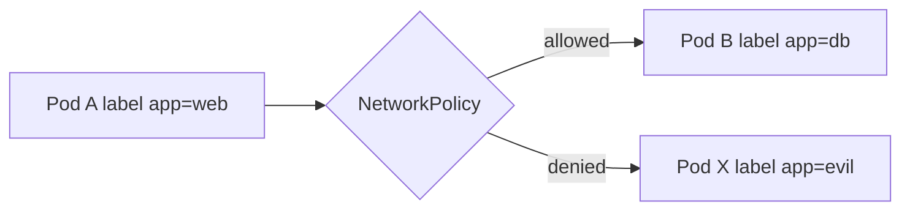

### Try it
- `kubectl get networkpolicy -A`
- `kubectl exec -it test -- nc -zv <other-pod-ip> 5432`
- `cilium policy get` (if Cilium)

---

## 12. tcpdump — The Tape Recorder on the Wire

### Analogy
You suspect kids are passing weird notes. You stick a tape recorder on
the corridor and capture every note that passes. Later you replay it
to see exactly who said what.

### Real
`tcpdump` reads raw packets off an interface. You can filter by IP,
port, protocol. Save to pcap, open in Wireshark for visual inspection.
The single most useful debugging tool in networking.

### Diagram
<!-- mermaid:rendered -->

Mermaid source

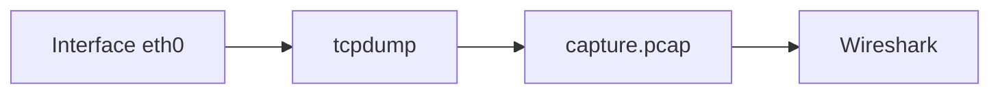

### Try it
- `tcpdump -i any -n port 53` — watch DNS in real time
- `tcpdump -i any -nn -w out.pcap host 10.0.0.5` — record a host
- Open `out.pcap` in Wireshark and follow a TCP stream

---

## 13. dig — The Phone Book Look-Upper

### Analogy
You want to know the secretary's number for "Mom" without dialing it.
You flip open the phone book. `dig` flips open DNS for you, shows you
exactly which page it found, what time the entry was last updated, and
how long the answer is good for.

### Real
`dig` is a CLI for DNS. Asks a resolver and shows the full response
including answer section, TTL, query time, server used.

### Diagram
<!-- mermaid:rendered -->

Mermaid source

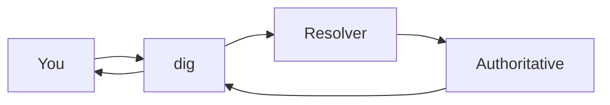

### Try it
- `dig kubernetes.default.svc.cluster.local`
- `dig +short example.com`
- `dig -x 8.8.8.8` — reverse lookup

---

## 14. curl — The Universal Hand Wave

### Analogy
You want to test whether the librarian is at the desk. You walk over,
wave, and see if she waves back. `curl` is your wave: it sends a
request and tells you exactly what came back.

### Real
`curl` makes HTTP(S), and many other protocol, requests. With `-v` it
shows TLS handshake, headers, response. With `--resolve` you bypass
DNS for cert testing. Indispensable.

### Diagram
<!-- mermaid:rendered -->

Mermaid source

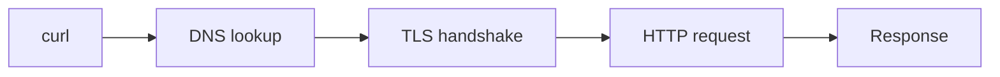

### Try it
- `curl -v https://example.com`
- `curl --resolve api.foo.com:443:10.0.0.5 https://api.foo.com/health`
- `curl -w "%{time_total}\n" -o /dev/null -s https://example.com`

---

## 15. eBPF — The Smart Sticker on Every Door

### Analogy
Imagine every door in the school had a smart sticker. The sticker can
read the note coming in, decide instantly to allow it, deny it, redirect
it, or count it — all without bothering the teacher. eBPF stickers run
inside the kernel itself.

### Real
eBPF is a sandboxed virtual machine inside the Linux kernel. Programs
attach to hooks (network packets, syscalls, tracepoints) and run with
near-native speed. CNIs use it for routing, policy, observability without
iptables.

### Diagram
<!-- mermaid:rendered -->


Mermaid source

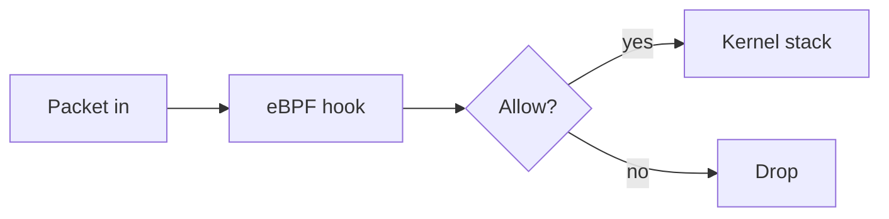

### Try it
- `bpftool prog show` — list loaded programs
- `cilium monitor --type drop` — see eBPF drops live
- `bpftrace -e 'tracepoint:net:net_dev_xmit { @ = count(); }'`

---

## Putting It All Together

A user clicks a link in their browser. Here is the whole school
analogy in one shot:

1. The browser opens its phone book (DNS) and finds the server's number.
2. It picks a random room (ephemeral port) and writes a note to room 443
   at that server.
3. The note goes through the school secretary (NAT) to hide the real
   sender.
4. It crosses the corridor (network) and arrives at the front gate
   (Ingress).
5. The gate hands it to the class representative (Service).
6. The rep picks one kid in the class (Pod) to read the note.
7. The kid's walkie-talkie (sidecar) decrypts and verifies the message
   first.
8. The kid writes a reply, and the whole chain reverses.

The packet always wins. If you remember nothing else, run `tcpdump` on
both ends and trust what you see.
