# Visual Flows — Networking Packet Paths

12 simple mermaid flowcharts. Each follows the rules: max 6 nodes,
no newlines in labels, no quotes in labels, no unquoted special
characters. Pin these up next to your monitor.

---

## 1. Pod-to-Pod Same Node

A pod talks to another pod on the same node. No routing, no overlay —
straight through the node bridge or eBPF map.

<!-- mermaid:rendered -->

Mermaid source

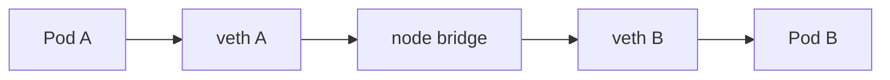

Notes:
- veth pair: one end in pod netns, one on the node.
- With Cilium eBPF, the bridge is replaced by a BPF map lookup.
- Latency: sub-millisecond, no encapsulation cost.

---

## 2. Pod-to-Pod Across Nodes (Overlay)

VXLAN or Geneve encapsulation across the underlay network.

<!-- mermaid:rendered -->

Mermaid source

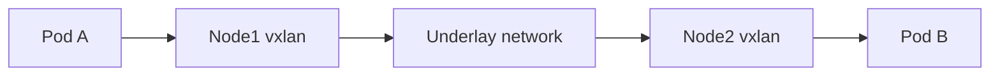

Notes:
- Outer header adds 50 bytes; MTU planning required.
- Encap/decap cost is on the node CPU.
- Visible as UDP 8472 (VXLAN) on the underlay.

---

## 3. Pod-to-Service-to-Backend (ClusterIP)

The Service VIP is virtual. kube-proxy or eBPF rewrites destination.

<!-- mermaid:rendered -->


Mermaid source

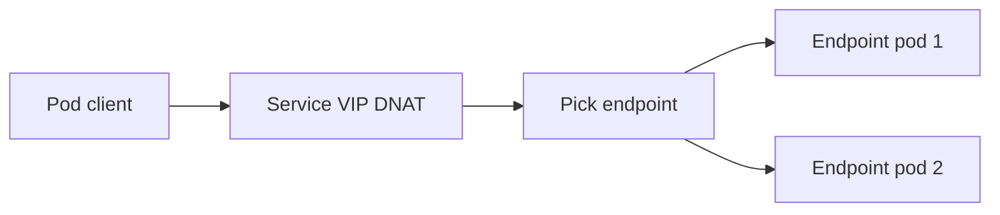

Notes:
- DNAT happens on the source node before the packet leaves.
- Conntrack stores the rewrite for the reverse path.
- With Cilium kube-proxy replacement, BPF maps replace iptables.

---

## 4. NodePort Path

External client hits a node port; kube-proxy forwards to a pod.

<!-- mermaid:rendered -->


Mermaid source

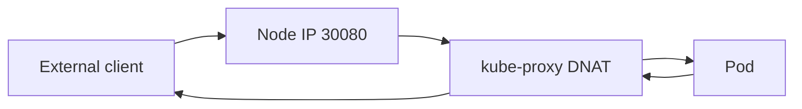

Notes:
- externalTrafficPolicy=Cluster: SNATs source, hides client IP.
- externalTrafficPolicy=Local: preserves client IP, only routes to local pods.
- If no local pod with Local policy, packet is dropped.

---

## 5. LoadBalancer External Traffic

Cloud LB forwards to nodes (or directly to pods with right CNI).

<!-- mermaid:rendered -->

Mermaid source

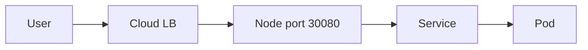

Notes:
- AWS NLB target type=ip can reach pods directly.
- Health checks must succeed against NodePort or pod port.
- TLS terminates at LB, cluster, or pod depending on design.

---

## 6. DNS Lookup Inside Cluster

Pod resolves a service name through CoreDNS.

<!-- mermaid:rendered -->

Mermaid source

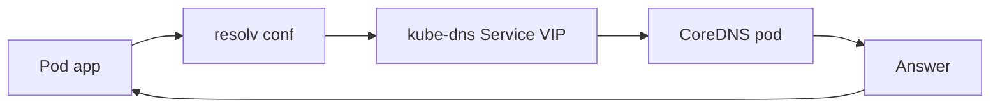

Notes:
- ndots:5 default causes search domain expansion.
- 5s timeout symptom = conntrack race on UDP NAT.
- NodeLocal DNSCache inserts a local cache before kube-dns.

---

## 7. NodeLocal DNSCache

Local cache short-circuits CoreDNS for cache hits.

<!-- mermaid:rendered -->

Mermaid source

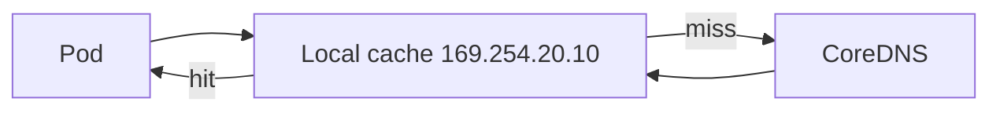

Notes:
- Listens on link-local IP, no NAT, no UDP race.
- Talks TCP upstream to CoreDNS, eliminating UDP issues.
- iptables NOTRACK rules keep conntrack out of the path.

---

## 8. eBPF Hook on Pod Egress

eBPF program inspects and forwards in-kernel.

<!-- mermaid:rendered -->

Mermaid source

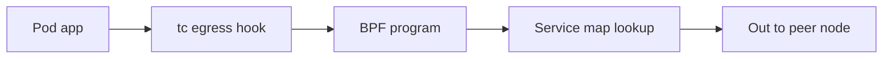

Notes:
- No iptables traversal, no conntrack for known flows.
- Hubble taps the BPF program output for observability.
- Verifier guarantees the program halts and is memory-safe.

---

## 9. Ingress to Pod via Gateway

External traffic through Ingress controller to a backend pod.

<!-- mermaid:rendered -->

Mermaid source

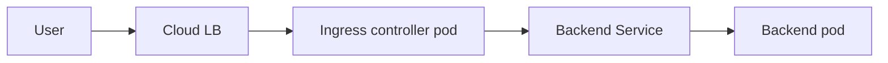

Notes:
- Ingress controller terminates TLS by default.
- Host header drives routing rules.
- Pod can be in any namespace via Ingress rules.

---

## 10. Service Mesh East-West Traffic

Two pods talk through their sidecars with mTLS.

<!-- mermaid:rendered -->

Mermaid source

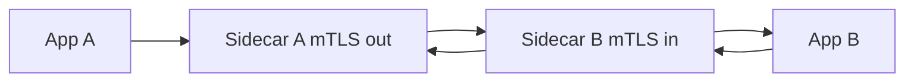

Notes:
- App talks plain to its own sidecar over loopback.
- Sidecar A terminates app TLS, opens mTLS to sidecar B.
- AuthorizationPolicy evaluated at sidecar B.

---

## 11. Multi-Cluster via East-West Gateway

Cross-cluster traffic in Istio multi-primary.

<!-- mermaid:rendered -->

Mermaid source

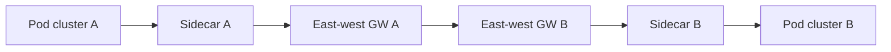

Notes:
- SNI routing on the east-west gateways.
- mTLS preserved end-to-end with SPIFFE identity.
- Service entries in each cluster point at remote gateway.

---

## 12. Hybrid Cloud Egress via Transit Gateway

On-prem service consumed by a cloud pod through TGW + Direct Connect.

<!-- mermaid:rendered -->

Mermaid source

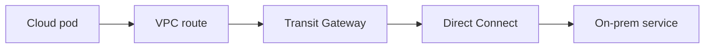

Notes:
- BGP advertises on-prem prefixes into the TGW route table.
- Backup IPSec VPN with lower BGP local-preference.
- DNS resolved via Route53 outbound resolver to on-prem AD.

---

## How to Use These Diagrams

- Whiteboard one at the start of any design discussion.
- When debugging, trace your hypothesis on the diagram before opening
  tcpdump.
- Annotate each arrow with the actual latency you measured.
- If reality disagrees with the diagram, the diagram is wrong — update
  it before you forget.

## Quick Lookup Table

| Diagram | Use when |
|---------|----------|
| 1 Pod same node | Validating low-latency assumption |
| 2 Pod cross node | Debugging overlay MTU / encap |
| 3 Pod to Service | Conntrack and DNAT issues |
| 4 NodePort | External access without LB |
| 5 LoadBalancer | Cloud-managed external LB design |
| 6 DNS lookup | Resolution failures |
| 7 NodeLocal cache | Eliminating 5s timeouts |
| 8 eBPF egress | Performance tuning, drop debugging |
| 9 Ingress | HTTPS routing design |
| 10 Mesh east-west | mTLS and policy debugging |
| 11 Multi-cluster | Cross-cluster service consumption |
| 12 Hybrid egress | On-prem integration design |

## Drawing Rules Recap

For your own diagrams in this folder:
- Max 6 nodes per chart so it fits on a whiteboard.
- One subject per chart; do not cram L2 + L7 into one.
- Label arrows with the protocol or hop kind.
- Avoid newlines and quoted strings inside labels.
- Use flowchart LR for paths, flowchart TB for layered views.

## Validation Steps

After whiteboarding, validate each hop on a real cluster:

1. Diagram 1: `kubectl exec` and ping pod IP on same node.
2. Diagram 2: pod ping across nodes; capture VXLAN on underlay.
3. Diagram 3: `curl service-name`; inspect conntrack.
4. Diagram 4: `curl <node-ip>:<nodeport>`; check externalTrafficPolicy.
5. Diagram 5: hit cloud LB hostname; correlate with LB access logs.
6. Diagram 6: `dig service-name.namespace.svc`; time the answer.
7. Diagram 7: confirm 169.254.20.10 listening on each node.
8. Diagram 8: `cilium monitor --type trace`; watch the hook fire.
9. Diagram 9: `curl -H Host:foo` to LB; check Ingress logs.
10. Diagram 10: `istioctl proxy-config` on both sides.
11. Diagram 11: cross-cluster `kubectl exec curl`; check both gateways.
12. Diagram 12: `traceroute` from pod to on-prem; expect TGW hop.

## When the Packet Disagrees

If your diagram says it should work and tcpdump says it doesn't, the
diagram is missing a hop. Common missing hops:
- An init container that mutates iptables.
- A second NetworkPolicy in another namespace.
- A sidecar that intercepts and drops on a config error.
- A cloud security group denying the port.
- A NAT gateway with port exhaustion.

Add the missing node to your diagram. Keep it under 6 nodes by removing
something else that no longer matters.
