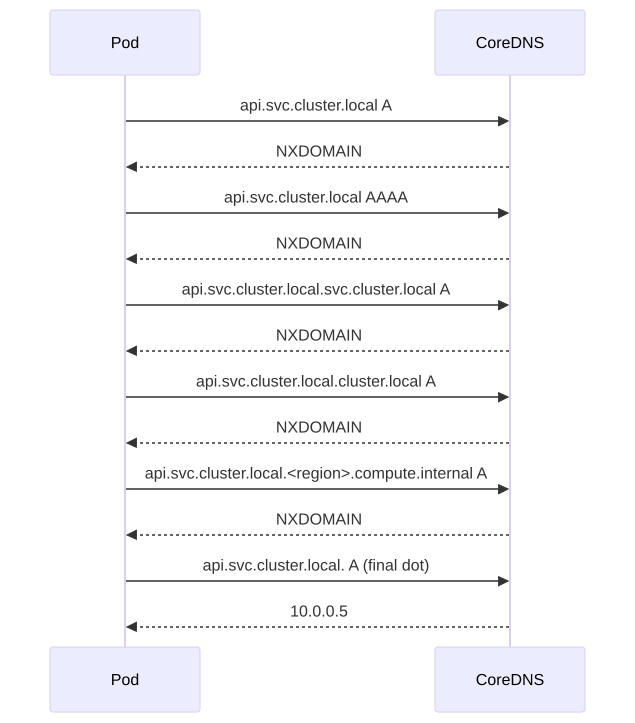
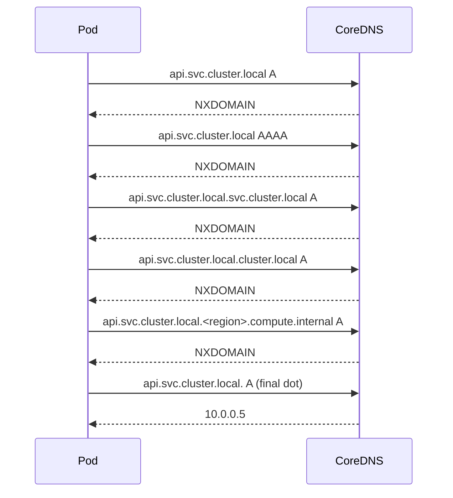
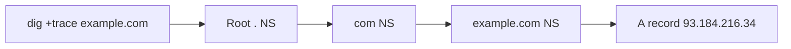

# DNS Resolution on Linux

## Why this matters

DNS is the most common production failure that **looks like** something else. "Service is slow" → it's DNS. "Auth API is failing" → DNS. "Pods can't talk" → DNS. The Linux DNS path is a chain of components — `getaddrinfo()` → NSS → `resolv.conf` (or systemd-resolved) → search domains → cache → upstream — and any link can lie. K8s Pods add `ndots:5` to the mix, which silently triples DNS load. This file is the map of every resolver moving part on a modern Linux box.

---

## DNS resolution flow on Linux

```mermaid
flowchart TB
  APP[App: getaddrinfo example.com] --> NSS[/etc/nsswitch.conf]
  NSS -->|files| HOSTS[/etc/hosts]
  NSS -->|dns| RES[glibc resolver]
  NSS -->|resolve| RD[systemd-resolved 127.0.0.53]
  NSS -->|mdns| AVAHI[avahi]
  HOSTS -->|hit| APP
  RES --> RC[/etc/resolv.conf]
  RC --> SD[search domains expansion]
  SD --> US[Upstream DNS server]
  RD --> CACHE[resolved cache]
  CACHE --> US
  US --> AUTH[Authoritative chain]
```

## ndots = 5 explosion (K8s Pod)

<!-- mermaid:rendered -->
<p align="center"></p>

<details><summary>Mermaid source</summary>



</details>
## dig +trace cascade

<!-- mermaid:rendered -->
<p align="center"></p>

<details><summary>Mermaid source</summary>



</details>
---

## Concepts

### `/etc/nsswitch.conf` — the source of truth
- The `hosts:` line decides resolver order. Typical: `files dns` or `files mdns4_minimal [NOTFOUND=return] dns`.
- `files` → `/etc/hosts`. `dns` → glibc resolver via `/etc/resolv.conf`. `resolve` → systemd-resolved over D-Bus or 127.0.0.53.

### `/etc/resolv.conf`
```text
nameserver 8.8.8.8
nameserver 1.1.1.1
search corp.example.com example.com
options ndots:2 timeout:2 attempts:2 rotate single-request-reopen
```
- **nameserver** — up to 3 (MAXNS); tried sequentially with timeout each.
- **search** — domains appended to short names.
- **ndots:N** — names with FEWER than N dots get search domains tried FIRST as absolute lookups fall back.
- **timeout** — seconds per try.
- **rotate** — round-robin across nameservers.

### systemd-resolved
- Stub resolver listens on `127.0.0.53:53`.
- Real resolv.conf is `/run/systemd/resolve/resolv.conf` (or `stub-resolv.conf`).
- `resolvectl status` shows per-link config.
- Per-interface DNS (great for VPNs) — uses `routing-based DNS`.

### `/etc/hosts`
- Always wins over DNS (unless nsswitch order is changed).
- Use for emergency overrides, dev shortcuts, blocking ad domains.

### glibc resolver quirks
- **Single-request** — without it, A and AAAA queries are sent in parallel **on one socket** — many DNS servers misbehave. Set `options single-request` on noisy networks.
- **Connection refused** on AAAA → app waits for timeout. `options no-aaaa` (glibc 2.31+) helps.
- **Caches NOTHING** by default. Use nscd, systemd-resolved, or app-side caches.

### Common search-domain bugs
- `ndots:5` (K8s default) means `kubernetes.default` triggers search expansion before absolute lookup → 6+ queries per name.
- Solution: use FQDNs ending in `.` (e.g., `kubernetes.default.svc.cluster.local.`).

---

## Commands

```bash
# Configuration view
cat /etc/resolv.conf
cat /etc/nsswitch.conf
resolvectl status                            # systemd-resolved per-link view
resolvectl statistics                        # cache hits, transactions

# Look up a name (lots of ways)
dig example.com                              # full DNS reply
dig +short example.com                       # just the answer
dig @8.8.8.8 example.com                     # specific server
dig +trace example.com                       # walk from root
dig +tcp example.com                         # force TCP
dig -x 8.8.8.8                               # reverse lookup
dig MX example.com                           # specific record type
dig +noall +answer example.com               # clean output

# nslookup (legacy but everywhere)
nslookup example.com 1.1.1.1

# host (one-line)
host -t MX example.com
host -v example.com

# getent — what your APP actually sees (uses NSS!)
getent hosts example.com                      # honors /etc/hosts + resolv.conf
getent ahosts example.com                     # all addresses with families

# resolvectl (systemd)
resolvectl query example.com                  # via stub resolver
resolvectl flush-caches                       # clear cache

# Check what resolv.conf the app actually uses
strace -f -e openat curl http://example.com 2>&1 | grep resolv

# Force-bypass DNS for testing
curl --resolve example.com:443:1.2.3.4 https://example.com/

# Tcpdump DNS
tcpdump -i any -nn -s0 'udp port 53 or tcp port 53'
```

---

## Lab — observe ndots blowup

```bash
docker run -it --rm --privileged --net=host nicolaka/netshoot

# Simulate K8s-style resolv.conf
cat > /tmp/resolv.conf <<EOF
nameserver 8.8.8.8
search svc.cluster.local cluster.local example.com
options ndots:5
EOF

# Capture DNS while we query a short name
tcpdump -i any -nn 'port 53' -c 30 &

# Use the lab resolv.conf via dig
dig @8.8.8.8 +search +domain=svc.cluster.local kubernetes
dig @8.8.8.8 +search +domain=svc.cluster.local kubernetes.default
dig @8.8.8.8 kubernetes.default.svc.cluster.local.   # FQDN, only 1 query

# Compare query counts in tcpdump
wait

# Clean up
rm /tmp/resolv.conf
```

---

## Common DNS failures playbook

| Symptom | Likely cause | Confirm with |
|---------|--------------|--------------|
| `ping host` works, `curl http://host` doesn't | NSS order issue / /etc/hosts vs DNS mismatch | `getent hosts host` |
| 5 second pauses on every connect | A/AAAA parallel bug | `options single-request-reopen` |
| Intermittent NXDOMAIN | rotate + one bad upstream | Remove the bad nameserver |
| K8s Pod slow DNS | ndots:5 + missing FQDN dot | Append `.` to hostnames |
| `dig` works, app fails | resolved stub vs direct disagreement | `strace -e openat` the app |
| Long timeout to specific name | DNSSEC validation failure | `dig +cd` (disable validation) |

---

## Gotchas

> - **`/etc/resolv.conf` may be a symlink** managed by systemd-resolved, NetworkManager, dhclient, or cloud-init. Editing it directly may be reverted.
> - **`search` + `ndots`** can leak internal hostnames externally if the search domain you're appending happens to resolve at the public DNS.
> - **glibc caches NOTHING** — every name is re-resolved per call unless your app or a sidecar caches it.
> - **`hosts: dns files`** (reverse order) is a footgun — DNS will silently mask your `/etc/hosts` overrides.
> - **DNS over UDP truncates at 512 bytes** unless EDNS0 is negotiated. Large TXT/SPF records may need TCP fallback.
> - **systemd-resolved DNSSEC mode "allow-downgrade"** silently drops to plaintext on signing errors → security depends on what you set.

---

## 20-year tips

> 1. **Always test with `getent hosts`** when debugging app-level DNS — `dig` bypasses NSS and gives different answers.
> 2. **Use FQDNs (with the trailing dot)** for any name in production code — eliminates search-domain weirdness and saves DNS load.
> 3. **Run a node-local DNS cache** (NodeLocal DNSCache, dnsmasq, unbound) on every K8s node — cuts DNS latency from 5ms to sub-ms and protects from CoreDNS hiccups.
> 4. **Capture DNS with `tcpdump -i any 'port 53'`** during incident response — half of "slow" tickets vanish when you see the resolver retrying.
> 5. **`options single-request-reopen`** has saved more production hours than any other resolv.conf tweak — copy-paste it into your golden image.

---

## Common interview questions

> - Walk through what `getaddrinfo("example.com")` does on a modern Linux box.
> - What is `ndots` and why does it matter in Kubernetes?
> - Difference between `dig`, `nslookup`, `host`, and `getent`?
> - How does systemd-resolved differ from a plain glibc resolver?
> - Why might `dig` succeed and `curl` fail for the same hostname?
> - Walk through diagnosing a "DNS sometimes returns the wrong IP" report.

---

## Sources

- `man 5 resolv.conf`, `man 5 nsswitch.conf`, `man 1 dig`, `man 8 systemd-resolved`
- RFC 1034 (DNS concepts), RFC 1035 (DNS implementation), RFC 6891 (EDNS0)
- https://systemd.io/RESOLVED-VPNS/
- https://github.com/kubernetes/kubernetes/issues/56903 (the ndots:5 saga)
- "DNS and BIND" — Liu & Albitz (5th ed.)
