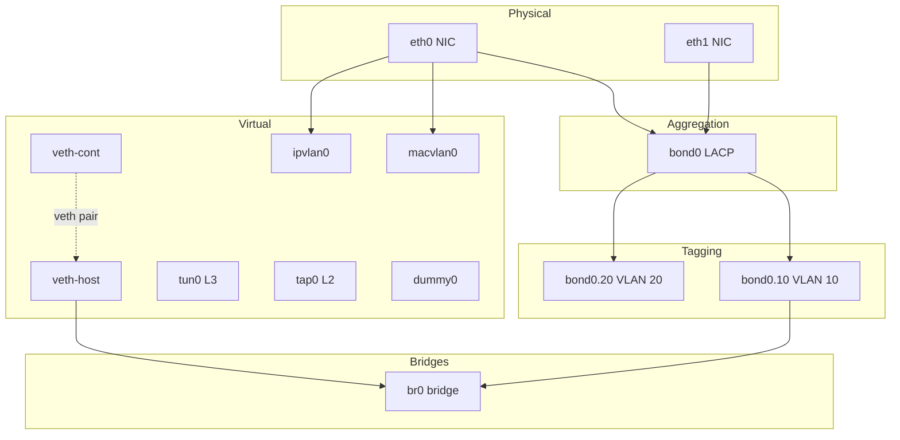
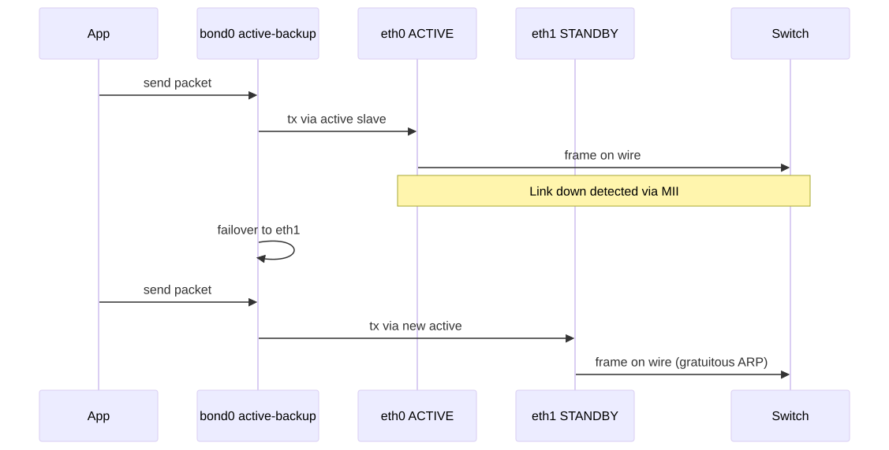
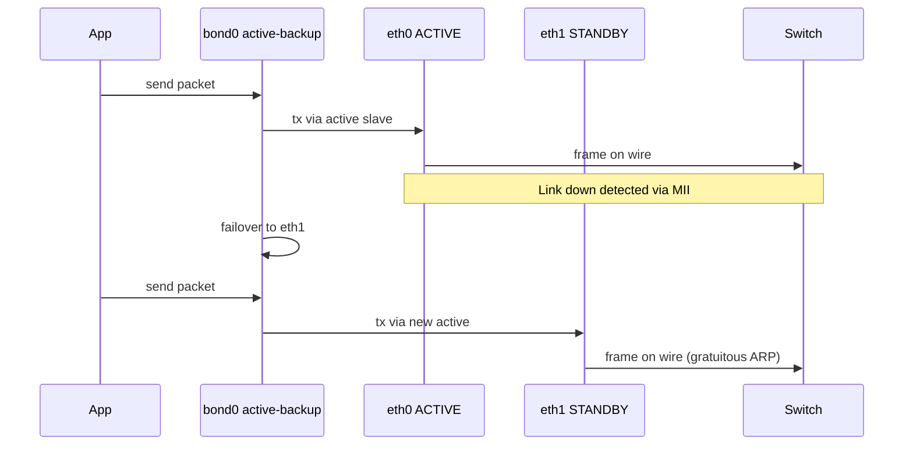
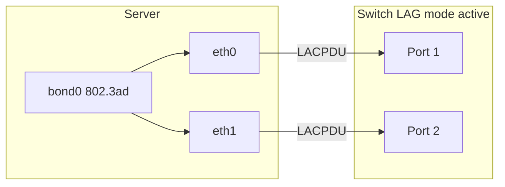

# Interfaces, Bonding & VLANs

## Why this matters

Every packet enters or leaves through an **interface** — physical, virtual, or stacked on top of others. Modern Linux boxes routinely have 30+ interfaces (bonds, VLANs, bridges, veth pairs per container, tunnels, dummies). When you can't reach a service, the answer is almost always "wrong interface" or "wrong MTU on this interface." Understanding the interface zoo is the foundation of everything else — bonding for HA, VLANs for tenancy, veth/bridge for containers, macvlan for performance.

This file is the map of every interface type you'll encounter on a Linux server in 2026.

---

## Interface taxonomy

<!-- mermaid:rendered -->
<p align="center"></p>

<details><summary>Mermaid source</summary>



</details>
## Bond active-backup data flow

<!-- mermaid:rendered -->
<p align="center"></p>

<details><summary>Mermaid source</summary>



</details>
## LACP 802.3ad bundle

<!-- mermaid:rendered -->
<p align="center"></p>

<details><summary>Mermaid source</summary>



</details>
---

## Concepts

### Physical NICs
- One NIC = one PCIe device, one MAC, one driver (e.g., `ixgbe`, `mlx5_core`, `i40e`).
- Has hardware features: ring buffers, queues (RSS for multi-CPU spreading), offloads.

### Virtual interface types
- **veth** — Cable simulator: two ends, packets in one come out the other. Used by Docker/Pods.
- **tap** — L2 device exposed as `/dev/net/tun`; used by VMs (KVM/QEMU).
- **tun** — L3 device; used by VPNs (OpenVPN, WireGuard wraps it).
- **bridge** — Software L2 switch. Learns MACs, floods unknowns. Used by libvirt/Docker.
- **dummy** — Loopback-like, but configurable. Useful for stable IP regardless of NIC state.
- **macvlan** — One NIC, many MACs at L2. Each macvlan has its own MAC; switch sees multiple devices.
- **ipvlan** — One NIC, one MAC, multiple IPs (L2 mode) or L3 routing mode. Better with switches that limit MACs per port.

### Bonding modes
- **mode=0 balance-rr** — round-robin; can reorder packets.
- **mode=1 active-backup** — only one slave active; works with any switch.
- **mode=2 balance-xor** — hash-based; no LACP.
- **mode=4 802.3ad LACP** — proper link aggregation; requires switch config.
- **mode=5 balance-tlb** — adaptive transmit load balancing.
- **mode=6 balance-alb** — adaptive load balancing (rx + tx); uses ARP rewrites.

### VLANs (802.1Q)
- 12-bit VLAN ID (1–4094); 4-byte tag inserted between MAC and EtherType.
- Trunk port = carries multiple tagged VLANs; access port = single untagged VLAN.
- Linux: `ip link add link eth0 name eth0.10 type vlan id 10`.

### MTU
- Default 1500. Jumbo frames = 9000.
- VXLAN adds 50 bytes of overhead (8 VXLAN + 8 UDP + 20 IP + 14 inner Eth) — set MTU 1450 inside.
- WireGuard adds ~60 bytes; set MTU 1420.
- Mismatched MTU = "small pings work, large hang" — classic.

---

## Commands

```bash
# List everything
ip -br link show                                  # one-line summary per link
ip -d link show eth0                              # detailed: kind, MTU, qdisc

# Bring up/down + MTU
ip link set eth0 up                               # admin up
ip link set eth0 mtu 9000                         # jumbo frames

# Add an IP
ip addr add 10.0.0.5/24 dev eth0                  # primary IP
ip addr add 10.0.0.6/24 dev eth0 label eth0:1     # legacy alias

# VLAN
ip link add link eth0 name eth0.10 type vlan id 10  # tag VLAN 10
ip link set eth0.10 up

# Bridge
ip link add br0 type bridge                        # create bridge
ip link set eth0 master br0                        # add port
bridge link show                                   # bridge ports
bridge fdb show br br0                             # learned MACs
bridge vlan show                                   # per-port VLAN

# veth pair
ip link add veth-h type veth peer name veth-c      # create pair
ip link set veth-c netns ns1                       # move one end into ns1

# Bond (active-backup)
ip link add bond0 type bond mode active-backup miimon 100
ip link set eth0 down && ip link set eth0 master bond0
ip link set eth1 down && ip link set eth1 master bond0
ip link set bond0 up
cat /proc/net/bonding/bond0                        # active slave + state

# Bond (LACP 802.3ad)
ip link add bond0 type bond mode 802.3ad miimon 100 lacp_rate fast xmit_hash_policy layer3+4

# macvlan / ipvlan
ip link add mv0 link eth0 type macvlan mode bridge   # macvlan
ip link add iv0 link eth0 type ipvlan mode l2        # ipvlan L2

# Stats per NIC
ip -s link show eth0                                 # rx/tx packets, errors, drops
ethtool -S eth0 | grep -i drop                       # driver-level drop counters
ethtool eth0                                         # speed/duplex/link
ethtool -g eth0                                      # ring buffers
ethtool -G eth0 rx 4096 tx 4096                      # increase rings
ethtool -k eth0                                      # offloads (gro, tso, gso)
ethtool -K eth0 gro off                              # disable GRO for tcpdump clarity

# MTU testing
ping -M do -s 1472 8.8.8.8                           # 1472+28 = 1500; -M do = no fragment
```

---

## Lab — bond + VLAN + bridge in one box

```bash
docker run -it --rm --privileged --net=host nicolaka/netshoot

# Inside container (working on host net):
# Create dummies as fake physical NICs
ip link add eth_d0 type dummy
ip link add eth_d1 type dummy
ip link set eth_d0 up && ip link set eth_d1 up

# Bond them
ip link add bond_lab type bond mode active-backup miimon 100
ip link set eth_d0 master bond_lab
ip link set eth_d1 master bond_lab
ip link set bond_lab up
cat /proc/net/bonding/bond_lab

# Tag VLAN 100 on top of the bond
ip link add link bond_lab name bond_lab.100 type vlan id 100
ip link set bond_lab.100 up

# Bridge that VLAN
ip link add br_lab type bridge
ip link set bond_lab.100 master br_lab
ip link set br_lab up
ip addr add 192.168.100.1/24 dev br_lab

# Verify tower
ip -d link show br_lab
ip -d link show bond_lab.100
ip -d link show bond_lab

# Cleanup
ip link del br_lab
ip link del bond_lab.100
ip link del bond_lab
ip link del eth_d0
ip link del eth_d1
```

---

## Gotchas

> - **macvlan + host comms is broken by design.** A macvlan child interface CANNOT talk to its parent host. Use `ipvlan` or a separate macvlan on the host side.
> - **Bond + bridge + STP** can blackhole traffic for 30s during failover. Use RSTP or `stp_state 0` on the bridge.
> - **VLAN MTU** must equal parent MTU minus 0 (the 4-byte tag is inside the 1500 payload limit on most NICs that support hardware VLAN offload). On older drivers, you may need MTU 1496.
> - **`miimon=0`** (default for some configs) means link state is never checked → bond never fails over.
> - **xmit_hash_policy=layer2** (default) hashes only on MAC, so all traffic to one switch goes via one slave. Use `layer3+4` for real distribution.

---

## 20-year tips

> 1. **Always use `ip -d link` (detailed)** when debugging unfamiliar interfaces — it reveals the type (vlan/bond/veth/macvlan) you may not expect.
> 2. **MTU mismatches in overlays** silently break Pod-to-Pod traffic for large payloads. Always test with `ping -M do -s <size>` after deploying CNI plugins.
> 3. **Disable GRO/TSO before tcpdump** if you need real packet sizes; otherwise you'll see massive 64KB "packets" that never traveled the wire.
> 4. **For LACP, mismatched switch config** (port-channel vs LACP active vs passive) is the #1 cause of "bond looks up but no traffic." Always check `cat /proc/net/bonding/bond0` for "Partner Mac Address" — all zeros means LACP not negotiated.
> 5. **Prefer `ipvlan L3` mode** for high-density containers — fewer broadcasts, lower kernel overhead than bridges.

---

## Common interview questions

> - Difference between macvlan and ipvlan? When use which?
> - What does LACP negotiate? What happens if one side is "active" and the other "passive"?
> - Explain how a veth pair connects two namespaces.
> - Why might a bonded interface show "up" but no traffic flow?
> - Walk me through configuring a tagged VLAN trunk on Linux.
> - What MTU should I set inside a Pod when the underlay is VXLAN over 1500-MTU Ethernet?

---

## Sources

- `man 5 systemd.netdev`, `man 8 ip-link`, `man 8 bridge`
- `Documentation/networking/bonding.rst` (kernel)
- IEEE 802.3ad (LACP), IEEE 802.1Q (VLAN)
- https://www.kernel.org/doc/Documentation/networking/ipvlan.txt
- https://developers.redhat.com/blog/2018/10/22/introduction-to-linux-interfaces-for-virtual-networking
