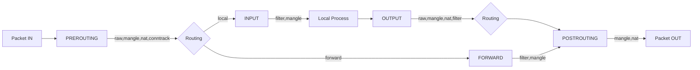
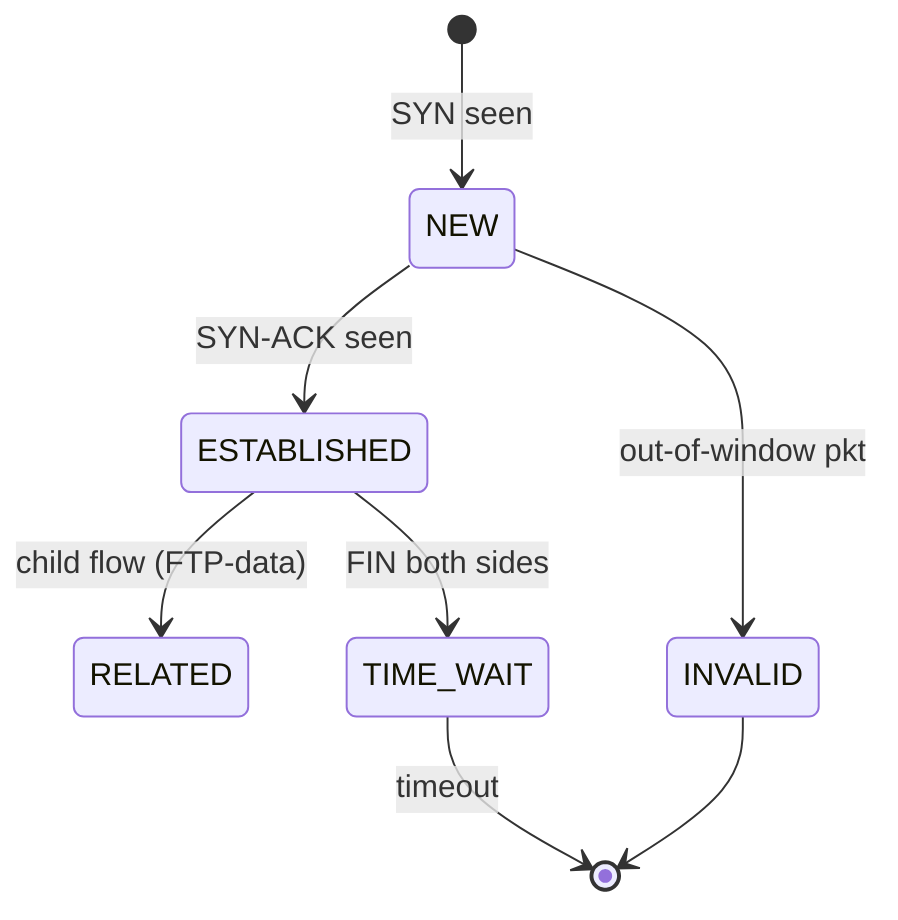
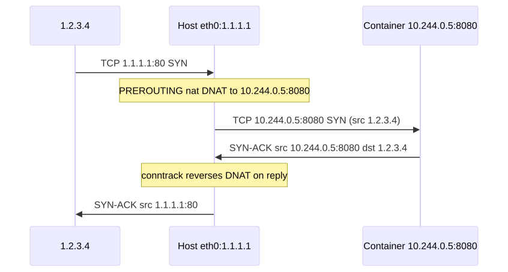
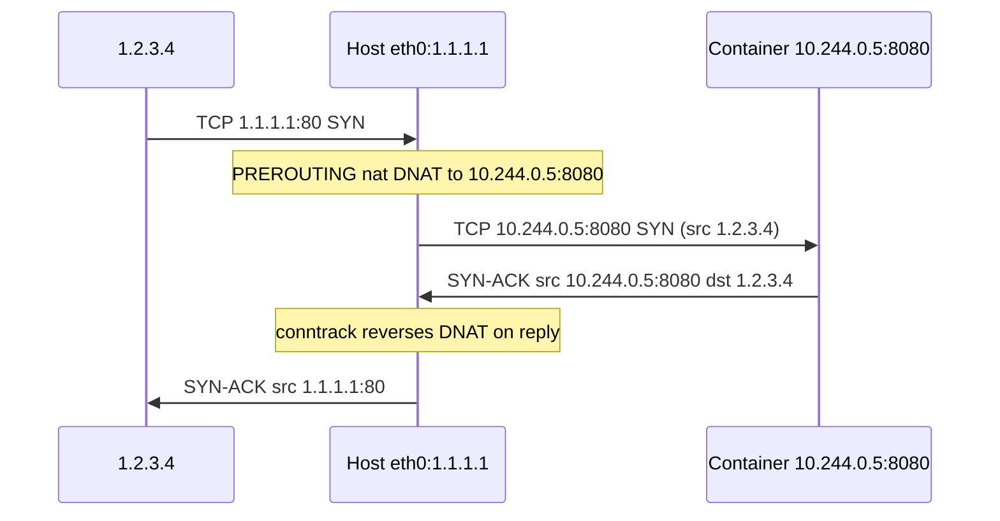

# iptables vs nftables (and conntrack)

## Why this matters

Every firewall, every Kubernetes Service, every Docker port mapping, every NAT gateway runs on **netfilter** — the in-kernel framework that iptables and nftables both wrap. Knowing only `iptables -L` is enough to follow a tutorial; knowing the **table/chain/hook model** is what lets you debug "why is this packet dropping?" in production. Modern distros (RHEL 8+, Debian 11+, Ubuntu 22+) default to nftables, but the iptables CLI still works via a compat shim. You will read both in the wild for the next decade.

This file covers tables, chains, hooks, targets, conntrack, and the nft equivalents — with the senior-engineer mental model.

---

## Netfilter hooks + tables matrix

<!-- mermaid:rendered -->
<p align="center"></p>

<details><summary>Mermaid source</summary>



</details>
## Conntrack lifecycle

<!-- mermaid:rendered -->
<p align="center"></p>

<details><summary>Mermaid source</summary>



</details>
## DNAT for a published service

<!-- mermaid:rendered -->
<p align="center"></p>

<details><summary>Mermaid source</summary>



</details>
---

## Concepts

### Tables (purpose)
- **filter** — ACCEPT / DROP / REJECT (default).
- **nat** — DNAT, SNAT, MASQUERADE; only the **first packet** of a flow is processed (then conntrack handles the rest).
- **mangle** — modify packet headers (TTL, TOS, MARK).
- **raw** — runs before conntrack; used to set NOTRACK or skip CT.
- **security** — SELinux / MLS marking.

### Chains (when they fire)
| Chain | Fires for |
|-------|-----------|
| PREROUTING | every incoming packet, before routing |
| INPUT | packets destined to local process |
| FORWARD | packets being routed through (not local) |
| OUTPUT | packets locally generated |
| POSTROUTING | every outgoing packet, after routing |

### Targets (verbs)
- **ACCEPT** — let it pass.
- **DROP** — silently discard. No reply. Use sparingly (clients hang).
- **REJECT** — discard + send ICMP unreachable / TCP RST.
- **DNAT** — change destination (publish a service).
- **SNAT** — change source (fixed external IP).
- **MASQUERADE** — SNAT but auto-pick src IP from outgoing iface (use for dynamic IPs).
- **REDIRECT** — DNAT to local port (transparent proxy).
- **MARK / CONNMARK** — tag packet/connection for later policy routing.
- **LOG / NFLOG** — log to kernel log / userspace daemon.
- **RETURN** — pop out of user-defined chain.
- **JUMP** — go to user-defined chain.

### Conntrack
- Stateful flow tracker; entries in `/proc/net/nf_conntrack`.
- Required for stateful firewall rules (`-m conntrack --ctstate ESTABLISHED,RELATED -j ACCEPT`).
- Required for NAT (kernel needs to remember the original mapping).
- **Capacity**: `net.netfilter.nf_conntrack_max` — default ~256K, often too low for high-RPS hosts.

---

## Commands — iptables

```bash
# Show ALL tables/chains with line numbers and counters
iptables -t filter -L -nv --line-numbers              # filter table verbose
iptables -t nat    -L -nv --line-numbers              # NAT rules
iptables -t mangle -L -nv --line-numbers
iptables -S                                            # rules in iptables-save format

# Save / restore (production deployment style)
iptables-save > /etc/iptables/rules.v4
iptables-restore < /etc/iptables/rules.v4

# Add basic stateful firewall
iptables -P INPUT DROP                                 # default-deny
iptables -A INPUT -i lo -j ACCEPT                      # loopback
iptables -A INPUT -m conntrack --ctstate ESTABLISHED,RELATED -j ACCEPT
iptables -A INPUT -p tcp --dport 22 -j ACCEPT          # ssh
iptables -A INPUT -p icmp -j ACCEPT                    # ping

# DNAT (publish container :8080 to host :80)
iptables -t nat -A PREROUTING -p tcp --dport 80 \
  -j DNAT --to-destination 10.244.0.5:8080
sysctl -w net.ipv4.ip_forward=1                        # required!

# SNAT (fixed src for outbound traffic)
iptables -t nat -A POSTROUTING -s 10.244.0.0/24 -o eth0 -j SNAT --to-source 1.1.1.1

# MASQUERADE (dynamic outbound, e.g., home router)
iptables -t nat -A POSTROUTING -s 10.244.0.0/24 -o eth0 -j MASQUERADE

# Delete by line number
iptables -D INPUT 4

# Insert at top
iptables -I INPUT 1 -s 10.0.0.5 -j DROP

# Counters
iptables -L INPUT -nv -x                               # exact byte/packet counters
iptables -Z                                            # zero counters
```

## Commands — nftables (modern equivalent)

```bash
# Inspect
nft list ruleset                                       # everything
nft list table inet filter
nft -a list ruleset                                    # show handles for delete

# Build a stateful firewall
nft add table inet filter
nft 'add chain inet filter input { type filter hook input priority 0 ; policy drop ; }'
nft add rule inet filter input iif lo accept
nft add rule inet filter input ct state established,related accept
nft add rule inet filter input tcp dport 22 accept
nft add rule inet filter input ip protocol icmp accept

# DNAT
nft add table ip nat
nft 'add chain ip nat prerouting { type nat hook prerouting priority -100 ; }'
nft add rule ip nat prerouting tcp dport 80 dnat to 10.244.0.5:8080

# SNAT / MASQUERADE
nft 'add chain ip nat postrouting { type nat hook postrouting priority 100 ; }'
nft add rule ip nat postrouting oifname eth0 ip saddr 10.244.0.0/24 masquerade

# Save / restore
nft list ruleset > /etc/nftables.conf
nft -f /etc/nftables.conf

# Delete one rule by handle
nft delete rule inet filter input handle 5
```

## Commands — conntrack

```bash
conntrack -L                                            # list flows
conntrack -L -p tcp --dport 80                          # filter
conntrack -S                                            # stats per CPU
conntrack -E                                            # event stream (live)
conntrack -D -p tcp --dport 80                          # delete matching flows

# Sysctls
sysctl net.netfilter.nf_conntrack_count                 # current count
sysctl net.netfilter.nf_conntrack_max                   # cap
sysctl -w net.netfilter.nf_conntrack_max=524288         # raise it
sysctl net.netfilter.nf_conntrack_tcp_timeout_established  # default 432000s
sysctl -w net.netfilter.nf_conntrack_tcp_timeout_time_wait=30
```

---

## iptables vs nftables — comparison

| Aspect | iptables | nftables |
|--------|----------|----------|
| Syntax | one rule per line, multi-table | unified language, sets |
| Performance | linear chain walk | compiled bytecode (faster on large rulesets) |
| Sets | `ipset` separate tool | native `set` type |
| IPv4 + IPv6 | separate (iptables / ip6tables) | unified `inet` family |
| Atomic update | full reload only | per-rule with handles |
| Default in | RHEL 7, Ubuntu 18 | RHEL 8+, Debian 11+, Ubuntu 22+ |
| Backend | x_tables module | nf_tables module |

> The **`iptables-nft`** binary on modern distros translates iptables syntax to nftables in the kernel — your old scripts still work.

---

## Lab — DNAT a netcat target

```bash
docker run -it --rm --privileged --net=host nicolaka/netshoot

# Listen on 9999 in the host
nc -lvnp 9999 &

# DNAT :12345 -> :9999
iptables -t nat -A PREROUTING -p tcp --dport 12345 -j DNAT --to-destination 127.0.0.1:9999

# Connect via the published port
echo hello | nc -w1 127.0.0.1 12345

# Watch conntrack create the flow
conntrack -L -p tcp --dport 9999

# Cleanup
iptables -t nat -D PREROUTING -p tcp --dport 12345 -j DNAT --to-destination 127.0.0.1:9999
kill %1 2>/dev/null
```

---

## Gotchas

> - **`iptables -L` without `-t`** only shows the filter table — you'll miss every NAT rule. Always specify `-t nat` etc.
> - **`-L` is slow** because it does DNS PTR lookups. Always use `-n`.
> - **Order matters.** First-match wins per chain. Adding ACCEPT below DROP is a no-op.
> - **`ip_forward` not set** is the #1 reason DNAT/MASQUERADE silently doesn't work.
> - **Conntrack table full** logs `nf_conntrack: table full, dropping packet` in dmesg — silent drops, services collapse. Always raise `nf_conntrack_max` on busy hosts (Pre-K8s nodes commonly need 1M+).
> - **Mixing iptables-legacy and iptables-nft** corrupts your ruleset. Pick one with `update-alternatives --config iptables`.

---

## 20-year tips

> 1. **Always end with explicit DROP and a counter rule above it** (`-A INPUT -j LOG --log-prefix "DENY: "` or NFLOG) so you have evidence when something gets blocked.
> 2. **Never use `iptables -F` in production without `iptables-save` first** — you've just locked yourself out via SSH if your default policy is DROP.
> 3. **Conntrack timeouts trump iptables policy.** A long-idle TCP flow will be evicted at 432000s default; tune lower (~3600s) so memory doesn't bloat.
> 4. **For K8s nodes**, monitor `nf_conntrack_count` as a Prometheus metric; alert at 80% of max. This single alert prevents whole-node failures.
> 5. **Use `nft monitor trace`** — set a `meta nftrace set 1` rule for one IP and watch every chain decision live. It's the netfilter version of `strace`.

---

## Common interview questions

> - Walk a packet through netfilter from PREROUTING to POSTROUTING.
> - Difference between SNAT, DNAT, and MASQUERADE — when would you use each?
> - What is conntrack and how does it interact with NAT?
> - Why might `iptables-save` show rules but `nft list ruleset` show nothing (or vice versa)?
> - Your DNAT rule looks correct but traffic isn't reaching the backend. List five things to check.
> - How do you safely deploy a default-deny INPUT policy via SSH?

---

## Sources

- `man 8 iptables`, `man 8 nft`, `man 8 conntrack`
- `Documentation/networking/nf_conntrack-sysctl.rst`
- https://wiki.nftables.org/
- https://netfilter.org/documentation/
- "Linux Firewalls" — Steve Suehring (4th ed.)
