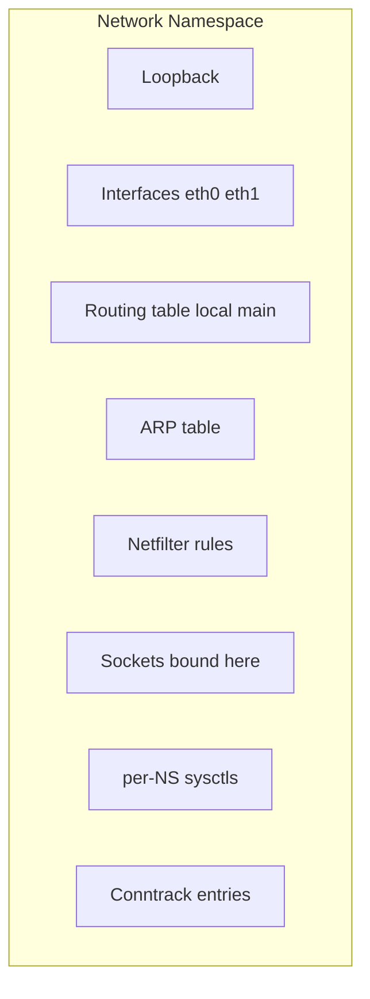
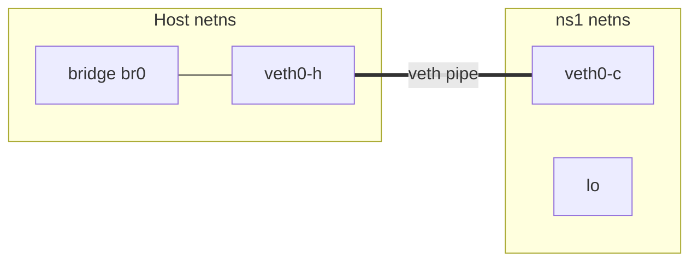
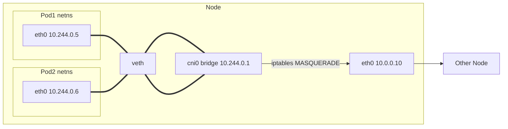

# Network Namespaces

## Why this matters

**Every container, every Pod, every Docker network is just a Linux network namespace.** Once you understand `ip netns`, `veth` pairs, and bridges, container networking stops being magic — you can build a "Pod" by hand in 30 seconds with `unshare` and `ip` commands. This file teaches you the primitives, then shows how Docker, Kubernetes, and CNI plugins compose them. After this, reading a CNI bug report or debugging "Pod can't reach service" is just `nsenter` and `tcpdump`.

---

## What a namespace contains

<!-- mermaid:rendered -->
<p align="center"></p>

<details><summary>Mermaid source</summary>



</details>
## veth pair connecting host + namespace

<!-- mermaid:rendered -->
<p align="center"></p>

<details><summary>Mermaid source</summary>



</details>
## Pod networking — how Kubernetes does it

<!-- mermaid:rendered -->
<p align="center"></p>

<details><summary>Mermaid source</summary>



</details>
---

## Concepts

### What `unshare(CLONE_NEWNET)` does
Creates a new namespace with:
- Only `lo` (down by default).
- Empty routing tables (no default route).
- Empty ARP cache.
- Empty netfilter rules.
- A separate copy of every per-NS sysctl (`net.ipv4.ip_forward`, etc.).

### Two ways to create / enter
- **`ip netns add NAME`** — persistent; appears in `/var/run/netns/` (a mount point).
- **`unshare -n CMD`** — anonymous; gone when CMD exits. Used by Docker (it uses raw `clone()` flags).

### Connecting namespaces
- **veth pair** — two ends, one in each ns; packets in one come out the other.
- **bridge** — software switch in one ns; veth ends connect Pods to it.
- **macvlan/ipvlan** — share a physical NIC across namespaces (no bridge needed).

### Per-NS conntrack (kernel 5.7+)
Each netns has its own conntrack table — Pods don't pollute the host's table. Older kernels share globally → conntrack overflow on busy nodes.

### sysctls that are per-NS
`net.ipv4.ip_forward`, `net.ipv4.conf.all.*`, `net.ipv4.tcp_*`, `net.netfilter.*`, `net.ipv6.conf.*`. Set them inside the namespace via `ip netns exec ... sysctl`.

---

## Commands

```bash
# List
ip netns list                                    # named netns

# Create / delete
ip netns add ns1
ip netns del ns1

# Run a command in a netns
ip netns exec ns1 ip addr
ip netns exec ns1 bash                           # shell inside

# Move an interface in / out
ip link set eth1 netns ns1                       # moves it (disappears from host)
ip netns exec ns1 ip link set eth1 netns 1       # netns 1 = init = host

# veth pair
ip link add veth-h type veth peer name veth-c
ip link set veth-c netns ns1
ip addr add 10.10.0.1/24 dev veth-h
ip link set veth-h up
ip netns exec ns1 ip addr add 10.10.0.2/24 dev veth-c
ip netns exec ns1 ip link set veth-c up
ip netns exec ns1 ip link set lo up
ip netns exec ns1 ip route add default via 10.10.0.1

# Inspect a Docker container's netns
PID=$(docker inspect -f '{{.State.Pid}}' my-container)
nsenter -t $PID -n ip addr                       # see container's interfaces
nsenter -t $PID -n ss -tnlp                      # see its listening sockets
nsenter -t $PID -n tcpdump -i eth0 -nn           # capture inside

# Or expose Docker's anonymous netns to ip netns
mkdir -p /var/run/netns
ln -sfT /proc/$PID/ns/net /var/run/netns/$PID
ip netns list
ip netns exec $PID ip addr

# Watch sockets per-ns
ss -K -N ns1                                     # kill sockets in ns1 (kernel 4.5+)
```

---

## Lab — build a "Pod" by hand

```bash
docker run -it --rm --privileged --net=host nicolaka/netshoot

# 1. Create two namespaces (two "Pods")
ip netns add pod1
ip netns add pod2

# 2. Build a bridge
ip link add cni-lab type bridge
ip addr add 10.244.0.1/24 dev cni-lab
ip link set cni-lab up

# 3. veth pair for pod1
ip link add veth1-h type veth peer name veth1-c
ip link set veth1-c netns pod1
ip link set veth1-h master cni-lab
ip link set veth1-h up
ip netns exec pod1 ip addr add 10.244.0.5/24 dev veth1-c
ip netns exec pod1 ip link set veth1-c up
ip netns exec pod1 ip link set lo up
ip netns exec pod1 ip route add default via 10.244.0.1

# 4. veth pair for pod2
ip link add veth2-h type veth peer name veth2-c
ip link set veth2-c netns pod2
ip link set veth2-h master cni-lab
ip link set veth2-h up
ip netns exec pod2 ip addr add 10.244.0.6/24 dev veth2-c
ip netns exec pod2 ip link set veth2-c up
ip netns exec pod2 ip link set lo up
ip netns exec pod2 ip route add default via 10.244.0.1

# 5. Test pod1 -> pod2
ip netns exec pod1 ping -c 3 10.244.0.6
ip netns exec pod1 ping -c 3 10.244.0.1

# 6. Outbound NAT (so Pods can reach the internet)
sysctl -w net.ipv4.ip_forward=1
iptables -t nat -A POSTROUTING -s 10.244.0.0/24 ! -o cni-lab -j MASQUERADE
ip netns exec pod1 ping -c 3 8.8.8.8

# 7. Listen in pod2, connect from pod1
ip netns exec pod2 nc -lvnp 9000 &
ip netns exec pod1 bash -c 'echo hi from pod1 | nc -w1 10.244.0.6 9000'

# Cleanup
iptables -t nat -D POSTROUTING -s 10.244.0.0/24 ! -o cni-lab -j MASQUERADE
ip netns del pod1
ip netns del pod2
ip link del cni-lab
```

You just built what flannel/calico/cilium do — minus the controller, BGP, eBPF.

---

## How Docker uses namespaces

| Step | What Docker does |
|------|------------------|
| 1. Container start | `clone(CLONE_NEWNET ...)` creates anonymous netns |
| 2. Bridge mode (default) | Creates veth pair; one end → docker0 bridge, other end → container |
| 3. Container side renamed | `eth0` inside; `vethXXXX` on host |
| 4. IPAM | Allocates from `172.17.0.0/16`; sets default route to `172.17.0.1` |
| 5. Port publish | `iptables -t nat -A DOCKER -p tcp --dport 8080 -j DNAT --to-destination 172.17.0.2:80` |
| 6. Outbound | `iptables -t nat -A POSTROUTING -s 172.17.0.0/16 ! -o docker0 -j MASQUERADE` |

K8s adds: kube-proxy iptables/IPVS for Services, CNI plugin for Pod networking (overlay or routed), and per-Pod (not per-container) networks via the **pause** container holding the netns.

---

## Gotchas

> - **`ip netns exec` runs as root in YOUR mount namespace.** `/etc/resolv.conf` is the host's unless you also use `unshare --mount` and bind-mount.
> - **Anonymous netns (Docker)** don't show in `ip netns list` until you symlink `/proc/PID/ns/net` to `/var/run/netns/`.
> - **Moving an interface to a netns clears its IPs.** Re-add them inside the netns.
> - **Per-NS sysctls** must be set INSIDE the namespace; a host-level `sysctl -w` doesn't reach Pod netns.
> - **`lo` is down by default** in new namespaces — `ping 127.0.0.1` fails until you `ip link set lo up`.
> - **Conntrack on older kernels (<5.7) is global** — one busy Pod can fill the host's table.

---

## 20-year tips

> 1. **`nsenter -t <PID> -n` is your best friend** — every "container can't reach X" debug starts with `nsenter -t <PID> -n tcpdump -i any`.
> 2. **Build the lab above on every new K8s node you SSH into** — it forces you to confirm `ip_forward`, conntrack, bridge support are all working.
> 3. **For CNI debugging, dump the Pod's full state:** `nsenter -t $PID -n bash -c 'ip addr; ip route; ss -tnlp; iptables -L -n'`.
> 4. **`ip netns identify <PID>`** maps a PID to a named netns — useful when juggling many containers.
> 5. **Use a "debug" container with `hostNetwork: true` + `nicolaka/netshoot`** as your K8s troubleshooting Pod — it sees everything the node sees.

---

## Common interview questions

> - What does `unshare -n` do? What's left in the new namespace?
> - Build a Pod-equivalent by hand using `ip netns` and `veth`.
> - How does Docker connect a container to the host network?
> - Where does kube-proxy fit into this picture?
> - Why might a Pod see different DNS results than the host?
> - What's the difference between `hostNetwork: true` and a normal Pod?

---

## Sources

- `man 8 ip-netns`, `man 1 unshare`, `man 1 nsenter`, `man 7 network_namespaces`
- `Documentation/admin-guide/namespaces/`
- https://man7.org/linux/man-pages/man7/network_namespaces.7.html
- "Container Networking" — Michael Hausenblas (O'Reilly, free)
- https://kubernetes.io/docs/concepts/cluster-administration/networking/
