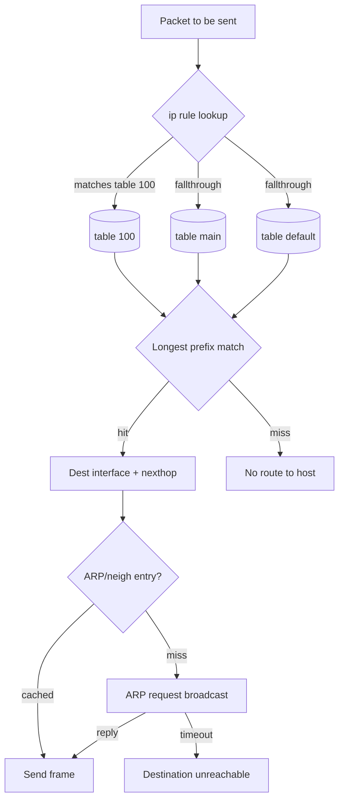
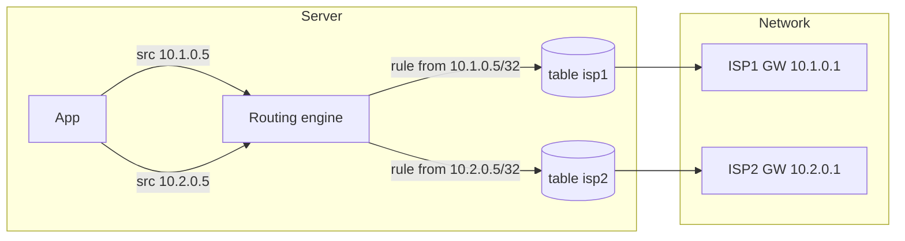
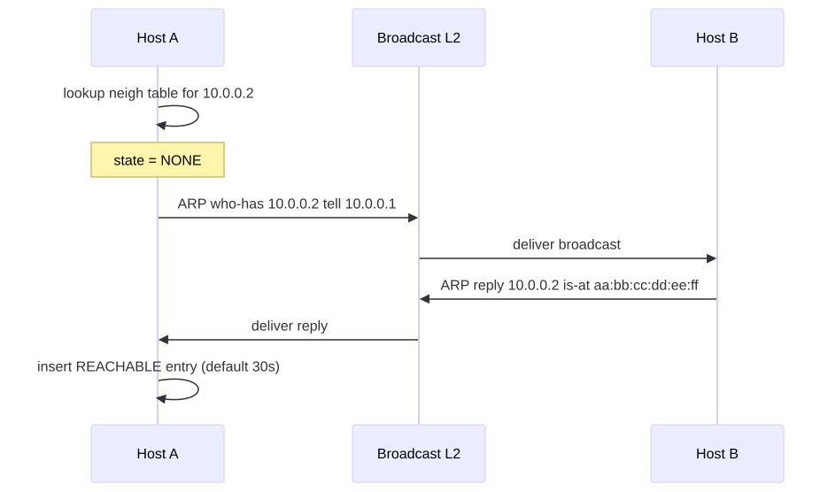
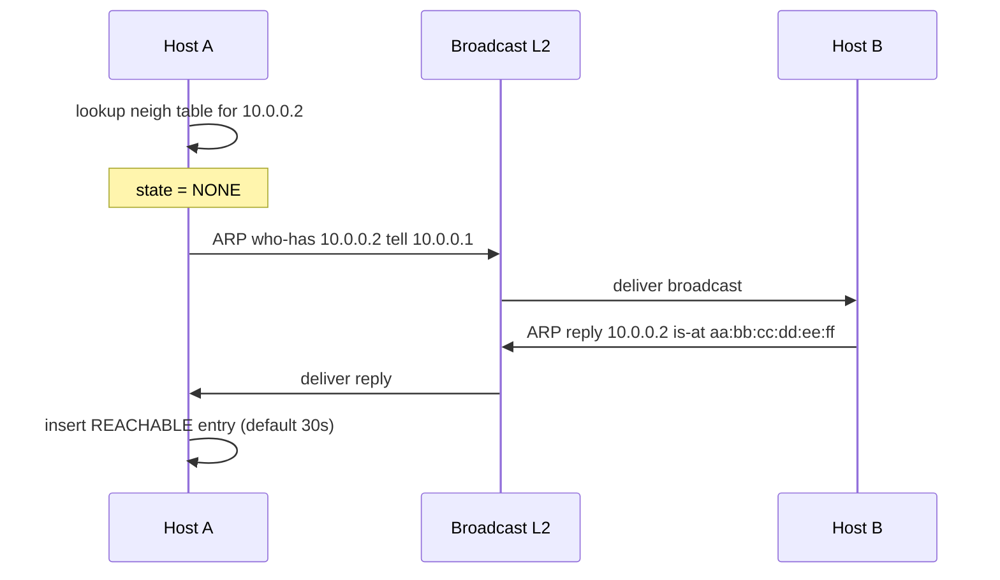

# Routing, ARP & Policy Routing

## Why this matters

The routing decision is the most consequential thing the Linux kernel does for any packet — it answers "which interface, which gateway, which source IP?" If routing is wrong, nothing else matters: firewalls don't fire, sockets don't connect, traceroutes lie. And on multi-homed machines (cloud VMs, dual-NIC servers, K8s nodes), the default routing table is rarely enough — you need **policy routing** with `ip rule` and multiple tables. This file covers how Linux makes the routing decision, when ARP fails (and why your cluster goes down), and the asymmetric routing traps that bite production every quarter.

---

## Routing decision flow

<!-- mermaid:rendered -->
<p align="center"></p>

<details><summary>Mermaid source</summary>



</details>
## Policy routing with two ISPs

<!-- mermaid:rendered -->
<p align="center"></p>

<details><summary>Mermaid source</summary>



</details>
## ARP resolution sequence

<!-- mermaid:rendered -->
<p align="center"></p>

<details><summary>Mermaid source</summary>



</details>
---

## Concepts

### Routing tables
- Linux supports up to 255 routing tables. Default ones:
  - **local (255)** — local IPs / broadcasts (auto-managed; never edit).
  - **main (254)** — what you usually see with `ip route`.
  - **default (253)** — typically empty.
- Custom tables: name them in `/etc/iproute2/rt_tables`.

### Routing decision algorithm
1. Walk `ip rule` in priority order (lowest number first).
2. First matching rule selects a table.
3. Within the table, **longest prefix match** wins.
4. If multiple equal routes (same prefix length) → ECMP / multipath.
5. If nothing matches → "Network unreachable" (no rule) or "No route to host."

### Source address selection
- If you `bind()` to a specific src IP, that IP is used.
- Otherwise: kernel picks the IP of the **outgoing interface** that's on the same subnet as the gateway, preferring `prefsrc` if set.
- `ip route get <dst>` shows the answer including chosen `src`.

### ARP / neighbor states
- `NONE` → `INCOMPLETE` → `REACHABLE` → `STALE` → `DELAY` → `PROBE` → `FAILED`.
- `arp_ignore`, `arp_announce` sysctls control how Linux replies to ARP on multi-homed hosts (set to 1/2 for sane behavior in K8s with calico).
- `gc_thresh1/2/3` cap the size of the neighbor table; **exceed them and packets drop silently**.

### ECMP (Equal-Cost Multi-Path)
- `ip route add 10.0.0.0/8 nexthop via 1.1.1.1 weight 1 nexthop via 2.2.2.2 weight 1`.
- Hash is per-flow (5-tuple) since kernel 4.4 — same flow always same path; different flows balance.

### RFC 1918 — private address space
- `10.0.0.0/8`, `172.16.0.0/12`, `192.168.0.0/16`. Plus `100.64.0.0/10` (CGN, RFC 6598) widely used in cloud.

---

## Commands

```bash
# Show routes
ip route show                           # main table
ip route show table all                 # every table
ip route show table local               # local IPs/broadcasts
ip -6 route                             # IPv6

# What route WILL be used
ip route get 8.8.8.8                    # exact decision incl. src + dev + table
ip route get 10.0.0.5 from 192.168.1.5  # simulate src

# Add / modify routes
ip route add 10.10.0.0/16 via 192.168.1.1 dev eth0          # static route
ip route add default via 192.168.1.1                         # default gateway
ip route replace default via 192.168.1.1 metric 100         # change metric
ip route del 10.10.0.0/16

# Multiple tables (policy routing)
echo "100 isp1" >> /etc/iproute2/rt_tables
ip route add default via 10.1.0.1 dev eth0 table isp1
ip rule add from 10.1.0.5/32 table isp1 priority 1000
ip rule show

# ECMP
ip route add 10.0.0.0/8 nexthop via 1.1.1.1 weight 1 nexthop via 2.2.2.2 weight 1
sysctl net.ipv4.fib_multipath_hash_policy=1   # use L4 in hash

# Neighbor / ARP
ip neigh show                           # current cache
ip neigh show dev eth0
ip neigh add 10.0.0.99 lladdr aa:bb:cc:dd:ee:ff dev eth0    # static
ip neigh del 10.0.0.99 dev eth0
ip neigh flush all                      # nuke cache (will rebuild)

# Send gratuitous ARP (failover trick)
arping -c 3 -A -I eth0 10.0.0.5

# Tune neigh table sizing (production must!)
sysctl -w net.ipv4.neigh.default.gc_thresh1=2048
sysctl -w net.ipv4.neigh.default.gc_thresh2=4096
sysctl -w net.ipv4.neigh.default.gc_thresh3=8192

# Forwarding
sysctl -w net.ipv4.ip_forward=1
sysctl -w net.ipv6.conf.all.forwarding=1

# Reverse path filter (rp_filter) — anti-spoofing
sysctl -w net.ipv4.conf.all.rp_filter=2     # loose mode for asymmetric
```

---

## Lab — two-table policy routing in a namespace

```bash
docker run -it --rm --privileged --net=host nicolaka/netshoot

ip netns add lab1
ip link add veth-h type veth peer name veth-c
ip link set veth-c netns lab1
ip addr add 10.55.0.1/24 dev veth-h
ip link set veth-h up
ip netns exec lab1 ip addr add 10.55.0.2/24 dev veth-c
ip netns exec lab1 ip link set veth-c up
ip netns exec lab1 ip link set lo up

# Inside the netns: add a custom table + rule
ip netns exec lab1 bash -c '
  echo "200 viahost" >> /etc/iproute2/rt_tables
  ip route add default via 10.55.0.1 table 200
  ip rule add from 10.55.0.2 table 200 priority 100
  ip rule show
  ip route show table 200
  ip route get 8.8.8.8
'

# Cleanup
ip netns del lab1
ip link del veth-h 2>/dev/null
```

---

## Gotchas

> - **Asymmetric routing + rp_filter=1** drops return packets silently. On multi-homed hosts set `rp_filter=2` (loose) or `0`.
> - **`ip route` shows main table only.** Use `ip route show table all` or you'll miss policy routes that are actually being used.
> - **Neighbor table overflow** logs `neighbour: arp_cache: neighbor table overflow!` in dmesg — silent packet drops. Always raise `gc_thresh*` on K8s nodes.
> - **Default route metric** matters. If two default routes exist (e.g., DHCP added one, you added another), the lower metric wins. Check with `ip -d route`.
> - **`ip route get` lies if rules require fwmark.** It can't simulate the mark unless you pass `mark <n>`.
> - **Cloud VMs:** the metadata service (169.254.169.254) is reached via the default GW; deleting the default route kills metadata-driven IAM.

---

## 20-year tips

> 1. **Always run `ip route get <dest>` before `ping <dest>`** when debugging — half the "ping doesn't work" tickets are wrong source IP or wrong table selection.
> 2. **Tag your routes with metric and protocol** (`proto static`, `metric 100`) — when something automated (NetworkManager, dhclient) tramples them, you'll spot the difference instantly.
> 3. **`ip rule add table X suppress_prefixlength 0`** is the magic trick to skip the default route in a table — used heavily by WireGuard / Tailscale.
> 4. **Pin gc_thresh** explicitly via sysctl on every K8s node — defaults (128/512/1024) collapse around 800 pods.
> 5. **For VRRP / keepalived failovers**, send gratuitous ARP with `arping -A` — saves up to 30s of upstream ARP cache staleness.

---

## Common interview questions

> - Walk me through Linux's routing decision step-by-step.
> - Difference between `ip route` and `ip rule`?
> - You have two NICs on different subnets, both with default routes. What happens?
> - What is rp_filter and when do you change it from 1?
> - Explain ECMP and how flow stickiness is achieved.
> - Your service drops 5% of packets to a specific IP only — how do you debug?
> - What is gratuitous ARP and when is it sent?

---

## Sources

- `man 8 ip-route`, `man 8 ip-rule`, `man 8 ip-neighbour`, `man 7 arp`
- `Documentation/networking/ip-sysctl.rst`
- RFC 826 (ARP), RFC 1812 (Router Requirements), RFC 4861 (NDP for IPv6)
- https://www.policyrouting.org/PolicyRoutingBook/
- LWN: https://lwn.net/Articles/277049/ (Multipath routing)
