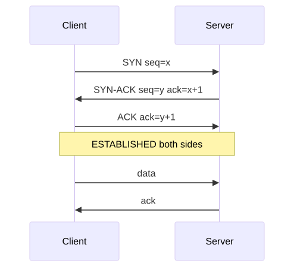
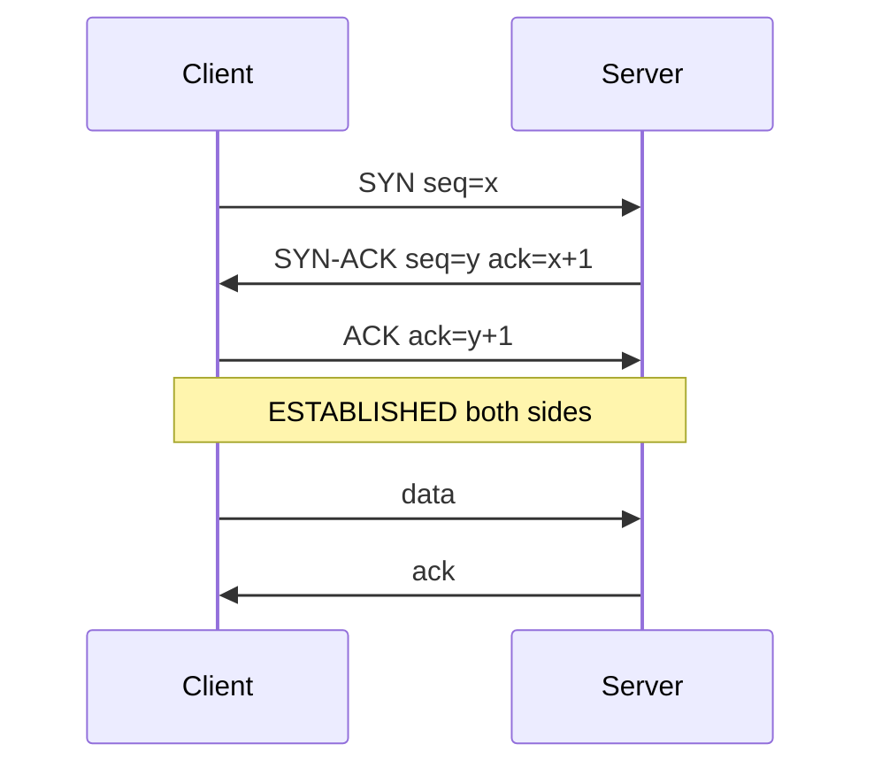
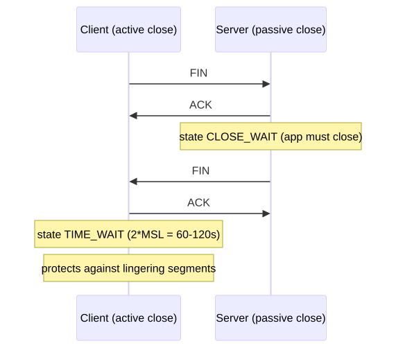
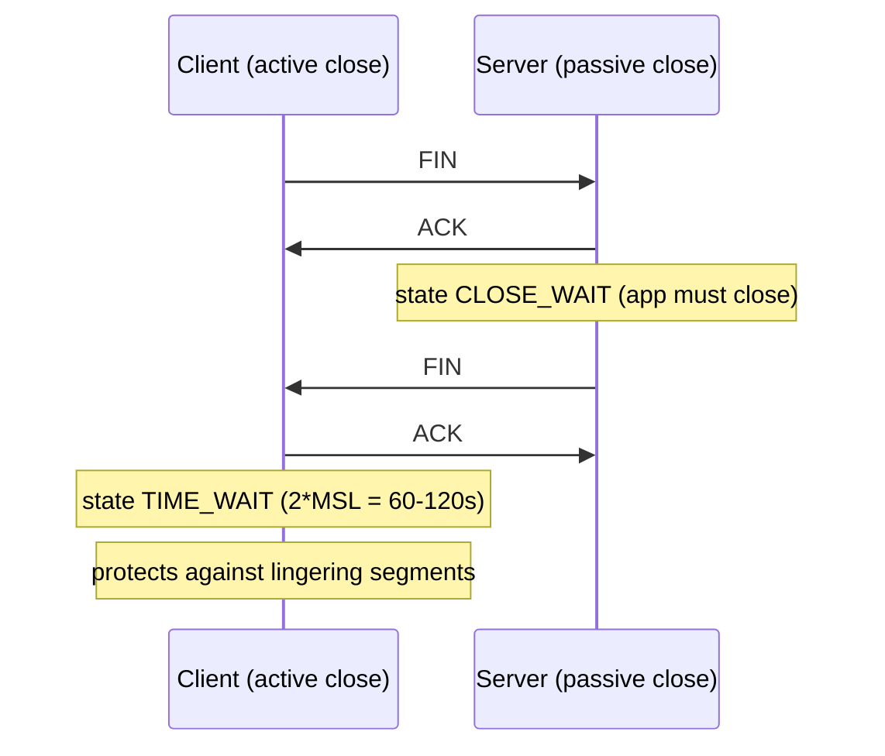
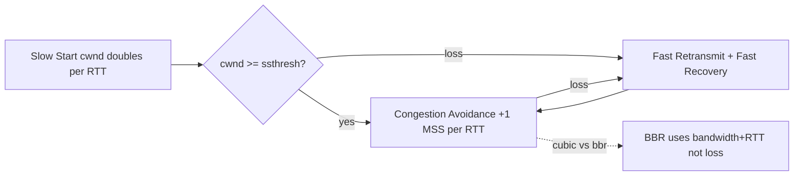

# TCP Internals

## Why this matters

TCP is the carrier of 99% of your production traffic — HTTP/1.1, HTTP/2, gRPC, Postgres, Kafka, SSH all ride on it. When latency spikes, when connections hang in TIME_WAIT, when downloads run at 10% of link speed, the answer is in the **TCP state machine, congestion control, and socket buffer tuning** — not in the application. This file covers the parts of TCP that show up in production incidents: the handshake, the close dance, congestion algorithms (cubic vs BBR), TIME_WAIT vs CLOSE_WAIT, SYN cookies, and why `tcp_tw_recycle` was deleted from the kernel.

---

## TCP three-way handshake

<!-- mermaid:rendered -->
<p align="center"></p>

<details><summary>Mermaid source</summary>



</details>
## TCP close (4-way) — TIME_WAIT vs CLOSE_WAIT

<!-- mermaid:rendered -->
<p align="center"></p>

<details><summary>Mermaid source</summary>



</details>
## Congestion control — slow start to BBR

<!-- mermaid:rendered -->
<p align="center"></p>

<details><summary>Mermaid source</summary>



</details>
---

## Concepts

### TCP states (from `ss -tn`)
| State | Meaning |
|-------|---------|
| LISTEN | server waiting for SYN |
| SYN-SENT | client sent SYN, waiting for SYN-ACK |
| SYN-RECV | server got SYN, sent SYN-ACK |
| ESTABLISHED | data flow |
| FIN-WAIT-1 | sent FIN, waiting for ACK |
| FIN-WAIT-2 | got ACK, waiting for peer FIN |
| CLOSE-WAIT | got FIN, app hasn't called `close()` |
| LAST-ACK | sent FIN after CLOSE-WAIT, waiting for final ACK |
| TIME-WAIT | active closer, waiting 2*MSL |
| CLOSED | virtual state |

### TIME_WAIT vs CLOSE_WAIT
- **TIME_WAIT** is on the **active closer** (typically client). 60s default, holds the 4-tuple to absorb late retransmits. Many TIME_WAITs = many short-lived connections — usually fine.
- **CLOSE_WAIT** is on the **passive closer**. It means the **app didn't call `close()`** after seeing FIN. Many CLOSE_WAITs = application bug (forgot to close socket / leaked fd).

### Congestion algorithms
- **reno / new-reno** — original AIMD; halves cwnd on loss.
- **cubic** — Linux default; cubic growth function; less aggressive than reno on long-fat networks.
- **bbr** — model-based; uses estimated bottleneck bandwidth + RTT, not loss. Dramatically better on lossy or buffer-bloated paths.
- **bbr2** — out-of-tree; addresses fairness vs cubic.

```bash
sysctl net.ipv4.tcp_available_congestion_control
sysctl net.ipv4.tcp_congestion_control          # current
sysctl -w net.ipv4.tcp_congestion_control=bbr   # change
modprobe tcp_bbr                                 # load if missing
```

### Window scaling
- TCP header window field is 16 bits = max 64KB without scaling.
- `tcp_window_scaling=1` (default) negotiates a shift factor in SYN options → up to 1GB window.
- Required for high-bandwidth × delay paths (BDP).

### SYN cookies
- `tcp_syncookies=1` — when SYN queue overflows, server replies with a cookie-encoded SYN-ACK without allocating state. Resists SYN floods.
- Production must: set to `1`. Default in modern kernels.

### tcp_tw_reuse vs tcp_tw_recycle
- **tcp_tw_reuse=1** — safely reuse TIME_WAIT sockets for **outgoing** connections (uses timestamps). Fine in production.
- **tcp_tw_recycle** — REMOVED in kernel 4.12 (2017). It broke catastrophically behind NAT (different clients sharing one IP got dropped). **Never use; never recommend.**

### Slow start
- Initial cwnd = 10 MSS (RFC 6928, Linux default).
- Doubles every RTT until `ssthresh` or loss.
- After loss → multiplicative decrease + congestion avoidance.

### Buffer tuning
```bash
sysctl net.ipv4.tcp_rmem    # min default max receive buffer
sysctl net.ipv4.tcp_wmem    # min default max send buffer
sysctl net.core.rmem_max    # absolute cap
sysctl -w net.ipv4.tcp_rmem="4096 87380 16777216"   # 16MB max
```

---

## Commands

```bash
# Socket inspection
ss -tan                                  # all TCP sockets
ss -tn state established                 # established only
ss -tn state time-wait | wc -l           # TIME_WAIT count
ss -tn state close-wait                  # leaked sockets!
ss -ti                                   # TCP info: cwnd, rtt, retrans
ss -tnp 'sport = :443'                   # who owns port 443
ss -tnli                                 # listening + extended

# Backlog inspection (Recv-Q on LISTEN = pending; Send-Q = max backlog)
ss -ltn

# Per-socket stats
ss -tip dst 10.0.0.5

# System-wide TCP stats
nstat -az | grep -i tcp                  # /proc/net/snmp deltas
cat /proc/net/sockstat                    # in-use counts
cat /proc/net/netstat | grep -i tcp

# Tune
sysctl -w net.ipv4.tcp_congestion_control=bbr
sysctl -w net.ipv4.tcp_tw_reuse=1
sysctl -w net.ipv4.tcp_fin_timeout=15        # default 60
sysctl -w net.ipv4.tcp_keepalive_time=600    # idle before keepalive probes
sysctl -w net.ipv4.tcp_max_syn_backlog=8192
sysctl -w net.core.somaxconn=4096            # listen() backlog cap

# Capture handshake only
tcpdump -i any -nn 'tcp[tcpflags] & (tcp-syn|tcp-fin) != 0'

# See retransmits
ss -ti | grep -E 'retrans|lost'
```

---

## Lab — observe TCP states + BBR vs cubic

```bash
docker run -it --rm --privileged --net=host nicolaka/netshoot

# Terminal 1: a slow server
nc -lvnp 9001 &

# Terminal 2: connect, hold open
exec 3<>/dev/tcp/127.0.0.1/9001
ss -tn dst 127.0.0.1 dport = :9001        # ESTABLISHED

# Close from server side
kill %1 2>/dev/null
ss -tn | grep 9001                         # see CLOSE_WAIT on the open fd
exec 3<&-                                  # close fd
ss -tn | grep 9001                         # gone (or TIME_WAIT)

# BBR comparison
sysctl net.ipv4.tcp_congestion_control
sysctl -w net.ipv4.tcp_congestion_control=bbr
# Run an iperf3 over a high-RTT link and compare throughput vs cubic
iperf3 -c iperf.example.com -t 30
```

---

## Common TCP issues playbook

| Symptom | Likely cause | Action |
|---------|--------------|--------|
| `connection refused` | nothing listening / SYN reset | `ss -ltn` on server; check firewall |
| `connection timed out` | SYN dropped (firewall) | tcpdump SYN in/out |
| Many TIME_WAIT on client | high connection rate, no keepalive | enable `tcp_tw_reuse`; use HTTP keep-alive |
| Many CLOSE_WAIT | app not closing fds | fix the app; restart as bandaid |
| Slow throughput on long links | small buffers / wrong CC | raise `tcp_rmem`; switch to BBR |
| Random RST mid-flow | conntrack timeout / middlebox | enable keepalive; check NAT timeout |
| SYN flood | attack / misconfig | enable syncookies; raise `tcp_max_syn_backlog` |

---

## Gotchas

> - **`tcp_tw_recycle` is REMOVED.** Any blog post recommending it is outdated and dangerous.
> - **`somaxconn=128` (kernel default until 5.4)** silently truncates `listen(backlog=N)` — set it to 4096+ on every server.
> - **HTTP/1.1 with `Connection: close`** generates one TIME_WAIT per request — use keep-alive.
> - **BBR + fq qdisc is required.** `tc qdisc add dev eth0 root fq` — without fq, BBR can be unfair.
> - **Window scaling broken by old middleboxes** silently caps throughput at 64KB. `ss -ti` shows wscale.
> - **Keepalive defaults are too long** — 2 hours idle. Set `tcp_keepalive_time=600` for production servers behind NAT/LBs.

---

## 20-year tips

> 1. **Use `ss -ti` over `netstat -an` always** — it shows cwnd, rtt, retrans counters that tell you WHY a connection is slow.
> 2. **Switch to BBR on every internet-facing host.** It's a one-line change with measurable improvement on lossy paths (mobile, transcontinental).
> 3. **Monitor `nstat TcpExtTCPSynRetrans` and `TCPRetransSegs`** as Prometheus metrics — they spike before users notice.
> 4. **For HAProxy/Envoy in front, set `somaxconn=65535`** AND match in the LB's `listen` backlog — undersized backlog drops SYNs invisibly.
> 5. **TIME_WAIT is rarely the problem.** It only matters if you exhaust the local port range (~28K). Diagnose first with `ss -tan state time-wait | wc -l` vs `cat /proc/sys/net/ipv4/ip_local_port_range`.

---

## Common interview questions

> - Walk through the three-way handshake and four-way close.
> - Difference between TIME_WAIT and CLOSE_WAIT — who has each?
> - What is congestion control? Compare cubic and BBR.
> - Why was `tcp_tw_recycle` removed?
> - What are SYN cookies and when do they engage?
> - How would you tune Linux TCP for a 100ms-RTT 10Gbit link?
> - You see thousands of CLOSE_WAIT — what does it mean and how do you fix?

---

## Sources

- `man 7 tcp`, `man 8 ss`, `man 7 socket`
- `Documentation/networking/ip-sysctl.rst`
- RFC 793 (TCP), RFC 5681 (Congestion Control), RFC 6298 (RTO), RFC 7414 (TCP roadmap)
- BBR paper: https://research.google/pubs/bbr-congestion-based-congestion-control/
- LWN: https://lwn.net/Articles/722273/ (tcp_tw_recycle removal)
- "TCP/IP Illustrated, Volume 1" — W. Richard Stevens
