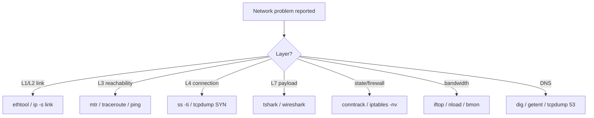
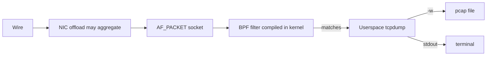
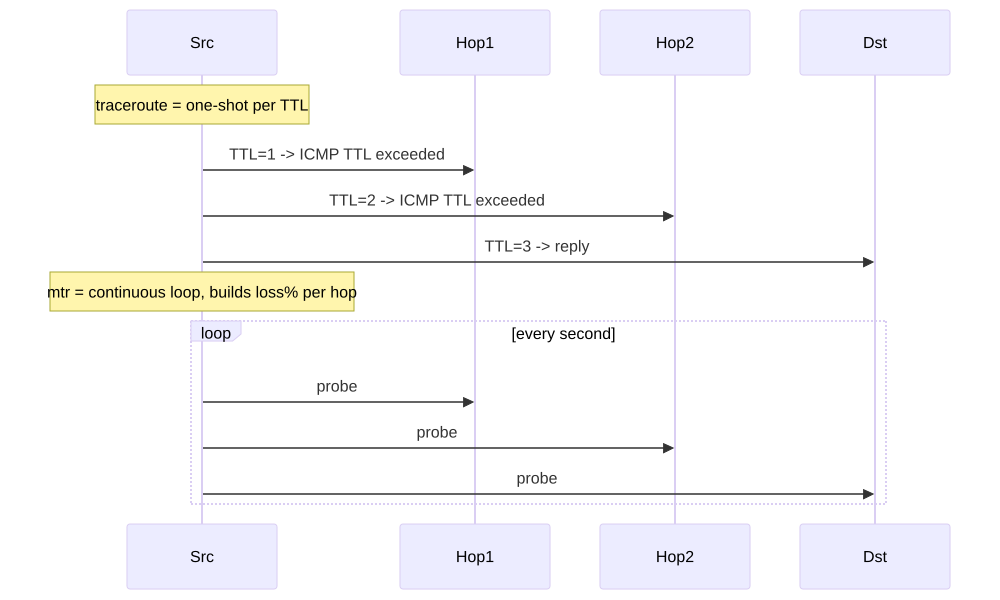
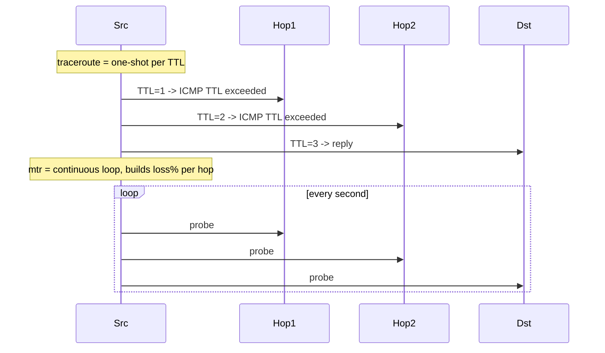

# Tools Mastery — tcpdump, ss, mtr, ethtool & friends

## Why this matters

You can know every TCP RFC by heart and still be useless in an outage if you can't drive the **tools**. This file is the senior engineer's working set: `tcpdump` filters that find the bug in 30 seconds, `ss` invocations that replace 5 dashboards, `mtr` for distinguishing "their network is broken" from "ours is," `ethtool` for proving a bad SFP, and `conntrack` for catching the silent killer. Master these eight tools and you can debug 95% of network incidents from one SSH session.

---

## Tool decision tree

<!-- mermaid:rendered -->
<p align="center"></p>

<details><summary>Mermaid source</summary>



</details>
## tcpdump pipeline

<!-- mermaid:rendered -->
<p align="center"></p>

<details><summary>Mermaid source</summary>



</details>
## mtr vs traceroute

<!-- mermaid:rendered -->
<p align="center"></p>

<details><summary>Mermaid source</summary>



</details>
---

## tcpdump

### BPF filter syntax (the 90% you need)
```bash
tcpdump -i eth0 -nn host 1.2.3.4
tcpdump -i eth0 -nn 'port 80 or port 443'
tcpdump -i eth0 -nn 'src 1.2.3.4 and dst port 22'
tcpdump -i eth0 -nn 'tcp and net 10.0.0.0/8'
tcpdump -i eth0 -nn 'icmp'
tcpdump -i eth0 -nn 'arp'
tcpdump -i eth0 -nn 'vlan 100'
tcpdump -i eth0 -nn 'not port 22'                            # exclude ssh
tcpdump -i eth0 -nn 'tcp[tcpflags] & (tcp-syn|tcp-fin) != 0' # connection events
tcpdump -i eth0 -nn 'tcp[tcpflags] & tcp-rst != 0'           # RSTs only
tcpdump -i eth0 -nn 'tcp[((tcp[12] & 0xf0) >> 2):4] = 0x47455420'  # HTTP "GET "
tcpdump -i any -nn -s0 -w /tmp/cap.pcap 'host 1.2.3.4'       # save full packets
```

### Useful flags
| Flag | Effect |
|------|--------|
| `-i any` | all interfaces (Linux only) |
| `-nn` | no DNS, no port-name lookup |
| `-s0` | full snaplen (default 262144 since 4.99) |
| `-w FILE` | save pcap (binary) |
| `-r FILE` | read pcap |
| `-c N` | stop after N packets |
| `-A` | print payload as ASCII |
| `-X` | hex + ASCII |
| `-vv` | verbose protocol decode |
| `-G N -W M -w 'cap-%s.pcap'` | rotate every N seconds, keep M files |
| `-Q in/out/inout` | direction filter (Linux) |
| `-K` | skip checksum verification (offload-friendly) |

### Tcpdump tricks
```bash
# Catch only the handshake of new connections
tcpdump -i any -nn 'tcp[tcpflags] = tcp-syn'

# Watch retransmits live (large pcap, post-process)
tcpdump -i any -nn -w /tmp/r.pcap 'tcp port 443'
# then: tshark -r /tmp/r.pcap -Y 'tcp.analysis.retransmission'

# Ring-buffered always-on capture (production safe)
tcpdump -i any -nn -G 60 -W 30 -w '/var/log/cap/%Y%m%d-%H%M%S.pcap' -Z root \
  'not port 22' &

# Decode with pretty output
tcpdump -i any -nn -A -s0 'tcp port 80'
```

---

## ss vs netstat

`netstat` is deprecated; `ss` is faster (uses netlink, not /proc parsing).

| Need | ss | netstat (legacy) |
|------|----|------------------|
| All TCP | `ss -tan` | `netstat -tan` |
| Listening only | `ss -tnl` | `netstat -tnl` |
| With PID | `ss -tnlp` | `netstat -tnlp` |
| TCP info (cwnd, rtt) | `ss -ti` | (not available) |
| Filter by state | `ss -tn state established` | `netstat -tan \| grep ESTABLISHED` |
| Per-socket memory | `ss -tm` | (not available) |
| Routing table | `ip route` | `netstat -rn` |
| Interface stats | `ip -s link` | `netstat -i` |

```bash
ss -s                                # one-line summary of all sockets
ss -tnlp '( sport = :80 or sport = :443 )'   # who owns 80/443
ss -tn dst 10.0.0.5                  # all conns to 10.0.0.5
ss -tn '( dport = :443 )' | wc -l    # count outbound HTTPS
ss -K state time-wait                # KILL all TIME_WAIT (kernel 4.5+, dangerous)
ss -tip                              # full TCP info per socket
```

---

## mtr vs traceroute

```bash
# Continuous traceroute showing per-hop loss + latency
mtr -rwbzc 100 8.8.8.8
# -r report mode (one-shot then exit)
# -w wide output
# -b show IP and hostname
# -z show ASN
# -c 100 = 100 cycles

# TCP traceroute (works through firewalls that drop UDP/ICMP)
traceroute -n -T -p 443 example.com
# Or:
mtr -T -P 443 example.com
```

> **Read mtr loss columns carefully:** isolated hop loss in the middle is usually ICMP rate-limiting, not real packet loss. Loss that **continues to subsequent hops + the destination** is real.

---

## ethtool

```bash
ethtool eth0                          # speed, duplex, link
ethtool -i eth0                       # driver + firmware version
ethtool -S eth0 | grep -iE 'drop|err|miss'   # driver stats
ethtool -g eth0                       # ring buffer sizes
ethtool -G eth0 rx 4096 tx 4096       # raise rings (for high pps)
ethtool -k eth0                       # offload features
ethtool -K eth0 gro off lro off       # disable for accurate tcpdump
ethtool -c eth0                       # interrupt coalescing
ethtool -l eth0                       # combined queue counts
ethtool -L eth0 combined 8            # set queue count (RSS)
ethtool -m eth0                       # SFP/transceiver info (for DAC/optics)
ethtool -t eth0                       # self-test
ethtool --reset eth0 dma              # subsystem reset (rarely needed)
```

---

## conntrack-tools

```bash
conntrack -L                          # all flows
conntrack -L -p tcp --dport 443 | head
conntrack -E                          # event stream (live)
conntrack -S                          # stats per CPU
conntrack -C                          # count
conntrack -F                          # FLUSH (be careful)
conntrack -D -p tcp --dport 8080      # delete matching flows
```

---

## Bandwidth tools

```bash
nload eth0                            # rx/tx graph
iftop -i eth0 -nP                     # top talkers
bmon                                  # per-interface dashboard
nethogs eth0                          # per-process bandwidth
vnstat -l -i eth0                     # live + historical
iperf3 -c remote -t 30 -P 4           # 4-stream throughput test
```

---

## tshark — Wireshark headless

```bash
tshark -i eth0 -Y 'http.request.method == "GET"'
tshark -r cap.pcap -Y 'tcp.analysis.retransmission'
tshark -r cap.pcap -q -z conv,tcp                # conversation summary
tshark -r cap.pcap -q -z io,stat,1 -Y 'tcp'      # per-second stats
tshark -r cap.pcap -T fields -e frame.time -e ip.src -e ip.dst -e tcp.flags
```

---

## Lab — find the slow hop

```bash
docker run -it --rm --privileged --net=host nicolaka/netshoot

# 1. Continuous mtr to a public target
mtr -rwbzc 30 1.1.1.1

# 2. Identify the hop with loss/latency spike. Capture from that point.
tcpdump -i any -nn -w /tmp/slow.pcap 'icmp or (tcp port 443 and host 1.1.1.1)' &

# 3. Generate traffic
curl -o /dev/null -s -w 'time_total=%{time_total} dns=%{time_namelookup} connect=%{time_connect} firstbyte=%{time_starttransfer}\n' \
  https://1.1.1.1/

# 4. Inspect handshake
kill %1
tshark -r /tmp/slow.pcap -Y 'tcp.flags.syn == 1'

# 5. Look for retransmits
tshark -r /tmp/slow.pcap -Y 'tcp.analysis.retransmission or tcp.analysis.duplicate_ack'
```

---

## Gotchas

> - **`tcpdump -i eth0` may miss packets** that are NIC-offloaded (GRO merges multiple segments). Use `ethtool -K eth0 gro off` for honest captures.
> - **`tcpdump -nn` is required.** Without `-n`, every packet triggers a reverse DNS lookup that floods the same network you're debugging.
> - **`ss -tan` doesn't show kernel-internal sockets** (e.g., kTLS); use `ss -tax` or `lsof -i`.
> - **`mtr` ICMP-only by default** can mislead — many routers de-prioritize ICMP. Use `mtr -T` for the real path.
> - **`ethtool -S` counters reset only on reboot** — calculate deltas, not absolute values.
> - **`conntrack -F` (flush)** kills every active flow on the host — never run on a production node without an outage window.

---

## 20-year tips

> 1. **Always start incidents with `tcpdump -i any -w /tmp/incident-$(date +%s).pcap not port 22`** in a tmux pane — even if you don't analyze it, you'll be glad you have it.
> 2. **`ss -ti dst <ip>`** during a "slow connection" report tells you `cwnd`, `rtt`, `retrans` instantly — usually answers it before you open Wireshark.
> 3. **Build aliases for the 5 commands you use 50x/day:** `alias tcpdumpa='tcpdump -i any -nn -s0'`, `alias ssn='ss -tnp'`, etc. Saves seconds, multiplies into hours.
> 4. **For long incidents, run a rotating tcpdump** (`-G 60 -W 60`) — you get the last hour without a 100GB file.
> 5. **`tshark -q -z conv,tcp` on a captured pcap** is the fastest way to identify which flows dominated bandwidth in an outage window.

---

## Common interview questions

> - You suspect packet loss to one IP. Walk through your tool sequence.
> - Difference between `mtr` and `traceroute`?
> - How do you capture only TCP RST packets?
> - Why might `tcpdump` show a 65535-byte packet on a 1500-MTU interface?
> - `ss` vs `netstat` — what does `ss` provide that netstat can't?
> - You see 30% packet loss on hop 5 of mtr but 0% to the destination. What does this mean?

---

## Sources

- `man 1 tcpdump`, `man 8 ss`, `man 8 ethtool`, `man 8 mtr`, `man 8 conntrack`
- `man 7 pcap-filter` (BPF filter syntax)
- https://www.tcpdump.org/manpages/pcap-filter.7.html
- https://wiki.wireshark.org/DisplayFilters
- "Wireshark Network Analysis" — Laura Chappell
