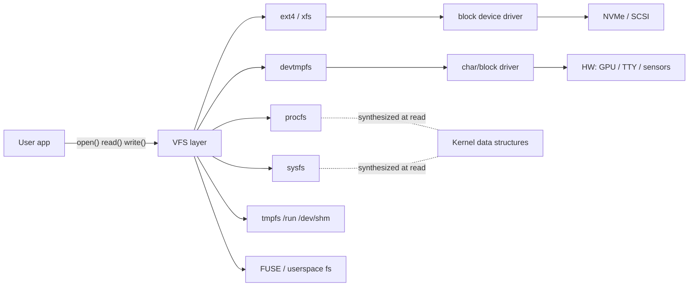
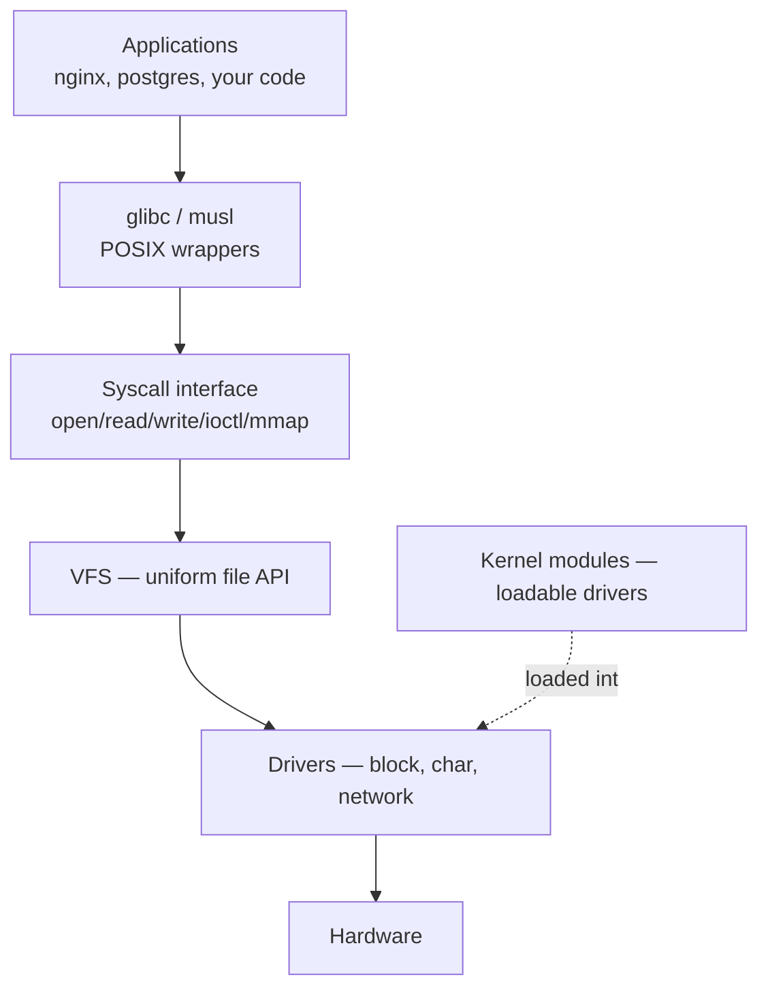

# Files, Devices, and Services — Deep Dive

> "On Linux, everything is a file." — and once you internalize that, the kernel stops being a black box.

## Why this matters

UNIX's defining design decision was the **uniform file abstraction**. A regular file, a TCP socket, a serial port, a process's memory map, a kernel knob, and a USB camera all expose the same `open()` / `read()` / `write()` / `close()` API. This is what makes shell pipelines, `strace`, `lsof`, and 50 years of tooling possible. If you understand how the kernel projects its internal state into the filesystem, you can debug anything — because you can `cat` it.

This module covers the four layers DevOps engineers touch every day:

1. **Pseudo-filesystems** (`/proc`, `/sys`) — kernel state as files
2. **Device nodes** (`/dev`, udev) — hardware as files
3. **Kernel modules** — the kernel's plugin system
4. **Mounts and filesystems** — how storage gets glued in
5. **Services (systemd)** — how userspace processes are supervised
6. **Signals, pipes, sockets** — how processes talk

## The Filesystem Hierarchy Standard (FHS) Map

```text
/
├── bin       -> /usr/bin       # essential user binaries
├── sbin      -> /usr/sbin      # essential system binaries
├── lib       -> /usr/lib       # shared libraries
├── boot/                       # kernel + initramfs + bootloader
├── dev/                        # device nodes (created by udev)
│   ├── sda, nvme0n1            # block devices
│   ├── tty*, pts/              # terminals
│   ├── null, zero, random      # virtual char devices
│   └── disk/by-{id,uuid,path}/ # persistent disk names
├── etc/                        # system-wide configuration
│   ├── fstab, hostname, hosts
│   ├── systemd/                # unit files + drop-ins
│   ├── modprobe.d/             # kernel module options
│   └── udev/rules.d/           # device-naming rules
├── home/                       # user homes
├── proc/                       # PROCESS + kernel state (procfs)
│   ├── <pid>/                  # one dir per running process
│   ├── cpuinfo, meminfo, ...   # kernel info
│   └── sys/                    # writable kernel tunables
├── sys/                        # device + driver state (sysfs)
│   ├── class/                  # devices grouped by class
│   ├── block/                  # block devices + queue tunables
│   ├── fs/cgroup/              # cgroup v2 hierarchy
│   └── module/                 # loaded kernel modules
├── run/                        # tmpfs: PIDs, sockets, runtime state
├── tmp/                        # world-writable scratch
├── usr/                        # the OS itself (read-only on immutable distros)
│   ├── bin, sbin, lib, share, local
├── var/                        # mutable state: logs, spool, caches
│   ├── log/, lib/, cache/, spool/
└── opt/                        # third-party packages
```

## How the kernel exposes everything as a file

<!-- mermaid:rendered -->
<p align="center"></p>

<details><summary>Mermaid source</summary>



</details>
**Key insight:** `/proc` and `/sys` files don't exist on disk. When you `cat /proc/meminfo`, the kernel **synthesizes** the contents on the fly from its internal data structures. That is why these files always show the current state and why their size is `0` in `ls -l`.

## Subtopic Map

| File | Topic | Read when... |
|------|-------|--------------|
| [proc-and-sys.md](proc-and-sys.md) | procfs + sysfs internals | debugging a process or tweaking a sysctl |
| [dev-and-udev.md](dev-and-udev.md) | device nodes, udev rules | a disk vanished or got renamed |
| [kernel-modules.md](kernel-modules.md) | lsmod, modprobe, DKMS | a driver isn't loading |
| [mounts-and-filesystems.md](mounts-and-filesystems.md) | fstab, mount opts, FS comparison | building images, fixing fstab |
| [services-deep.md](services-deep.md) | systemd unit anatomy | writing or hardening a unit |
| [signals-and-pipes.md](signals-and-pipes.md) | signals, FIFOs, Unix sockets | IPC, graceful shutdown bugs |

## Quick orientation lab

```bash
# Show all mounted filesystems with their type and source
findmnt --real

# Watch the kernel synthesize /proc/loadavg every second
watch -n1 cat /proc/loadavg

# See which file types live under /dev
ls -l /dev | awk '{print substr($1,1,1)}' | sort -u
# c = character device, b = block device, l = symlink, s = socket, p = FIFO

# Every file descriptor your shell currently holds open
ls -l /proc/$$/fd
```

## Mental model: layered abstractions

<!-- mermaid:rendered -->
<p align="center"></p>

<details><summary>Mermaid source</summary>



</details>
> **Gotcha:** `/proc/<pid>/` disappears the instant the process exits. Tools that race with process death (`ps`, `lsof`) will sometimes show "no such file" errors — this is normal, not a bug.

> **20-year tip:** Before you `strace` or `gdb`, just `ls -l /proc/<pid>/{cwd,exe,fd}`. Half of all "what is this process doing" questions are answered there in 2 seconds.

> **Common interview questions**
> 1. **Q:** What is the difference between `/proc` and `/sys`?
>    **A:** `/proc` is older and mixes process info with kernel knobs; `/sys` is the modern device/driver model with one-value-per-file discipline. New tunables go in `/sys`; legacy ones live in `/proc/sys`.
> 2. **Q:** Why does `cat /proc/meminfo` show a file of size 0 in `ls`?
>    **A:** It's a virtual file synthesized by the kernel on read; it has no on-disk representation, so reported size is 0.
> 3. **Q:** What creates `/dev/sda`?
>    **A:** `devtmpfs` creates the node when the kernel detects the device; `udev` then renames/symlinks it and applies permissions per the rules in `/etc/udev/rules.d/`.
> 4. **Q:** What's the difference between a block and character device?
>    **A:** Block devices are addressable in fixed-size chunks and cacheable (disks); character devices stream byte-by-byte (TTYs, `/dev/random`).
> 5. **Q:** Why is `/run` a tmpfs?
>    **A:** Runtime state (PID files, sockets) must not survive a reboot and must be writable before disks are mounted. tmpfs gives both.

## Sources

- `man 7 hier` — filesystem hierarchy manpage
- `man 5 proc`, `man 5 sysfs`
- Filesystem Hierarchy Standard 3.0 — https://refspecs.linuxfoundation.org/FHS_3.0/fhs/index.html
- Linux kernel docs: `Documentation/filesystems/proc.rst`, `Documentation/admin-guide/sysfs-rules.rst`
- freedesktop.org systemd docs — https://systemd.io/
