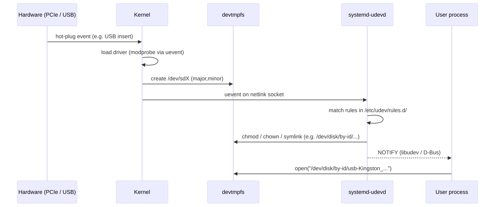
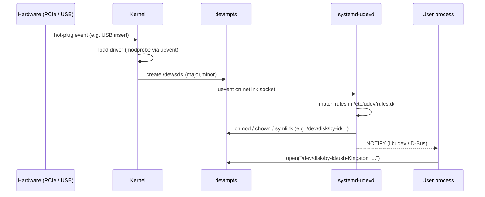

# /dev and udev — Hardware as Files

> A SATA SSD, a serial console, a webcam, and `/dev/null` all answer the same syscalls. That's the magic.

## Why this matters

Every piece of hardware on a Linux box is reached through a **device node** in `/dev`. The node is just a special file with a (major, minor) number that the kernel maps to a driver. Twenty years ago `/dev` was a static disaster of 10,000 pre-created nodes; today **udev** creates them on the fly when the kernel announces a device, applies your naming/permission rules, and emits hot-plug events you can react to. If you've ever had a USB disk show up as `/dev/sdb` one day and `/dev/sdc` the next, this file is for you.

## How a device becomes a file

<!-- mermaid:rendered -->
<p align="center"></p>

<details><summary>Mermaid source</summary>



</details>
## Character vs block devices

```bash
$ ls -l /dev/sda /dev/null /dev/tty1 /dev/random
brw-rw---- 1 root disk    8,  0 Apr 26 09:00 /dev/sda
crw-rw-rw- 1 root root    1,  3 Apr 26 09:00 /dev/null
crw--w---- 1 root tty     4,  1 Apr 26 09:00 /dev/tty1
crw-rw-rw- 1 root root    1,  8 Apr 26 09:00 /dev/random
^                         ^   ^
| type                    |   minor (specific device)
                          major (driver number)
```

| Type | Letter | Access pattern | Examples |
|------|--------|----------------|----------|
| **Block** | `b` | seekable, fixed-size blocks, page cache | `/dev/sda`, `/dev/nvme0n1`, `/dev/loop0` |
| **Character** | `c` | byte stream, no caching | `/dev/tty*`, `/dev/null`, `/dev/random`, `/dev/kvm` |
| **Symlink** | `l` | persistent name | `/dev/disk/by-uuid/...` |
| **Socket** | `s` | UNIX socket file | `/run/docker.sock` |
| **FIFO** | `p` | named pipe | created by `mkfifo` |

The major number tells the kernel which driver; the minor tells it which instance. `/proc/devices` lists the registered numbers.

```bash
$ head -20 /proc/devices
Character devices:
  1 mem         # /dev/null, /dev/zero, /dev/random, /dev/urandom
  4 /dev/vc/0
  4 tty
  5 /dev/tty
 10 misc        # /dev/kvm, /dev/fuse
 13 input
116 alsa
Block devices:
  8 sd          # SATA/SCSI disks
259 blkext
253 device-mapper
259 nvme
```

## The well-known virtual character devices

| Node | Behavior | Use |
|------|----------|-----|
| `/dev/null` | reads return EOF; writes discarded | `cmd > /dev/null` |
| `/dev/zero` | reads return infinite NUL bytes | `dd if=/dev/zero of=file bs=1M count=100` |
| `/dev/full` | writes always return ENOSPC | testing error paths |
| `/dev/random` | blocking entropy source (post-5.6: only at boot) | crypto seed |
| `/dev/urandom` | non-blocking CSPRNG | **use this** for keys, tokens |
| `/dev/tty` | the controlling terminal of *this* process | `read pw </dev/tty` in scripts |
| `/dev/console` | the system console | early-boot logging |

> Modern guidance: **always use `/dev/urandom`**. The "random vs urandom" debate ended with kernel 5.6 — both are now CSPRNG-backed; `/dev/random` only blocks during the first few seconds of boot.

## Creating device nodes manually: `mknod`

You almost never do this anymore (devtmpfs + udev does it for you), but it exists for chroots, initramfs, and container images.

```bash
# Recreate /dev/null inside a chroot (major 1, minor 3, character)
mknod /chroot/dev/null c 1 3
chmod 666 /chroot/dev/null

# A loop device node
mknod /dev/loop10 b 7 10
```

## udev — naming, permissions, and hot-plug actions

`systemd-udevd` listens on a kernel netlink socket for `uevent` messages. For each event it evaluates rules in (in order):

1. `/usr/lib/udev/rules.d/` — distro defaults
2. `/run/udev/rules.d/` — runtime / generated
3. `/etc/udev/rules.d/` — **your overrides** (highest priority)

Files are named `NN-name.rules` and processed in lexicographic order. Common starters: `60-` for permissions, `70-` for naming, `99-` for catch-all.

### Rule syntax

```text
ACTION=="add",                                  # match: add | remove | change
SUBSYSTEM=="block",                             # match: block | net | tty | usb | input | ...
KERNEL=="sd[a-z]",                              # kernel name pattern
ATTR{queue/rotational}=="0",                    # match a sysfs attribute
ATTRS{idVendor}=="0951", ATTRS{idProduct}=="1666",  # walk parent devices
SYMLINK+="my-usb-key",                          # action: add a symlink in /dev
GROUP="storage", MODE="0660",                   # action: set ownership
RUN+="/usr/local/bin/notify-disk %k"            # action: run a program
```

`==` is match, `=` is assignment, `+=` is append. `%k` is the kernel name, `%E{KEY}` reads an env var.

### Realistic example — pin a USB drive to a stable name

```bash
# Step 1: discover the device's identifying attributes
$ udevadm info -a -n /dev/sdb | head -30
  looking at device '/devices/.../block/sdb':
    KERNEL=="sdb"
    SUBSYSTEM=="block"
    ATTR{size}=="62333952"
  looking at parent device '/devices/.../usb1/1-2':
    ATTRS{idVendor}=="0951"
    ATTRS{idProduct}=="1666"
    ATTRS{serial}=="408D5C0DAB6FE0A097A40034"
    ATTRS{manufacturer}=="Kingston"

# Step 2: write a rule
sudo tee /etc/udev/rules.d/99-kingston-backup.rules <<'EOF'
SUBSYSTEM=="block", ATTRS{idVendor}=="0951", ATTRS{idProduct}=="1666", \
  ATTRS{serial}=="408D5C0DAB6FE0A097A40034", \
  SYMLINK+="backup-usb%n", GROUP="backup", MODE="0660"
EOF

# Step 3: reload + retrigger
sudo udevadm control --reload
sudo udevadm trigger --subsystem-match=block --action=add

# Step 4: verify
ls -l /dev/backup-usb*
# lrwxrwxrwx 1 root root 3 Apr 26 10:30 /dev/backup-usb -> sdb
# lrwxrwxrwx 1 root root 4 Apr 26 10:30 /dev/backup-usb1 -> sdb1
```

### Test rules without rebooting

```bash
# Show what udev would do for a device, including which rule matched
sudo udevadm test /sys/class/block/sdb 2>&1 | grep -E 'RUN|SYMLINK|MODE|GROUP'

# Watch live events as you plug things in
sudo udevadm monitor --udev --property
```

## Persistent disk naming under `/dev/disk/`

Stop using `/dev/sda` in `/etc/fstab`. It changes. Use one of these stable names that udev creates for you:

```bash
$ ls /dev/disk/
by-id      by-label   by-partlabel   by-partuuid   by-path   by-uuid
```

| Directory | Source of stability | When to use |
|-----------|--------------------|--------------| 
| `by-uuid/` | filesystem UUID | **default for /etc/fstab** |
| `by-label/` | filesystem label | when you control labels |
| `by-id/` | hardware serial (USB / WWN) | identifying physical disks |
| `by-partuuid/` | GPT partition UUID | bootloaders, partitions before mkfs |
| `by-partlabel/` | GPT partition label | scripted provisioning |
| `by-path/` | physical bus path | locating slot in a JBOD |

```bash
$ ls -l /dev/disk/by-uuid/
lrwxrwxrwx 1 root root 10 Apr 26 09:00 5a3c-e7d2 -> ../../sda1
lrwxrwxrwx 1 root root 10 Apr 26 09:00 8f2e-99ba-4c01-... -> ../../nvme0n1p2

# Find the UUID for fstab
blkid /dev/sda1
# /dev/sda1: UUID="8f2e-99ba-4c01-..." TYPE="ext4" PARTUUID="..."
```

## Hot-plug walkthrough — USB drive insertion

```bash
# Terminal 1: watch
sudo udevadm monitor --udev

# Terminal 2: plug in a USB stick. You'll see a flurry:
UDEV  [4521.123] add  /devices/.../usb1/1-2 (usb)
UDEV  [4521.245] add  /devices/.../host6 (scsi)
UDEV  [4521.489] add  /devices/.../host6/.../sdb (block)
UDEV  [4521.501] add  /devices/.../host6/.../sdb/sdb1 (block)
UDEV  [4521.531] change /devices/.../host6/.../sdb1 (block)  ← partition table read

# What just happened?
dmesg | tail -10
# usb 1-2: new high-speed USB device
# usb-storage 1-2:1.0: USB Mass Storage device detected
# scsi 6:0:0:0: Direct-Access Kingston DataTraveler 3.0
# sd 6:0:0:0: [sdb] 62333952 512-byte logical blocks: (31.9 GB)
# sdb: sdb1
```

> **Gotchas**
> - `/etc/udev/rules.d/` filenames must end in `.rules` — anything else is silently ignored.
> - A single typo in a rule file aborts that file but does not block boot. Always run `udevadm test` after editing.
> - `/dev` on a running system is `devtmpfs` (kernel-managed). Inside a container or chroot, you typically bind-mount `/dev` or use a minimal static set.
> - Do not `mknod` over an existing node and expect the original to come back — udev won't recreate it until the next uevent.
> - Reading `/dev/random` on a kiosk-class device at boot can hang indefinitely. Use `urandom` or seed `/var/lib/systemd/random-seed`.

> **20-year tips**
> - When a disk "moved" from `sdb` to `sdc`, the disk didn't move — its enumeration order changed. Use `by-uuid` and the problem disappears forever.
> - For Kubernetes nodes with NVMe, write a udev rule that sets `nr_requests` and the IO scheduler — it survives kernel upgrades and is reproducible across the fleet.
> - `udevadm info --query=all --name=/dev/sda` is the single most useful command in this whole module. Memorize it.
> - Use `RUN+=` sparingly. udev runs your script with a 30-second timeout and will SIGKILL it. Anything longer than a kebab-case task belongs in a systemd unit triggered by a `.device` unit dependency.
> - If your container image is missing `/dev/null`, every program crashes with `ENOENT` in unpredictable places. Always include the basic five: `null zero full random urandom tty`.

> **Common interview questions**
> 1. **Q:** What replaced the static `/dev` of the 1990s?
>    **A:** First `devfs` (kernel-side), then **udev** (userspace), and today `devtmpfs` (kernel creates nodes) + `systemd-udevd` (userspace applies naming and permissions).
> 2. **Q:** Why does a USB stick sometimes appear as `sdb`, sometimes `sdc`?
>    **A:** The kernel assigns `sdN` in detection order, which depends on bus enumeration timing. The fix is to reference `/dev/disk/by-uuid/` or `by-id/`.
> 3. **Q:** What's the difference between `/dev/random` and `/dev/urandom`?
>    **A:** Historically random blocked when entropy ran low; urandom never did. On modern kernels (5.6+) both use the same CSPRNG; `random` only blocks until the pool is initially seeded at boot. Use `urandom`.
> 4. **Q:** How do you make a custom udev rule active without reboot?
>    **A:** `udevadm control --reload && udevadm trigger`.
> 5. **Q:** What information does `udevadm info -a -n /dev/sdb` give you?
>    **A:** The full device chain from the leaf up to the root bus, listing all `ATTR{}` and `ATTRS{}` keys you can match in rules.
> 6. **Q:** Why are major and minor numbers important if udev gives me named symlinks?
>    **A:** They're how the kernel routes syscalls to drivers. Containers, mknod, and cgroup device controllers all operate on (major, minor).
> 7. **Q:** How would you make a script run every time a specific USB device is plugged in?
>    **A:** Write a udev rule with `ACTION=="add"`, match the device's `idVendor`/`idProduct`, and use `RUN+="/path/to/handler"` — or better, `TAG+="systemd"` and let a `dev-foo.device` unit pull in your service.

## Sources

- `man 7 udev`, `man 8 systemd-udevd`, `man 8 udevadm`
- `man 5 udev` rule syntax
- Greg Kroah-Hartman, "udev — A Userspace Implementation of devfs", OLS 2003
- Linux kernel `Documentation/admin-guide/devices.txt` — major/minor allocations
- freedesktop.org: https://www.freedesktop.org/software/systemd/man/udev.html
