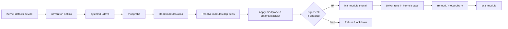

# Kernel Modules — The Plugin System for the Kernel

> A monolithic kernel that can grow itself at runtime. The trick that made Linux portable across every piece of hardware.

## Why this matters

Linux is technically a monolithic kernel — drivers run in kernel space, not as separate processes — but it has supported **loadable kernel modules (LKMs)** since 1.2. That means a single kernel binary can support thousands of devices because each driver is a `.ko` file the kernel loads on demand. Every time you `modprobe nvidia`, attach a USB serial adapter, mount NFS, or fire up a VM with `kvm_intel`, you're loading a module. Understanding `lsmod`, `modinfo`, `modprobe.d/`, blacklists, signed modules, and DKMS is the difference between "the kernel just works" and "I can fix anything the driver layer throws at me."

## The lifecycle of a module

<!-- mermaid:rendered -->
<p align="center"></p>

<details><summary>Mermaid source</summary>



</details>
## Tools you must know

| Tool | What it does | When to use |
|------|--------------|-------------|
| `lsmod` | list currently loaded modules | "is the driver in?" |
| `modinfo <name>` | metadata: author, license, params, deps, signature | before loading something unfamiliar |
| `modprobe <name>` | smart load — resolves deps + applies config | almost always |
| `modprobe -r <name>` | unload (and recursively unused deps) | replacing a driver |
| `insmod <file.ko>` | dumb load of a single `.ko` — no dep resolution | development only |
| `rmmod <name>` | dumb unload | development only |
| `depmod -a` | rebuild `modules.dep` and `modules.alias` | after dropping a `.ko` into `/lib/modules/<ver>/` |
| `dmesg` | see what the driver said when it loaded | every load/unload |
| `kmod static-nodes` | print devtmpfs nodes a module would create | initramfs scripting |

## `lsmod` and `modinfo` in practice

```bash
$ lsmod | head
Module                  Size  Used by
xt_conntrack           16384  4
nf_conntrack          172032  3 xt_conntrack,...
kvm_intel             376832  0
kvm                  1183744  1 kvm_intel
nvme                   53248  3
nvme_core             167936  4 nvme

# "Used by" — the refcount and which other modules pin this one in memory.
# kvm is loaded because kvm_intel depends on it. You cannot rmmod kvm
# until you rmmod kvm_intel first.

$ modinfo nvme | head -15
filename:       /lib/modules/6.5.0-15/kernel/drivers/nvme/host/nvme.ko
version:        1.0
license:        GPL
author:         Matthew Wilcox <willy@linux.intel.com>
srcversion:     A6B...
alias:          pci:v*d*sv*sd*bc01sc08i02*
depends:        nvme-core
intree:         Y
name:           nvme
vermagic:       6.5.0-15-generic SMP preempt mod_unload modversions
sig_id:         PKCS#7
signer:         Build time autogenerated kernel key
parm:           use_threaded_interrupts:bool
parm:           io_queue_depth:Number of IO queues per controller (default 1024) (uint)
```

The `alias:` line is what allows automatic loading: when a PCI device with that vendor/class signature appears, udev calls `modprobe pci:v...` which `modprobe` resolves to `nvme` via `modules.alias`.

## `modprobe` vs `insmod`

| | `insmod` | `modprobe` |
|--|----------|------------|
| Resolves dependencies | no | yes |
| Reads `modprobe.d/` config | no | yes |
| Applies aliases | no | yes |
| Honors blacklist | no | yes |
| Path | full filename | bare name |

```bash
# WRONG — will fail because nvme depends on nvme-core
sudo insmod /lib/modules/6.5.0-15/kernel/drivers/nvme/host/nvme.ko
# insmod: ERROR: could not insert module: Unknown symbol in module

# RIGHT
sudo modprobe nvme
```

## Configuration: `/etc/modprobe.d/` and `/etc/modules-load.d/`

Two different directories with two different jobs:

| Directory | Purpose | Example |
|-----------|---------|---------|
| `/etc/modules-load.d/*.conf` | **load these modules at boot**, one per line | `vfio-pci` |
| `/etc/modprobe.d/*.conf` | **how** modules behave (options, aliases, blacklist) | see below |

### Module options

```bash
# /etc/modprobe.d/iwlwifi.conf — disable buggy power saving on Intel WiFi
options iwlwifi power_save=0 power_level=1 swcrypto=1
```

`modinfo <module>` shows valid `parm:` lines. After editing, the change takes effect on the **next** load — for already-loaded modules you must `modprobe -r` then `modprobe`.

For modules built into the kernel (not loaded as `.ko`) you instead pass options on the **kernel command line**: `iwlwifi.power_save=0`.

### Aliases

```bash
# /etc/modprobe.d/aliases.conf
alias eth0 e1000e          # name a NIC driver
alias char-major-89-* i2c-dev
```

### Blacklisting

```bash
# /etc/modprobe.d/blacklist-nouveau.conf — common before installing NVIDIA proprietary
blacklist nouveau
options nouveau modeset=0
```

Blacklist prevents **automatic** loading. A user who runs `modprobe nouveau` directly will still load it. To absolutely prevent loading, use `install`:

```bash
install nouveau /bin/true       # any modprobe attempt does nothing
```

After changing blacklists, regenerate the initramfs so early-boot doesn't re-pull the module:

```bash
sudo update-initramfs -u           # Debian/Ubuntu
sudo dracut -f                     # Fedora/RHEL
```

## Signed modules and kernel lockdown

Modern distros sign every in-tree module with the kernel's own key (visible as `signer:` in `modinfo`). When **Secure Boot** is on, the kernel enters **lockdown** mode and refuses unsigned modules:

```bash
$ sudo modprobe my-out-of-tree-driver
modprobe: ERROR: could not insert 'my-out-of-tree-driver': Key was rejected by service
```

Options:
1. Disable Secure Boot in firmware (least secure)
2. Enroll a **Machine Owner Key (MOK)** with `mokutil --import` and sign your modules with it
3. Disable lockdown (`SYSTEM_BLACKLIST_KEYRING` / boot param `lockdown=none` if kernel allows)

```bash
# Sign a module yourself
sudo /usr/src/linux-headers-$(uname -r)/scripts/sign-file \
    sha256 \
    /var/lib/shim-signed/mok/MOK.priv \
    /var/lib/shim-signed/mok/MOK.der \
    my-driver.ko
```

## DKMS — keeping out-of-tree modules alive across kernel upgrades

A kernel module is compiled against **specific kernel headers**. When apt/dnf updates your kernel, every out-of-tree module (NVIDIA, VirtualBox, ZFS, WireGuard pre-5.6) becomes incompatible. **DKMS (Dynamic Kernel Module Support)** automates the rebuild.

```mermaid
flowchart LR
    PKG[apt install nvidia-dkms]
    PKG --> SRC[/usr/src/nvidia-535.x.y/]
    SRC --> REG[dkms add — registers in /var/lib/dkms/]
    REG --> BLD1[Build for current kernel — install .ko]
    APT[apt upgrade → new kernel installed]
    APT --> HOOK[postinst kernel hook → dkms autoinstall]
    HOOK --> BLD2[Rebuild module against new headers]
    BLD2 --> NEW[/lib/modules/<new>/updates/dkms/nvidia.ko]
```

```bash
# What DKMS modules are registered?
dkms status
# nvidia/535.183.01, 6.5.0-15-generic, x86_64: installed
# nvidia/535.183.01, 6.5.0-21-generic, x86_64: installed

# Manual rebuild after a hand-installed kernel
sudo dkms autoinstall -k 6.5.0-21-generic

# Add a new out-of-tree module to DKMS
sudo dkms add /usr/src/foo-1.0
sudo dkms build foo/1.0
sudo dkms install foo/1.0
```

The build needs `linux-headers-$(uname -r)` (Debian) or `kernel-devel` (RHEL). Without them, `dkms status` says "WARNING: missing kernel headers."

## Lab walkthrough — load, configure, and verify the `loop` module

```bash
# 1. Is it built-in or modular?
$ grep CONFIG_BLK_DEV_LOOP /boot/config-$(uname -r)
CONFIG_BLK_DEV_LOOP=m            # m = module, y = built-in

# 2. Currently loaded?
$ lsmod | grep ^loop
loop                   32768  0

# 3. What params does it accept?
$ modinfo -p loop
max_loop:Maximum number of loop devices (int)
max_part:Maximum number of partitions per loop device (int)

# 4. Reload with more partitions per loop device
sudo modprobe -r loop
sudo modprobe loop max_part=8

# 5. Persist
echo 'options loop max_part=8' | sudo tee /etc/modprobe.d/loop.conf
echo 'loop' | sudo tee /etc/modules-load.d/loop.conf

# 6. Verify the parameter took effect
cat /sys/module/loop/parameters/max_part
# 8

# 7. Confirm with dmesg
dmesg | tail -3
# loop: module loaded
```

## Inspecting from `/sys/module/`

Every loaded module appears as a directory:

```bash
$ ls /sys/module/nvme/
coresize  drivers  holders  initsize  initstate  notes  parameters  refcnt  sections  srcversion  taint  version  uevent

$ cat /sys/module/nvme/refcnt        # how many holders pin this module
3
$ ls /sys/module/nvme/parameters/
io_queue_depth  use_threaded_interrupts  ...
$ cat /sys/module/nvme/parameters/io_queue_depth
1024
```

Some parameters are **runtime-writable** if exported with `0644`:

```bash
$ ls -l /sys/module/nf_conntrack/parameters/
-rw-r--r-- 1 root root 4096 Apr 26 11:00 acct
-r--r--r-- 1 root root 4096 Apr 26 11:00 hashsize
$ echo 1 | sudo tee /sys/module/nf_conntrack/parameters/acct
```

## Tainting

```bash
$ cat /proc/sys/kernel/tainted
12288
```

Each bit represents a way the kernel was "tainted" — usually by loading a proprietary module (NVIDIA), an unsigned module, or after a panic. Distros refuse to debug tainted kernels. Decode with:

```bash
$ awk '{print $1}' /proc/sys/kernel/tainted | xargs -I{} python3 -c "
b={}
for i in range(20):
  if b & (1<<i): print('bit',i,'set')
"
```

> **Gotchas**
> - `rmmod` will fail with `EBUSY` if anything is using the module. Use `lsmod` to find the holder, then unload that first.
> - Editing `/etc/modprobe.d/` does not affect modules already loaded by initramfs (early boot). You must `update-initramfs -u` (or distro equivalent).
> - Kernel parameters for **built-in** code are NOT in `modprobe.d` — they go on the kernel command line via the bootloader.
> - After installing a new kernel, NVIDIA / ZFS / VirtualBox modules are missing for the new kernel until DKMS rebuilds them. Check `dkms status` before rebooting.
> - `insmod foo.ko` requires the `.ko` to be compiled against the **exact running kernel version** (`vermagic` must match), or it fails with `Invalid module format`.

> **20-year tips**
> - On servers, write `blacklist` rules for unused storage stacks (`firewire-ohci`, `pcspkr`, `joydev`) — fewer modules = smaller attack surface and faster boot.
> - When chasing a driver bug, build the module with `make M=drivers/foo modules` and `insmod` it directly — much faster than full kernel rebuild.
> - `modprobe --show-depends nvme` shows the full load order. Use it to debug "why is module X being pulled in?"
> - In containers, kernel modules belong to the **host**. Don't try to `modprobe` from inside a container; mount the module on the host or use a privileged init container.
> - For embedded boards: keep an eye on module memory. `lsmod` shows size; on a 64MB system, every loaded `.ko` matters.

> **Common interview questions**
> 1. **Q:** What's the difference between `insmod` and `modprobe`?
>    **A:** `modprobe` resolves dependencies and config from `/etc/modprobe.d/`; `insmod` does a raw load of a single `.ko` and fails on missing symbols.
> 2. **Q:** How do you make a module load options persistent?
>    **A:** Drop a file in `/etc/modprobe.d/`, e.g. `options iwlwifi power_save=0`, then re-modprobe (or rebuild initramfs if needed at boot).
> 3. **Q:** What does DKMS solve?
>    **A:** Out-of-tree modules need rebuilding for each new kernel. DKMS hooks into the package manager so the rebuild happens automatically when a kernel is installed.
> 4. **Q:** Why might `modprobe foo` succeed but `insmod /lib/modules/.../foo.ko` fail?
>    **A:** `foo` likely depends on other modules (`Unknown symbol` errors); `modprobe` loads them first.
> 5. **Q:** What is kernel "tainting"?
>    **A:** A flag set when something compromises debuggability — proprietary code, unsigned modules, machine-check events. Distro support typically ends once the kernel is tainted.
> 6. **Q:** How do you blacklist `nouveau` so NVIDIA's driver can take over?
>    **A:** `/etc/modprobe.d/blacklist-nouveau.conf` with `blacklist nouveau` and `options nouveau modeset=0`, then rebuild initramfs.
> 7. **Q:** Where do you set parameters for **built-in** drivers?
>    **A:** On the kernel command line in the bootloader: `iwlwifi.power_save=0`.

## Sources

- `man 8 modprobe`, `man 5 modprobe.d`, `man 5 modules-load.d`, `man 8 depmod`, `man 8 lsmod`, `man 8 modinfo`
- `man 8 dkms`
- Linux kernel `Documentation/admin-guide/module-signing.rst`
- Linux kernel `Documentation/admin-guide/sysctl/kernel.rst` (taint flags)
- Greg Kroah-Hartman, *Linux Kernel in a Nutshell*
