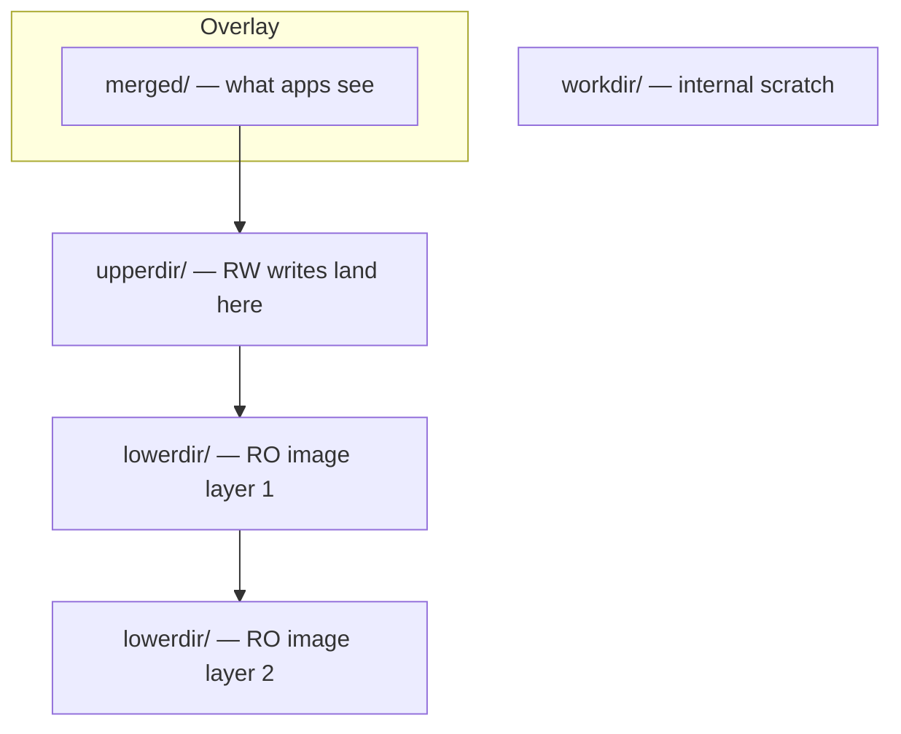

# Mounts and Filesystems — Storage Glued to the Tree

> Mounting is just attaching a tree to a node. The hard part is choosing the right options and the right filesystem.

## Why this matters

A Linux system is **one** tree. Disks, network shares, RAM, ISO images, container layers — they all become subtrees of `/` via the `mount()` syscall. The `/etc/fstab` you copy-paste from Stack Overflow runs at every boot; one wrong field can leave your machine dropping into emergency shell. Beyond fstab, container runtimes lean on **bind**, **overlay**, and **tmpfs** mounts — those are how Docker layers, Kubernetes secrets, and immutable OSes actually work. Understand mount options like `noatime`, `nodev`, `nosuid`, `discard` and you'll cut latency, harden security, and stop your SSDs from dying early.

## The mount tree

```mermaid
flowchart TD
    R[/]
    R --> BOOT[/boot — /dev/nvme0n1p1 vfat]
    R --> HOME[/home — /dev/mapper/vg-home ext4]
    R --> VAR[/var — /dev/mapper/vg-var xfs]
    R --> RUN[/run — tmpfs]
    R --> TMP[/tmp — tmpfs]
    R --> PROC[/proc — proc]
    R --> SYS[/sys — sysfs]
    R --> DEV[/dev — devtmpfs]
    R --> NFS[/mnt/share — server:/data nfs4]
    R --> OVL[/var/lib/docker/.../merged — overlay]
```

A subdirectory becomes the **mountpoint**; whatever was there before is hidden until you unmount.

## `/etc/fstab` field-by-field

```
# <device>                                        <mount>   <type>  <options>                <dump> <pass>
UUID=8f2e-99ba-4c01-a1e9-...                      /         ext4    defaults,noatime,errors=remount-ro 0 1
UUID=4ab2-1cde                                    /boot     ext2    defaults                  0 2
UUID=12fa-bdca                                    /boot/efi vfat    umask=0077                0 2
/dev/mapper/vg-swap                               none      swap    sw                        0 0
tmpfs                                             /tmp      tmpfs   defaults,nosuid,nodev,size=2G 0 0
nas.lan:/exports/backups                          /backups  nfs4    rw,soft,bg,_netdev,vers=4.2 0 0
//fileserver/share                                /smb      cifs    credentials=/etc/smb.cred,_netdev 0 0
```

| Field | Meaning |
|-------|---------|
| **device** | source — UUID/LABEL preferred; raw `/dev/sd*` is fragile |
| **mount** | absolute path mountpoint; `none` for swap |
| **type** | `ext4`, `xfs`, `btrfs`, `vfat`, `tmpfs`, `nfs4`, `cifs`, `auto`, ... |
| **options** | comma-separated; see below |
| **dump** | legacy `dump(8)` flag — set to `0` |
| **pass** | fsck order: `1` for root, `2` for others, `0` to skip |

A bad fstab entry can fail boot. Always test with `mount -a` after editing — if it returns an error, fix it before rebooting.

## Mount options worth knowing

### Performance

| Option | Effect |
|--------|--------|
| `noatime` | don't update access time on read — **always set on busy filesystems** |
| `nodiratime` | same but only for directories (atime still updated for files) |
| `relatime` | atime updated only if older than mtime/ctime — **default** since 2.6.30 |
| `discard` | issue TRIM on every delete — fine on NVMe; can hurt on SATA SSDs (use weekly `fstrim` instead) |
| `commit=N` | flush journal every N seconds (ext4) — higher = less IO, more risk |
| `barrier=0` | disable write barriers (ext4) — DANGEROUS without battery-backed cache |

### Security

| Option | Effect |
|--------|--------|
| `nosuid` | ignore setuid bit — set on `/tmp`, `/var`, `/home` always |
| `nodev` | ignore device nodes — block sneaky `/tmp/dev/sda` |
| `noexec` | refuse to execute binaries from this mount — set on `/tmp` if your apps allow |
| `ro` | read-only |

A typical hardened `/tmp`:

```
tmpfs   /tmp   tmpfs   rw,nosuid,nodev,noexec,size=2G,mode=1777   0 0
```

### NFS / network

| Option | Effect |
|--------|--------|
| `_netdev` | mount only after networking is up (essential, or boot hangs) |
| `soft` vs `hard` | `soft` returns EIO on timeout; `hard` retries forever (default) |
| `bg` | retry mount in background if server unreachable at boot |
| `vers=4.2` | pin NFS protocol version |
| `nconnect=4` | open multiple TCP connections (NFSv4.1+) — big throughput win |

## Bind mounts — make a directory appear in two places

```bash
# Make /srv/website appear inside a chroot
sudo mkdir -p /chroot/var/www
sudo mount --bind /srv/website /chroot/var/www

# Read-only bind (two-step on older kernels)
sudo mount --bind /srv/website /chroot/var/www
sudo mount -o remount,ro,bind /chroot/var/www
```

Bind mounts are the foundation of containers — `docker run -v` is a bind mount. They're also how you isolate `/home` to a separate partition without changing layout.

## Overlay mounts — layered filesystems

Used by Docker, Podman, OSTree, and image-based OSes. An overlay presents a **merged** view of one writable upper layer on top of one or more read-only lower layers.

```bash
sudo mkdir -p /tmp/{lower,upper,work,merged}
echo "from base" | sudo tee /tmp/lower/file
sudo mount -t overlay overlay \
  -o lowerdir=/tmp/lower,upperdir=/tmp/upper,workdir=/tmp/work \
  /tmp/merged

# Reads from merged see the file, writes go to upper
cat /tmp/merged/file               # "from base"
echo "modified" > /tmp/merged/file
ls /tmp/upper/                     # file (the modified copy)
ls /tmp/lower/                     # untouched
```

<!-- mermaid:rendered -->
<p align="center"></p>

<details><summary>Mermaid source</summary>



</details>

## tmpfs — RAM-backed filesystem

```bash
sudo mount -t tmpfs -o size=4G,mode=1777,nosuid,nodev tmpfs /scratch
df -h /scratch
# tmpfs   4.0G  0  4.0G  0%  /scratch
```

tmpfs uses RAM, then swap. That makes it perfect for caches, build directories, `/run` PID files. Crucially, **a tmpfs without an explicit `size=` defaults to 50 % of RAM** — easy footgun on small VMs.

## autofs — mount on access, unmount when idle

For NFS shares that come and go, or USB drives in shared workstations:

```bash
# /etc/auto.master
/mnt/nfs    /etc/auto.nfs --timeout=300

# /etc/auto.nfs
home    -fstype=nfs4,rw,soft  nas.lan:/exports/home
backups -fstype=nfs4,rw,soft  nas.lan:/exports/backups

sudo systemctl restart autofs
ls /mnt/nfs/home          # triggers the mount
```

## Investigating mounts

```bash
# Pretty tree of every mount (ignore pseudo-FS)
findmnt --real
# TARGET                 SOURCE                       FSTYPE     OPTIONS
# /                      /dev/mapper/vg-root          ext4       rw,relatime
# ├─/boot                /dev/nvme0n1p1               ext2       rw,relatime
# ├─/boot/efi            /dev/nvme0n1p2               vfat       rw,fmask=0077
# └─/home                /dev/mapper/vg-home          xfs        rw,noatime

# Block devices and their mounts (one screen)
lsblk -o NAME,SIZE,TYPE,FSTYPE,UUID,MOUNTPOINT
# nvme0n1                  931G   disk
# ├─nvme0n1p1              512M   part vfat   1234-5678 /boot/efi
# ├─nvme0n1p2              1G     part ext2   abcd-...  /boot
# └─nvme0n1p3              929G   part LVM2   ...
#   ├─vg-root              100G   lvm  ext4   8f2e-...  /
#   └─vg-home              829G   lvm  xfs    91a3-...  /home

# Find what's keeping you from unmounting
sudo lsof +f -- /mnt/share
sudo fuser -vm /mnt/share
```

## Common Linux filesystems compared

| | **ext4** | **xfs** | **btrfs** | **zfs** |
|--|----------|---------|-----------|---------|
| Stable since | 2008 | 2001 (in Linux) | 2014 | 2005 (Solaris) / 2013 (Linux ZoL) |
| Max FS size | 1 EiB | 8 EiB | 16 EiB | 256 ZiB |
| Snapshots | no (LVM gives them) | no | yes (CoW) | yes (CoW) |
| Subvolumes | no | no | yes | yes |
| Compression | no | no (in 6.x experimental) | yes (zstd, lzo) | yes (lz4, zstd, gzip) |
| Built-in RAID | no | no | yes (1, 10) | yes (1, Z1/2/3, dRAID) |
| Online resize | grow only | grow only | yes (grow + shrink) | yes (grow), pool-based |
| Best for | general purpose default | large files, parallel IO, /var | snapshots, single-host RAID | servers, NAS, immutable OSes |
| Notes | safest fallback | XFS journals are *fast*; can't shrink | RAID5/6 still fragile | not in mainline; out-of-tree license |

### Quick chooser

- **Single root partition on a laptop:** ext4
- **Many large files (logs, media, db):** xfs
- **Want snapshots without LVM, single host:** btrfs
- **NAS, file servers, datasets, send/recv:** zfs
- **Cluster storage:** Ceph or GlusterFS, not a local FS

## Lab walkthrough — adding a data disk to fstab safely

```bash
# 1. Identify the disk
lsblk
# nvme1n1   1.8T disk    (no partitions, no mountpoint)

# 2. Partition (GPT, single partition)
sudo parted /dev/nvme1n1 -- mklabel gpt
sudo parted /dev/nvme1n1 -- mkpart data 0% 100%

# 3. Format
sudo mkfs.xfs -L data /dev/nvme1n1p1

# 4. Get UUID
sudo blkid /dev/nvme1n1p1
# /dev/nvme1n1p1: LABEL="data" UUID="b3a5-9f01-..." TYPE="xfs"

# 5. Mountpoint and fstab entry
sudo mkdir -p /data
echo 'UUID=b3a5-9f01-... /data xfs defaults,noatime,nofail,_netdev 0 2' | sudo tee -a /etc/fstab

# 6. Test BEFORE reboot
sudo systemctl daemon-reload     # systemd watches /etc/fstab
sudo mount -a                    # if this fails, fix fstab
findmnt /data                    # confirm

# 7. Verify it survives a reboot in a controlled way
sudo systemctl reboot
```

`nofail` is critical: without it, a missing disk drops you into emergency shell at boot. With it, the system continues and you'll find the issue in `journalctl -b`.

> **Gotchas**
> - `swap` partitions need `swapon -a`, not `mount -a`. The `swap` line in fstab handles it on boot but `mount -a` won't.
> - Do not use raw `/dev/sdX` in fstab; the next reboot may renumber and you'll mount the wrong disk. Always use `UUID=` or `LABEL=`.
> - `noexec` on `/tmp` breaks installers (Java, Python venv builds, some package managers). Test before deploying.
> - tmpfs default size is 50 % of RAM if you omit `size=`. On a 256 GB box that's an easy way to OOM yourself.
> - `mount --bind` does **not** propagate options like `ro`. You need a second `mount -o remount,ro,bind`.
> - Removing an XFS partition is a one-way ticket — XFS cannot shrink. Plan capacity carefully.

> **20-year tips**
> - Always add `_netdev` and `nofail` to remote mounts. The number of production outages caused by a missing NFS server hanging boot is too damn high.
> - Mount `/home`, `/var`, `/tmp` separately from `/` on real servers. A runaway log file can fill `/var` without killing the OS.
> - Schedule weekly `fstrim -av` via the `fstrim.timer` systemd unit instead of mount-time `discard` for SATA SSDs.
> - For databases on XFS, format with `-d agcount=<2x cores>` and mount with `noatime,nodiratime,inode64,logbufs=8`.
> - When debugging "file not found" inside a container, always check that the bind mount actually landed where you think — `findmnt` inside the container reveals all.

> **Common interview questions**
> 1. **Q:** What is `_netdev` and why does it matter?
>    **A:** It tells systemd this mount needs the network — the mount unit will wait for `network-online.target`. Without it, NFS/CIFS mounts at boot can hang the system.
> 2. **Q:** Difference between `noatime` and `relatime`?
>    **A:** `noatime` never updates access time; `relatime` updates only when the previous atime is older than mtime/ctime. `relatime` is the modern default — POSIX-friendly and almost as cheap as `noatime`.
> 3. **Q:** What is a bind mount used for in containers?
>    **A:** To share host directories with the container's filesystem namespace — the foundation of `docker -v` and Kubernetes `hostPath` volumes.
> 4. **Q:** When would you choose XFS over ext4?
>    **A:** Workloads with very large files or high parallel IO (databases, media, logs). XFS scales better but cannot shrink.
> 5. **Q:** What does the `pass` field in fstab do?
>    **A:** Order in which `fsck` runs at boot: `1` for `/`, `2` for others, `0` to skip. fscks with the same number can run in parallel.
> 6. **Q:** How does an overlay filesystem work?
>    **A:** Reads see merged contents of `lowerdir` (RO) and `upperdir` (RW); writes go to `upperdir`. Deletes create whiteouts in `upperdir`. It's how container image layers compose.
> 7. **Q:** What's the difference between a hard and soft NFS mount?
>    **A:** `hard` retries forever on server timeout (data integrity); `soft` returns EIO to the application after retries (responsiveness). Use `hard,intr` historically; modern: `hard` for data, `soft` only for read-only caches.

## Sources

- `man 5 fstab`, `man 8 mount`, `man 8 findmnt`, `man 8 lsblk`
- `man 5 nfs`, `man 8 mount.cifs`
- Linux kernel `Documentation/filesystems/{ext4,xfs,btrfs,overlayfs,tmpfs}.rst`
- Red Hat docs — Storage Administration Guide
- OpenZFS handbook — https://openzfs.github.io/openzfs-docs/
