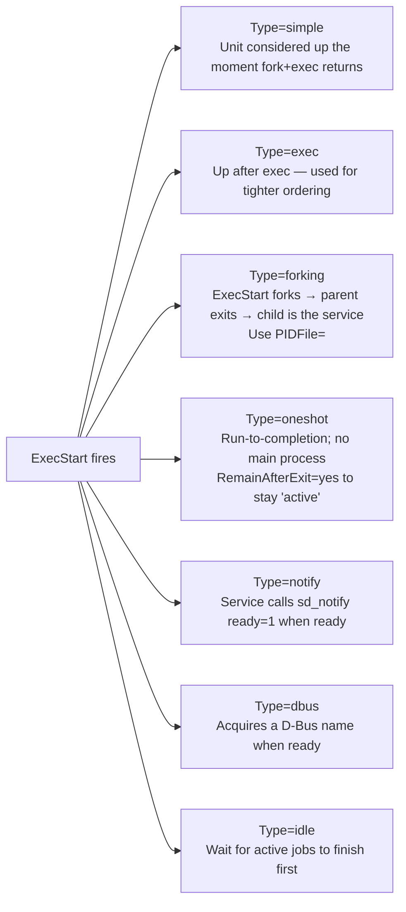

# systemd Services — Deep Dive

> systemd is not the enemy. It is the operating system's process manager, and once you understand the unit grammar, it becomes the most powerful tool in your shed.

## Why this matters

Every modern Linux distribution boots with systemd as PID 1. It supervises every long-running process, manages dependencies, captures logs, enforces resource limits, sandboxes services, and restarts them when they crash. If you can write a clean unit file with the right `Type=`, `Restart=`, `ExecStartPre=`, `WatchdogSec=`, sandboxing options, and a smart drop-in, you are operating at the level where 99 % of "my service won't start" tickets disappear. Bonus: `systemd-run` lets you launch one-off transient services with full sandboxing — better than `nohup` in every way.

## Anatomy of a unit file

Unit files live in (in order of precedence):

1. `/etc/systemd/system/` — admin overrides (you)
2. `/run/systemd/system/` — runtime
3. `/usr/lib/systemd/system/` — vendor / package

```ini
# /etc/systemd/system/myapp.service
[Unit]
Description=My App API
Documentation=https://docs.example.com/myapp
After=network-online.target postgresql.service
Wants=network-online.target
Requires=postgresql.service
ConditionPathExists=/etc/myapp/config.yaml

[Service]
Type=notify
User=myapp
Group=myapp
WorkingDirectory=/var/lib/myapp
EnvironmentFile=-/etc/myapp/env
ExecStartPre=/usr/local/bin/myapp migrate
ExecStart=/usr/local/bin/myapp serve --config /etc/myapp/config.yaml
ExecReload=/bin/kill -HUP $MAINPID
ExecStopPost=/usr/local/bin/myapp shutdown-hook
Restart=on-failure
RestartSec=5s
WatchdogSec=30s
TimeoutStartSec=60s
TimeoutStopSec=30s

# Sandboxing
NoNewPrivileges=yes
ProtectSystem=strict
ProtectHome=yes
PrivateTmp=yes
ProtectKernelTunables=yes
ProtectKernelModules=yes
ProtectControlGroups=yes
RestrictAddressFamilies=AF_INET AF_INET6 AF_UNIX
SystemCallFilter=@system-service
SystemCallArchitectures=native
ReadWritePaths=/var/lib/myapp /var/log/myapp
LimitNOFILE=65535

[Install]
WantedBy=multi-user.target
```

### `[Unit]` — metadata and ordering

| Directive | Use |
|-----------|-----|
| `Description=` | one-line summary; shown by `systemctl status` |
| `Documentation=` | URL or `man:` ref |
| `After=` / `Before=` | **ordering** only — does not pull in the dep |
| `Requires=` | hard dependency — if it fails, we fail |
| `Wants=` | soft dependency — try to start, don't fail if it can't |
| `Requisite=` | dep must be already running, won't start it |
| `BindsTo=` | hard dep + we stop when it stops |
| `PartOf=` | propagate stop/restart from the dep |
| `Conflicts=` | starting us stops the listed unit |
| `ConditionPathExists=` | skip silently if condition false |
| `AssertPathExists=` | fail loudly if condition false |

> Critical distinction: `Requires=` does **not** mean "start after". You almost always pair it with `After=`.

### `[Service]` — what to actually run

#### `Type=` is the most-screwed-up directive

<!-- mermaid:rendered -->
<p align="center"></p>

<details><summary>Mermaid source</summary>



</details>

| Type | When it's "up" | Use for |
|------|----------------|---------|
| `simple` (default) | as soon as exec runs | most foreground daemons |
| `exec` | after exec returns | tighter ordering than simple |
| `forking` | when parent exits and PIDFile shows up | classic daemons (nginx) |
| `oneshot` | when ExecStart finishes | scripts, mounts, setup steps |
| `notify` | when daemon calls `sd_notify(READY=1)` | best for modern services |
| `dbus` | when name appears on the bus | dbus-aware daemons |
| `idle` | after pending jobs done | TTY logins to avoid garbled output |

#### `Restart=`

| Value | Restart on... |
|-------|---------------|
| `no` | never (default) |
| `on-success` | clean exit (rare) |
| `on-failure` | non-zero exit, signal, watchdog timeout |
| `on-abnormal` | signal or watchdog only — not non-zero |
| `on-watchdog` | watchdog timeout only |
| `on-abort` | uncaught signal (SIGABRT, etc.) |
| `always` | every exit, even clean — dangerous, can mask bugs |

Pair with **rate limiting** to avoid restart storms:

```
Restart=on-failure
RestartSec=5s
StartLimitIntervalSec=300
StartLimitBurst=5
```

If 5 starts happen in 300 s, systemd gives up and the unit is `failed`.

#### Hooks: ExecStartPre, ExecStartPost, ExecReload, ExecStop, ExecStopPost

```ini
ExecStartPre=/bin/mkdir -p /var/run/myapp
ExecStartPre=-/usr/local/bin/myapp prepare      # leading - = ignore failure
ExecStart=/usr/local/bin/myapp serve
ExecReload=/bin/kill -HUP $MAINPID              # what `systemctl reload` does
ExecStop=/usr/local/bin/myapp graceful-stop      # if SIGTERM isn't enough
ExecStopPost=/usr/local/bin/myapp cleanup       # always runs, even on crash
```

`ExecStartPre`/`Post` and `ExecStopPost` are run **synchronously** with their own timeouts.

#### Watchdog and `sd_notify`

For `Type=notify` services, the daemon talks back to systemd via the `NOTIFY_SOCKET` env var (a Unix datagram socket). Two important messages:

- `READY=1` — service is fully initialized
- `WATCHDOG=1` — heartbeat; must be sent every `WatchdogSec/2`

```c
#include <systemd/sd-daemon.h>
sd_notify(0, "READY=1\nSTATUS=Listening on :8080");
// in your event loop:
sd_notify(0, "WATCHDOG=1");
```

If `WATCHDOG=1` doesn't arrive in time, systemd kills the service and (with `Restart=on-watchdog`) restarts it. This catches silent hangs that PID-based monitoring misses.

```ini
WatchdogSec=30s
Restart=on-failure
```

### `[Install]` — what `systemctl enable` does

`enable` creates a symlink in the target's `.wants/` directory.

```ini
[Install]
WantedBy=multi-user.target          # most services
# Alternatives:
# WantedBy=default.target           # user services
# RequiredBy=some-other.service     # hard dep
# Alias=httpd.service               # second name
```

`disable` removes the symlink. `mask` symlinks to `/dev/null` so the unit can never be started, even by dependency.

## Drop-ins — overriding without editing vendor files

Never edit `/usr/lib/systemd/system/foo.service`. The next package update overwrites it. Instead:

```bash
# Open editor; systemd creates /etc/systemd/system/foo.service.d/override.conf
sudo systemctl edit foo
```

A drop-in only contains the deltas:

```ini
# /etc/systemd/system/myapp.service.d/override.conf
[Service]
Environment="LOG_LEVEL=debug"
LimitNOFILE=131072
```

To override a list-typed directive (like `ExecStart=`), you must reset it first:

```ini
[Service]
ExecStart=
ExecStart=/usr/local/bin/myapp --new-flag serve
```

Drop-ins are layered alphabetically — useful for fleet management where multiple Ansible roles each add a fragment.

## Journal forwarding

By default everything a service writes to stdout/stderr goes to the systemd journal:

```bash
journalctl -u myapp                  # all logs for this unit
journalctl -u myapp -f               # follow
journalctl -u myapp --since "10 min ago"
journalctl -u myapp -p err           # priority err and above
journalctl -u myapp -o json          # machine readable
journalctl _PID=1234                 # by PID
journalctl -k                        # kernel ring buffer
journalctl --disk-usage              # how much journal storage am I using?
```

Persistent journals require `/var/log/journal/` to exist:

```bash
sudo mkdir -p /var/log/journal
sudo systemd-tmpfiles --create --prefix /var/log/journal
sudo systemctl restart systemd-journald
```

Per-service log retention:

```ini
[Service]
StandardOutput=journal           # default
StandardError=journal
LogRateLimitIntervalSec=30s
LogRateLimitBurst=1000
```

Forwarding to syslog (rsyslog, journald → /dev/log):

```
# /etc/systemd/journald.conf
ForwardToSyslog=yes
ForwardToWall=no
```

## Transient units — `systemd-run`

Run a one-shot job with the **full** systemd toolbox — sandboxing, cgroups, logs in journalctl, time limits. Better than `nohup` or detached `screen`.

```bash
# Run a backup with a CPU/memory cap, log to journal, scope to a transient unit
systemd-run --unit=backup-now --slice=backups.slice \
  -p MemoryMax=512M -p CPUQuota=20% \
  /usr/local/bin/backup.sh

# Tail it
journalctl -u backup-now -f

# Same idea, but in a per-user manager (no root required)
systemd-run --user --unit=ffmpeg-job ffmpeg -i in.mp4 out.webm

# Run a command in a transient timer (one-off scheduled task)
systemd-run --on-active=10min --unit=cleanup /usr/local/bin/cleanup.sh

# Interactive shell with sandboxing
systemd-run -t --pty --uid=nobody --pipe \
  -p ProtectHome=yes -p PrivateTmp=yes /bin/bash
```

`systemd-run` units self-destruct when the process exits (unless `RemainAfterExit=yes`).

## Sandboxing cheat sheet

These directives use kernel features (cgroups, namespaces, seccomp, capabilities) to box the service in. Add them incrementally — each one can break a poorly-behaved app.

| Directive | Effect |
|-----------|--------|
| `NoNewPrivileges=yes` | bans setuid escape (`PR_SET_NO_NEW_PRIVS`) |
| `ProtectSystem=strict` | `/usr`, `/boot`, `/etc` are read-only |
| `ProtectHome=yes` | `/home`, `/root`, `/run/user` empty |
| `PrivateTmp=yes` | private `/tmp` and `/var/tmp` |
| `PrivateDevices=yes` | only `/dev/{null,zero,...}` visible |
| `PrivateNetwork=yes` | own network namespace (no host network) |
| `ProtectKernelTunables=yes` | `/proc/sys` and `/sys` read-only |
| `ProtectKernelModules=yes` | block `init_module()` |
| `ProtectControlGroups=yes` | `/sys/fs/cgroup` read-only |
| `RestrictAddressFamilies=AF_INET AF_INET6 AF_UNIX` | seccomp on `socket()` |
| `SystemCallFilter=@system-service` | seccomp on syscalls |
| `CapabilityBoundingSet=CAP_NET_BIND_SERVICE` | drop all caps except this |
| `ReadWritePaths=` / `ReadOnlyPaths=` / `InaccessiblePaths=` | path-level access |
| `MemoryMax=`, `CPUQuota=`, `TasksMax=` | cgroup resource limits |

Audit a unit: `systemd-analyze security myapp.service` gives a 0-10 "exposure score".

## Lab walkthrough — write, harden, debug a real service

```bash
# 1. Drop a unit
sudo tee /etc/systemd/system/hello.service <<'EOF'
[Unit]
Description=Hello service
After=network.target

[Service]
Type=simple
User=nobody
ExecStart=/bin/bash -c 'while true; do echo hi; sleep 5; done'
Restart=on-failure
RestartSec=2s

[Install]
WantedBy=multi-user.target
EOF

sudo systemctl daemon-reload
sudo systemctl enable --now hello

# 2. Inspect
systemctl status hello
# ● hello.service - Hello service
#      Loaded: loaded (/etc/systemd/system/hello.service; enabled)
#      Active: active (running) since Sat 2026-04-26 11:55:14 UTC; 3s ago
#    Main PID: 23410 (bash)
#       Tasks: 2 (limit: 4915)
#      Memory: 388.0K
#         CPU: 5ms
#      CGroup: /system.slice/hello.service
#              ├─23410 /bin/bash -c while true; do echo hi; sleep 5; done
#              └─23415 sleep 5

journalctl -u hello -f

# 3. Harden it with a drop-in
sudo systemctl edit hello
# add:
# [Service]
# NoNewPrivileges=yes
# ProtectSystem=strict
# ProtectHome=yes
# PrivateTmp=yes

sudo systemctl restart hello
systemd-analyze security hello
# → 'exposure level' goes from ~9.6 down to ~5

# 4. Simulate a crash to test Restart=
sudo kill -9 $(systemctl show -p MainPID --value hello)
journalctl -u hello -n 5
# hello.service: Main process exited, code=killed, status=9/KILL
# hello.service: Failed with result 'signal'.
# hello.service: Scheduled restart job, restart counter is at 1.
# Started Hello service.
```

> **Gotchas**
> - `Type=simple` with a process that backgrounds itself: systemd will report it as "active" and then dead instantly. Use `Type=forking` + `PIDFile=`, or fix the daemon to stay foreground.
> - `Restart=always` plus a startup bug = restart loop. Always set `StartLimitIntervalSec=` and `StartLimitBurst=`.
> - `EnvironmentFile=` does NOT do shell expansion. Use `KEY=value`, not `KEY=$OTHER`.
> - Forgetting `daemon-reload` after editing a unit: changes don't take effect.
> - `User=` does NOT chroot. Filesystem isolation requires `Protect*=` and `ReadWritePaths=`.
> - `ProtectSystem=strict` plus a service that writes to `/var/log` will fail. Add `ReadWritePaths=/var/log/myapp` or `LogsDirectory=myapp`.

> **20-year tips**
> - `systemctl cat <unit>` shows the merged unit file with all drop-ins applied. First command to run when debugging a unit.
> - `systemd-analyze blame` and `systemd-analyze critical-chain` find slow boot units.
> - Use `StateDirectory=`, `LogsDirectory=`, `CacheDirectory=`, `RuntimeDirectory=` instead of hardcoding paths — systemd creates them with correct ownership.
> - Use socket activation (`foo.socket` + `foo.service`) for low-traffic services — they don't run until first connection.
> - For Type=notify daemons, `Type=notify-reload` (systemd 253+) lets `systemctl reload` know when reload completes.
> - Always `journalctl -u <unit> -b -p warning` after a deploy to catch warnings you'd miss in info-level logs.

> **Common interview questions**
> 1. **Q:** What's the difference between `Requires=` and `Wants=`?
>    **A:** `Requires=` is hard — failure of the dep makes us fail. `Wants=` is soft — we still start. Both must be paired with `After=` for ordering.
> 2. **Q:** What does `Type=notify` give you over `Type=simple`?
>    **A:** Real readiness signaling — systemd waits until the daemon calls `sd_notify(READY=1)` before considering it active and starting dependents. Plus watchdog support.
> 3. **Q:** How do you safely override a vendor-shipped unit?
>    **A:** `systemctl edit <unit>` to create a drop-in in `/etc/systemd/system/<unit>.d/override.conf`. Never edit the unit in `/usr/lib/`.
> 4. **Q:** What happens with `Restart=always` and a service that crashes immediately?
>    **A:** Without rate limits, infinite restart loop. Set `StartLimitIntervalSec=` and `StartLimitBurst=` so systemd gives up.
> 5. **Q:** What is `systemd-run` and when do you use it?
>    **A:** Creates a transient unit at runtime — gives you sandboxing, cgroups, journaling, and timers without writing a unit file. Use for one-off jobs and ad-hoc constrained execution.
> 6. **Q:** How do you make a service log only to syslog and not the journal?
>    **A:** `StandardOutput=syslog` + ensure the syslog daemon is reading from `/dev/log` or journald is forwarding.
> 7. **Q:** What's the role of `WatchdogSec=`?
>    **A:** Sets a deadline by which the service must call `sd_notify(WATCHDOG=1)`. If it misses, systemd kills (and with `Restart=on-watchdog`, restarts) the service — catches silent hangs.

## Sources

- `man 5 systemd.unit`, `man 5 systemd.service`, `man 5 systemd.exec`, `man 5 systemd.resource-control`
- `man 1 systemd-run`, `man 1 systemd-analyze`, `man 1 journalctl`
- `man 3 sd_notify`
- freedesktop.org systemd documentation index — https://systemd.io/
- "Sandboxing services with systemd" — https://0pointer.net/blog/dynamic-users-with-systemd.html
