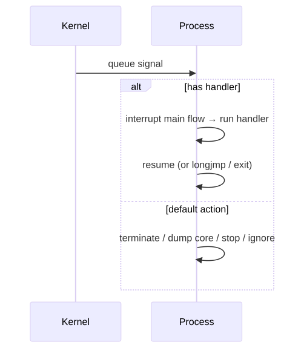
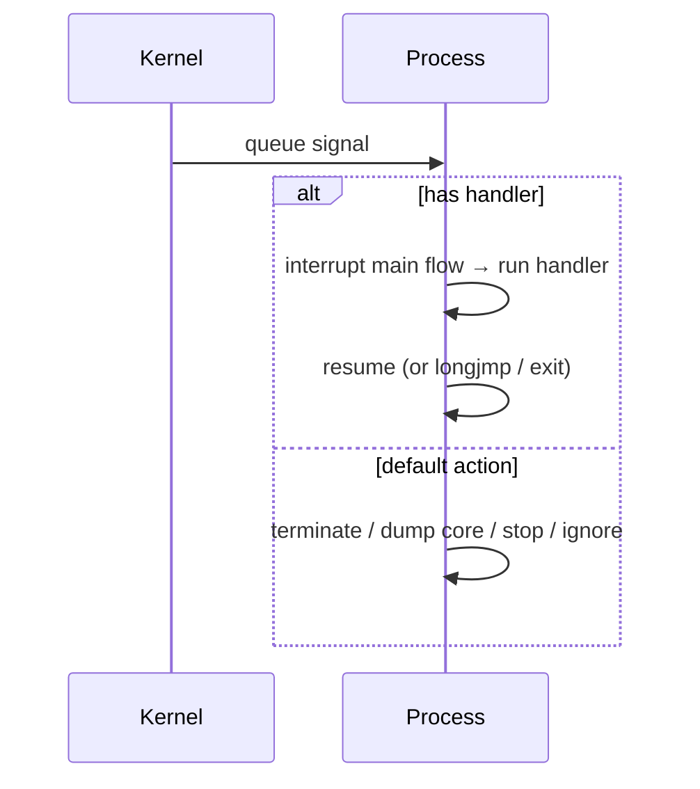
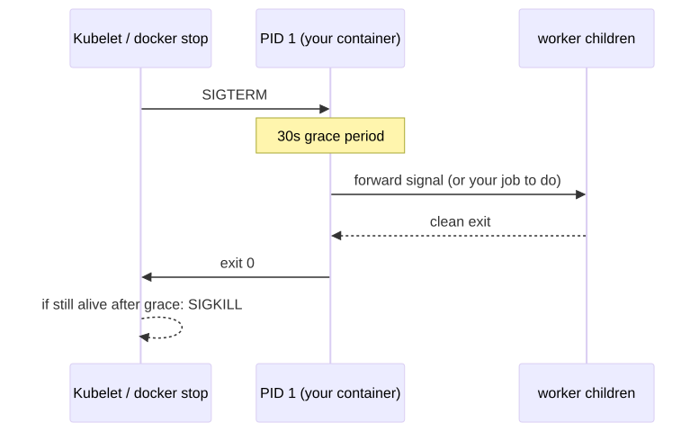
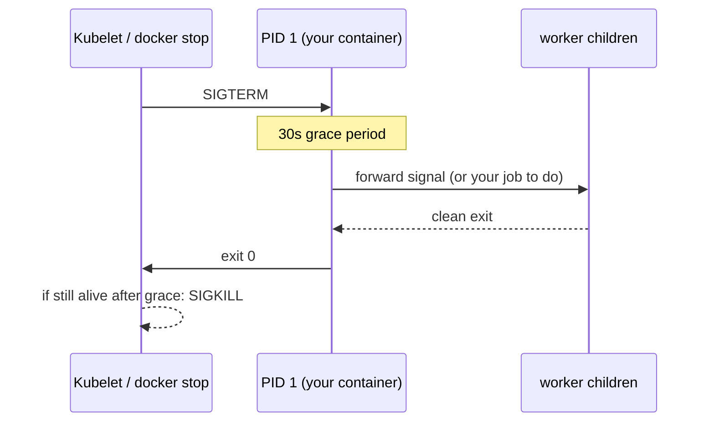

# Signals, Pipes, and Sockets — How Processes Talk

> Three IPC primitives, fifty years old, still the bedrock of every distributed system you'll ever build on.

## Why this matters

When two processes need to coordinate — a web server reloading config, a parent waiting on a child, two daemons exchanging events — they reach for one of three classic mechanisms: **signals**, **pipes**, or **sockets**. Misunderstanding signals is why your container won't stop gracefully (and Kubernetes kills it after 30 s with `SIGKILL`). Misunderstanding pipes is why your `tail -f log | grep ERR | tee` mysteriously buffers. Misunderstanding Unix sockets is why your microservice mesh re-implements localhost networking with TCP overhead. Get these right and you reduce a whole category of "weird" production behavior to "expected".

## Signals

A signal is an asynchronous notification delivered by the kernel. Every process has a default action for each signal (terminate, ignore, dump core, stop, continue) that can be overridden with a handler — except for two: `SIGKILL` and `SIGSTOP` cannot be caught, blocked, or ignored.

<!-- mermaid:rendered -->
<p align="center"></p>

<details><summary>Mermaid source</summary>



</details>
### The signal table you must know

| # | Name | Default | Catchable | When the kernel sends it |
|---|------|---------|-----------|--------------------------|
| 1 | `SIGHUP` | term | yes | controlling terminal closed; convention: **reload config** |
| 2 | `SIGINT` | term | yes | Ctrl-C |
| 3 | `SIGQUIT` | term + core | yes | Ctrl-\\ — graceful with core dump |
| 6 | `SIGABRT` | term + core | yes | `abort()`, assertion failure |
| 7 | `SIGBUS` | term + core | yes | misaligned access, mmap'd file shrunk under you |
| 9 | `SIGKILL` | term | **no** | `kill -9` — last resort, no cleanup |
| 11 | `SIGSEGV` | term + core | yes | invalid memory access |
| 13 | `SIGPIPE` | term | yes | wrote to a pipe with no readers |
| 14 | `SIGALRM` | term | yes | `alarm()` timer expired |
| 15 | `SIGTERM` | term | yes | **default `kill`; please shut down cleanly** |
| 17 | `SIGCHLD` | ignore | yes | a child changed state (exited, stopped) |
| 18 | `SIGCONT` | continue | yes | resume a stopped process |
| 19 | `SIGSTOP` | stop | **no** | unconditional pause |
| 20 | `SIGTSTP` | stop | yes | Ctrl-Z |
| 10/12 | `SIGUSR1`/`SIGUSR2` | term | yes | application-defined |
| 28 | `SIGWINCH` | ignore | yes | terminal window resized |

> Numbers above are for x86/amd64. ARM and others differ for some signals — always use names.

```bash
kill -l                # list all signals on this kernel
kill -HUP 1234         # send SIGHUP
kill -SIGTERM 1234     # explicit
killall -USR1 nginx    # signal by name (be specific!)
pkill -HUP -u www-data nginx
```

### Process-level handling

```c
#include <signal.h>
void handler(int sig) { /* re-entrant code only */ }
struct sigaction sa = { .sa_handler = handler, .sa_flags = SA_RESTART };
sigaction(SIGHUP, &sa, NULL);
```

Inside a handler you may only call **async-signal-safe** functions (`man 7 signal-safety`). `printf`, `malloc`, mutex operations are NOT safe. The standard pattern is to set a `sig_atomic_t` flag and check it in your main loop.

### Signal masks and `signalfd`

Each thread has a **mask** of blocked signals (`pthread_sigmask`, `sigprocmask`). Blocked signals are **pending** until unblocked. Modern style: block all signals at startup and read them as file descriptor events.

```c
sigset_t mask; sigfillset(&mask);
sigprocmask(SIG_BLOCK, &mask, NULL);
int sfd = signalfd(-1, &mask, 0);
// add sfd to your epoll loop; read struct signalfd_siginfo
```

This eliminates the entire async-handler reentrancy headache.

### Convention for daemons

| Signal | What a well-behaved daemon does |
|--------|----------------------------------|
| `SIGTERM` | drain connections, flush, exit 0 |
| `SIGHUP` | reload config without dropping connections |
| `SIGUSR1` | rotate log files (so `logrotate` can `copytruncate` cleanly) |
| `SIGUSR2` | re-exec self for binary upgrade (nginx, haproxy) |
| `SIGQUIT` | quick exit with state dump (often a graceful shutdown variant) |

### Container shutdown semantics

<!-- mermaid:rendered -->
<p align="center"></p>

<details><summary>Mermaid source</summary>



</details>
Two common failure modes:

1. **PID 1 is `bash -c "myapp"`** — bash does not forward signals; your app never gets `SIGTERM`. Fix: `exec myapp` so the binary becomes PID 1, or use `tini`/`dumb-init`.
2. **App ignores SIGTERM** — kubelet always SIGKILLs after `terminationGracePeriodSeconds`. Fix: catch SIGTERM and do graceful shutdown.

## Pipes

Anonymous pipes are the bread and butter of UNIX:

```bash
ls | grep .conf | wc -l
```

`pipe()` returns two file descriptors `(read, write)`. After `fork()`, parent and child share them. Writes block when the buffer (default 64 KiB on Linux) is full; reads block until data arrives or the write end is closed (then read returns 0 = EOF).

If a writer writes to a pipe whose reader has closed, the writer gets `SIGPIPE` (which by default kills it — that's why long-running daemons usually `signal(SIGPIPE, SIG_IGN)` and check `EPIPE` from `write()`).

### Buffering surprise

```bash
# Counterintuitively: this prints nothing for a long time
tail -f /var/log/auth.log | grep "Failed" | awk '{print $1}'
```

Because `grep` switches to **block buffering** when its stdout is a pipe (not a terminal). Each stage adds latency. Fix:

```bash
tail -f /var/log/auth.log | grep --line-buffered "Failed" | awk '{print $1; fflush()}'
# or with stdbuf
stdbuf -oL grep "Failed" /var/log/auth.log
```

### Named pipes (FIFOs)

A FIFO is a pipe with a filename. Two unrelated processes can use it.

```bash
mkfifo /tmp/queue
ls -l /tmp/queue
# prw-r--r-- 1 user user 0 Apr 26 13:00 /tmp/queue   ← 'p' for FIFO

# Terminal A
cat > /tmp/queue

# Terminal B
cat /tmp/queue
# (anything you type in A appears in B)
```

`open(fifo, O_RDONLY)` blocks until a writer opens, and vice versa, unless you pass `O_NONBLOCK`. FIFOs only support **byte streams**, not message boundaries — use Unix sockets if you need framing.

## Unix domain sockets

A socket on the local machine — same API as TCP, but no network stack. Faster than localhost TCP (no checksum, routing, ACK), and supports passing **file descriptors** between processes (`SCM_RIGHTS`) — that's how systemd activates services.

```mermaid
flowchart LR
    AppA[Process A] -- write --> SOCK[/run/myapp.sock]
    SOCK -- read --> AppB[Process B]
    AppA -. send fd .-> AppB
```

### SOCK_STREAM vs SOCK_DGRAM

| | SOCK_STREAM | SOCK_DGRAM |
|--|-------------|------------|
| Like | TCP | UDP |
| Boundaries | none — byte stream | preserved per send |
| Reliability | guaranteed | guaranteed locally |
| Use | most daemons | logging (syslog), small messages |

```bash
# Server side with socat
socat UNIX-LISTEN:/tmp/echo.sock,fork EXEC:cat

# Client
echo "hello" | socat - UNIX-CONNECT:/tmp/echo.sock
# hello

# Inspect with ss (replaces netstat)
ss -lx                       # all listening Unix sockets
ss -xp src /tmp/echo.sock    # who's listening?
```

### Filesystem permissions and abstract namespace

Two flavors of address:

- **Pathname** — `/run/foo.sock` — permissions enforced via filesystem mode/ACL (`chmod 0660 /run/foo.sock; chown app:app`)
- **Abstract** — name starts with `\0`, no inode, vanishes when last fd closes — Linux-only

Always rely on filesystem permissions for security; abstract sockets are reachable from anywhere in the same network namespace.

### SO_REUSEPORT — multiple processes on the same port

Pre-2013 you could bind one listener per (addr, port). With `SO_REUSEPORT` (Linux 3.9+), multiple sockets can bind the same port and the kernel **load-balances incoming connections** across them — perfect for multi-process servers.

```c
int sock = socket(AF_INET, SOCK_STREAM, 0);
int yes = 1;
setsockopt(sock, SOL_SOCKET, SO_REUSEPORT, &yes, sizeof(yes));
bind(sock, ...);
listen(sock, ...);
```

Each worker process opens its own socket with `SO_REUSEPORT` and the kernel assigns connections by 4-tuple hash. Restart-without-drop is also possible: spawn the new binary, it `bind()`s the same port, then SIGTERM the old. `nginx`, `envoy`, `caddy`, `haproxy` all use this.

> Distinguish from `SO_REUSEADDR`, which only lets you reuse a `TIME_WAIT` socket — different behavior.

## Lab walkthrough — graceful shutdown of a worker

```bash
# 1. A toy worker that handles SIGTERM
cat > /tmp/worker.sh <<'EOF'
#!/bin/bash
trap 'echo "SIGTERM caught — draining for 3s"; sleep 3; echo "bye"; exit 0' TERM
echo "worker pid=$$"
while true; do echo "tick $(date +%T)"; sleep 1; done
EOF
chmod +x /tmp/worker.sh

# 2. Run it
/tmp/worker.sh &
WPID=$!

# 3. Send SIGTERM
sleep 2
kill -TERM $WPID
wait $WPID
# tick 13:01:01
# tick 13:01:02
# SIGTERM caught — draining for 3s
# bye

# 4. Now try with SIGKILL — no chance to clean up
/tmp/worker.sh &
WPID=$!; sleep 2
kill -KILL $WPID         # 9
wait $WPID
# tick ...
# Killed
```

## Lab walkthrough — Unix socket vs localhost TCP latency

```bash
# Unix socket
socat UNIX-LISTEN:/tmp/perf.sock,fork EXEC:cat &
time (for i in {1..10000}; do echo x | socat - UNIX-CONNECT:/tmp/perf.sock > /dev/null; done)
# real ~3.2s

# Localhost TCP
socat TCP-LISTEN:9999,reuseaddr,fork EXEC:cat &
time (for i in {1..10000}; do echo x | socat - TCP:127.0.0.1:9999 > /dev/null; done)
# real ~5.8s
```

Roughly 40 % faster on the same kernel, before you even count the savings on syscall count and CPU.

## Inspecting IPC

```bash
# Every signal pending or blocked for a process
grep -E '^(Sig|Shd)' /proc/<pid>/status
# SigQ:    1/4096
# SigPnd:  0000000000000000
# ShdPnd:  0000000000000000
# SigBlk:  0000000000010000
# SigIgn:  0000000000001000     ← bitmask; bit N = signal N+1

# Decode:  SigBlk = 0x00010000 → bit 16 → SIGCHLD blocked
# (use: kill -l to enumerate)

# All open Unix sockets (system-wide)
ss -xa
# u_str  LISTEN  0  4096  /run/dbus/system_bus_socket  ...

# Pipes a process holds
ls -l /proc/<pid>/fd | grep pipe
# l-wx------ 1 app app 64 Apr 26 13:00 1 -> 'pipe:[12345]'

# Find the other end of a pipe by inode
ss -ap | grep 12345
lsof | awk '/12345/'
```

> **Gotchas**
> - SIGKILL bypasses your handler. If you "need" to clean up, you must do it before that. Use `prestop` hooks in K8s.
> - `kill -9 $$` from inside a shell script does NOT kill the shell on some shells until the next prompt — signal arrives but is processed at sequence point. Use `exit` if you want immediate.
> - SIGCHLD is delivered when a child exits AND when it stops. `waitpid(WNOHANG)` is the only safe way to drain — don't assume one signal = one child.
> - Pipes have a 64 KiB buffer (4 KiB on older kernels). A producer faster than its consumer will block; if the consumer dies, the producer gets SIGPIPE.
> - `SIGPIPE` is **silently ignored** by many runtimes (Go, Node) but kills C programs by default. Always handle EPIPE on `write()`.
> - Abstract Unix sockets (`@name`) ignore filesystem permissions — they're a security sharp edge.
> - `SO_REUSEPORT` and `SO_REUSEADDR` are NOT the same. `REUSEPORT` does load balancing; `REUSEADDR` reuses TIME_WAIT.

> **20-year tips**
> - Always block signals before installing handlers, then unblock atomically — avoids the race where a signal arrives between handler install and main loop start.
> - For PID 1 in a container, use `tini` or `dumb-init` unless your app is a true init replacement. They reap zombies and forward signals.
> - Use `signalfd` + epoll/io_uring to turn signals into ordinary fd events — eliminates a whole class of reentrancy bugs.
> - `nc -U /run/foo.sock` is the fastest way to poke a Unix socket interactively.
> - When designing a daemon, define your signal contract in the man page: TERM = exit, HUP = reload, USR1 = log rotate. Predictability is a feature.
> - For high-perf servers, prefer Unix sockets over localhost TCP for sidecar communication. Less CPU, lower tail latency, and you get peer credentials via `SO_PEERCRED`.

> **Common interview questions**
> 1. **Q:** What's the difference between SIGTERM and SIGKILL?
>    **A:** SIGTERM is catchable — the process gets to clean up. SIGKILL is unblockable, immediate, and bypasses all cleanup. Always send TERM first; KILL only as a last resort.
> 2. **Q:** Why does `nginx -s reload` work via SIGHUP?
>    **A:** Convention: SIGHUP tells a daemon to re-read its config without restarting. nginx parses the new config, spawns new workers, lets old workers drain, and exits them.
> 3. **Q:** What is SIGPIPE and when does a process get one?
>    **A:** When it `write()`s to a pipe (or socket) whose other end has been closed. Default action is termination — production daemons typically ignore it and check `EPIPE` instead.
> 4. **Q:** Anonymous vs named pipes?
>    **A:** Anonymous pipes (`pipe()`) are inherited via `fork()` — only related processes share them. Named pipes (FIFOs, `mkfifo`) appear in the filesystem and let any two processes connect.
> 5. **Q:** When would you use a Unix socket instead of TCP on localhost?
>    **A:** Lower latency, lower CPU, no port exhaustion, peer credential passing (`SO_PEERCRED`), file descriptor passing (`SCM_RIGHTS`), and filesystem-based access control.
> 6. **Q:** What does SO_REUSEPORT enable?
>    **A:** Multiple processes/threads to bind the same port; the kernel load-balances incoming connections across them. Used by nginx, envoy, haproxy for multi-worker scaling and zero-downtime upgrades.
> 7. **Q:** Why does my container ignore SIGTERM and get SIGKILLed by Kubernetes?
>    **A:** Most likely your PID 1 (a shell wrapper) doesn't forward signals to the actual app. Use `exec` so the app becomes PID 1, or use `tini`/`dumb-init`.

## Sources

- `man 7 signal`, `man 7 signal-safety`, `man 2 sigaction`, `man 2 signalfd`
- `man 7 pipe`, `man 7 fifo`, `man 2 pipe2`
- `man 7 unix`, `man 7 socket`, `man 2 socket`, `man 2 setsockopt`
- `man 7 ip` — for SO_REUSEPORT semantics
- W. Richard Stevens, *Advanced Programming in the UNIX Environment* (Ch. 10, 15, 17)
- Linux kernel `Documentation/networking/snmp_counter.rst`
- LWN, "The SO_REUSEPORT socket option" — https://lwn.net/Articles/542629/
