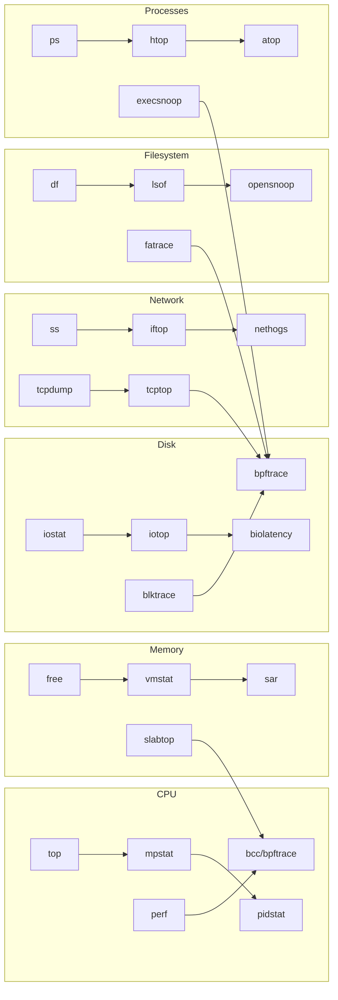
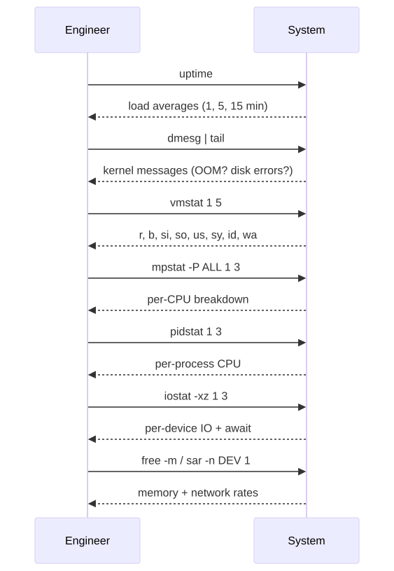
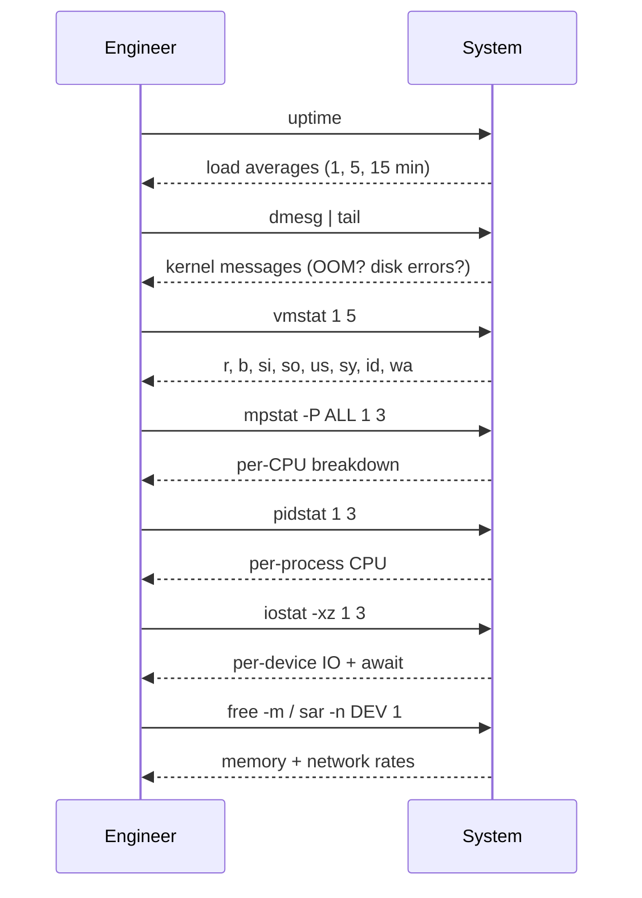

# Linux Monitoring & Observability Tools Mastery

## Why this matters

If you cannot answer "is the system healthy?" in under 60 seconds, you don't operate the system — you watch it crash. Monitoring is not Grafana dashboards; it is a methodology. The two methodologies you must internalize are **USE** (resource-centric) and **RED** (service-centric). They are complementary, not competing. After 20 years on call, the engineer who reaches for `vmstat 1` first generally beats the engineer who opens 14 browser tabs.

This folder is a working reference for every monitoring tool that earns its keep on a Linux box, organized by era (vintage vs modern), by depth (userspace vs eBPF), by destination (Prometheus, Loki, ELK), and by philosophy (alerting that wakes humans).

---

## The Two Methods

### USE Method (Brendan Gregg, 2012) — for **resources**

For every resource (CPU, memory, disk, network, interconnect, storage controller), check three things:

| Letter | Meaning | Example signal |
|--------|---------|----------------|
| **U**tilization | % time the resource was busy | CPU %busy, disk %util |
| **S**aturation | extra work queued (cannot service immediately) | run-queue length, swap-in rate |
| **E**rrors | error events | NIC rx_errors, disk read errors |

> Saturation is the killer. A disk at 80% utilization with `await` of 200ms is sicker than a disk at 99% utilization with `await` of 2ms.

### RED Method (Tom Wilkie, 2015) — for **services**

For every request-driven service, track:

| Letter | Meaning | Prometheus shape |
|--------|---------|------------------|
| **R**ate | requests/sec | `rate(http_requests_total[1m])` |
| **E**rrors | failed requests/sec | `rate(http_requests_total{status=~"5.."}[1m])` |
| **D**uration | latency distribution | `histogram_quantile(0.99, ...)` |

USE finds the sick resource. RED finds the unhappy customer. Use both.

---

## Tools by Subsystem (Brendan Gregg style)

<!-- mermaid:rendered -->
<p align="center"></p>

<details><summary>Mermaid source</summary>



</details>

The deeper you go on the chain, the more invasive (and the more truthful) the tool gets. Start at the top, walk down only as needed.

---

## The 60-Second Triage (memorize this)

<!-- mermaid:rendered -->
<p align="center"></p>

<details><summary>Mermaid source</summary>



</details>

Reference: [Linux Performance Analysis in 60 Seconds](http://www.brendangregg.com/Articles/Netflix_Linux_Perf_Analysis_60s.pdf)

---

## File Index

| File | When to read |
|------|--------------|
| [vintage-tools.md](vintage-tools.md) | Bare-metal box, no internet, need answers now |
| [modern-tools.md](modern-tools.md) | You want pretty + useful (atop/htop/btop/glances) |
| [perf-and-bcc-ebpf.md](perf-and-bcc-ebpf.md) | Userspace tools lie or are too coarse |
| [prometheus-node-exporter.md](prometheus-node-exporter.md) | You want history, alerting, fleet view |
| [log-analysis.md](log-analysis.md) | "Something happened at 03:14, find it" |
| [alerting-philosophy.md](alerting-philosophy.md) | Pager woke you 4 times last night |

---

## Lab: Stress the box and watch every tool light up

Install the universal stressor:

```bash
sudo apt-get install -y stress-ng sysstat
```

Run a CPU storm in one terminal, then walk the triage in another:

```bash
# Terminal A — burn 4 CPUs hard for 60s
stress-ng --cpu 4 --cpu-method matrixprod --timeout 60s --metrics-brief

# Terminal B — observe
vmstat 1 10
mpstat -P ALL 1 5
pidstat -u 1 5
```

You should see `r` (run queue) climb above CPU count, `us` (user time) saturate, and `pidstat` finger the offender. That's USE, manually.

Now an IO storm:

```bash
# write 4 GB of zeros, bypass page cache
dd if=/dev/zero of=/tmp/bigfile bs=1M count=4096 oflag=direct
# observe
iostat -xz 1
```

Watch `%util` climb to 100, `await` balloon, `aqu-sz` grow. Saturation visible.

---

!!! tip "20-year tips"
    1. **`vmstat 1` is the most underrated tool on Linux.** Eight columns of truth, no scrolling.
    2. **Always `dmesg | tail` first.** OOM killer, disk errors, NIC flaps live here. People skip it and waste 40 minutes.
    3. **If you see `wa` (iowait) > 30 in `top`, it's IO, not CPU.** Stop staring at `top`, run `iostat`.
    4. **Load average is misleading on Linux.** It includes uninterruptible sleepers (D-state, usually IO). High load + low CPU = IO problem.
    5. **The truthful tool is the one closest to the kernel.** `top` lies (sampled). `perf`/`bpftrace` don't.
    6. **Never trust a single sample.** Always 3 samples, 1 second apart, minimum.

!!! question "Common interview questions"
    **Q1: Difference between USE and RED?**
    A: USE is per-resource (CPU/disk/net): Utilization, Saturation, Errors. RED is per-service: Rate, Errors, Duration. USE finds infrastructure problems; RED finds user-facing problems.

    **Q2: Load average is 16 on a 4-core box. Is the system overloaded?**
    A: Maybe. Check `vmstat 1`: if `r` (running tasks) is consistently >4, yes CPU is saturated. If `b` (blocked on IO) is high, it's IO. Linux load includes D-state.

    **Q3: What does `wa` mean in top, and what do you do about it?**
    A: % CPU time waiting on IO. High `wa` means CPU is idle waiting for disk. Run `iostat -xz 1` and `iotop` to find the device and process.

    **Q4: How do you find which process is opening a specific file?**
    A: `lsof /path/to/file` (snapshot) or `opensnoop-bpfcc -n procname` (live tracing via eBPF).

    **Q5: Prometheus vs Nagios — when do you pick each?**
    A: Prometheus for time-series + dynamic targets (k8s, microservices) + label-based queries. Nagios for static infra + binary check_X scripts + simpler ops. Modern stacks default to Prometheus.

    **Q6: What's a flame graph and when do you use one?**
    A: A stack-sample visualization where x-axis is sample population (not time). You read width = CPU spent. Use it when `top` says a process is hot but you don't know why.

    **Q7: Symptom-based vs cause-based alerting — which wins?**
    A: Symptom-based. Alert on "users see 5xx" or "p99 latency > SLO", not "disk is 80% full". Cause-based alerts produce noise; symptom-based alerts are actionable.

---

## Sources

- Brendan Gregg, [USE Method](https://www.brendangregg.com/usemethod.html)
- Tom Wilkie, [The RED Method](https://thenewstack.io/monitoring-microservices-red-method/)
- [Linux Performance](https://www.brendangregg.com/linuxperf.html) — the canonical map
- [iovisor/bcc](https://github.com/iovisor/bcc)
- man pages: `man 1 vmstat`, `man 1 iostat`, `man 1 sar`, `man 1 pidstat`
