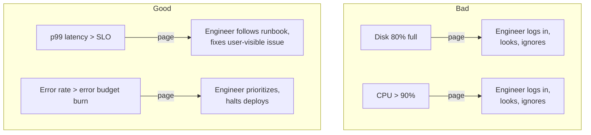

# Alerting Philosophy — wake humans only when humans are needed

## Why this matters

A pager that fires 12 times a night for things nobody acts on is worse than no pager at all. It teaches the on-call engineer to ignore everything, including the one alert that mattered. **Alert fatigue is the single biggest cause of missed incidents in mature organizations.** This file is the operating manual for the on-call you actually want to be on.

The two laws of useful alerting:

1. **Every page must be actionable.** If the response is "ack and ignore", delete the alert.
2. **Alert on symptoms, not causes.** Users don't care about disk inodes; they care that checkout works.

<!-- mermaid:rendered -->
<p align="center"></p>

<details><summary>Mermaid source</summary>



</details>
---

## The alert hierarchy

Three tiers, not one bucket:

| Tier | Channel | Examples | Response time |
|------|---------|----------|---------------|
| **Page** (waking) | PagerDuty / phone call | service down, SLO burn rate critical, data loss imminent | minutes |
| **Ticket** (working hours) | Jira / email / Slack channel | disk filling in 7 days, certificate expiring in 14 days, error budget at 50% | hours/days |
| **Dashboard** (informational) | Grafana | every other metric | when investigating |

If your "page" tier is producing more than ~2 events per on-call rotation per service, your thresholds are wrong.

---

## Symptom-based alerts (do these)

These wake you because users are unhappy:

```promql
# 1) HTTP error rate > 1% (sustained 5m)
sum(rate(http_requests_total{status=~"5.."}[5m]))
  / sum(rate(http_requests_total[5m]))
  > 0.01

# 2) p99 latency > SLO
histogram_quantile(0.99, sum by (le) (rate(http_request_duration_seconds_bucket[5m]))) > 0.5

# 3) Service has zero traffic when it should have some
sum(rate(http_requests_total[5m])) == 0

# 4) Job hasn't completed in 25h (cron expected daily)
time() - max(job_last_success_timestamp_seconds) > 25 * 3600

# 5) SLO error budget burn > 14.4x (will exhaust 30d budget in 2 days)
(sum(rate(http_requests_total{status=~"5.."}[1h])) / sum(rate(http_requests_total[1h])))
  > (14.4 * 0.001)   # if SLO is 99.9% (0.1% error budget)
```

See sibling: [../05-monitoring/09-slo-engineering/](../05-monitoring/09-slo-engineering/) for full SLO/error-budget engineering.

---

## Cause-based alerts (mostly don't do these)

These wake you because **a cause exists**, but the user may not feel anything:

- "CPU > 80%" — so what? If latency is fine, who cares?
- "Disk 80% full" — that's a ticket, not a page. Page when "will be full in <2h".
- "Memory > 90%" — Linux uses RAM as cache; this is normal.
- "Pod restarted" — Kubernetes self-heals; one restart is uninteresting.

**The exception**: when a cause is a leading indicator of an unrecoverable user-visible failure (e.g., "disk will be full in 30 min, writes will start failing").

---

## Multi-window, multi-burn-rate alerts (the gold standard)

Single-window threshold alerts ("error rate > 1% for 5 minutes") are noisy. Google SRE's approach uses **two windows** to get both fast detection AND high precision:

```yaml
# Page: 2% of monthly budget burned in 1h AND last 5min still burning
- alert: HighErrorBudgetBurn
  expr: |
    (
      job:slo_errors_per_request:ratio_rate1h{job="myapi"} > (14.4 * 0.001)
      and
      job:slo_errors_per_request:ratio_rate5m{job="myapi"} > (14.4 * 0.001)
    )
  for: 2m
  labels:
    severity: page
  annotations:
    summary: "myapi: burning 30-day budget in 2 days"
    runbook: https://wiki/runbooks/myapi-error-burn
```

Standard burn-rate matrix (for 99.9% SLO over 30 days):

| Burn rate | Time to exhaust budget | Long window | Short window | Severity |
|-----------|------------------------|-------------|--------------|----------|
| 14.4x | 2 days | 1h | 5m | Page |
| 6x | 5 days | 6h | 30m | Page |
| 1x | 30 days | 3d | 6h | Ticket |

Reference: [Google SRE Workbook ch. 5](https://sre.google/workbook/alerting-on-slos/).

---

## Runbooks linked from every alert

Every alert MUST link to a runbook. The runbook MUST contain, in order:

1. **Impact** — who is affected, how badly.
2. **Verify** — is this real? (curl, grafana panel, log query)
3. **Mitigate** — fastest way to stop user pain (rollback, failover, scale out, kill bad pod).
4. **Diagnose** — how to find the root cause.
5. **Escalate** — who to call if unknown.
6. **Postmortem** — link to template.

Example template:

```markdown
# Runbook: myapi-error-burn

## Impact
Users see 5xx on /checkout. Revenue at risk: ~$2k/min.

## Verify
- Grafana: https://grafana/d/myapi
- Query: `sum(rate(http_requests_total{job="myapi",status=~"5.."}[1m]))`
- Should be > 1% sustained.

## Mitigate
1. Check recent deploys: `kubectl rollout history deploy/myapi -n prod`
2. If error spike correlates with deploy: `kubectl rollout undo deploy/myapi -n prod`
3. Verify recovery within 2m.

## Diagnose
- Logs: `{job="myapi", level="error"} | json`
- Traces: Tempo → service=myapi → status=ERROR
- Check downstream deps: db, cache, auth-svc

## Escalate
@myapi-oncall (Slack), then EM @alice
```

If you cannot write the runbook, the alert isn't ready to be enabled.

---

## Alert fatigue avoidance — concrete rules

1. **Every page generates a postmortem question**: was it actionable? If "no" twice in a quarter, delete it.
2. **Track alert volume per on-call shift.** Goal: <2 pages/shift on average. If higher, fix or delete.
3. **Group related alerts.** A pod crash + service alert + DB latency alert at the same instant is one incident, not three pages.
4. **Suppress dependent alerts.** If `service-down` fires, don't also page on `latency-high`. Use Alertmanager `inhibit_rules`.
5. **Use silencing during deploys/maintenance.** Build a button (`amtool silence add ...`) into your deploy pipeline.
6. **Time-based routing.** Cosmetic alerts → Slack channel during day, page only during business hours. Critical alerts → page 24/7.
7. **No flapping alerts.** If an alert fires and resolves within 5 min, add a `for: 5m` clause or rethink the threshold.
8. **Auto-resolve, never auto-page-again.** Resolution should be automatic when condition clears; re-firing should require human intervention via "ack" timeout.

### Alertmanager grouping example

```yaml
route:
  group_by: ['alertname', 'cluster', 'service']
  group_wait: 30s
  group_interval: 5m
  repeat_interval: 4h
  receiver: pagerduty
  routes:
    - match:
        severity: ticket
      receiver: jira
      repeat_interval: 24h
    - match:
        severity: info
      receiver: slack-ops

inhibit_rules:
  - source_match: { alertname: ServiceDown }
    target_match_re: { alertname: '(HighLatency|HighErrorRate)' }
    equal: ['service']
```

---

## Error budgets — how to use them

Define the SLO (e.g., 99.9% successful requests over 30 days). The remaining 0.1% is your **error budget** — 43 minutes of full downtime per month, or any equivalent fraction.

**Operating rule**: when the budget is healthy, ship fast. When it's burned, freeze deploys until you've earned it back.

```promql
# Remaining budget % (where 1 = 100% of budget remaining, 0 = exhausted)
1 - (
  (1 - (sum(rate(http_requests_total{status!~"5.."}[30d])) / sum(rate(http_requests_total[30d]))))
  / 0.001
)
```

This makes alerting a business decision, not a technical guess. Engineers and product own the same number.

---

## Lab: write and test a real alert

```bash
# Run prometheus + alertmanager locally
mkdir -p /tmp/alertlab && cd /tmp/alertlab

cat > prometheus.yml <<'EOF'
global:
  scrape_interval: 5s
  evaluation_interval: 5s
rule_files:
  - 'rules.yml'
alerting:
  alertmanagers:
    - static_configs:
        - targets: ['alertmanager:9093']
scrape_configs:
  - job_name: prom
    static_configs:
      - targets: ['localhost:9090']
EOF

cat > rules.yml <<'EOF'
groups:
  - name: lab
    rules:
      - alert: PrometheusScrapeSlow
        expr: scrape_duration_seconds > 0.5
        for: 30s
        labels:
          severity: ticket
        annotations:
          summary: "Slow scrape on {{ $labels.instance }}"
          runbook: "https://example.com/runbooks/slow-scrape"
EOF

cat > alertmanager.yml <<'EOF'
route:
  receiver: stdout
receivers:
  - name: stdout
    webhook_configs:
      - url: 'http://host.docker.internal:9999/'
EOF

# in terminal A
docker network create alertlab || true
docker run -d --name am --network alertlab -p 9093:9093 \
  -v $PWD/alertmanager.yml:/etc/alertmanager/alertmanager.yml \
  prom/alertmanager
docker run -d --name prom --network alertlab -p 9090:9090 \
  -v $PWD/prometheus.yml:/etc/prometheus/prometheus.yml \
  -v $PWD/rules.yml:/etc/prometheus/rules.yml \
  prom/prometheus

# in terminal B — receive webhook payloads
nc -lk 9999

# trigger by lowering threshold via promtool tests:
docker exec prom promtool check rules /etc/prometheus/rules.yml
```

Practice exercise: add a multi-window burn-rate alert against a synthetic SLO metric, validate it fires under load and resolves cleanly.

---

## Cross-references

- SLO engineering & error budgets in depth: [../05-monitoring/09-slo-engineering/](../05-monitoring/09-slo-engineering/)
- Prometheus exporter & PromQL recipes: [prometheus-node-exporter.md](prometheus-node-exporter.md)
- Log-driven alerts (Loki rules): [log-analysis.md](log-analysis.md)

---

!!! tip "20-year tips"
    1. **If a page is ignored, delete it.** Inaction is data; respect it.
    2. **A page without a runbook is a bug.** No runbook = no production alert.
    3. **Symptom > cause.** Page on user pain, not on resource utilization.
    4. **Two windows beat one.** Multi-burn-rate dramatically reduces noise.
    5. **Track pages-per-shift as a KPI.** > 2 means you're failing your team.
    6. **Always include a graph link in the alert.** Engineer should see context in one click.
    7. **Quarterly alert review.** Delete or fix the worst 10% by noise. Compounding wins.
    8. **Maintenance windows ARE part of alerting.** Build silencing into deploys; expect humans to forget.
    9. **Page on data loss imminence, not eventual fullness.** "Disk fills in 30m" pages; "disk 80% full" does not.
    10. **The on-call rotation is sacred.** Protect their sleep, and they'll protect the system.

!!! question "Common interview questions"
    **Q1: Symptom-based vs cause-based alerting — which is better and why?**
    A: Symptom-based. It alerts only when users are affected, so every page is actionable. Cause-based generates noise (high CPU isn't bad if latency is fine). The exception: leading-indicator causes for unrecoverable failures (disk full).

    **Q2: What is the multi-window multi-burn-rate alert pattern?**
    A: Pair a long window (e.g., 1h) with a short window (e.g., 5m), both required to fire. Long gives precision, short gives speed. Burn rate (e.g., 14.4x) tells you how fast you'll exhaust the SLO budget. Standard from Google SRE Workbook ch. 5.

    **Q3: How do you fight alert fatigue?**
    A: Quarterly alert reviews; delete inactionable pages; group related; inhibit dependents; multi-window burn-rate; symptom-based design; track pages-per-shift; require runbook for every alert.

    **Q4: What is an error budget and how does it drive alerting?**
    A: 1 - SLO. E.g., 99.9% SLO = 0.1% error budget. Burn rate = how fast you're consuming it. Alert when burn rate would exhaust budget within X (e.g., 14.4x burns 30d budget in 2d → page).

    **Q5: How do you alert on a cron job that didn't run?**
    A: Push a `last_success_timestamp_seconds` gauge (via Pushgateway or textfile collector). Alert: `time() - max(job_last_success_timestamp_seconds) > expected_interval * 1.5`.

    **Q6: Why must runbooks be linked from alerts?**
    A: Reduces MTTR. The on-call engineer (often a generalist or new hire) needs a known-good first step at 3 AM, not detective work. Builds institutional memory.

    **Q7: How do you handle alerts during a planned maintenance window?**
    A: Programmatic silences via Alertmanager API (`amtool silence add ...`) integrated into the deploy/maintenance pipeline. Time-bounded; auto-expire. Never disable alerts manually.

---

## Sources

- [Google SRE Book](https://sre.google/sre-book/table-of-contents/) — chapters 4 (SLO), 6 (alerting)
- [Google SRE Workbook — alerting on SLOs](https://sre.google/workbook/alerting-on-slos/)
- [Prometheus alerting best practices](https://prometheus.io/docs/practices/alerting/)
- Mike Julian, *Practical Monitoring* (O'Reilly)
- Charity Majors, [Observability vs Monitoring](https://charity.wtf/2019/12/02/the-rise-of-observability/)
- [Alertmanager docs](https://prometheus.io/docs/alerting/latest/alertmanager/)
- Sibling folder: [../05-monitoring/09-slo-engineering/](../05-monitoring/09-slo-engineering/)
