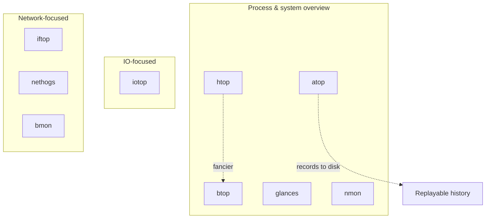

# Modern Tools — interactive, colorful, actually pleasant

## Why this matters

The vintage tools answer "what's wrong" in a tight, scriptable way. The modern tools answer "what's wrong" while you sip coffee and your boss watches your screen. They are not toys: `atop` is the only userspace tool that records full process history with sub-process resolution, `iotop` is the only `top`-style tool for disk IO, and `glances` ships an HTTP/JSON API so you can scrape it from Prometheus.

When you're debugging on your laptop, on a friendly box, or pairing with a colleague, reach for these. When you're on a stripped-down container in production, fall back to vintage.

<!-- mermaid:rendered -->
<p align="center"></p>

<details><summary>Mermaid source</summary>



</details>
---

## atop — the only tool that records the past

**Install**:
```bash
sudo apt install atop
sudo systemctl enable --now atop atopacct
# /var/log/atop/atop_YYYYMMDD — binary, replayable
```

**Favorite invocation**:
```bash
atop                       # live, 10s refresh
atop 1                     # 1s refresh
atop -r /var/log/atop/atop_$(date +%Y%m%d)   # replay today
atop -r FILE -b 03:00 -e 04:00               # 3-4 AM window
```

**Interactive keys**:
- `c` — sort by CPU
- `m` — sort by memory
- `d` — disk view
- `n` — network view (needs `netatop` kernel module)
- `g` — generic
- `t` / `T` — forward / back in time when replaying

**Why it earns its keep**: atop survives processes — when a process exits, atop still has its accounting record. So when "the cron job that ate all the RAM at 03:14 yesterday" disappeared by morning, atop's `_r` flag time-travels you to its corpse. **No other userspace tool does this.**

---

## htop — the upgraded top

**Install**: `apt install htop`.

**Favorite invocation**: just `htop`. Then:
- `F2` — setup (add columns, change colors, tree view)
- `F3` — search by name
- `F4` — filter
- `F5` — tree view (toggle)
- `F6` — sort column
- `H` — toggle threads
- `K` — toggle kernel threads
- `t` — tree
- `u` — filter by user
- `Space` — tag a row (then act on multiple)

**Interpretation**:
- CPU bars colored: blue=low priority, green=normal, red=kernel, cyan=virt steal.
- Memory bar: green=used, blue=buffers, yellow=cache. Big yellow ≠ low memory.

---

## btop — the eye-candy successor

**Install**: `apt install btop` or `cargo install btop` (rewrite of bashtop/bpytop).

**Favorite invocation**: `btop`. Then:
- `m` — toggle memory view size
- `n` — toggle network view
- `+`/`-` — change update rate
- `f` — filter
- `Esc` then click — mouse driven

Has GPU support (`btop --utf-force`), and a built-in process tree, network graphs, disk IO graphs all on one screen. Best demo tool. Use when you want to look competent on a screenshare.

---

## nmon — IBM's swiss army knife

**Install**: `apt install nmon`.

**Favorite invocation**:
```bash
nmon                    # interactive
nmon -f -s 30 -c 120    # capture 1 hour at 30s intervals -> nmon_HOST_DATE.nmon
```

**Interactive toggles** (single keys, no menu):
- `c` CPU, `m` memory, `d` disk, `n` network, `t` top processes, `k` kernel, `j` filesystems, `V` virtual memory.

The capture mode dumps CSV-like files that the [nmonchart](https://nmon.sourceforge.io/) tool turns into HTML graphs. Loved by AIX refugees and POWER admins.

---

## glances — the all-in-one + API

**Install**: `pip install glances` or `apt install glances`.

**Favorite invocation**:
```bash
glances                          # full interactive
glances -w                       # web UI on :61208
glances -s                       # server (XML-RPC) on :61209
glances --export prometheus      # ship metrics to Prometheus pushgateway
glances --export json --time 5   # JSON to stdout every 5s
glances -1                       # per-CPU instead of aggregate
```

Has a built-in HTTP/JSON API (`http://host:61208/api/4/all`) — handy for ad-hoc Prometheus scraping or curl-based scripting on hosts you can't install node_exporter on.

---

## iotop — top, but for disk IO

**Install**: `apt install iotop` (needs root or `CAP_NET_ADMIN`).

**Favorite invocation**:
```bash
sudo iotop -oPa
# -o only show processes doing IO
# -P process granularity (no threads)
# -a accumulated since iotop start
```

**Interactive**: `o` toggle "only IO procs", `r` reverse sort, `arrow keys` change sort column.

**Pitfalls**: kernel must be built with `CONFIG_TASK_DELAY_ACCT` and `CONFIG_TASK_IO_ACCOUNTING` (it is on every distro kernel). On low-IO systems the tool can't distinguish noise.

For deeper IO analysis go straight to `biolatency-bpfcc` (see [perf-and-bcc-ebpf.md](perf-and-bcc-ebpf.md)).

---

## iftop — top for network bandwidth by connection

**Install**: `apt install iftop`.

**Favorite invocation**:
```bash
sudo iftop -i eth0 -nNP
# -n no DNS, -N no port-name, -P show ports
sudo iftop -F 10.0.0.0/8       # filter source net
```

**Interactive**: `t` toggle layout, `T` cumulative totals, `n` toggle DNS, `s`/`d` toggle source/dest display, `o` freeze.

Shows current bandwidth between every endpoint pair. The reflex tool when "the link is full, who's using it?".

---

## nethogs — top for bandwidth by process

**Install**: `apt install nethogs`.

**Favorite invocation**:
```bash
sudo nethogs eth0
sudo nethogs -d 1 -v 3      # 1s refresh, KB/s as cumulative
```

**Interactive**: `m` cycle units, `r` sort by received, `s` sort by sent, `q` quit.

If `iftop` says "this IP is hogging bandwidth", `nethogs` says "this PID is hogging bandwidth". Use both.

---

## bmon — bandwidth by interface, with graphs

**Install**: `apt install bmon`.

**Favorite invocation**:
```bash
bmon -p eth0           # only this interface
bmon -o ascii          # ascii mode (no curses)
bmon -o curses:fgchar=:  # custom char
```

**Interactive**: `d` detail panel, `g` graph panel, `i` info, `?` help.

Best for watching link-level rx/tx and packet rates over time. Pairs well with `iftop` (who) + `nethogs` (which process).

---

## Quick chooser

| You need | Reach for |
|----------|-----------|
| Pretty general overview | `btop` (sexiest) or `glances` (most data) |
| Full system + history replay | `atop` |
| Familiar top-likeness with controls | `htop` |
| Per-process disk IO | `iotop` |
| Per-connection network usage | `iftop` |
| Per-process network usage | `nethogs` |
| Per-interface throughput graph | `bmon` |
| Capture for offline analysis | `nmon -f` or `atop -w` |

---

## Lab: Pretty-tool deathmatch

Open four terminals, run a multi-resource stress, watch every tool report it differently:

```bash
# T1 stressor
stress-ng --cpu 4 --io 2 --vm 2 --vm-bytes 1G \
          --hdd 2 --hdd-bytes 1G --timeout 60s --metrics-brief

# T2 system view
btop

# T3 disk view
sudo iotop -oPa

# T4 network — generate some traffic too
iperf3 -c iperf.he.net -t 60 &
sudo iftop -i eth0 -nNP
```

Now reproduce the same scenario, but with `atop` running in capture mode:

```bash
sudo systemctl restart atop
stress-ng --cpu 4 --vm 4 --vm-bytes 2G --timeout 30s
sleep 60
sudo atop -r /var/log/atop/atop_$(date +%Y%m%d)
# press 't' until you find the burst, then 'm' to see the memory hogs
```

This is the postmortem workflow that wins arguments at 9 AM.

---

!!! tip "20-year tips"
    1. **Install `atop` on every server. Today.** It's the only tool that lets you debug yesterday.
    2. **`htop`'s `F2 → display → tree view by default` is a one-time setup that pays off forever.**
    3. **`btop` is for screensharing; `atop` is for debugging; `glances` is for scraping.** Pick by audience.
    4. **`iotop` shows IOPS; it does not show latency.** For latency drill into eBPF (`biolatency`).
    5. **`iftop` + `nethogs` together** answer the "what + who" question of network saturation in 30 seconds.
    6. **`glances --export prometheus` is a great pinch hitter** when you can't install node_exporter (locked-down hosts, embedded boxes).
    7. **Don't run `atop` at 1s on 1000 servers.** It writes accounting data; the IO is non-trivial. 10s is fine.

!!! question "Common interview questions"
    **Q1: How do you investigate "high CPU at 3 AM" the next morning if you don't have Prometheus?**
    A: `atop -r /var/log/atop/atop_YYYYMMDD -b 02:55 -e 03:15`. Walk forward in time with `t`. atop survives process exits.

    **Q2: `htop` vs `top` — what does `htop` give you that `top` doesn't?**
    A: Tree view, mouse support, easy column setup, intuitive sorting, multiple-process tagging, color CPU/memory bars, search/filter by name. Same kernel data, much friendlier UX.

    **Q3: How do you find which process is consuming the most network bandwidth?**
    A: `nethogs` (per-process bandwidth). For per-connection use `iftop`. For deeper, `tcptop-bpfcc` from bcc.

    **Q4: Why might `iotop` show no activity even when disk is busy?**
    A: Kernel without `CONFIG_TASK_IO_ACCOUNTING`, or process IO is asynchronous (e.g., journal flushes attributed to kthread). Cross-check with `iostat -x 1`.

    **Q5: What does atop do that no other tool does?**
    A: Records process accounting to disk every 10 seconds, including processes that have since exited, and lets you replay any window with full per-process detail. Cheap APM.

    **Q6: Best tool for per-CPU saturation visualization in a single screen?**
    A: `htop` with all CPUs visible (auto), or `btop` which scales gracefully. For scripting, `mpstat -P ALL 1`.

    **Q7: You can't install anything; you only have the box's stock tools. Now what?**
    A: Fall back to vintage tools (see vintage-tools.md). `vmstat 1` + `iostat -x 1` + `pidstat 1` cover 90% of cases.

---

## Sources

- [atop](https://www.atoptool.nl/) and `man atop`, `man atopsar`
- [htop](https://htop.dev/)
- [btop++](https://github.com/aristocratos/btop)
- [glances](https://nicolargo.github.io/glances/)
- [nmon](https://nmon.sourceforge.io/)
- [iotop](http://guichaz.free.fr/iotop/)
- [iftop](https://www.ex-parrot.com/pdw/iftop/)
- [nethogs](https://github.com/raboof/nethogs)
- [bmon](https://github.com/tgraf/bmon)
