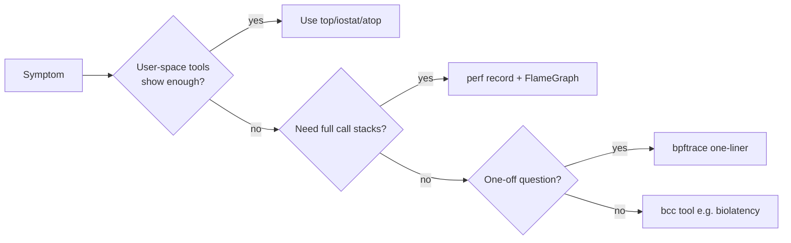

# perf, bcc, and bpftrace — when userspace tools lie

## Why this matters

`top` samples. `vmstat` aggregates. `iostat` rounds to 1-second buckets. None of them can answer "which line of which function is responsible for 12ms of latency p99 on this PID right now?". For that you need to look inside the kernel — at scheduler decisions, IO completions, page faults, syscall arguments — without recompiling and without rebooting. That is what **perf**, **bcc**, and **bpftrace** are for.

`perf` is in the kernel since 2.6.31 (2009) and ships in `linux-tools-common`. **bcc** and **bpftrace** are eBPF — safe, JIT-compiled in-kernel programs that run on tracepoints, kprobes, uprobes, and USDT probes. Together they replace SystemTap, DTrace, ltrace, and most of strace.

> If you can articulate the question precisely, eBPF can answer it without restarting the process.

<!-- mermaid:rendered -->
<p align="center"></p>

<details><summary>Mermaid source</summary>



</details>
---

## perf — the universal Linux profiler

**Install**:
```bash
sudo apt install linux-tools-common linux-tools-$(uname -r)
# RHEL: yum install perf
```

### perf top — `top`, but per-function

```bash
sudo perf top                    # system-wide, sorted by sample count
sudo perf top -p PID             # one process
sudo perf top -e cycles -K       # only userspace (skip kernel)
sudo perf top --call-graph dwarf # show callers
```

You'll see something like:
```text
  18.42%  myapp   [.] hot_function
  12.10%  [kernel] [k] _raw_spin_lock
   8.33%  myapp   [.] memcpy_avx2
```

The `[.]` is userspace; `[k]` is kernel. **The `[k] _raw_spin_lock` line is your friend** — it usually means lock contention.

### perf record / report — capture & analyze

```bash
# 30s system-wide CPU profile, all stacks (frame pointers required, or DWARF)
sudo perf record -F 99 -a -g -- sleep 30

# one process
sudo perf record -F 99 -p PID -g -- sleep 30

# off-CPU profiling (where is time spent waiting?)
sudo perf record -e sched:sched_switch -a -g -- sleep 30

# analyze
sudo perf report                      # interactive TUI
sudo perf report --stdio              # text dump
sudo perf script                      # raw events for FlameGraph
```

**Sample rate**: `-F 99` = 99 Hz (avoids lockstep with 100 Hz timers). 999 Hz for finer detail at higher overhead.

**Frame pointers**: if stacks look broken, your binary was compiled with `-fomit-frame-pointer`. Either rebuild with `-fno-omit-frame-pointer`, or use `--call-graph dwarf,16384` (DWARF unwinding, slower but works on stripped binaries), or `--call-graph lbr` (Last Branch Records, Intel only, very fast but limited depth).

### FlameGraphs — Brendan Gregg's masterpiece

```bash
git clone https://github.com/brendangregg/FlameGraph
cd FlameGraph

sudo perf record -F 99 -a -g -- sleep 30
sudo perf script | ./stackcollapse-perf.pl | ./flamegraph.pl > flame.svg
xdg-open flame.svg
```

**How to read a flame graph**:
- **x-axis is sample count, NOT time** (don't read it left-to-right).
- y-axis is stack depth (top of stack = currently executing).
- Width of a box = total samples that included that function.
- Look for **wide plateaus high up the stack** — those are the hot spots.

Variants:
- **CPU flame graph** — `perf record` (default).
- **Off-CPU flame graph** — `offcputime-bpfcc -df 30 > out.stacks; ./flamegraph.pl --color=io < out.stacks > offcpu.svg`. Shows blocking time (locks, IO, sleeps).
- **Memory flame graph** — `perf record -e malloc` with USDT probes on libc.
- **Differential flame graph** — compare two runs.

Open `flame.svg` in a browser; click any function to zoom in.

---

## bcc-tools — eBPF tools you can actually use

**Install**:
```bash
sudo apt install bpfcc-tools linux-headers-$(uname -r)
# tools land in /usr/sbin with -bpfcc suffix
ls /usr/sbin/*-bpfcc | head
```

The "starter pack" you must know:

### execsnoop — log every new process

```bash
sudo execsnoop-bpfcc
sudo execsnoop-bpfcc -t -U      # timestamps + UID
```

Use case: catching the cron job, finding fork bombs, debugging "what's spawning these zombies".

### opensnoop — log every file open

```bash
sudo opensnoop-bpfcc
sudo opensnoop-bpfcc -n nginx       # only nginx
sudo opensnoop-bpfcc -e             # show errors (ENOENT etc.)
```

Use case: "which config file is this app actually reading?", "why is it failing with permission denied?".

### biolatency — block IO latency histogram

```bash
sudo biolatency-bpfcc 10 1     # 10s sample, 1 iteration
sudo biolatency-bpfcc -D 10    # per-disk
sudo biolatency-bpfcc -m       # millisecond buckets
```

Output is a power-of-2 histogram. Hunt for the long tail — a healthy SSD has all samples < 1ms; a sick one has bumps at 32ms+.

### biosnoop — every block IO with latency

```bash
sudo biosnoop-bpfcc
# TIME PID COMM DISK T SECTOR BYTES LAT(ms)
```

Use case: catching the one slow IO that drags p99.

### runqlat — scheduler run queue latency

```bash
sudo runqlat-bpfcc 10 1
```

How long does a runnable task wait before getting CPU? > 1ms is usually CPU saturation; > 10ms is bad.

### tcptop / tcplife / tcpconnect / tcpaccept

```bash
sudo tcptop-bpfcc           # like top, for TCP throughput per connection
sudo tcplife-bpfcc          # log every TCP connection's lifetime + bytes
sudo tcpconnect-bpfcc       # log every active connect()
sudo tcpaccept-bpfcc        # log every passive accept()
```

### profile — CPU sampling profiler (eBPF version of perf)

```bash
sudo profile-bpfcc -F 99 30        # 99 Hz, 30s, system-wide
sudo profile-bpfcc -p PID 30
sudo profile-bpfcc -F 99 -af 30 > out.stacks
./flamegraph.pl < out.stacks > flame.svg
```

Lower overhead than `perf record` for long captures.

### Other goodies

| Tool | What it does |
|------|--------------|
| `funclatency-bpfcc` | latency histogram for any kernel/user function |
| `argdist-bpfcc` | distributions of function arguments |
| `cachestat-bpfcc` | page-cache hit/miss rate |
| `dirtop-bpfcc` | top reads/writes per directory |
| `ext4slower-bpfcc` | log slow ext4 operations |
| `nfsslower-bpfcc` | log slow NFS operations |
| `oomkill-bpfcc` | log every OOM kill with context |
| `slabratetop-bpfcc` | kernel slab allocation rates |
| `tcpretrans-bpfcc` | log every TCP retransmit |

There are ~150 tools. `ls /usr/sbin/*-bpfcc` and read `man execsnoop-bpfcc`.

---

## bpftrace — one-liner eBPF

**Install**: `apt install bpftrace`.

The "DTrace for Linux". Examples that earn their keep:

```bash
# Count syscalls per process
sudo bpftrace -e 'tracepoint:raw_syscalls:sys_enter { @[comm] = count(); }'

# Distribution of read() return sizes
sudo bpftrace -e 'tracepoint:syscalls:sys_exit_read /args->ret>0/ { @bytes = hist(args->ret); }'

# Who is opening this file?
sudo bpftrace -e 'tracepoint:syscalls:sys_enter_openat { printf("%s %s\n", comm, str(args->filename)); }' \
  | grep /etc/passwd

# Time a kernel function
sudo bpftrace -e 'kprobe:vfs_read { @start[tid] = nsecs; }
                  kretprobe:vfs_read /@start[tid]/ {
                      @ns = hist(nsecs - @start[tid]); delete(@start[tid]); }'

# Trace TCP retransmits with stack traces
sudo bpftrace -e 'kprobe:tcp_retransmit_skb { @[kstack] = count(); }'

# Count page faults per process
sudo bpftrace -e 'software:page-faults:1 { @[comm] = count(); }'
```

`bpftrace -l '*tcp*'` lists every probe matching a wildcard. There are tens of thousands.

---

## Lab: hunt a hot function

```bash
# 1) Start a CPU burner
stress-ng --cpu 1 --cpu-method matrixprod --timeout 120s &
PID=$!

# 2) Sample stacks
sudo perf record -F 99 -p $PID -g -- sleep 30

# 3) Build a flame graph
git clone --depth=1 https://github.com/brendangregg/FlameGraph /tmp/FG
sudo perf script | /tmp/FG/stackcollapse-perf.pl | /tmp/FG/flamegraph.pl > /tmp/flame.svg
xdg-open /tmp/flame.svg

# 4) Count hot functions live
sudo profile-bpfcc -F 99 -p $PID 10 | head -40
```

You should see `matrixprod` and the matrix-multiply loop dominate the flame.

### Lab 2: catch the slow IO

```bash
# T1 IO storm
stress-ng --hdd 4 --hdd-bytes 2G --timeout 60s &

# T2 latency histogram
sudo biolatency-bpfcc 10 6

# T3 catch the slowest individual ops
sudo biosnoop-bpfcc | awk '$NF+0 > 50'    # only > 50ms ops
```

---

!!! tip "20-year tips"
    1. **`perf top` first, `perf record` second.** Live exploration before deep capture.
    2. **`-F 99` is the right sample rate.** 99 (not 100) avoids resonance with kernel timers.
    3. **Always `-g` (call graphs).** A function name without context tells you nothing.
    4. **If your stacks are full of `[unknown]`, you have a frame-pointer problem.** Compile with `-fno-omit-frame-pointer` or fall back to `--call-graph dwarf`.
    5. **Off-CPU flame graphs catch what CPU flame graphs miss.** A process waiting on a mutex won't show up in CPU samples — it'll show in `offcputime`.
    6. **eBPF tools are safe for production.** They are verified by the kernel before loading. You will not crash the box.
    7. **Keep `execsnoop` running in a `tmux` pane during incident response.** It tells you what's spawning when, with no setup.
    8. **`bpftrace -l` is your discovery tool.** Don't memorize probes; grep them.
    9. **Latency histograms (`biolatency`, `runqlat`, `funclatency`) beat averages every time.** Averages hide the long tail; histograms show it.

!!! question "Common interview questions"
    **Q1: How do you build a flame graph from a running process?**
    A: `perf record -F 99 -p PID -g -- sleep 30` → `perf script | stackcollapse-perf.pl | flamegraph.pl > flame.svg`. Open in browser.

    **Q2: Difference between perf and bpftrace?**
    A: `perf` is sampling + counters + tracing, mature, no programming needed. `bpftrace` is a high-level language compiled to eBPF for in-kernel aggregation, lower overhead, more flexible (custom one-liners). Use perf for general profiling, bpftrace for targeted questions.

    **Q3: An app's p99 latency is 200ms but CPU usage is 5%. Where is the time going?**
    A: Off-CPU. Use `offcputime-bpfcc` to find what the threads are blocking on (locks, IO, sleeps). Build an off-CPU flame graph.

    **Q4: How do you find which file an unknown process keeps reading?**
    A: `opensnoop-bpfcc -p PID` or bpftrace one-liner on `tracepoint:syscalls:sys_enter_openat`.

    **Q5: How do you quantify scheduler latency?**
    A: `runqlat-bpfcc` — histogram of time-in-runqueue. Or bpftrace on `tracepoint:sched:sched_wakeup` / `sched_switch`.

    **Q6: Is eBPF safe in production?**
    A: Yes. Programs are verified by the kernel verifier (no unbounded loops, valid memory access). Worst case the program is rejected. Overhead is typically <1% for sampling tools.

    **Q7: How do you read a flame graph?**
    A: x-axis = sample count (NOT time). y-axis = stack depth, top = currently executing. Wide plateaus near the top = hot functions. Click to zoom.

    **Q8: When would `-F 999` be appropriate?**
    A: Short captures of latency-sensitive code where 99 Hz under-samples. Be aware of overhead and storage growth.

---

## Sources

- [perf wiki](https://perf.wiki.kernel.org/index.php/Main_Page)
- Brendan Gregg, [FlameGraphs](http://www.brendangregg.com/flamegraphs.html), [perf examples](http://www.brendangregg.com/perf.html)
- [github.com/iovisor/bcc](https://github.com/iovisor/bcc) — tool index in `/tools`
- [github.com/iovisor/bpftrace](https://github.com/iovisor/bpftrace), [reference guide](https://github.com/bpftrace/bpftrace/blob/master/docs/reference_guide.md)
- Brendan Gregg, [BPF Performance Tools](http://www.brendangregg.com/bpf-performance-tools-book.html) (the book)
