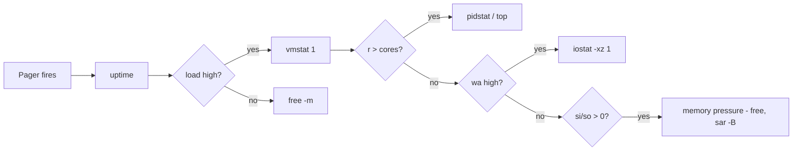

# Vintage Tools — the unkillable classics

## Why this matters

When you SSH into a 12-year-old RHEL 6 box with no internet egress and a firing pager, `htop` is not installed. `btop` is not installed. What is installed: `top`, `vmstat`, `iostat`, `sar`, `ps`, `free`, `uptime`. These tools have been on every Unix since before you were born. They are POSIX-adjacent, they ship in `procps-ng` and `sysstat`, and they answer 80% of "what's wrong" in 10 seconds. Master them or be useless on legacy infra.

The "vintage" tools are also the only tools that work in container init images, in initramfs rescue, in busybox, and over 1200-baud out-of-band consoles. They are not optional.

<!-- mermaid:rendered -->
<p align="center"></p>

<details><summary>Mermaid source</summary>



</details>
---

## top

**Install**: in `procps-ng`, ships with every distro.

**Favorite invocation**:
```bash
top -d 1 -o %CPU             # 1s refresh, sort by CPU
top -H -p $(pgrep -d, java)  # threads of all java processes
top -b -n 1 > top.snap       # batch mode, one shot, save it
```

**Interpretation**:
- `load average: 4.2 8.1 12.3` — 1/5/15 min. Trending up = getting worse.
- `%us` user, `%sy` kernel, `%ni` nice, `%id` idle, `%wa` IO wait, `%hi` hardirq, `%si` softirq, `%st` stolen (hypervisor took it).
- `%st > 5` on a VM = noisy neighbour. Open a ticket with your cloud provider.
- `RES` is resident set (real RAM). `VIRT` is meaningless on modern Linux — ignore it.

**Pitfalls**:
- `top` samples; brief CPU bursts are invisible.
- Default sort is `%CPU` but `1` toggles per-CPU view (you usually want this).
- `H` toggles thread mode. People miss multi-threaded culprits without it.

---

## vmstat

**Install**: `procps-ng`.

**Favorite invocation**:
```bash
vmstat 1            # 1-second samples forever
vmstat -SM 1        # in MiB instead of KiB
vmstat -w 1         # wide format, easier to read
vmstat -d           # per-disk stats (rarely used)
```

**Interpretation** (the eight columns that matter):

| Col | Meaning | Bad when |
|-----|---------|----------|
| `r` | runnable tasks | > vCPU count |
| `b` | uninterruptible sleepers | > 0 sustained = IO bound |
| `si` | swap-in KB/s | > 0 sustained = memory pressure |
| `so` | swap-out KB/s | > 0 sustained = memory pressure |
| `us` | user CPU % | high + low `sy` = app hot |
| `sy` | system CPU % | > 30 sustained = syscall storm |
| `id` | idle % | low + high `r` = CPU bound |
| `wa` | iowait % | > 20 = IO bound |

**Pitfalls**: first row is since-boot averages — **always discard it**. The bug is always "I checked vmstat once and it looked fine."

---

## iostat

**Install**: `sysstat` package (`apt install sysstat`).

**Favorite invocation**:
```bash
iostat -xz 1        # extended, hide idle devs, 1s
iostat -xmz 1       # MB/s instead of KB/s
iostat -p sda 1     # specific device + partitions
```

**Interpretation**:
- `r/s`, `w/s` — IOPS in/out
- `rkB/s`, `wkB/s` — throughput
- `await` — average wait per IO (ms). HDD: <20 ok. SSD: <2 ok. NVMe: <0.5 ok.
- `aqu-sz` — queue depth. > 1 means saturation, IOs are queueing.
- `%util` — % time the device had at least one IO in flight. **Misleading on SSDs/NVMe** (they parallelize). Trust `await` and `aqu-sz` instead.

**Pitfalls**: `%util` of 100 on NVMe means nothing — they handle 32+ concurrent ops. Look at `await`.

---

## mpstat

**Install**: `sysstat`.

**Favorite invocation**:
```bash
mpstat -P ALL 1     # per-CPU, 1s
mpstat -I SUM 1     # interrupt rates
```

**Interpretation**: spots single-CPU saturation (e.g., a single-threaded process pegging CPU0 while CPU1-15 idle). `top` averages CPUs and hides this. `mpstat` doesn't.

---

## pidstat

**Install**: `sysstat`.

**Favorite invocation**:
```bash
pidstat 1                      # per-PID CPU
pidstat -d 1                   # per-PID disk IO
pidstat -r 1                   # per-PID memory & faults
pidstat -w 1                   # context switches
pidstat -t -p $(pgrep nginx)   # threads of one process
```

**Interpretation**: this is the unsung hero. Where `top` shows a snapshot, `pidstat 1` shows a continuous timeline per process. `pidstat -d` is the only easy way to find the disk-hammering PID without eBPF.

---

## sar (sysstat)

**Install**: `sysstat`. Then enable collection:
```bash
sudo systemctl enable --now sysstat
# /etc/cron.d/sysstat collects every 10 min by default; bump to 1 min for prod
```

**Favorite invocation** — querying historical data:
```bash
sar -u 1                # live CPU
sar -u                  # today's CPU history
sar -u -f /var/log/sysstat/sa15  # day 15 of month
sar -r                  # memory
sar -n DEV              # network
sar -B                  # paging
sar -d                  # disk
sar -q                  # run queue + load
```

**Interpretation**: `sar` is the only universally-installed tool that lets you say "what was the CPU at 03:14 last Tuesday?" without a Prometheus stack. Worth its weight in gold during postmortems.

**Pitfalls**: data retention defaults to 7 days on Debian, 28 on RHEL. Bump it via `HISTORY=` in `/etc/sysstat/sysstat`.

---

## free

```bash
free -m         # MiB
free -h         # human
free -s 2       # repeat every 2s
```

**Interpretation** — the cardinal sin is reading "used" wrong:

```
              total   used   free   shared  buff/cache  available
Mem:          16000   9000   500    100     6500        7200
```

- **`available`** is the number that matters — RAM the kernel can give to a new process without swapping. If `available` > 20% of total, you have memory.
- `free` will always look small on healthy systems because Linux uses spare RAM for page cache. That's good.
- `buff/cache` is reclaimable. Don't panic.
- Worry only when `available` shrinks AND `swap used` grows AND `vmstat si/so` > 0.

---

## uptime

```bash
uptime
# 12:34:56 up 47 days, 3:21, 4 users, load average: 1.23, 0.98, 0.85
```

**Interpretation**: load = average runnable + uninterruptible tasks. On Linux this includes D-state (disk wait), unlike Solaris/BSD. So a Linux load of 8 with 4 cores might be CPU-bound OR IO-bound — confirm with `vmstat`.

Rule of thumb: load < cores = idle. Load == cores = busy. Load > 2x cores = struggling. But always cross-check.

---

## ps

```bash
ps auxf                           # full forest, all users
ps -eo pid,ppid,user,stat,%cpu,%mem,cmd --sort=-%cpu | head
ps -eLf | grep java               # show threads (-L)
ps -o pid,wchan:25,cmd -p PID     # what kernel func is the proc sleeping in
```

**Interpretation**: `STAT` column codes:

| Code | Meaning |
|------|---------|
| R | running / runnable |
| S | interruptible sleep |
| D | uninterruptible sleep (usually IO; can't be killed even with -9) |
| Z | zombie (parent never reaped) |
| T | stopped |
| < | high priority |
| N | low priority (niced) |
| + | foreground process group |

**A wedged D-state process means kernel is stuck on something** (NFS, dead disk, hung driver). Reboot territory.

---

## dstat

**Install**: `apt install dstat` or `pip install dstat` (deprecated upstream; replaced by `pcp-dstat`).

**Favorite invocation**:
```bash
dstat -tcdngy 1            # time, cpu, disk, net, page, sys
dstat --top-cpu --top-io   # who's using what
```

**Interpretation**: `dstat` was the "everything in one screen" tool before `glances`. Still beloved for one-off snapshots and CSV export (`--output file.csv`).

---

## Lab: Reproduce every signal

```bash
# 1) CPU saturation (us high, r > cores)
stress-ng --cpu 8 --timeout 30s &
vmstat 1 30

# 2) IO saturation (wa high, b > 0, await high)
stress-ng --hdd 2 --hdd-bytes 2G --timeout 30s &
iostat -xz 1 30

# 3) Memory pressure (si/so > 0)
stress-ng --vm 4 --vm-bytes 90% --vm-method all --timeout 30s &
vmstat 1 30; sar -B 1 30

# 4) Context-switch storm
stress-ng --switch 8 --timeout 30s &
vmstat 1 30   # cs column

# 5) Forking storm
stress-ng --fork 4 --timeout 30s &
vmstat 1 30   # in column (interrupts)
```

After each, ask: which column moved? That's the signal you'll use in production.

---

!!! tip "20-year tips"
    1. **`vmstat 1` is your first command. Always. Forever.**
    2. **`sar` data has saved more postmortems than any modern tool.** Enable it on every box.
    3. **Discard the first row of `vmstat`/`iostat`/`mpstat`.** It's averaged since boot. Useless for "right now".
    4. **`free` "used" is a lie. Read `available`.**
    5. **D-state processes will not die.** Don't escalate to `kill -9` four times in a row; investigate the kernel wait channel: `cat /proc/PID/wchan`.
    6. **`ps auxf` once at incident start.** The forest view often tells you immediately if a fork bomb is happening.
    7. **`%st` (steal) on a VM is your silent enemy.** A noisy neighbour can crater latency without showing in `%us` or `%sy`.

!!! question "Common interview questions"
    **Q1: Walk me through the first 60 seconds of incident triage on Linux using only stock tools.**
    A: `uptime` → `dmesg | tail` → `vmstat 1 5` → `mpstat -P ALL 1 3` → `pidstat 1 3` → `iostat -xz 1 3` → `free -m` → `sar -n DEV 1 3`. (Brendan Gregg's 60-second checklist.)

    **Q2: `top` shows 30% CPU idle but the app is slow. What next?**
    A: Look at `wa` (iowait) and `%st` (stolen). Check `vmstat`'s `b` column — uninterruptible sleepers don't count as CPU but are stalled. Check `pidstat -d` for the disk-bound PID.

    **Q3: How do you read `iostat -xz` for an SSD?**
    A: Ignore `%util` (parallelism breaks it). Trust `await` (target <2ms) and `aqu-sz` (target <1). High `aqu-sz` is the saturation signal.

    **Q4: A process is in state `D` and `kill -9` does nothing. Why?**
    A: D = uninterruptible sleep, usually waiting on a kernel call (often IO). The kernel won't deliver signals until the syscall returns. Cause is usually a hung NFS, dead disk, or buggy driver. Often requires reboot.

    **Q5: Linux load average is 12 on an 8-core box, but `top` shows 50% idle. Reconcile.**
    A: Load includes D-state tasks. Tasks blocked on IO inflate load without using CPU. Check `vmstat`'s `b` column and `iostat` for the slow device.

    **Q6: How do you check what was happening on a server 6 hours ago without Prometheus?**
    A: `sar` history (e.g., `sar -u -s 06:00:00 -e 07:00:00`). Enable sysstat on every server.

---

## Sources

- man pages: `vmstat(8)`, `iostat(1)`, `sar(1)`, `mpstat(1)`, `pidstat(1)`, `top(1)`, `free(1)`, `ps(1)`
- [sysstat project](http://sebastien.godard.pagesperso-orange.fr/)
- Brendan Gregg, [Linux Performance Analysis in 60 seconds](https://netflixtechblog.com/linux-performance-analysis-in-60-000-milliseconds-accc10403c55)
- [procps-ng](https://gitlab.com/procps-ng/procps)
