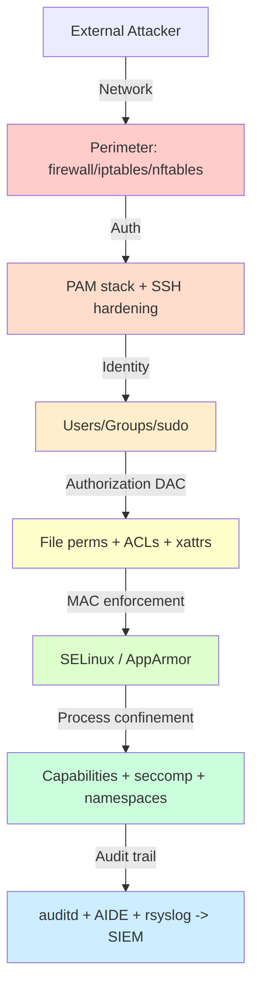

# Linux Security Mastery

## Why this matters

Linux runs the cloud, the edge, and almost every container on Earth. Every breach you'll read about in your career — ransomware, data exfiltration, supply-chain compromise, lateral movement — eventually touches a Linux box. The kernel and userland ship with a *staggering* amount of security machinery (DAC, MAC, capabilities, seccomp, namespaces, audit, PAM, ACLs, xattrs, immutable bits, SELinux, AppArmor, sysctls). Attackers know it. **Defenders rarely do.** This folder fixes that gap.

The goal is not to memorize every flag — it's to internalize **defense in depth**: never rely on one control. A misconfigured `sudoers`, a stray setuid binary, a permissive SELinux context, a forgotten capability — any one of these can be the pivot. Stack the controls so that breaking one still leaves the attacker outside.

---

## The Defense-in-Depth Model

<!-- mermaid:rendered -->
<p align="center"></p>

<details><summary>Mermaid source</summary>



</details>

Each layer assumes the layer above it failed. That is the entire idea.

---

## Map of Linux Security Primitives

```mermaid
flowchart LR
    subgraph Identity
        U[Users /etc/passwd]
        S[Shadow /etc/shadow]
        G[Groups /etc/group]
        SU[sudoers]
    end
    subgraph DAC
        P[Mode bits rwx]
        SUID[setuid/setgid/sticky]
        ACL[POSIX ACLs]
        XA[xattr + capabilities]
        IMM[chattr +i immutable]
    end
    subgraph Auth
        PAM[PAM stack]
        SSH[sshd_config]
        MFA[pam_google_authenticator]
    end
    subgraph MAC
        SE[SELinux contexts]
        AA[AppArmor profiles]
    end
    subgraph Audit
        AD[auditd]
        AIDE[AIDE / Tripwire]
        SY[rsyslog -> SIEM]
    end
    subgraph Kernel
        SC[seccomp-bpf]
        NS[namespaces]
        SY2[sysctl hardening]
    end
    Identity --> Auth --> DAC --> MAC --> Kernel --> Audit
```

<!-- mermaid:rendered -->
<p align="center"></p>

<details><summary>Mermaid source</summary>



</details>

---

## Files in this Folder

| File | What you learn |
|------|----------------|
| [users-groups-sudo.md](./users-groups-sudo.md) | passwd/shadow/group internals, sudoers grammar, NOPASSWD, audit |
| [file-permissions-deep.md](./file-permissions-deep.md) | mode bits, setuid/setgid/sticky, ACLs, xattr, file capabilities, chattr |
| [pam-deep.md](./pam-deep.md) | PAM stack semantics, modules, MFA, sshd/login configs |
| [selinux-vs-apparmor.md](./selinux-vs-apparmor.md) | MAC vs DAC, contexts, audit2allow, AppArmor profiles |
| [audit-and-fim.md](./audit-and-fim.md) | auditd rules, ausearch, AIDE, samhain, tripwire, SIEM forwarding |
| [hardening-checklist.md](./hardening-checklist.md) | CIS-distilled production hardening: SSH, sysctl, mounts, services |

---

## Quick Reference Cheatsheet

```bash
# Identity & sudo
getent passwd alice                # resolve via NSS
getent group wheel
sudo -l -U alice                   # what can alice run?
visudo -c                          # syntax-check sudoers

# DAC
ls -la /etc/shadow                 # 0640 root:shadow
find / -perm -4000 2>/dev/null     # all setuid binaries
getfacl /var/log/audit
getcap -r /usr/bin 2>/dev/null

# MAC
sestatus                           # SELinux state
ls -Z /etc/passwd
aa-status                          # AppArmor

# Audit
auditctl -l                        # active rules
ausearch -k passwd_changes
aide --check

# Hardening
sysctl -a | grep -E 'rp_filter|tcp_syncookies'
ss -tlnp                           # listening sockets
systemctl list-unit-files --state=enabled
```

---

## How to study this folder

1. Read `users-groups-sudo.md` first — every other layer assumes you understand identity.
2. Then `file-permissions-deep.md` — DAC is the foundation.
3. `pam-deep.md` — how authentication actually decides yes/no.
4. `selinux-vs-apparmor.md` — MAC layered on top of DAC.
5. `audit-and-fim.md` — you can't fix what you can't see.
6. `hardening-checklist.md` — apply everything to a fresh VM.

> **20-year tip**: I have seen *more* outages caused by SELinux misconfiguration than by attackers. I have *also* seen more breaches succeed because someone disabled SELinux to "fix the issue." Learn it. Don't run `setenforce 0` and walk away.

---

## Common attack patterns this folder defends against

| Attack | Layer that stops it |
|--------|---------------------|
| Brute-force SSH | PAM (pam_tally2/faillock) + SSH hardening |
| Privilege escalation via setuid binary | File capabilities replace setuid; AIDE detects new setuid files |
| Lateral move via shared NFS | ACLs + nosuid/nodev mount options |
| Ransomware modifying config | chattr +i + auditd watch + AIDE |
| Container escape | seccomp + namespaces + SELinux/AppArmor |
| Persistent backdoor in /etc/passwd | auditd watch + AIDE baseline |
| Kernel exploit via setuid | mount /tmp noexec/nosuid |

---

## Sources

- `man 5 passwd`, `man 5 shadow`, `man 5 sudoers`, `man 7 capabilities`
- NSA *Hardening Tips for Linux Servers* — https://www.nsa.gov/cybersecurity/
- CIS Benchmarks (RHEL, Ubuntu, Debian) — https://www.cisecurity.org/cis-benchmarks
- kernel.org *LSM Documentation* — https://www.kernel.org/doc/html/latest/admin-guide/LSM/
- Red Hat *SELinux User's and Administrator's Guide*
- Ubuntu AppArmor wiki — https://wiki.ubuntu.com/AppArmor
- Linux Audit project — https://github.com/linux-audit
- AIDE manual — https://aide.github.io/
