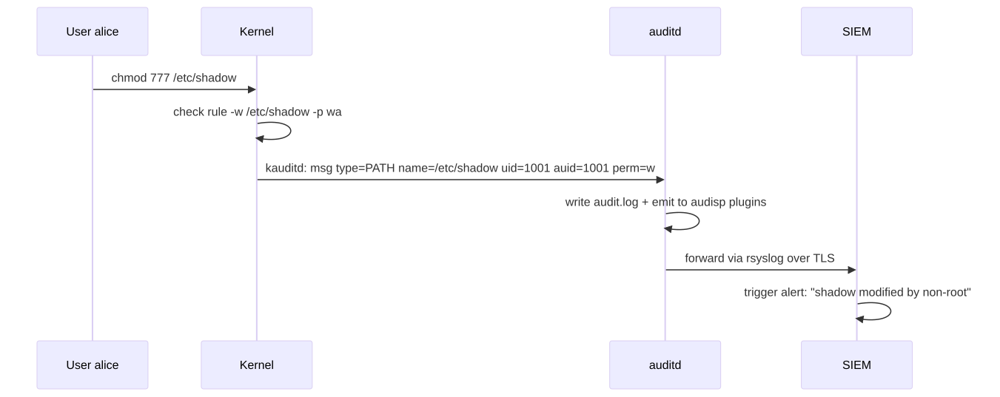
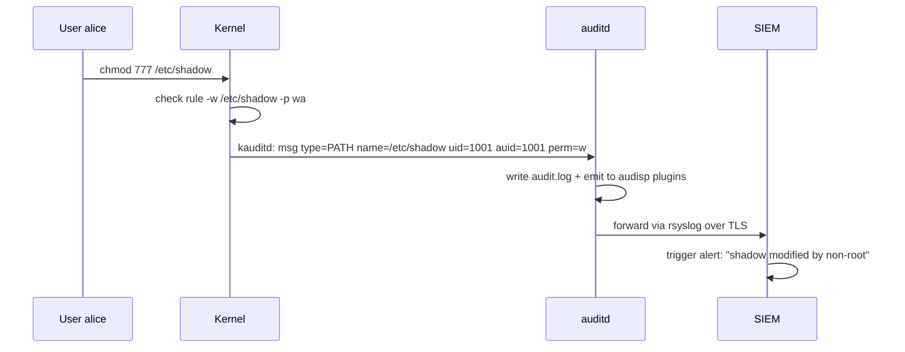

# Audit and File Integrity Monitoring (FIM)

## Why this matters

Every breach has a "how did we miss this?" moment. The answer is almost always: nobody was looking, or the data was there but nobody could find it, or the tooling logged it but no alert fired. Detection is half of security; without it, your prevention controls are just hopes.

Linux ships with a kernel-integrated audit subsystem (**auditd**) that records every syscall you ask about with cryptographic timestamps and original-loginuid attribution. Layered on top, **FIM** tools (AIDE, Samhain, Tripwire) baseline the filesystem and shout when files change. Forwarded to a SIEM via **rsyslog** or **journald**, you get a tamper-evident detection pipeline.

If you only learn one chapter from this folder by heart, learn this one. Prevention controls fail. Detection is what saves you.

---

## Mental model

```mermaid
flowchart LR
    K[Kernel syscalls] -->|kauditd queue| AUD[auditd daemon]
    AUD --> AL[/var/log/audit/audit.log]
    AL --> AS[ausearch / aureport]
    AL --> R[audisp plugins]
    R --> SY[rsyslog / syslog-ng]
    SY -->|TLS| SIEM[(SIEM:<br/>Splunk / ELK / Wazuh / Sentinel)]
    
    FS[Filesystem] -->|nightly scan| AIDE[AIDE database]
    AIDE -->|diff| ALERT[email / SIEM alert]
    
    K -.->|inotify| WATCHER[inotifywait scripts]
    WATCHER --> SY
```

<!-- mermaid:rendered -->
<p align="center"></p>

<details><summary>Mermaid source</summary>



</details>

---

## Auditd — the kernel audit subsystem

Auditd records syscall and filesystem events with high fidelity. It's separate from syslog/journald — events go through the kernel's audit netlink and **cannot be skipped by the application**.

### Architecture

- **Kernel audit subsystem** — issues events.
- **`auditd`** — userspace daemon, writes `/var/log/audit/audit.log`.
- **`auditctl`** — runtime rule management.
- **`/etc/audit/rules.d/*.rules`** — persistent rules, compiled into `/etc/audit/audit.rules`.
- **`audisp` plugins** — forward events (to syslog, remote, etc.).

### Rule types

```
# File watch: -w PATH -p PERM -k KEY
-w /etc/passwd -p wa -k passwd_changes

# Syscall rule: -a action,filter -F field=val -S syscall -k key
-a always,exit -F arch=b64 -S execve -F uid=0 -k root_exec

# Exclusion (suppress noise)
-a never,exit -F arch=b64 -S all -F exe=/usr/bin/false
```

`-p` permission bits for file watches:
- `r` read
- `w` write
- `x` execute
- `a` attribute change (chmod, chown, setxattr)

`-k KEY` is the searchable tag.

### A starter rules file

`/etc/audit/rules.d/99-mysite.rules`:

```
## Buffer & failure
-b 8192
-f 1                              # 1=printk on failure, 2=panic (paranoid)
--backlog_wait_time 60000

## Make rules immutable until next boot (last line in file!)
# -e 2

## Identity & auth
-w /etc/passwd            -p wa -k identity
-w /etc/group             -p wa -k identity
-w /etc/shadow            -p wa -k identity
-w /etc/gshadow           -p wa -k identity
-w /etc/sudoers           -p wa -k privilege
-w /etc/sudoers.d/        -p wa -k privilege
-w /etc/ssh/sshd_config   -p wa -k sshd_config
-w /etc/pam.d/            -p wa -k pam_changes

## Auth events
-w /var/log/lastlog       -p wa -k logins
-w /var/log/faillog       -p wa -k logins
-w /var/run/utmp          -p wa -k session
-w /var/log/wtmp          -p wa -k session
-w /var/log/btmp          -p wa -k session

## Privilege escalation
-a always,exit -F arch=b64 -S setuid  -S setgid -F auid>=1000 -F auid!=4294967295 -k privesc
-a always,exit -F arch=b64 -S execve  -F euid=0 -F auid>=1000 -F auid!=4294967295 -k root_exec

## Mount / unmount
-a always,exit -F arch=b64 -S mount -S umount2 -k mounts

## Time changes
-a always,exit -F arch=b64 -S adjtimex -S settimeofday -S clock_settime -k time_change
-w /etc/localtime -p wa -k time_change

## Module loads
-w /sbin/insmod    -p x -k modules
-w /sbin/rmmod     -p x -k modules
-w /sbin/modprobe  -p x -k modules
-a always,exit -F arch=b64 -S init_module -S delete_module -k modules

## Network changes
-w /etc/hosts             -p wa -k network
-w /etc/sysconfig/network -p wa -k network
-w /etc/resolv.conf       -p wa -k network

## Suspicious binaries
-w /usr/bin/passwd -p x  -k passwd_use
-w /usr/bin/chage  -p x  -k user_admin
-w /usr/bin/usermod -p x -k user_admin
-w /usr/bin/groupmod -p x -k user_admin

## Webroot tamper (adjust path)
-w /var/www/html/         -p wa -k webroot
```

> The last `-e 2` line locks the rule set until the next reboot. Useful in production after testing — even root cannot edit rules at runtime once `-e 2` is loaded. Comment it out while iterating.

### Loading & inspecting

```bash
# Reload rules
sudo augenrules --load

# List active rules
sudo auditctl -l

# Live status
sudo auditctl -s

# Add a one-off (non-persistent) watch
sudo auditctl -w /tmp/secret -p wa -k tmp_secret

# Drop all rules (rare)
sudo auditctl -D
```

### Searching the log

```bash
# By key
sudo ausearch -k passwd_changes

# By time window
sudo ausearch -k privesc -ts today
sudo ausearch -ts yesterday -te 09:00:00

# By user (auid = original login uid)
sudo ausearch -ua alice -ts today

# By syscall
sudo ausearch -sc execve -ua 1001

# Convert UIDs to names
sudo ausearch -k root_exec -i

# Aggregate
sudo aureport --summary
sudo aureport -au -i           # auth report
sudo aureport -f -i            # file report
sudo aureport --tty            # captured TTY input (if pam_tty_audit enabled)
```

### auid — the magic field

`auid` (audit user id, also called loginuid) is set by `pam_loginuid` at the original login. It **persists across su/sudo**, so when root deletes a file, you can still see "originally logged in as alice." Without `pam_loginuid`, attribution dies at the first privilege change.

```bash
# Find every command run as root that originally logged in as a non-system user
sudo ausearch -ua 1000-65535 -sc execve -ts today -i
```

---

## audisp — forwarding to syslog/SIEM

`/etc/audit/plugins.d/syslog.conf`:

```
active = yes
direction = out
path = /sbin/audisp-syslog
type = always
args = LOG_INFO LOG_LOCAL6
format = string
```

Then in `/etc/rsyslog.d/00-audit.conf`:

```
# Send local6.* to remote SIEM via TCP+TLS (RELP recommended for reliability)
local6.*  @@(o)siem.corp.example:6514
```

Restart both:
```bash
sudo systemctl restart auditd rsyslog
```

For bulletproof forwarding, use **RELP** (`omrelp`) or **kafka** (`omkafka`) — UDP loses messages under load, plain TCP can stall.

---

## File Integrity Monitoring (FIM)

### AIDE — Advanced Intrusion Detection Environment

The de-facto FIM on most distros. Builds a baseline database of file metadata + hashes, then diffs.

```bash
sudo apt install aide                  # Debian
sudo dnf install aide                  # RHEL
```

Config in `/etc/aide.conf` or `/etc/aide/aide.conf`:

```
# What to record
PERMS = p+u+g+acl+selinux+xattrs
DATAONLY = sha512+rmd160
NORMAL = PERMS+DATAONLY+ftype+i

# Rules
/etc           NORMAL
/bin           NORMAL
/sbin          NORMAL
/usr/bin       NORMAL
/usr/sbin      NORMAL
/lib           NORMAL
/lib64         NORMAL
/boot          NORMAL

# Exclusions
!/var/log/.*
!/etc/mtab
!/var/cache/.*
!/var/lib/aide/.*
```

Workflow:

```bash
# Initial baseline (do AFTER hardening, BEFORE going live)
sudo aide --init
sudo mv /var/lib/aide/aide.db.new.gz /var/lib/aide/aide.db.gz

# Optional: write the DB to read-only media or sign it
sudo gpg --detach-sign /var/lib/aide/aide.db.gz

# Daily check (cron / systemd timer)
sudo aide --check

# Update baseline after legitimate changes
sudo aide --update
sudo mv /var/lib/aide/aide.db.new.gz /var/lib/aide/aide.db.gz
```

Schedule via systemd timer:

`/etc/systemd/system/aide-check.service`:
```
[Unit]
Description=AIDE integrity check
After=network.target

[Service]
Type=oneshot
ExecStart=/usr/sbin/aide --check
StandardOutput=journal
```

`/etc/systemd/system/aide-check.timer`:
```
[Unit]
Description=Run AIDE nightly
[Timer]
OnCalendar=*-*-* 03:00:00
Persistent=true
[Install]
WantedBy=timers.target
```

```bash
sudo systemctl enable --now aide-check.timer
```

> **20-year tip — store the AIDE database off-host**. If an attacker has root, they will overwrite the local DB to hide their changes. Push to immutable object storage (S3 with object lock) or a write-once medium. Compare the host's report against the off-host baseline.

### Samhain

Daemon-mode FIM with built-in tamper detection (the daemon protects itself), kernel-module rootkit detection, central server (`yule`) for fleet-wide aggregation. Heavier to set up; preferred at scale and in regulated environments.

### Tripwire

The original 1992 FIM. Open-source edition still maintained. Conceptually identical to AIDE but with a more mature policy language. Most modern shops choose AIDE or Samhain for active development.

### inotify-based watchers (lightweight, real-time)

For specific files where you want immediate notification rather than nightly diffing:

```bash
sudo apt install inotify-tools

# Watch /etc/passwd /etc/shadow for any modify/create/delete
inotifywait -m -e modify,create,delete,attrib \
  /etc/passwd /etc/shadow /etc/sudoers /etc/sudoers.d \
  | while read path event file; do
      logger -p local6.warn "FIM: $event on $path$file"
      curl -X POST -d "{\"event\":\"$event\",\"path\":\"$path$file\"}" \
        https://siem.corp/webhook
    done
```

Wrap as a systemd service with restart-on-failure.

> Real-time inotify catches threats nightly AIDE misses. The two are complementary, not redundant.

---

## Lab — End-to-end detection pipeline

Goal: a tampering attempt against `/etc/sudoers.d/` triggers an alert in journald within seconds and shows up in a daily AIDE report.

```bash
# 1. Audit rule
sudo tee /etc/audit/rules.d/50-sudo.rules >/dev/null <<'EOF'
-w /etc/sudoers     -p wa -k sudo_changes
-w /etc/sudoers.d/  -p wa -k sudo_changes
EOF
sudo augenrules --load
sudo auditctl -l | grep sudo

# 2. AIDE rule for /etc/sudoers.d
sudo grep -q '/etc/sudoers.d' /etc/aide/aide.conf || \
  echo "/etc/sudoers.d  PERMS+sha512" | sudo tee -a /etc/aide/aide.conf
sudo aide --init
sudo mv /var/lib/aide/aide.db.new.gz /var/lib/aide/aide.db.gz

# 3. Trigger
sudo touch /etc/sudoers.d/99-test-evil

# 4. Search audit
sudo ausearch -k sudo_changes -ts recent -i

# 5. AIDE check
sudo aide --check | head -30

# 6. Cleanup
sudo rm /etc/sudoers.d/99-test-evil
sudo aide --update && sudo mv /var/lib/aide/aide.db.new.gz /var/lib/aide/aide.db.gz
```

You should see the audit log entry naming the file, the auid (original login UID), the syscall (`creat` or `openat`), and the AIDE report flagging the new entry.

---

## Common attack patterns

| Attack | Detection |
|--------|-----------|
| **Backdoor account added to /etc/passwd** | auditd `-w /etc/passwd -p wa` + AIDE diff |
| **Setuid binary planted in /usr/local/bin** | AIDE finds new file with mode 4755; `find / -perm -4000 -newer baselinefile` |
| **Cron job for persistence in /etc/cron.d/** | auditd watch + AIDE on /etc/cron.* |
| **SSH key appended to /root/.ssh/authorized_keys** | auditd `-w /root/.ssh/` + AIDE on file size/hash |
| **Kernel module loaded for rootkit** | auditd `-S init_module -k modules`; lsmod baseline |
| **Log tampering (deleting /var/log/auth.log)** | auditd `-w /var/log/auth.log -p wa`; forward in real time so the deletion can't catch up |
| **Audit daemon stopped** | systemd unit + Watchdog; rsyslog rule on `audispd` exit; SIEM heartbeat check |
| **Time rolled back to break correlation** | auditd `-S settimeofday -k time_change`; chrony with authenticated NTS |
| **Bash history wiped** | auditd `-w /home/*/.bash_history -p wa` and ship history to SIEM |

---

> **20-year tip — war story**
>
> Major ecommerce breach. Attackers were inside for 9 months. Forensics finally found them via a single auditd entry — the only piece of evidence not destroyed because logs had been forwarded *in real time* to a syslog collector on a separate VLAN. The attacker had wiped `/var/log/audit/audit.log` on every host but couldn't reach the collector.
>
> **Lesson**: local logs are evidence the attacker can edit. Logs only count when they leave the box, ideally over TLS to an account whose creds are *not* on the host. Use a dedicated forwarding identity, separate network path, write-once destination.
>
> Other lesson: **AIDE is useless if you only `--init` once and never `--check`.** I have seen this on dozens of audits — the database exists, last modified during initial install, never compared against. Schedule the check, fail loudly, page on diff.

---

> **Common interview questions**
>
> 1. **Q: What's the difference between auditd and syslog?**
>    A: syslog is application-driven — programs choose what to log. Auditd is kernel-driven — the kernel emits events for every matching syscall, regardless of the application. An attacker can convince an app to skip logging; they cannot tell the kernel to skip an audit rule (without root and `-e 0`).
>
> 2. **Q: What does `auid` mean in audit logs?**
>    A: The audit user ID, set by `pam_loginuid` at original login and propagated through privilege changes. So even after `sudo`, you see the original human's UID, enabling attribution.
>
> 3. **Q: Why might `auditctl -l` show no rules even though `audit.rules` is populated?**
>    A: Rules in `rules.d/*.rules` need `augenrules --load` to compile and apply. Or the audit daemon was restarted without reloading. Or the rules file has a syntax error and the loader skipped it — check `journalctl -u auditd`.
>
> 4. **Q: How does AIDE detect tampering?**
>    A: It computes a baseline of file metadata (mode, owner, size, timestamps, ACLs, xattrs, SELinux context) and content hashes (SHA-256/512), stores them in a database, and on each `--check` rebuilds and diffs. Drift = alert. Database must be protected against tampering itself.
>
> 5. **Q: An attacker has root. Can they bypass auditd?**
>    A: They can stop auditd or modify rules — *unless* `-e 2` is loaded (rules immutable until reboot) and `auditd` is monitored externally (heartbeat to SIEM). The rule load itself is audited, and an external collector preserves history. Defense in depth: forward in real time, alert on absence, use `pam_tty_audit` to capture commands.
>
> 6. **Q: Why is real-time log forwarding important?**
>    A: Local logs are tamperable. The attacker's first move after gaining root is usually to clear logs. If logs left the box already, you have evidence; if they haven't, you have nothing. Use TLS, dedicated identity per host, write-once destination.
>
> 7. **Q: AIDE reports thousands of changes after a package update. How do you handle it?**
>    A: Run `aide --update` after every legitimate change window, ideally as part of the patch process. Store the new DB off-host. Better: integrate with the package manager (`dpkg-trigger`, `dnf hook`) so the baseline is rebuilt automatically post-upgrade and the diff against the *previous post-upgrade* baseline is what gets alerted on.

---

## Sources

- `man 8 auditd`, `man 8 auditctl`, `man 7 audit.rules`, `man 8 ausearch`, `man 8 aureport`, `man 8 augenrules`
- `man 1 aide`, `man 5 aide.conf`
- Linux Audit project — https://github.com/linux-audit
- AIDE — https://aide.github.io/
- Samhain — https://www.la-samhna.de/samhain/
- NSA Hardening Guides — auditd rule recommendations
- CIS Benchmarks §4 (Logging and Auditing)
- Red Hat *Security Hardening Guide* — System Auditing chapter
